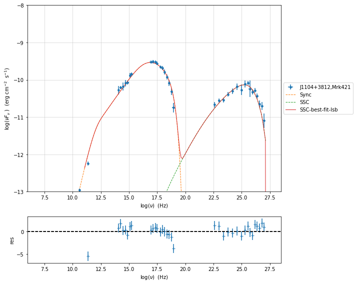
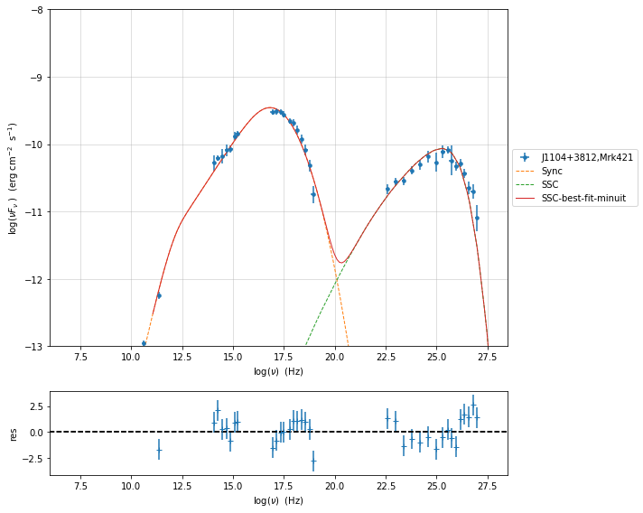
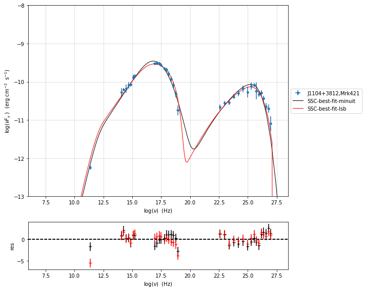
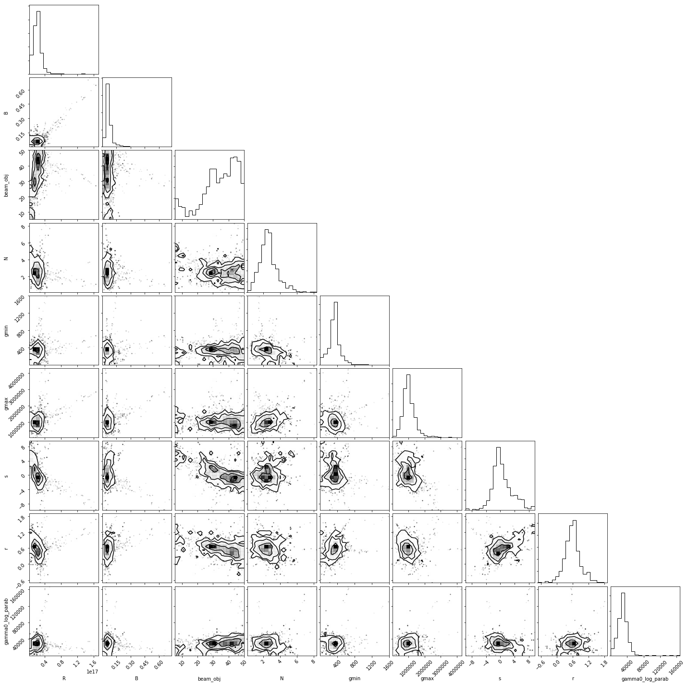
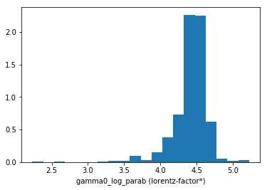
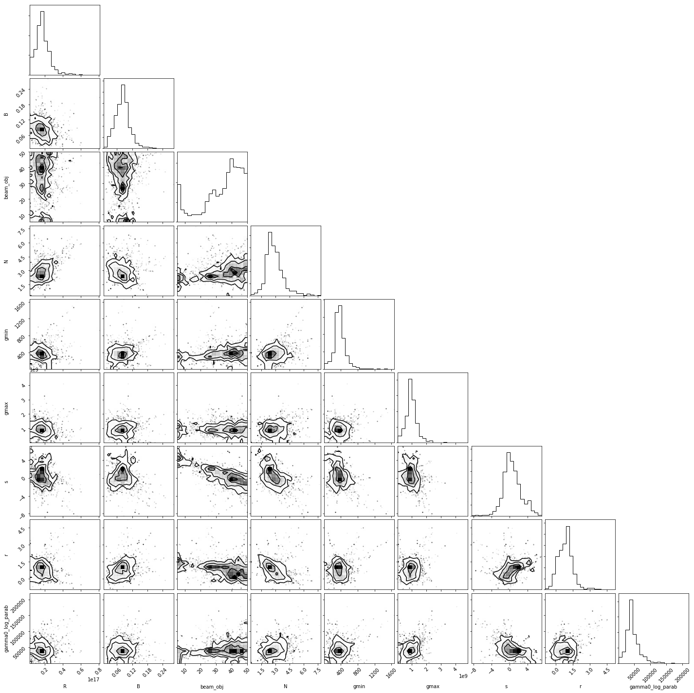
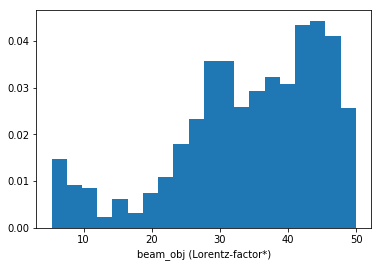

.. _model_fitting_1:

Model fitting
=============

.. code:: ipython3

    import warnings
    warnings.filterwarnings('ignore')
    
    import matplotlib.pylab as plt
    import jetset
    from jetset.test_data_helper import  test_SEDs
    from jetset.data_loader import ObsData,Data
    from jetset.plot_sedfit import PlotSED
    from jetset.test_data_helper import  test_SEDs

.. code:: ipython3

    test_SEDs

.. parsed-literal::

    ['/Users/orion/anaconda3/envs/develop/lib/python3.7/site-packages/jetset-1.1.0a3-py3.7-macosx-10.7-x86_64.egg/jetset/test_data/SEDs_data/SED_3C345.ecsv',
     '/Users/orion/anaconda3/envs/develop/lib/python3.7/site-packages/jetset-1.1.0a3-py3.7-macosx-10.7-x86_64.egg/jetset/test_data/SEDs_data/SED_MW_Mrk421.ecsv',
     '/Users/orion/anaconda3/envs/develop/lib/python3.7/site-packages/jetset-1.1.0a3-py3.7-macosx-10.7-x86_64.egg/jetset/test_data/SEDs_data/SED_MW_Mrk501.ecsv']

loading data
------------

see the :ref:`data_format` user guide for further information about loading data 

.. code:: ipython3

    print(test_SEDs[1])
    data=Data.from_file(test_SEDs[1])

.. parsed-literal::

    /Users/orion/anaconda3/envs/develop/lib/python3.7/site-packages/jetset-1.1.0a3-py3.7-macosx-10.7-x86_64.egg/jetset/test_data/SEDs_data/SED_MW_Mrk421.ecsv

.. code:: ipython3

    %matplotlib inline
    sed_data=ObsData(data_table=data)
    sed_data.group_data(bin_width=0.2)
    
    sed_data.add_systematics(0.1,[10.**6,10.**29])
    p=sed_data.plot_sed()

.. parsed-literal::

    ===================================================================================================================
    
    ***  binning data  ***
    ---> N bins= 89
    ---> bin_widht= 0.2
    ===================================================================================================================
    

.. image:: Jet_example_model_fit_files/Jet_example_model_fit_7_1.png

phenomenological model constraining
-----------------------------------

spectral indices
~~~~~~~~~~~~~~~~

.. code:: ipython3

    from jetset.sed_shaper import  SEDShape
    my_shape=SEDShape(sed_data)
    my_shape.eval_indices(silent=True)
    p=my_shape.plot_indices()
    p.rescale(y_min=-15,y_max=-6)

.. parsed-literal::

    ===================================================================================================================
    
    *** evaluating spectral indices for data ***
    ---> initial range for index radio  set to [6.000000,10.000000]
    ---> range for index radio updated  to [6.000000,10.000000]
    ---> name = radio            range=[6.000 ,10.000] log(Hz)  photon.val=-1.426527e+00, err=1.242337e-01 
    
    ---> initial range for index radio_mm  set to [10.000000,11.000000]
    ---> range for index radio_mm updated  to [10.000000,11.000000]
    ---> name = radio_mm         range=[10.000,11.000] log(Hz)  photon.val=-1.290348e+00, err=3.549105e-02 
    
    ---> initial range for index mm_IR  set to [11.000000,13.000000]
    ---> range for index mm_IR updated  to [10.300000,13.700000]
    ---> name = mm_IR            range=[10.300,13.700] log(Hz)  photon.val=-1.113008e+00, err=5.915490e-02 
    
    ---> initial range for index IR_Opt  set to [13.000000,14.000000]
    ---> range for index IR_Opt updated  to [12.500000,14.500000]
    ---> name = IR_Opt           range=[12.500,14.500] log(Hz)  photon.val=-1.783218e+00, err=9.834847e-02 
    
    ---> initial range for index Opt_UV  set to [14.000000,16.000000]
    ---> range for index Opt_UV updated  to [14.000000,16.000000]
    ---> name = Opt_UV           range=[14.000,16.000] log(Hz)  photon.val=-1.620555e+00, err=4.702747e-02 
    
    ---> initial range for index BBB  set to [15.000000,16.000000]
    ---> range for index BBB updated  to [14.800000,16.200000]
    ---> name = BBB              range=[14.800,16.200] log(Hz)  photon.val=-1.285305e+00, err=1.411368e-01 
    
    ---> initial range for index UV_X  set to [15.000000,17.500000]
    ---> range for index UV_X updated  to [15.000000,17.500000]
    ---> name = UV_X             range=[15.000,17.500] log(Hz)  photon.val=-1.847773e+00, err=2.092988e-02 
    
    ---> initial range for index X  set to [16.000000,19.000000]
    ---> range for index X updated  to [16.000000,19.000000]
    ---> name = X                range=[16.000,19.000] log(Hz)  photon.val=-2.397737e+00, err=6.837481e-02 
    
    ---> initial range for index Fermi  set to [22.380000,25.380000]
    ---> range for index Fermi updated  to [22.380000,25.380000]
    ---> name = Fermi            range=[22.380,25.380] log(Hz)  photon.val=-1.792256e+00, err=2.023988e-02 
    
    ---> initial range for index TeV  set to [25.000000,28.380000]
    ---> range for index TeV updated  to [25.000000,28.380000]
    ---> name = TeV              range=[25.000,28.380] log(Hz)  photon.val=-2.463457e+00, err=7.279736e-02 
    
    ===================================================================================================================
    

.. image:: Jet_example_model_fit_files/Jet_example_model_fit_10_1.png

sed shaper
~~~~~~~~~~

.. code:: ipython3

    mm,best_fit=my_shape.sync_fit(check_host_gal_template=False,
                      Ep_start=None,
                      minimizer='lsb',
                      silent=True,
                      fit_range=[10,21])

.. parsed-literal::

    ===================================================================================================================
    
    *** Log-Polynomial fitting of the synchrotron component ***
    ---> first blind fit run,  fit range: [10, 21]
    name   par type       units      val  phys. bound. min phys. bound. max  log  frozen
    ---- ------------ ------------- ----- ---------------- ---------------- ----- ------
       b    curvature                -1.0            -10.0              0.0 False  False
       c third-degree                -1.0            -10.0             10.0 False  False
      Ep    peak freq            Hz  14.0              0.0             30.0  True  False
      Sp    peak flux erg / (cm2 s) -10.0            -30.0              0.0  True  False
    ---> class:  HSP
    
    name   par type       units              val          phys. bound. min phys. bound. max  log  frozen
    ---- ------------ ------------- --------------------- ---------------- ---------------- ----- ------
       b    curvature                -0.15453004839441498            -10.0              0.0 False  False
       c third-degree               -0.010232447712917647            -10.0             10.0 False  False
      Ep    peak freq            Hz    16.722672085915843              0.0             30.0  True  False
      Sp    peak flux erg / (cm2 s)    -9.491658506170065            -30.0              0.0  True  False
    ---> sync       nu_p=+1.672267e+01 (err=+4.139905e-02)  nuFnu_p=-9.491659e+00 (err=+2.515288e-02) curv.=-1.545300e-01 (err=+9.534752e-03)

.. code:: ipython3

    best_fit.show_report()

.. parsed-literal::

    
    **************************************************************************************************
    Fit report
    
    Model: sync-shape-fit
    name   par type       units              val          phys. bound. min phys. bound. max  log  frozen
    ---- ------------ ------------- --------------------- ---------------- ---------------- ----- ------
       b    curvature                -0.15453004839441498            -10.0              0.0 False  False
       c third-degree               -0.010232447712917647            -10.0             10.0 False  False
      Ep    peak freq            Hz    16.722672085915843              0.0             30.0  True  False
      Sp    peak flux erg / (cm2 s)    -9.491658506170065            -30.0              0.0  True  False
    
    converged=True
    calls=28
    Both actual and predicted relative reductions in the sum of squares
      are at most 0.000000
    dof=18
    chisq=28.486970, chisq/red=1.582609 null hypothesis sig=0.055021
    
    best fit pars
    name      bestfit val              err +         err -     start val     fit range min fit range max frozen
    ---- --------------------- --------------------- ----- ----------------- ------------- ------------- ------
       b  -0.15453004839441498  0.009534751941233537  None              -1.0         -10.0           0.0  False
       c -0.010232447712917647 0.0014330731417558273  None              -1.0         -10.0          10.0  False
      Ep    16.722672085915843   0.04139904904390632  None 16.67039161699804           0.0          30.0  False
      Sp    -9.491658506170065  0.025152884830117343  None             -10.0         -30.0           0.0  False
    **************************************************************************************************
    

.. code:: ipython3

    my_shape.IC_fit(fit_range=[23,29],minimizer='minuit')
    p=my_shape.plot_shape_fit()
    p.rescale(y_min=-15)

.. parsed-literal::

    ===================================================================================================================
    
    *** Log-Polynomial fitting of the IC component ***
    ---> fit range: [23, 29]
    ---> LogCubic fit
    
    **************************************************************************************************
    Fit report
    
    Model: IC-shape-fit
    name   par type       units             val          phys. bound. min phys. bound. max  log  frozen
    ---- ------------ ------------- -------------------- ---------------- ---------------- ----- ------
       b    curvature               -0.20979248257934202            -10.0              0.0 False  False
       c third-degree               -0.04662648109652068            -10.0             10.0 False  False
      Ep    peak freq            Hz   25.249320432055992              0.0             30.0  True  False
      Sp    peak flux erg / (cm2 s)  -10.110940957544976            -30.0              0.0  True  False
    
    converged=True
    calls=202
    ------------------------------------------------------------------
    | FCN = 5.911                   |     Ncalls=201 (201 total)     |
    | EDM = 5.56E-05 (Goal: 1E-05)  |            up = 1.0            |
    ------------------------------------------------------------------
    |  Valid Min.   | Valid Param.  | Above EDM | Reached call limit |
    ------------------------------------------------------------------
    |     True      |     True      |   False   |       False        |
    ------------------------------------------------------------------
    | Hesse failed  |   Has cov.    | Accurate  | Pos. def. | Forced |
    ------------------------------------------------------------------
    |     False     |     True      |   True    |   True    | False  |
    ------------------------------------------------------------------
    -------------------------------------------------------------------------------------------
    |   | Name  |   Value   | Hesse Err | Minos Err- | Minos Err+ | Limit-  | Limit+  | Fixed |
    -------------------------------------------------------------------------------------------
    | 0 | par_0 |  -0.210   |   0.031   |            |            |   -10   |    0    |       |
    | 1 | par_1 |  -0.047   |   0.022   |            |            |   -10   |   10    |       |
    | 2 | par_2 |   25.25   |   0.11    |            |            |    0    |   30    |       |
    | 3 | par_3 |  -10.11   |    0.03   |            |            |   -30   |    0    |       |
    -------------------------------------------------------------------------------------------
    dof=10
    chisq=5.911131, chisq/red=0.591113 null hypothesis sig=0.822674
    
    best fit pars
    name     bestfit val             err +         err -     start val      fit range min fit range max frozen
    ---- -------------------- -------------------- ----- ------------------ ------------- ------------- ------
       b -0.20979248257934202  0.03133727822906529  None               -1.0         -10.0           0.0  False
       c -0.04662648109652068 0.021784447613785396  None               -1.0         -10.0          10.0  False
      Ep   25.249320432055992  0.11478667865102388  None 25.294117118594023           0.0          30.0  False
      Sp  -10.110940957544976  0.03498801209549285  None              -10.0         -30.0           0.0  False
    **************************************************************************************************
    
    ---> IC         nu_p=+2.524932e+01 (err=+1.147867e-01)  nuFnu_p=-1.011094e+01 (err=+3.498801e-02) curv.=-2.097925e-01 (err=+3.133728e-02)
    ===================================================================================================================
    

.. image:: Jet_example_model_fit_files/Jet_example_model_fit_14_1.png

model constraining
~~~~~~~~~~~~~~~~~~

.. code:: ipython3

    from jetset.obs_constrain import ObsConstrain
    from jetset.model_manager import  FitModel
    from jetset.minimizer import fit_SED
    sed_obspar=ObsConstrain(beaming=25,
                            B_range=[0.001,0.1],
                            distr_e='lppl',
                            t_var_sec=3*86400,
                            nu_cut_IR=1E12,
                            SEDShape=my_shape)
    
    
    prefit_jet=sed_obspar.constrain_SSC_model(electron_distribution_log_values=False)
    prefit_jet.save_model('prefit_jet.dat')

.. parsed-literal::

    ===================================================================================================================
    
    ***  constrains parameters from observable ***
    
          name             par type           units             val         phys. bound. min  phys. bound. max   log  frozen
    ---------------- ------------------- --------------- ------------------ ---------------- ------------------ ----- ------
                   N    electron_density         1 / cm3              100.0              0.0               None False  False
                gmin  low-energy-cut-off lorentz-factor*                2.0              1.0       1000000000.0 False  False
                gmax high-energy-cut-off lorentz-factor*          1000000.0              1.0 1000000000000000.0 False  False
                   s   LE_spectral_slope                                2.0            -10.0               10.0 False  False
                   r  spectral_curvature                                0.4            -15.0               15.0 False  False
    gamma0_log_parab    turn-over-energy lorentz-factor*            10000.0              1.0       1000000000.0 False  False
                   R         region_size              cm 5000000000000000.0              0.0              1e+30 False  False
                 R_H     region_position              cm              1e+17              0.0               None False   True
                   B      magnetic_field               G                0.1              0.0               None False  False
            beam_obj             beaming Lorentz-factor*               10.0           0.0001               None False  False
              z_cosm            redshift                                0.1              0.0               None False  False
    ---> ***  emitting region parameters  ***
    ---> name = beam_obj          type = beaming               units = Lorentz-factor*   val = +2.500000e+01  phys-bounds = [+1.000000e-04,No           ] islog = False  froze= False 
    ---> setting par type redshift, corresponding to par z_cosm
    --->  name = z_cosm            type = redshift              units =                   val = +3.080000e-02  phys-bounds = [+0.000000e+00,No           ] islog = False  froze= False 
    
    ---> setting par type magnetic_field, corresponding to par B
    --->  name = B                 type = magnetic_field        units = G                 val = +5.050000e-02  phys-bounds = [+0.000000e+00,No           ] islog = False  froze= False 
    ---> setting par type region_size, corresponding to par R
    --->  name = R                 type = region_size           units = cm                val = +1.884609e+17  phys-bounds = [+0.000000e+00,+1.000000e+30] islog = False  froze= False 
    
    
    ---> *** electron distribution parameters ***
    ---> distribution type:  lppl
    ---> r elec. spec. curvature =7.726502e-01
    ---> setting par type curvature, corresponding to par r
    --->  name = r                 type = spectral_curvature    units =                   val = +7.726502e-01  phys-bounds = [-1.500000e+01,+1.500000e+01] islog = False  froze= False 
    
    ---> s_radio_mm -0.2903478685469203 1.5806957370938406
    ---> s_X 3.7954735444730723
    ---> s_Fermi 1.6676089042528561
    ---> s_UV_X 2.6955461234094464
    ---> s_Opt_UV -0.6205553174662093 2.2411106349324186
    ---> s from synch log-log fit -1.0
    ---> s from (s_Fermi + s_UV)/2
    ---> power-law index s, class obj=HSP s chosen is 2.181578
    ---> setting par type LE_spectral_slope, corresponding to par s
    --->  name = s                 type = LE_spectral_slope     units =                   val = +2.181578e+00  phys-bounds = [-1.000000e+01,+1.000000e+01] islog = False  froze= False 
    
    ---> gamma_3p_Sync= 1.079460e+05, assuming B=5.050000e-02
    ---> gamma_max=1.373160e+06 from nu_max_Sync= 8.544779e+18, using B=5.050000e-02
    ---> setting par type high-energy-cut-off, corresponding to par gmax
    --->  name = gmax              type = high-energy-cut-off   units = lorentz-factor*   val = +1.373160e+06  phys-bounds = [+1.000000e+00,+1.000000e+15] islog = False  froze= False 
    
    ---> setting par type low-energy-cut-off, corresponding to par gmin
    --->  name = gmin              type = low-energy-cut-off    units = lorentz-factor*   val = +4.697542e+02  phys-bounds = [+1.000000e+00,+1.000000e+09] islog = False  froze= False 
    
    ---> setting par type turn-over energy, corresponding to par gamma0_log_parab
    ---> using gamma_3p_Sync= 107946.03443166826
    --->  name = gamma0_log_parab  type = turn-over-energy      units = lorentz-factor*   val = +3.188500e+04  phys-bounds = [+1.000000e+00,+1.000000e+09] islog = False  froze= False 
    
    nu_p_seed_blob 2177240915408355.5
    COMP FACTOR 1.9021242559951368 24449.101847240385
    ---> gamma_3p_SSCc= %e 163263.9921466799
    ---> setting par type turn-over energy, corresponding to par gamma0_log_parab
    ---> using gamma_3p_SSC= 163263.9921466799
    --->  name = gamma0_log_parab  type = turn-over-energy      units = lorentz-factor*   val = +4.822477e+04  phys-bounds = [+1.000000e+00,+1.000000e+09] islog = False  froze= False 
    
    
    ---> setting par type electron_density, corresponding to par N
    ---> name = N                 type = electron_density      units = 1 / cm3           val = +2.913445e-03  phys-bounds = [+0.000000e+00,No           ] islog = False  froze= False 
    ---> B from nu_p_S=2.207618e-02
    ---> get B from best matching of nu_p_IC
    ---> B=2.299785e-01, out of boundaries 1.000000e-03 1.000000e-01, rejected
         Best B not found, (temporary set to 1.000000e-01)
    ---> setting par type magnetic_field, corresponding to par B
    --->  name = B                 type = magnetic_field        units = G                 val = +1.000000e-01  phys-bounds = [+0.000000e+00,No           ] islog = False  froze= False 
    
    ---> constrain failed, B set to:  name = B                 type = magnetic_field        units = G                 val = +1.000000e-01  phys-bounds = [+0.000000e+00,No           ] islog = False  froze= False 
    
    
    ---> update pars for new B 
    ---> setting par type low-energy-cut-off, corresponding to par gmin
    --->  name = gmin              type = low-energy-cut-off    units = lorentz-factor*   val = +3.338231e+02  phys-bounds = [+1.000000e+00,+1.000000e+09] islog = False  froze= False 
    
    ---> setting par type low-energy-cut-off, corresponding to par gamma0_log_parab
    ---> using gamma_3p_Sync= 76710.07043738826
    --->  name = gamma0_log_parab  type = turn-over-energy      units = lorentz-factor*   val = +2.265855e+04  phys-bounds = [+1.000000e+00,+1.000000e+09] islog = False  froze= False 
    
    ---> gamma_max=9.758134e+05 from nu_max_Sync= 8.544779e+18, using B=1.000000e-01
    ---> setting par type high-energy-cut-off, corresponding to par gmax
    --->  name = gmax              type = high-energy-cut-off   units = lorentz-factor*   val = +9.758134e+05  phys-bounds = [+1.000000e+00,+1.000000e+15] islog = False  froze= False 
    
    ---> setting par type electron_density, corresponding to par N
    ---> get R from Compoton Dominance (CD)
         Best R=1.649188e+16
    ---> setting par type region_size, corresponding to par R
    --->  name = R                 type = region_size           units = cm                val = +1.649188e+16  phys-bounds = [+0.000000e+00,+1.000000e+30] islog = False  froze= False 
    
    ---> setting par type electron_density, corresponding to par N
    ---> t_var (days) 0.2625246202253361
    
    show pars
          name             par type           units               val          phys. bound. min  phys. bound. max   log  frozen
    ---------------- ------------------- --------------- --------------------- ---------------- ------------------ ----- ------
                   N    electron_density         1 / cm3     3.072163777115778              0.0               None False  False
                gmin  low-energy-cut-off lorentz-factor*    333.82306366971983              1.0       1000000000.0 False  False
                gmax high-energy-cut-off lorentz-factor*     975813.3512932507              1.0 1000000000000000.0 False  False
                   s   LE_spectral_slope                    2.1815775138311513            -10.0               10.0 False  False
                   r  spectral_curvature                    0.7726502419720749            -15.0               15.0 False  False
    gamma0_log_parab    turn-over-energy lorentz-factor*     22658.54895147617              1.0       1000000000.0 False  False
                   R         region_size              cm 1.649187684856415e+16              0.0              1e+30 False  False
                 R_H     region_position              cm                 1e+17              0.0               None False   True
                   B      magnetic_field               G                   0.1              0.0               None False  False
            beam_obj             beaming Lorentz-factor*                  25.0           0.0001               None False  False
              z_cosm            redshift                                0.0308              0.0               None False  False
    eval_model
    
    ===================================================================================================================
    

.. code:: ipython3

    pl=prefit_jet.plot_model(sed_data=sed_data)
    pl.add_residual_plot(prefit_jet,sed_data)
    pl.rescale(y_min=-15,x_min=7,x_max=29)

.. image:: Jet_example_model_fit_files/Jet_example_model_fit_17_0.png

Model fitting
-------------

We remind that we can use different ``minimizers`` for the model fitting. In the following we will use the ``minuit`` minimizer, but as alternative we can use the ``lsb`` minimizer. Using ``minuit`` we notice that sometime (as in the case below) the fit will converge, but the quality  will not be enough (``valid==false``) to run ``minos``. Anyhow, as shown in the :ref:`MCMC sampling`, it still possible to estimate asymmetric errors by means of MCMC sampling

Model fitting with LSB
~~~~~~~~~~~~~~~~~~~~~~

.. code:: ipython3

    from jetset.model_manager import  FitModel
    from jetset.jet_model import Jet
    
    jet_lsb=Jet.load_model('prefit_jet.dat')
    jet_lsb.set_gamma_grid_size(200)
    
    fit_model_lsb=FitModel( jet=jet_lsb, name='SSC-best-fit-lsb',template=None) 
    fit_model_lsb.freeze('z_cosm')
    fit_model_lsb.freeze('R_H')
    fit_model_lsb.parameters.R.fit_range=[10**15.5,10**17.5]
    fit_model_lsb.parameters.beam_obj.fit_range=[5,50]
    
    model_minimizer_lsb,best_fit_lsb=fit_SED(fit_model_lsb,sed_data,10.0**11,10**29.0,fitname='SSC-best-fit-lsb',minimizer='lsb')

.. parsed-literal::

          name             par type           units               val          phys. bound. min  phys. bound. max   log  frozen
    ---------------- ------------------- --------------- --------------------- ---------------- ------------------ ----- ------
                   R         region_size              cm 1.649187684856415e+16              0.0              1e+30 False  False
                 R_H     region_position              cm                 1e+17              0.0               None False   True
                   B      magnetic_field               G                   0.1              0.0               None False  False
            beam_obj             beaming Lorentz-factor*                  25.0           0.0001               None False  False
              z_cosm            redshift                                0.0308              0.0               None False  False
                   N    electron_density         1 / cm3     3.072163777115778              0.0               None False  False
                gmin  low-energy-cut-off lorentz-factor*    333.82306366971983              1.0       1000000000.0 False  False
                gmax high-energy-cut-off lorentz-factor*     975813.3512932507              1.0 1000000000000000.0 False  False
                   s   LE_spectral_slope                    2.1815775138311513            -10.0               10.0 False  False
                   r  spectral_curvature                    0.7726502419720749            -15.0               15.0 False  False
    gamma0_log_parab    turn-over-energy lorentz-factor*     22658.54895147617              1.0       1000000000.0 False  False
    filtering data in fit range = [1.000000e+11,1.000000e+29]
    data length 35
    ===================================================================================================================
    
    *** start fit process ***
    initial pars: 
          name             par type           units               val          phys. bound. min  phys. bound. max   log  frozen
    ---------------- ------------------- --------------- --------------------- ---------------- ------------------ ----- ------
                   R         region_size              cm 1.649187684856415e+16              0.0              1e+30 False  False
                 R_H     region_position              cm                 1e+17              0.0               None False   True
                   B      magnetic_field               G                   0.1              0.0               None False  False
            beam_obj             beaming Lorentz-factor*                  25.0           0.0001               None False  False
              z_cosm            redshift                                0.0308              0.0               None False   True
                   N    electron_density         1 / cm3     3.072163777115778              0.0               None False  False
                gmin  low-energy-cut-off lorentz-factor*    333.82306366971983              1.0       1000000000.0 False  False
                gmax high-energy-cut-off lorentz-factor*     975813.3512932507              1.0 1000000000000000.0 False  False
                   s   LE_spectral_slope                    2.1815775138311513            -10.0               10.0 False  False
                   r  spectral_curvature                    0.7726502419720749            -15.0               15.0 False  False
    gamma0_log_parab    turn-over-energy lorentz-factor*     22658.54895147617              1.0       1000000000.0 False  False
    ----- 
    | minim function calls=50, chisq=73.029402 UL part=-0.000000                                                                                                                                                                                                    
    **************************************************************************************************
    Fit report
    
    Model: SSC-best-fit-lsb
          name             par type           units               val           phys. bound. min  phys. bound. max   log  frozen
    ---------------- ------------------- --------------- ---------------------- ---------------- ------------------ ----- ------
                   R         region_size              cm 1.6642929916477756e+16              0.0              1e+30 False  False
                 R_H     region_position              cm                  1e+17              0.0               None False   True
                   B      magnetic_field               G    0.06501987655354347              0.0               None False  False
            beam_obj             beaming Lorentz-factor*     28.536784397612355           0.0001               None False  False
              z_cosm            redshift                                 0.0308              0.0               None False   True
                   N    electron_density         1 / cm3     2.5165097279650115              0.0               None False  False
                gmin  low-energy-cut-off lorentz-factor*      334.3352783238633              1.0       1000000000.0 False  False
                gmax high-energy-cut-off lorentz-factor*      909650.3003291064              1.0 1000000000000000.0 False  False
                   s   LE_spectral_slope                     2.1417963813836582            -10.0               10.0 False  False
                   r  spectral_curvature                     0.6649632565774048            -15.0               15.0 False  False
    gamma0_log_parab    turn-over-energy lorentz-factor*      26109.96973746294              1.0       1000000000.0 False  False
    
    converged=True
    calls=56
    The relative error between two consecutive iterates is at most 0.000000
    dof=26
    chisq=71.714028, chisq/red=2.758232 null hypothesis sig=0.000004
    
    best fit pars
          name            bestfit val               err +          err -       start val         fit range min        fit range max      frozen
    ---------------- ---------------------- ---------------------- ----- --------------------- ------------------ ---------------------- ------
                   R 1.6642929916477756e+16 2.7270654501155972e+16  None 1.649187684856415e+16 3162277660168379.5 3.1622776601683795e+17  False
                 R_H                   None                   None  None                 1e+17                0.0                   None   True
                   B    0.06501987655354347    0.03891038733488095  None                   0.1                0.0                   None  False
            beam_obj     28.536784397612355     19.136265066937863  None                  25.0                5.0                     50  False
              z_cosm                   None                   None  None                0.0308                0.0                   None   True
                   N     2.5165097279650115     3.9332637069110143  None     3.072163777115778                0.0                   None  False
                gmin      334.3352783238633     13.325849906281588  None    333.82306366971983                1.0           1000000000.0  False
                gmax      909650.3003291064      675879.8536214805  None     975813.3512932507                1.0     1000000000000000.0  False
                   s     2.1417963813836582    0.15543014304830927  None    2.1815775138311513              -10.0                   10.0  False
                   r     0.6649632565774048     0.1494473022841518  None    0.7726502419720749              -15.0                   15.0  False
    gamma0_log_parab      26109.96973746294      28708.10949194676  None     22658.54895147617                1.0           1000000000.0  False
    **************************************************************************************************
    
    ===================================================================================================================
    

.. code:: ipython3

    best_fit_lsb.save_report()
    best_fit_lsb.bestfit_table

.. raw:: html

    <i>Table length=11</i>
    <table id="table112149537424" class="table-striped table-bordered table-condensed">
    <thead><tr><th>name</th><th>bestfit val</th><th>err +</th><th>err -</th><th>start val</th><th>fit range min</th><th>fit range max</th><th>frozen</th></tr></thead>
    <thead><tr><th>str16</th><th>object</th><th>object</th><th>object</th><th>float64</th><th>float64</th><th>object</th><th>bool</th></tr></thead>
    <tr><td>R</td><td>1.6642929916477756e+16</td><td>2.7270654501155972e+16</td><td>None</td><td>1.649187684856415e+16</td><td>3162277660168379.5</td><td>3.1622776601683795e+17</td><td>False</td></tr>
    <tr><td>R_H</td><td>None</td><td>None</td><td>None</td><td>1e+17</td><td>0.0</td><td>None</td><td>True</td></tr>
    <tr><td>B</td><td>0.06501987655354347</td><td>0.03891038733488095</td><td>None</td><td>0.1</td><td>0.0</td><td>None</td><td>False</td></tr>
    <tr><td>beam_obj</td><td>28.536784397612355</td><td>19.136265066937863</td><td>None</td><td>25.0</td><td>5.0</td><td>50</td><td>False</td></tr>
    <tr><td>z_cosm</td><td>None</td><td>None</td><td>None</td><td>0.0308</td><td>0.0</td><td>None</td><td>True</td></tr>
    <tr><td>N</td><td>2.5165097279650115</td><td>3.9332637069110143</td><td>None</td><td>3.072163777115778</td><td>0.0</td><td>None</td><td>False</td></tr>
    <tr><td>gmin</td><td>334.3352783238633</td><td>13.325849906281588</td><td>None</td><td>333.82306366971983</td><td>1.0</td><td>1000000000.0</td><td>False</td></tr>
    <tr><td>gmax</td><td>909650.3003291064</td><td>675879.8536214805</td><td>None</td><td>975813.3512932507</td><td>1.0</td><td>1000000000000000.0</td><td>False</td></tr>
    <tr><td>s</td><td>2.1417963813836582</td><td>0.15543014304830927</td><td>None</td><td>2.1815775138311513</td><td>-10.0</td><td>10.0</td><td>False</td></tr>
    <tr><td>r</td><td>0.6649632565774048</td><td>0.1494473022841518</td><td>None</td><td>0.7726502419720749</td><td>-15.0</td><td>15.0</td><td>False</td></tr>
    <tr><td>gamma0_log_parab</td><td>26109.96973746294</td><td>28708.10949194676</td><td>None</td><td>22658.54895147617</td><td>1.0</td><td>1000000000.0</td><td>False</td></tr>
    </table>

.. code:: ipython3

    %matplotlib inline
    fit_model_lsb.set_nu_grid(1E6,1E30,200)
    fit_model_lsb.eval()
    p2=fit_model_lsb.plot_model(sed_data=sed_data)
    p2.rescale(y_min=-13,x_min=6,x_max=28.5)

Model fitting with Minuit
~~~~~~~~~~~~~~~~~~~~~~~~~

.. code:: ipython3

    jet_minuit=Jet.load_model('prefit_jet.dat')
    jet_minuit.set_gamma_grid_size(200)
    
    fit_model_minuit=FitModel( jet=jet_minuit, name='SSC-best-fit-minuit',template=None) 
    fit_model_minuit.freeze('z_cosm')
    fit_model_minuit.freeze('R_H')
    fit_model_minuit.parameters.R.fit_range=[10**15.5,10**17.5]
    fit_model_minuit.parameters.beam_obj.fit_range=[5,50]
    
    model_minimizer_minuit,best_fit_minuit=fit_SED(fit_model_minuit,sed_data,10.0**11,10**29.0,fitname='SSC-best-fit-minuit',minimizer='minuit',max_ev=None)

.. parsed-literal::

          name             par type           units               val          phys. bound. min  phys. bound. max   log  frozen
    ---------------- ------------------- --------------- --------------------- ---------------- ------------------ ----- ------
                   R         region_size              cm 1.649187684856415e+16              0.0              1e+30 False  False
                 R_H     region_position              cm                 1e+17              0.0               None False   True
                   B      magnetic_field               G                   0.1              0.0               None False  False
            beam_obj             beaming Lorentz-factor*                  25.0           0.0001               None False  False
              z_cosm            redshift                                0.0308              0.0               None False  False
                   N    electron_density         1 / cm3     3.072163777115778              0.0               None False  False
                gmin  low-energy-cut-off lorentz-factor*    333.82306366971983              1.0       1000000000.0 False  False
                gmax high-energy-cut-off lorentz-factor*     975813.3512932507              1.0 1000000000000000.0 False  False
                   s   LE_spectral_slope                    2.1815775138311513            -10.0               10.0 False  False
                   r  spectral_curvature                    0.7726502419720749            -15.0               15.0 False  False
    gamma0_log_parab    turn-over-energy lorentz-factor*     22658.54895147617              1.0       1000000000.0 False  False
    filtering data in fit range = [1.000000e+11,1.000000e+29]
    data length 35
    ===================================================================================================================
    
    *** start fit process ***
    initial pars: 
          name             par type           units               val          phys. bound. min  phys. bound. max   log  frozen
    ---------------- ------------------- --------------- --------------------- ---------------- ------------------ ----- ------
                   R         region_size              cm 1.649187684856415e+16              0.0              1e+30 False  False
                 R_H     region_position              cm                 1e+17              0.0               None False   True
                   B      magnetic_field               G                   0.1              0.0               None False  False
            beam_obj             beaming Lorentz-factor*                  25.0           0.0001               None False  False
              z_cosm            redshift                                0.0308              0.0               None False   True
                   N    electron_density         1 / cm3     3.072163777115778              0.0               None False  False
                gmin  low-energy-cut-off lorentz-factor*    333.82306366971983              1.0       1000000000.0 False  False
                gmax high-energy-cut-off lorentz-factor*     975813.3512932507              1.0 1000000000000000.0 False  False
                   s   LE_spectral_slope                    2.1815775138311513            -10.0               10.0 False  False
                   r  spectral_curvature                    0.7726502419720749            -15.0               15.0 False  False
    gamma0_log_parab    turn-over-energy lorentz-factor*     22658.54895147617              1.0       1000000000.0 False  False
    ----- 
    / minim function calls=780, chisq=53.541723 UL part=-0.000000                                                                                                                                                                                                   
    **************************************************************************************************
    Fit report
    
    Model: SSC-best-fit-minuit
          name             par type           units               val           phys. bound. min  phys. bound. max   log  frozen
    ---------------- ------------------- --------------- ---------------------- ---------------- ------------------ ----- ------
                   R         region_size              cm 1.5498060407388818e+16              0.0              1e+30 False  False
                 R_H     region_position              cm                  1e+17              0.0               None False   True
                   B      magnetic_field               G    0.08167021968270172              0.0               None False  False
            beam_obj             beaming Lorentz-factor*     26.508206233217923           0.0001               None False  False
              z_cosm            redshift                                 0.0308              0.0               None False   True
                   N    electron_density         1 / cm3     2.3422623949460637              0.0               None False  False
                gmin  low-energy-cut-off lorentz-factor*       332.303233848766              1.0       1000000000.0 False  False
                gmax high-energy-cut-off lorentz-factor*      947683167.6077591              1.0 1000000000000000.0 False  False
                   s   LE_spectral_slope                     2.0753218222094123            -10.0               10.0 False  False
                   r  spectral_curvature                     1.1189366770330018            -15.0               15.0 False  False
    gamma0_log_parab    turn-over-energy lorentz-factor*      36969.05045317013              1.0       1000000000.0 False  False
    
    converged=True
    calls=780
    ------------------------------------------------------------------
    | FCN = 53.29                   |     Ncalls=774 (779 total)     |
    | EDM = 0.0774 (Goal: 1E-05)    |            up = 1.0            |
    ------------------------------------------------------------------
    |  Valid Min.   | Valid Param.  | Above EDM | Reached call limit |
    ------------------------------------------------------------------
    |     False     |     True      |   True    |       False        |
    ------------------------------------------------------------------
    | Hesse failed  |   Has cov.    | Accurate  | Pos. def. | Forced |
    ------------------------------------------------------------------
    |     False     |     True      |   False   |   False   |  True  |
    ------------------------------------------------------------------
    -------------------------------------------------------------------------------------------
    |   | Name  |   Value   | Hesse Err | Minos Err- | Minos Err+ | Limit-  | Limit+  | Fixed |
    -------------------------------------------------------------------------------------------
    | 0 | par_0 | 1.550E16  | 0.032E16  |            |            |3.16228e+15|3.16228e+17|       |
    | 1 | par_1 |   0.082   |   0.004   |            |            |    0    |         |       |
    | 2 | par_2 |   26.51   |   0.09    |            |            |    5    |   50    |       |
    | 3 | par_3 |   2.34    |   0.07    |            |            |    0    |         |       |
    | 4 | par_4 |  332.303  |   0.003   |            |            |    1    |  1e+09  |       |
    | 5 | par_5 |  0.948E9  |  0.000E9  |            |            |    1    |  1e+15  |       |
    | 6 | par_6 |   2.075   |   0.011   |            |            |   -10   |   10    |       |
    | 7 | par_7 |   1.12    |   0.05    |            |            |   -15   |   15    |       |
    | 8 | par_8 |  0.370E5  |  0.012E5  |            |            |    1    |  1e+09  |       |
    -------------------------------------------------------------------------------------------
    dof=26
    chisq=53.541723, chisq/red=2.059297 null hypothesis sig=0.001159
    
    best fit pars
          name            bestfit val              err +         err -       start val         fit range min        fit range max      frozen
    ---------------- ---------------------- -------------------- ----- --------------------- ------------------ ---------------------- ------
                   R 1.5498060407388818e+16    316108006199718.0  None 1.649187684856415e+16 3162277660168379.5 3.1622776601683795e+17  False
                 R_H                   None                 None  None                 1e+17                0.0                   None   True
                   B    0.08167021968270172 0.004150406681923013  None                   0.1                0.0                   None  False
            beam_obj     26.508206233217923  0.09369501047857831  None                  25.0                5.0                     50  False
              z_cosm                   None                 None  None                0.0308                0.0                   None   True
                   N     2.3422623949460637  0.07096331407593004  None     3.072163777115778                0.0                   None  False
                gmin       332.303233848766 0.003429145852749116  None    333.82306366971983                1.0           1000000000.0  False
                gmax      947683167.6077591   129834.36548095942  None     975813.3512932507                1.0     1000000000000000.0  False
                   s     2.0753218222094123 0.011060782996470842  None    2.1815775138311513              -10.0                   10.0  False
                   r     1.1189366770330018  0.04657714653558109  None    0.7726502419720749              -15.0                   15.0  False
    gamma0_log_parab      36969.05045317013   1218.8935358838025  None     22658.54895147617                1.0           1000000000.0  False
    **************************************************************************************************
    
    ===================================================================================================================
    

.. code:: ipython3

    %matplotlib inline
    fit_model_minuit.set_nu_grid(1E6,1E30,200)
    fit_model_minuit.eval()
    p2=fit_model_minuit.plot_model(sed_data=sed_data)
    p2.rescale(y_min=-13,x_min=6,x_max=28.5)

.. code:: ipython3

    model_minimizer_minuit.minimizer.mesg

.. raw:: html

    <table>
    <tr>
    <td colspan="2" title="Minimum value of function">
    FCN = 53.29
    </td>
    <td align="center" colspan="3" title="No. of calls in last algorithm and total number of calls">
    Ncalls = 774 (779 total)
    </td>
    </tr>
    <tr>
    <td colspan="2" title="Estimated distance to minimum and target threshold">
    EDM = 0.0774 (Goal: 1E-05)
    </td>
    <td align="center" colspan="3" title="Increase in FCN which corresponds to 1 standard deviation">
    up = 1.0
    </td>
    </tr>
    <tr>
    <td align="center" title="Validity of the migrad call">
    Valid Min.
    </td>
    <td align="center" title="Validity of parameters">
    Valid Param.
    </td>
    <td align="center" title="Is EDM above goal EDM?">
    Above EDM
    </td>
    <td align="center" colspan="2" title="Did last migrad call reach max call limit?">
    Reached call limit
    </td>
    </tr>
    <tr>
    <td align="center" style="background-color:#FF7878;">
    False
    </td>
    <td align="center" style="background-color:#92CCA6;">
    True
    </td>
    <td align="center" style="background-color:#FF7878;">
    True
    </td>
    <td align="center" colspan="2" style="background-color:#92CCA6;">
    False
    </td>
    </tr>
    <tr>
    <td align="center" title="Did Hesse fail?">
    Hesse failed
    </td>
    <td align="center" title="Has covariance matrix">
    Has cov.
    </td>
    <td align="center" title="Is covariance matrix accurate?">
    Accurate
    </td>
    <td align="center" title="Is covariance matrix positive definite?">
    Pos. def.
    </td>
    <td align="center" title="Was positive definiteness enforced by Minuit?">
    Forced
    </td>
    </tr>
    <tr>
    <td align="center" style="background-color:#92CCA6;">
    False
    </td>
    <td align="center" style="background-color:#92CCA6;">
    True
    </td>
    <td align="center" style="background-color:#FF7878;">
    False
    </td>
    <td align="center" style="background-color:#FF7878;">
    False
    </td>
    <td align="center" style="background-color:#FF7878;">
    True
    </td>
    </tr>
    </table>
    <table>
    <tr style="background-color:#F4F4F4;">
    <td/>
    <th title="Variable name">
    Name
    </th>
    <th title="Value of parameter">
    Value
    </th>
    <th title="Hesse error">
    Hesse Error
    </th>
    <th title="Minos lower error">
    Minos Error-
    </th>
    <th title="Minos upper error">
    Minos Error+
    </th>
    <th title="Lower limit of the parameter">
    Limit-
    </th>
    <th title="Upper limit of the parameter">
    Limit+
    </th>
    <th title="Is the parameter fixed in the fit">
    Fixed
    </th>
    </tr>
    <tr style="background-color:#FFFFFF;">
    <td>
    0
    </td>
    <td>
    par_0
    </td>
    <td>
    1.550E16
    </td>
    <td>
    0.032E16
    </td>
    <td>
    
    </td>
    <td>
    
    </td>
    <td>
    3.16E+15
    </td>
    <td>
    3.16E+17
    </td>
    <td>
    
    </td>
    </tr>
    <tr style="background-color:#F4F4F4;">
    <td>
    1
    </td>
    <td>
    par_1
    </td>
    <td>
    0.082
    </td>
    <td>
    0.004
    </td>
    <td>
    
    </td>
    <td>
    
    </td>
    <td>
    0
    </td>
    <td>
    
    </td>
    <td>
    
    </td>
    </tr>
    <tr style="background-color:#FFFFFF;">
    <td>
    2
    </td>
    <td>
    par_2
    </td>
    <td>
    26.51
    </td>
    <td>
    0.09
    </td>
    <td>
    
    </td>
    <td>
    
    </td>
    <td>
    5
    </td>
    <td>
    50
    </td>
    <td>
    
    </td>
    </tr>
    <tr style="background-color:#F4F4F4;">
    <td>
    3
    </td>
    <td>
    par_3
    </td>
    <td>
    2.34
    </td>
    <td>
    0.07
    </td>
    <td>
    
    </td>
    <td>
    
    </td>
    <td>
    0
    </td>
    <td>
    
    </td>
    <td>
    
    </td>
    </tr>
    <tr style="background-color:#FFFFFF;">
    <td>
    4
    </td>
    <td>
    par_4
    </td>
    <td>
    332.303
    </td>
    <td>
    0.003
    </td>
    <td>
    
    </td>
    <td>
    
    </td>
    <td>
    1
    </td>
    <td>
    1E+09
    </td>
    <td>
    
    </td>
    </tr>
    <tr style="background-color:#F4F4F4;">
    <td>
    5
    </td>
    <td>
    par_5
    </td>
    <td>
    0.948E9
    </td>
    <td>
    0.000E9
    </td>
    <td>
    
    </td>
    <td>
    
    </td>
    <td>
    1
    </td>
    <td>
    1E+15
    </td>
    <td>
    
    </td>
    </tr>
    <tr style="background-color:#FFFFFF;">
    <td>
    6
    </td>
    <td>
    par_6
    </td>
    <td>
    2.075
    </td>
    <td>
    0.011
    </td>
    <td>
    
    </td>
    <td>
    
    </td>
    <td>
    -10
    </td>
    <td>
    10
    </td>
    <td>
    
    </td>
    </tr>
    <tr style="background-color:#F4F4F4;">
    <td>
    7
    </td>
    <td>
    par_7
    </td>
    <td>
    1.12
    </td>
    <td>
    0.05
    </td>
    <td>
    
    </td>
    <td>
    
    </td>
    <td>
    -15
    </td>
    <td>
    15
    </td>
    <td>
    
    </td>
    </tr>
    <tr style="background-color:#FFFFFF;">
    <td>
    8
    </td>
    <td>
    par_8
    </td>
    <td>
    0.370E5
    </td>
    <td>
    0.012E5
    </td>
    <td>
    
    </td>
    <td>
    
    </td>
    <td>
    1
    </td>
    <td>
    1E+09
    </td>
    <td>
    
    </td>
    </tr>
    </table>

.. code:: ipython3

    %matplotlib inline
    from jetset.plot_sedfit import PlotSED
    fit_model_minuit.set_nu_grid(1E6,1E30,200)
    fit_model_minuit.eval()
    p2=PlotSED()
    p2.add_data_plot(sed_data,fit_range=[ 11,29])
    p2.add_model_plot(fit_model_minuit,color='black')
    p2.add_residual_plot(fit_model_minuit,sed_data,fit_range=[ 11,29],color='black')
    p2.add_model_plot(fit_model_lsb,color='red')
    p2.add_residual_plot(fit_model_lsb,sed_data,fit_range=[ 11,29],color='red')
    p2.rescale(y_min=-13,x_min=6,x_max=28.5)

MCMC sampling
-------------

.. code:: ipython3

    from jetset.mcmc import McmcSampler

.. code:: ipython3

    jet_lsb.set_gamma_grid_size(100)
    mcmc=McmcSampler(model_minimizer_lsb)
    mcmc.run_sampler(nwalkers=150,burnin=10,threads=1,steps=50)

.. parsed-literal::

    - progress=102.000% calls=7650 accepted=6461

.. code:: ipython3

    f=mcmc.corner_plot()

.. parsed-literal::

    WARNING:root:Too few points to create valid contours
    WARNING:root:Too few points to create valid contours

.. code:: ipython3

    mcmc.sampler_out.get_par('N')

.. parsed-literal::

    (array([2.84378306, 2.92525054, 2.44577632, ..., 3.12461893, 3.12461893,
            2.9350844 ]), 3)

.. code:: ipython3

    f=mcmc.sampler_out.plot_par('beam_obj')

.. image:: Jet_example_model_fit_files/Jet_example_model_fit_35_0.png

.. code:: ipython3

    mcmc.seve_run('test_run')

.. code:: ipython3

    from jetset.mcmc import SamplerOutput
    s=SamplerOutput.from_file('test_run')

.. code:: ipython3

    f=s.plot_par('beam_obj',log_plot=False)

.. image:: Jet_example_model_fit_files/Jet_example_model_fit_38_0.png

.. code:: ipython3

    f=s.plot_par('gmin',log_plot=True)

.. image:: Jet_example_model_fit_files/Jet_example_model_fit_39_0.png

.. code:: ipython3

    f=s.plot_par('gamma0_log_parab',log_plot=True)

.. code:: ipython3

    jet_minuit.set_gamma_grid_size(100)
    mcmc=McmcSampler(model_minimizer_minuit)
    mcmc.run_sampler(nwalkers=150,burnin=10,threads=1,steps=50)

.. parsed-literal::

    | progress=101.867% calls=7640 accepted=6246

.. code:: ipython3

    f=mcmc.corner_plot()

.. code:: ipython3

    f=s.plot_par('beam_obj',log_plot=False)

