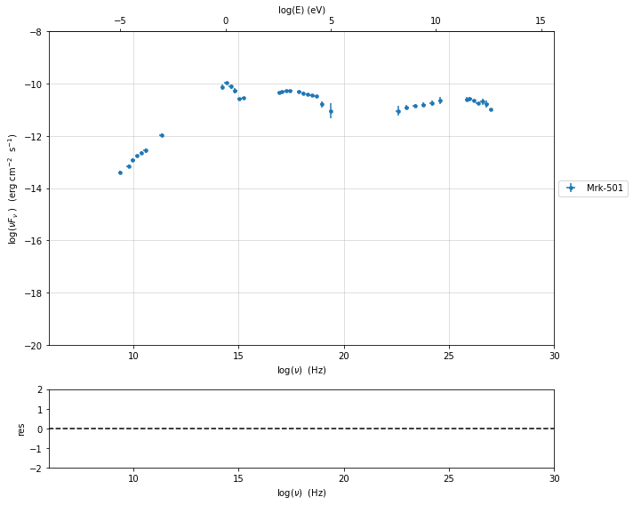
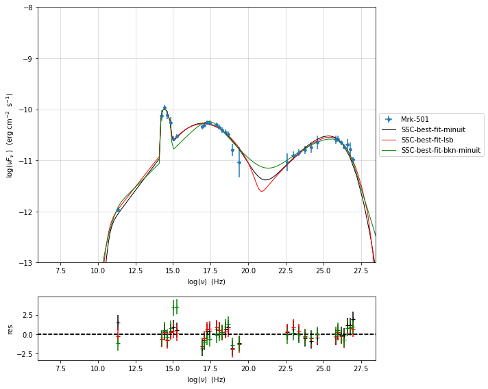

.. _model_fitting_2:

Model fitting
=============

.. code:: ipython3

    import warnings
    warnings.filterwarnings('ignore')
    
    import matplotlib.pylab as plt
    import jetset
    from jetset.test_data_helper import  test_SEDs
    from jetset.data_loader import ObsData,Data
    from jetset.plot_sedfit import PlotSED
    from jetset.test_data_helper import  test_SEDs

.. code:: ipython3

    test_SEDs

.. parsed-literal::

    ['/Users/orion/anaconda3/envs/develop/lib/python3.7/site-packages/jetset-1.1.0a3-py3.7-macosx-10.7-x86_64.egg/jetset/test_data/SEDs_data/SED_3C345.ecsv',
     '/Users/orion/anaconda3/envs/develop/lib/python3.7/site-packages/jetset-1.1.0a3-py3.7-macosx-10.7-x86_64.egg/jetset/test_data/SEDs_data/SED_MW_Mrk421.ecsv',
     '/Users/orion/anaconda3/envs/develop/lib/python3.7/site-packages/jetset-1.1.0a3-py3.7-macosx-10.7-x86_64.egg/jetset/test_data/SEDs_data/SED_MW_Mrk501.ecsv']

loading data
------------

see the :ref:`data_format` user guide for further information about loading data 

.. code:: ipython3

    data=Data.from_file(test_SEDs[2])

.. code:: ipython3

    %matplotlib inline
    sed_data=ObsData(data_table=data)
    sed_data.group_data(bin_width=0.2)
    
    sed_data.add_systematics(0.1,[10.**6,10.**29])
    p=sed_data.plot_sed()

.. parsed-literal::

    ===================================================================================================================
    
    ***  binning data  ***
    ---> N bins= 90
    ---> bin_widht= 0.2
    ===================================================================================================================
    

phenomenological model constraining
-----------------------------------

spectral indices
~~~~~~~~~~~~~~~~

.. code:: ipython3

    from jetset.sed_shaper import  SEDShape
    my_shape=SEDShape(sed_data)
    my_shape.eval_indices(silent=True)
    p=my_shape.plot_indices()
    p.rescale(y_min=-15,y_max=-6)

.. parsed-literal::

    ===================================================================================================================
    
    *** evaluating spectral indices for data ***
    ---> initial range for index radio  set to [6.000000,10.000000]
    ---> range for index radio updated  to [6.000000,10.000000]
    ---> name = radio            range=[6.000 ,10.000] log(Hz)  photon.val=-1.295207e+00, err=1.359752e-01 
    
    ---> initial range for index radio_mm  set to [10.000000,11.000000]
    ---> range for index radio_mm updated  to [10.000000,11.000000]
    ---> name = radio_mm         range=[10.000,11.000] log(Hz)  photon.val=-1.455018e+00, err=5.280897e-02 
    
    ---> initial range for index mm_IR  set to [11.000000,13.000000]
    ---> range for index mm_IR updated  to [10.300000,13.700000]
    ---> name = mm_IR            range=[10.300,13.700] log(Hz)  photon.val=-1.296277e+00, err=3.749588e-02 
    
    ---> initial range for index IR_Opt  set to [13.000000,14.000000]
    ---> range for index IR_Opt updated  to [12.300000,14.700000]
    ---> name = IR_Opt           range=[12.300,14.700] log(Hz)  photon.val=-2.087455e+00, err=5.433975e-01 
    
    ---> initial range for index Opt_UV  set to [14.000000,16.000000]
    ---> range for index Opt_UV updated  to [14.000000,16.000000]
    ---> name = Opt_UV           range=[14.000,16.000] log(Hz)  photon.val=-2.665890e+00, err=1.419430e-01 
    
    ---> initial range for index BBB  set to [15.000000,16.000000]
    ---> range for index BBB updated  to [14.800000,16.200000]
    ---> name = BBB              range=[14.800,16.200] log(Hz)  photon.val=-2.282189e+00, err=5.738888e-01 
    
    ---> initial range for index UV_X  set to [15.000000,17.500000]
    ---> range for index UV_X updated  to [15.000000,17.500000]
    ---> name = UV_X             range=[15.000,17.500] log(Hz)  photon.val=-1.873128e+00, err=7.268872e-03 
    
    ---> initial range for index X  set to [16.000000,19.000000]
    ---> range for index X updated  to [16.000000,19.000000]
    ---> name = X                range=[16.000,19.000] log(Hz)  photon.val=-2.111490e+00, err=3.364660e-02 
    
    ---> initial range for index Fermi  set to [22.380000,25.380000]
    ---> range for index Fermi updated  to [22.380000,25.380000]
    ---> name = Fermi            range=[22.380,25.380] log(Hz)  photon.val=-1.844574e+00, err=1.535431e-02 
    
    ---> initial range for index TeV  set to [25.000000,28.380000]
    ---> range for index TeV updated  to [25.000000,28.380000]
    ---> name = TeV              range=[25.000,28.380] log(Hz)  photon.val=-2.357854e+00, err=4.850264e-02 
    
    ===================================================================================================================
    

.. image:: Jet_example_model_fit_wiht_gal_template_files/Jet_example_model_fit_wiht_gal_template_10_1.png

sed shaper
~~~~~~~~~~

.. code:: ipython3

    mm,best_fit=my_shape.sync_fit(check_host_gal_template=True,
                      Ep_start=None,
                      minimizer='lsb',
                      silent=True,
                      fit_range=[10,21])

.. parsed-literal::

    ===================================================================================================================
    
    *** Log-Polynomial fitting of the synchrotron component ***
    ---> first blind fit run,  fit range: [10, 21]
    name   par type       units      val  phys. bound. min phys. bound. max  log  frozen
    ---- ------------ ------------- ----- ---------------- ---------------- ----- ------
       b    curvature                -1.0            -10.0              0.0 False  False
       c third-degree                -1.0            -10.0             10.0 False  False
      Ep    peak freq            Hz  14.0              0.0             30.0  True  False
      Sp    peak flux erg / (cm2 s) -10.0            -30.0              0.0  True  False
    ---> class:  HSP
    
        name       par type       units              val          phys. bound. min phys. bound. max  log  frozen
    ------------ ------------ ------------- --------------------- ---------------- ---------------- ----- ------
               b    curvature                -0.04778764423637938            -10.0              0.0 False  False
               c third-degree               0.0035762013845097584            -10.0             10.0 False  False
              Ep    peak freq            Hz    16.268703084421343              0.0             30.0  True  False
              Sp    peak flux erg / (cm2 s)    -10.25412262810351            -30.0              0.0  True  False
    nuFnu_p_host  nuFnu-scale erg / (cm2 s)    -10.25412262810351            -20.0             20.0 False  False
        nu_scale     nu-scale            Hz                   0.0             -2.0              2.0 False  False
    
    **************************************************************************************************
    Fit report
    
    Model: sync-shape-fit
        name       par type       units              val           phys. bound. min phys. bound. max  log  frozen
    ------------ ------------ ------------- ---------------------- ---------------- ---------------- ----- ------
               b    curvature                 -0.06411142567190709            -10.0              0.0 False  False
               c third-degree               -0.0017517043999486503            -10.0             10.0 False  False
              Ep    peak freq            Hz     17.037469323035243              0.0             30.0  True  False
              Sp    peak flux erg / (cm2 s)    -10.300678073393044            -30.0              0.0  True  False
    nuFnu_p_host  nuFnu-scale erg / (cm2 s)    -10.065562043463723            -20.0             20.0 False  False
        nu_scale     nu-scale            Hz    0.01730750205131648             -2.0              2.0 False  False
    
    converged=True
    calls=144
    The relative error between two consecutive iterates is at most 0.000000
    dof=15
    chisq=15.371959, chisq/red=1.024797 null hypothesis sig=0.424971
    
    best fit pars
        name          bestfit val               err +         err -       start val         fit range min      fit range max   frozen
    ------------ ---------------------- --------------------- ----- --------------------- ------------------ ----------------- ------
               b   -0.06411142567190709  0.007838949891087113  None  -0.04778764423637938              -10.0               0.0  False
               c -0.0017517043999486503 0.0011269419345774961  None 0.0035762013845097584              -10.0              10.0  False
              Ep     17.037469323035243   0.09437330920664459  None    16.268703084421343                0.0              30.0  False
              Sp    -10.300678073393044  0.018841147588972495  None    -10.25412262810351              -30.0               0.0  False
    nuFnu_p_host    -10.065562043463723   0.05462494081480342  None    -10.25412262810351 -12.25412262810351 -8.25412262810351  False
        nu_scale    0.01730750205131648 0.0036948369484981407  None                   0.0               -0.5               0.5  False
    **************************************************************************************************
    
    ---> class:  HSP
    ---> sync       nu_p=+1.703747e+01 (err=+9.437331e-02)  nuFnu_p=-1.030068e+01 (err=+1.884115e-02) curv.=-6.411143e-02 (err=+7.838950e-03)

.. code:: ipython3

    best_fit.show_report()

.. parsed-literal::

    
    **************************************************************************************************
    Fit report
    
    Model: sync-shape-fit
        name       par type       units              val           phys. bound. min phys. bound. max  log  frozen
    ------------ ------------ ------------- ---------------------- ---------------- ---------------- ----- ------
               b    curvature                 -0.06411142567190709            -10.0              0.0 False  False
               c third-degree               -0.0017517043999486503            -10.0             10.0 False  False
              Ep    peak freq            Hz     17.037469323035243              0.0             30.0  True  False
              Sp    peak flux erg / (cm2 s)    -10.300678073393044            -30.0              0.0  True  False
    nuFnu_p_host  nuFnu-scale erg / (cm2 s)    -10.065562043463723            -20.0             20.0 False  False
        nu_scale     nu-scale            Hz    0.01730750205131648             -2.0              2.0 False  False
    
    converged=True
    calls=144
    The relative error between two consecutive iterates is at most 0.000000
    dof=15
    chisq=15.371959, chisq/red=1.024797 null hypothesis sig=0.424971
    
    best fit pars
        name          bestfit val               err +         err -       start val         fit range min      fit range max   frozen
    ------------ ---------------------- --------------------- ----- --------------------- ------------------ ----------------- ------
               b   -0.06411142567190709  0.007838949891087113  None  -0.04778764423637938              -10.0               0.0  False
               c -0.0017517043999486503 0.0011269419345774961  None 0.0035762013845097584              -10.0              10.0  False
              Ep     17.037469323035243   0.09437330920664459  None    16.268703084421343                0.0              30.0  False
              Sp    -10.300678073393044  0.018841147588972495  None    -10.25412262810351              -30.0               0.0  False
    nuFnu_p_host    -10.065562043463723   0.05462494081480342  None    -10.25412262810351 -12.25412262810351 -8.25412262810351  False
        nu_scale    0.01730750205131648 0.0036948369484981407  None                   0.0               -0.5               0.5  False
    **************************************************************************************************
    

.. code:: ipython3

    my_shape.IC_fit(fit_range=[23,29],minimizer='minuit')
    p=my_shape.plot_shape_fit()
    p.rescale(y_min=-15)

.. parsed-literal::

    ===================================================================================================================
    
    *** Log-Polynomial fitting of the IC component ***
    ---> fit range: [23, 29]
    ---> LogCubic fit
    
    **************************************************************************************************
    Fit report
    
    Model: IC-shape-fit
    name   par type       units             val          phys. bound. min phys. bound. max  log  frozen
    ---- ------------ ------------- -------------------- ---------------- ---------------- ----- ------
       b    curvature                -0.1310958292206994            -10.0              0.0 False  False
       c third-degree               -0.03300307548904158            -10.0             10.0 False  False
      Ep    peak freq            Hz   25.496044142870343              0.0             30.0  True  False
      Sp    peak flux erg / (cm2 s)  -10.579458692670435            -30.0              0.0  True  False
    
    converged=True
    calls=217
    ------------------------------------------------------------------
    | FCN = 1.997                   |     Ncalls=216 (216 total)     |
    | EDM = 9.56E-07 (Goal: 1E-05)  |            up = 1.0            |
    ------------------------------------------------------------------
    |  Valid Min.   | Valid Param.  | Above EDM | Reached call limit |
    ------------------------------------------------------------------
    |     True      |     True      |   False   |       False        |
    ------------------------------------------------------------------
    | Hesse failed  |   Has cov.    | Accurate  | Pos. def. | Forced |
    ------------------------------------------------------------------
    |     False     |     True      |   True    |   True    | False  |
    ------------------------------------------------------------------
    -------------------------------------------------------------------------------------------
    |   | Name  |   Value   | Hesse Err | Minos Err- | Minos Err+ | Limit-  | Limit+  | Fixed |
    -------------------------------------------------------------------------------------------
    | 0 | par_0 |   -0.13   |    0.03   |            |            |   -10   |    0    |       |
    | 1 | par_1 |  -0.033   |   0.021   |            |            |   -10   |   10    |       |
    | 2 | par_2 |   25.50   |   0.22    |            |            |    0    |   30    |       |
    | 3 | par_3 |  -10.58   |    0.04   |            |            |   -30   |    0    |       |
    -------------------------------------------------------------------------------------------
    dof=7
    chisq=1.996620, chisq/red=0.285231 null hypothesis sig=0.960027
    
    best fit pars
    name     bestfit val             err +         err -     start val     fit range min fit range max frozen
    ---- -------------------- -------------------- ----- ----------------- ------------- ------------- ------
       b  -0.1310958292206994  0.03244100734334854  None              -1.0         -10.0           0.0  False
       c -0.03300307548904158  0.02072522109968844  None              -1.0         -10.0          10.0  False
      Ep   25.496044142870343  0.22355556512819952  None 25.56357458508762           0.0          30.0  False
      Sp  -10.579458692670435 0.043330596273419175  None             -10.0         -30.0           0.0  False
    **************************************************************************************************
    
    ---> IC         nu_p=+2.549604e+01 (err=+2.235556e-01)  nuFnu_p=-1.057946e+01 (err=+4.333060e-02) curv.=-1.310958e-01 (err=+3.244101e-02)
    ===================================================================================================================
    

.. image:: Jet_example_model_fit_wiht_gal_template_files/Jet_example_model_fit_wiht_gal_template_14_1.png

model constraining
~~~~~~~~~~~~~~~~~~

.. code:: ipython3

    from jetset.obs_constrain import ObsConstrain
    from jetset.model_manager import  FitModel
    from jetset.minimizer import fit_SED
    sed_obspar=ObsConstrain(beaming=25,
                            B_range=[0.001,0.1],
                            distr_e='lppl',
                            t_var_sec=3*86400,
                            nu_cut_IR=1E11,
                            SEDShape=my_shape)
    
    
    prefit_jet=sed_obspar.constrain_SSC_model(electron_distribution_log_values=False)
    prefit_jet.save_model('prefit_jet_gal_templ.dat')

.. parsed-literal::

    ===================================================================================================================
    
    ***  constrains parameters from observable ***
    
          name             par type           units             val         phys. bound. min  phys. bound. max   log  frozen
    ---------------- ------------------- --------------- ------------------ ---------------- ------------------ ----- ------
                   N    electron_density         1 / cm3              100.0              0.0               None False  False
                gmin  low-energy-cut-off lorentz-factor*                2.0              1.0       1000000000.0 False  False
                gmax high-energy-cut-off lorentz-factor*          1000000.0              1.0 1000000000000000.0 False  False
                   s   LE_spectral_slope                                2.0            -10.0               10.0 False  False
                   r  spectral_curvature                                0.4            -15.0               15.0 False  False
    gamma0_log_parab    turn-over-energy lorentz-factor*            10000.0              1.0       1000000000.0 False  False
                   R         region_size              cm 5000000000000000.0              0.0              1e+30 False  False
                 R_H     region_position              cm              1e+17              0.0               None False   True
                   B      magnetic_field               G                0.1              0.0               None False  False
            beam_obj             beaming Lorentz-factor*               10.0           0.0001               None False  False
              z_cosm            redshift                                0.1              0.0               None False  False
    ---> ***  emitting region parameters  ***
    ---> name = beam_obj          type = beaming               units = Lorentz-factor*   val = +2.500000e+01  phys-bounds = [+1.000000e-04,No           ] islog = False  froze= False 
    ---> setting par type redshift, corresponding to par z_cosm
    --->  name = z_cosm            type = redshift              units =                   val = +3.360000e-02  phys-bounds = [+0.000000e+00,No           ] islog = False  froze= False 
    
    ---> setting par type magnetic_field, corresponding to par B
    --->  name = B                 type = magnetic_field        units = G                 val = +5.050000e-02  phys-bounds = [+0.000000e+00,No           ] islog = False  froze= False 
    ---> setting par type region_size, corresponding to par R
    --->  name = R                 type = region_size           units = cm                val = +1.879504e+17  phys-bounds = [+0.000000e+00,+1.000000e+30] islog = False  froze= False 
    
    
    ---> *** electron distribution parameters ***
    ---> distribution type:  lppl
    ---> r elec. spec. curvature =3.205571e-01
    ---> setting par type curvature, corresponding to par r
    --->  name = r                 type = spectral_curvature    units =                   val = +3.205571e-01  phys-bounds = [-1.500000e+01,+1.500000e+01] islog = False  froze= False 
    
    ---> s_radio_mm -0.4550181897119767 1.9100363794239534
    ---> s_X 3.222980305950095
    ---> s_Fermi 1.751318246803089
    ---> s_UV_X 2.7462552767002855
    ---> s_Opt_UV -1.6658904880354974 4.331780976070995
    ---> s from synch log-log fit -1.0
    ---> s from (s_Fermi + s_UV)/2
    ---> power-law index s, class obj=HSP s chosen is 2.248787
    ---> setting par type LE_spectral_slope, corresponding to par s
    --->  name = s                 type = LE_spectral_slope     units =                   val = +2.248787e+00  phys-bounds = [-1.000000e+01,+1.000000e+01] islog = False  froze= False 
    
    ---> gamma_3p_Sync= 1.553082e+05, assuming B=5.050000e-02
    ---> gamma_max=2.310708e+06 from nu_max_Sync= 2.413075e+19, using B=5.050000e-02
    ---> setting par type high-energy-cut-off, corresponding to par gmax
    --->  name = gmax              type = high-energy-cut-off   units = lorentz-factor*   val = +2.310708e+06  phys-bounds = [+1.000000e+00,+1.000000e+15] islog = False  froze= False 
    
    ---> setting par type low-energy-cut-off, corresponding to par gmin
    --->  name = gmin              type = low-energy-cut-off    units = lorentz-factor*   val = +1.487509e+02  phys-bounds = [+1.000000e+00,+1.000000e+09] islog = False  froze= False 
    
    ---> setting par type turn-over energy, corresponding to par gamma0_log_parab
    ---> using gamma_3p_Sync= 155308.18930566724
    --->  name = gamma0_log_parab  type = turn-over-energy      units = lorentz-factor*   val = +1.045836e+04  phys-bounds = [+1.000000e+00,+1.000000e+09] islog = False  froze= False 
    
    nu_p_seed_blob 4506940400380918.0
    COMP FACTOR 5.665025584724533 22606.126136511644
    ---> gamma_3p_SSCc= %e 246681.73532127816
    ---> setting par type turn-over energy, corresponding to par gamma0_log_parab
    ---> using gamma_3p_SSC= 246681.73532127816
    --->  name = gamma0_log_parab  type = turn-over-energy      units = lorentz-factor*   val = +1.661140e+04  phys-bounds = [+1.000000e+00,+1.000000e+09] islog = False  froze= False 
    
    
    ---> setting par type electron_density, corresponding to par N
    ---> name = N                 type = electron_density      units = 1 / cm3           val = +3.758246e-03  phys-bounds = [+0.000000e+00,No           ] islog = False  froze= False 
    ---> B from nu_p_S=2.001733e-02
    ---> get B from best matching of nu_p_IC
    ---> B=3.445266e-01, out of boundaries 1.000000e-03 1.000000e-01, rejected
         Best B not found, (temporary set to 1.000000e-01)
    ---> setting par type magnetic_field, corresponding to par B
    --->  name = B                 type = magnetic_field        units = G                 val = +1.000000e-01  phys-bounds = [+0.000000e+00,No           ] islog = False  froze= False 
    
    ---> constrain failed, B set to:  name = B                 type = magnetic_field        units = G                 val = +1.000000e-01  phys-bounds = [+0.000000e+00,No           ] islog = False  froze= False 
    
    
    ---> update pars for new B 
    ---> setting par type low-energy-cut-off, corresponding to par gmin
    --->  name = gmin              type = low-energy-cut-off    units = lorentz-factor*   val = +1.057074e+02  phys-bounds = [+1.000000e+00,+1.000000e+09] islog = False  froze= False 
    
    ---> setting par type low-energy-cut-off, corresponding to par gamma0_log_parab
    ---> using gamma_3p_Sync= 110367.20527869459
    --->  name = gamma0_log_parab  type = turn-over-energy      units = lorentz-factor*   val = +7.432063e+03  phys-bounds = [+1.000000e+00,+1.000000e+09] islog = False  froze= False 
    
    ---> gamma_max=1.642067e+06 from nu_max_Sync= 2.413075e+19, using B=1.000000e-01
    ---> setting par type high-energy-cut-off, corresponding to par gmax
    --->  name = gmax              type = high-energy-cut-off   units = lorentz-factor*   val = +1.642067e+06  phys-bounds = [+1.000000e+00,+1.000000e+15] islog = False  froze= False 
    
    ---> setting par type electron_density, corresponding to par N
    ---> get R from Compoton Dominance (CD)
         Best R=5.485641e+15
    ---> setting par type region_size, corresponding to par R
    --->  name = R                 type = region_size           units = cm                val = +5.485641e+15  phys-bounds = [+0.000000e+00,+1.000000e+30] islog = False  froze= False 
    
    ---> setting par type electron_density, corresponding to par N
    ---> t_var (days) 0.08755993893706769
    
    show pars
          name             par type           units             val         phys. bound. min  phys. bound. max   log  frozen
    ---------------- ------------------- --------------- ------------------ ---------------- ------------------ ----- ------
                   N    electron_density         1 / cm3 107.84943545012176              0.0               None False  False
                gmin  low-energy-cut-off lorentz-factor* 105.70739829384722              1.0       1000000000.0 False  False
                gmax high-energy-cut-off lorentz-factor* 1642066.7004262165              1.0 1000000000000000.0 False  False
                   s   LE_spectral_slope                 2.2487867617516875            -10.0               10.0 False  False
                   r  spectral_curvature                 0.3205571283595354            -15.0               15.0 False  False
    gamma0_log_parab    turn-over-energy lorentz-factor*  7432.062863037491              1.0       1000000000.0 False  False
                   R         region_size              cm 5485641265784695.0              0.0              1e+30 False  False
                 R_H     region_position              cm              1e+17              0.0               None False   True
                   B      magnetic_field               G                0.1              0.0               None False  False
            beam_obj             beaming Lorentz-factor*               25.0           0.0001               None False  False
              z_cosm            redshift                             0.0336              0.0               None False  False
    eval_model
    
    ===================================================================================================================
    

.. code:: ipython3

    pl=prefit_jet.plot_model(sed_data=sed_data)
    pl.add_residual_plot(prefit_jet,sed_data)
    pl.rescale(y_min=-15,x_min=7,x_max=29)

.. image:: Jet_example_model_fit_wiht_gal_template_files/Jet_example_model_fit_wiht_gal_template_17_0.png

Model fitting
-------------

We remind that we can use different ``minimizers`` for the model fitting. In the following we will use the ``minuit`` minimizer, but as alternative we can use the ``lsb`` minimizer. Using ``minuit`` we notice that sometime (as in the case below) the fit will converge, but the quality  will not be enough (``valid==false``) to run ``minos``. Anyhow, as shown in the :ref:`MCMC sampling`, it still possible to estimate asymmetric errors by means of MCMC sampling

Model fitting with LSB
~~~~~~~~~~~~~~~~~~~~~~

.. code:: ipython3

    from jetset.model_manager import  FitModel
    from jetset.jet_model import Jet
    
    jet_lsb=Jet.load_model('prefit_jet_gal_templ.dat')
    jet_lsb.set_gamma_grid_size(200)
    
    fit_model_lsb=FitModel( jet=jet_lsb, name='SSC-best-fit-lsb',template=my_shape.host_gal) 
    fit_model_lsb.freeze('z_cosm')
    fit_model_lsb.freeze('R_H')
    fit_model_lsb.parameters.beam_obj.fit_range=[5,50]
    fit_model_lsb.parameters.R.fit_range=[10**15.5,10**17.5]
    fit_model_lsb.parameters.gmax.fit_range=[1E4,1E8]
    fit_model_lsb.parameters.nuFnu_p_host.frozen=False
    fit_model_lsb.parameters.nu_scale.frozen=True
    
    
    model_minimizer_lsb,best_fit_lsb=fit_SED(fit_model_lsb,sed_data,10.0**11,10**29.0,fitname='SSC-best-fit-lsb',minimizer='lsb')

.. parsed-literal::

          name             par type           units             val         phys. bound. min  phys. bound. max   log  frozen
    ---------------- ------------------- --------------- ------------------ ---------------- ------------------ ----- ------
                   R         region_size              cm 5485641265784695.0              0.0              1e+30 False  False
                 R_H     region_position              cm              1e+17              0.0               None False   True
                   B      magnetic_field               G                0.1              0.0               None False  False
            beam_obj             beaming Lorentz-factor*               25.0           0.0001               None False  False
              z_cosm            redshift                             0.0336              0.0               None False  False
                   N    electron_density         1 / cm3 107.84943545012176              0.0               None False  False
                gmin  low-energy-cut-off lorentz-factor* 105.70739829384722              1.0       1000000000.0 False  False
                gmax high-energy-cut-off lorentz-factor* 1642066.7004262165              1.0 1000000000000000.0 False  False
                   s   LE_spectral_slope                 2.2487867617516875            -10.0               10.0 False  False
                   r  spectral_curvature                 0.3205571283595354            -15.0               15.0 False  False
    gamma0_log_parab    turn-over-energy lorentz-factor*  7432.062863037491              1.0       1000000000.0 False  False
    filtering data in fit range = [1.000000e+11,1.000000e+29]
    data length 31
    ===================================================================================================================
    
    *** start fit process ***
    initial pars: 
          name             par type           units              val         phys. bound. min  phys. bound. max   log  frozen
    ---------------- ------------------- --------------- ------------------- ---------------- ------------------ ----- ------
                   R         region_size              cm  5485641265784695.0              0.0              1e+30 False  False
                 R_H     region_position              cm               1e+17              0.0               None False   True
                   B      magnetic_field               G                 0.1              0.0               None False  False
            beam_obj             beaming Lorentz-factor*                25.0           0.0001               None False  False
              z_cosm            redshift                              0.0336              0.0               None False   True
                   N    electron_density         1 / cm3  107.84943545012176              0.0               None False  False
                gmin  low-energy-cut-off lorentz-factor*  105.70739829384722              1.0       1000000000.0 False  False
                gmax high-energy-cut-off lorentz-factor*  1642066.7004262165              1.0 1000000000000000.0 False  False
                   s   LE_spectral_slope                  2.2487867617516875            -10.0               10.0 False  False
                   r  spectral_curvature                  0.3205571283595354            -15.0               15.0 False  False
    gamma0_log_parab    turn-over-energy lorentz-factor*   7432.062863037491              1.0       1000000000.0 False  False
        nuFnu_p_host         nuFnu-scale   erg / (cm2 s) -10.065562043463723            -20.0               20.0 False  False
            nu_scale            nu-scale              Hz 0.01730750205131648             -2.0                2.0 False   True
    ----- 
    / minim function calls=220, chisq=16.175660 UL part=-0.000000                                                                                                                                                                                                   
    **************************************************************************************************
    Fit report
    
    Model: SSC-best-fit-lsb
          name             par type           units              val          phys. bound. min  phys. bound. max   log  frozen
    ---------------- ------------------- --------------- -------------------- ---------------- ------------------ ----- ------
                   R         region_size              cm   8378228093120288.0              0.0              1e+30 False  False
                 R_H     region_position              cm                1e+17              0.0               None False   True
                   B      magnetic_field               G 0.017801553453728358              0.0               None False  False
            beam_obj             beaming Lorentz-factor*    46.95494511788813           0.0001               None False  False
              z_cosm            redshift                               0.0336              0.0               None False   True
                   N    electron_density         1 / cm3    47.97366358048528              0.0               None False  False
                gmin  low-energy-cut-off lorentz-factor*   102.46624530427954              1.0       1000000000.0 False  False
                gmax high-energy-cut-off lorentz-factor*    7929178.419082588              1.0 1000000000000000.0 False  False
                   s   LE_spectral_slope                   2.2455458450296977            -10.0               10.0 False  False
                   r  spectral_curvature                   0.3585923704414302            -15.0               15.0 False  False
    gamma0_log_parab    turn-over-energy lorentz-factor*    17351.49944670226              1.0       1000000000.0 False  False
        nuFnu_p_host         nuFnu-scale   erg / (cm2 s)  -10.047325970775558            -20.0               20.0 False  False
            nu_scale            nu-scale              Hz  0.01730750205131648             -2.0                2.0 False   True
    
    converged=True
    calls=229
    The relative error between two consecutive iterates is at most 0.000000
    dof=21
    chisq=16.175660, chisq/red=0.770270 null hypothesis sig=0.759702
    
    best fit pars
          name           bestfit val              err +         err -      start val        fit range min        fit range max      frozen
    ---------------- -------------------- --------------------- ----- ------------------- ------------------ ---------------------- ------
                   R   8378228093120288.0 2.204486627707412e+16  None  5485641265784695.0 3162277660168379.5 3.1622776601683795e+17  False
                 R_H                 None                  None  None               1e+17                0.0                   None   True
                   B 0.017801553453728358   0.01679317589598411  None                 0.1                0.0                   None  False
            beam_obj    46.95494511788813    46.391377140656175  None                25.0                5.0                     50  False
              z_cosm                 None                  None  None              0.0336                0.0                   None   True
                   N    47.97366358048528    142.13768244872657  None  107.84943545012176                0.0                   None  False
                gmin   102.46624530427954    0.2531078937618845  None  105.70739829384722                1.0           1000000000.0  False
                gmax    7929178.419082588     9702557.590413574  None  1642066.7004262165            10000.0            100000000.0  False
                   s   2.2455458450296977   0.04802909037375515  None  2.2487867617516875              -10.0                   10.0  False
                   r   0.3585923704414302   0.04252170953021034  None  0.3205571283595354              -15.0                   15.0  False
    gamma0_log_parab    17351.49944670226    14638.784751180716  None   7432.062863037491                1.0           1000000000.0  False
        nuFnu_p_host  -10.047325970775558   0.04364529970524803  None -10.065562043463723 -12.25412262810351      -8.25412262810351  False
            nu_scale                 None                  None  None 0.01730750205131648               -0.5                    0.5   True
    **************************************************************************************************
    
    ===================================================================================================================                                                                                                                                             
    

.. code:: ipython3

    best_fit_lsb.save_report()
    best_fit_lsb.bestfit_table

.. raw:: html

    <i>Table length=13</i>
    <table id="table112254942992" class="table-striped table-bordered table-condensed">
    <thead><tr><th>name</th><th>bestfit val</th><th>err +</th><th>err -</th><th>start val</th><th>fit range min</th><th>fit range max</th><th>frozen</th></tr></thead>
    <thead><tr><th>str16</th><th>object</th><th>object</th><th>object</th><th>float64</th><th>float64</th><th>object</th><th>bool</th></tr></thead>
    <tr><td>R</td><td>8378228093120288.0</td><td>2.204486627707412e+16</td><td>None</td><td>5485641265784695.0</td><td>3162277660168379.5</td><td>3.1622776601683795e+17</td><td>False</td></tr>
    <tr><td>R_H</td><td>None</td><td>None</td><td>None</td><td>1e+17</td><td>0.0</td><td>None</td><td>True</td></tr>
    <tr><td>B</td><td>0.017801553453728358</td><td>0.01679317589598411</td><td>None</td><td>0.1</td><td>0.0</td><td>None</td><td>False</td></tr>
    <tr><td>beam_obj</td><td>46.95494511788813</td><td>46.391377140656175</td><td>None</td><td>25.0</td><td>5.0</td><td>50</td><td>False</td></tr>
    <tr><td>z_cosm</td><td>None</td><td>None</td><td>None</td><td>0.0336</td><td>0.0</td><td>None</td><td>True</td></tr>
    <tr><td>N</td><td>47.97366358048528</td><td>142.13768244872657</td><td>None</td><td>107.84943545012176</td><td>0.0</td><td>None</td><td>False</td></tr>
    <tr><td>gmin</td><td>102.46624530427954</td><td>0.2531078937618845</td><td>None</td><td>105.70739829384722</td><td>1.0</td><td>1000000000.0</td><td>False</td></tr>
    <tr><td>gmax</td><td>7929178.419082588</td><td>9702557.590413574</td><td>None</td><td>1642066.7004262165</td><td>10000.0</td><td>100000000.0</td><td>False</td></tr>
    <tr><td>s</td><td>2.2455458450296977</td><td>0.04802909037375515</td><td>None</td><td>2.2487867617516875</td><td>-10.0</td><td>10.0</td><td>False</td></tr>
    <tr><td>r</td><td>0.3585923704414302</td><td>0.04252170953021034</td><td>None</td><td>0.3205571283595354</td><td>-15.0</td><td>15.0</td><td>False</td></tr>
    <tr><td>gamma0_log_parab</td><td>17351.49944670226</td><td>14638.784751180716</td><td>None</td><td>7432.062863037491</td><td>1.0</td><td>1000000000.0</td><td>False</td></tr>
    <tr><td>nuFnu_p_host</td><td>-10.047325970775558</td><td>0.04364529970524803</td><td>None</td><td>-10.065562043463723</td><td>-12.25412262810351</td><td>-8.25412262810351</td><td>False</td></tr>
    <tr><td>nu_scale</td><td>None</td><td>None</td><td>None</td><td>0.01730750205131648</td><td>-0.5</td><td>0.5</td><td>True</td></tr>
    </table>

.. code:: ipython3

    %matplotlib inline
    fit_model_lsb.set_nu_grid(1E6,1E30,200)
    fit_model_lsb.eval()
    p2=fit_model_lsb.plot_model(sed_data=sed_data)
    p2.rescale(y_min=-13,x_min=6,x_max=28.5)

.. image:: Jet_example_model_fit_wiht_gal_template_files/Jet_example_model_fit_wiht_gal_template_23_0.png

Model fitting with Minuit
~~~~~~~~~~~~~~~~~~~~~~~~~

.. code:: ipython3

    jet_minuit=Jet.load_model('prefit_jet_gal_templ.dat')
    jet_minuit.set_gamma_grid_size(200)
    
    fit_model_minuit=FitModel( jet=jet_minuit, name='SSC-best-fit-minuit',template=my_shape.host_gal) 
    fit_model_minuit.freeze('z_cosm')
    fit_model_minuit.freeze('R_H')
    fit_model_minuit.parameters.beam_obj.fit_range=[5,50]
    fit_model_minuit.parameters.R.fit_range=[10**15.5,10**17.5]
    fit_model_minuit.parameters.nuFnu_p_host.frozen=False
    fit_model_minuit.parameters.nu_scale.frozen=True
    
    model_minimizer_minuit,best_fit_minuit=fit_SED(fit_model_minuit,sed_data,10.0**11,10**29.0,fitname='SSC-best-fit-minuit',minimizer='minuit')

.. parsed-literal::

          name             par type           units             val         phys. bound. min  phys. bound. max   log  frozen
    ---------------- ------------------- --------------- ------------------ ---------------- ------------------ ----- ------
                   R         region_size              cm 5485641265784695.0              0.0              1e+30 False  False
                 R_H     region_position              cm              1e+17              0.0               None False   True
                   B      magnetic_field               G                0.1              0.0               None False  False
            beam_obj             beaming Lorentz-factor*               25.0           0.0001               None False  False
              z_cosm            redshift                             0.0336              0.0               None False  False
                   N    electron_density         1 / cm3 107.84943545012176              0.0               None False  False
                gmin  low-energy-cut-off lorentz-factor* 105.70739829384722              1.0       1000000000.0 False  False
                gmax high-energy-cut-off lorentz-factor* 1642066.7004262165              1.0 1000000000000000.0 False  False
                   s   LE_spectral_slope                 2.2487867617516875            -10.0               10.0 False  False
                   r  spectral_curvature                 0.3205571283595354            -15.0               15.0 False  False
    gamma0_log_parab    turn-over-energy lorentz-factor*  7432.062863037491              1.0       1000000000.0 False  False
    filtering data in fit range = [1.000000e+11,1.000000e+29]
    data length 31
    ===================================================================================================================
    
    *** start fit process ***
    initial pars: 
          name             par type           units              val         phys. bound. min  phys. bound. max   log  frozen
    ---------------- ------------------- --------------- ------------------- ---------------- ------------------ ----- ------
                   R         region_size              cm  5485641265784695.0              0.0              1e+30 False  False
                 R_H     region_position              cm               1e+17              0.0               None False   True
                   B      magnetic_field               G                 0.1              0.0               None False  False
            beam_obj             beaming Lorentz-factor*                25.0           0.0001               None False  False
              z_cosm            redshift                              0.0336              0.0               None False   True
                   N    electron_density         1 / cm3  107.84943545012176              0.0               None False  False
                gmin  low-energy-cut-off lorentz-factor*  105.70739829384722              1.0       1000000000.0 False  False
                gmax high-energy-cut-off lorentz-factor*  1642066.7004262165              1.0 1000000000000000.0 False  False
                   s   LE_spectral_slope                  2.2487867617516875            -10.0               10.0 False  False
                   r  spectral_curvature                  0.3205571283595354            -15.0               15.0 False  False
    gamma0_log_parab    turn-over-energy lorentz-factor*   7432.062863037491              1.0       1000000000.0 False  False
        nuFnu_p_host         nuFnu-scale   erg / (cm2 s) -10.047325970775558            -20.0               20.0 False  False
            nu_scale            nu-scale              Hz 0.01730750205131648             -2.0                2.0 False   True
    ----- 
    | minim function calls=530, chisq=23.558150 UL part=-0.000000                                                                                                                                                                                                   
    **************************************************************************************************
    Fit report
    
    Model: SSC-best-fit-minuit
          name             par type           units              val         phys. bound. min  phys. bound. max   log  frozen
    ---------------- ------------------- --------------- ------------------- ---------------- ------------------ ----- ------
                   R         region_size              cm  7005902449303527.0              0.0              1e+30 False  False
                 R_H     region_position              cm               1e+17              0.0               None False   True
                   B      magnetic_field               G 0.02824843541131483              0.0               None False  False
            beam_obj             beaming Lorentz-factor*  39.675103214017845           0.0001               None False  False
              z_cosm            redshift                              0.0336              0.0               None False   True
                   N    electron_density         1 / cm3  105.32197460286113              0.0               None False  False
                gmin  low-energy-cut-off lorentz-factor*  62.341393403356406              1.0       1000000000.0 False  False
                gmax high-energy-cut-off lorentz-factor*   948726898.2652165              1.0 1000000000000000.0 False  False
                   s   LE_spectral_slope                   2.214083798550364            -10.0               10.0 False  False
                   r  spectral_curvature                  0.4032976785594613            -15.0               15.0 False  False
    gamma0_log_parab    turn-over-energy lorentz-factor*   18134.12131456428              1.0       1000000000.0 False  False
        nuFnu_p_host         nuFnu-scale   erg / (cm2 s) -10.035494783731453            -20.0               20.0 False  False
            nu_scale            nu-scale              Hz 0.01730750205131648             -2.0                2.0 False   True
    
    converged=True
    calls=530
    ------------------------------------------------------------------
    | FCN = 23.33                   |     Ncalls=518 (529 total)     |
    | EDM = 4.27E+05 (Goal: 1E-05)  |            up = 1.0            |
    ------------------------------------------------------------------
    |  Valid Min.   | Valid Param.  | Above EDM | Reached call limit |
    ------------------------------------------------------------------
    |     False     |     True      |   True    |       False        |
    ------------------------------------------------------------------
    | Hesse failed  |   Has cov.    | Accurate  | Pos. def. | Forced |
    ------------------------------------------------------------------
    |     False     |     True      |   True    |   True    | False  |
    ------------------------------------------------------------------
    -------------------------------------------------------------------------------------------
    |   | Name  |   Value   | Hesse Err | Minos Err- | Minos Err+ | Limit-  | Limit+  | Fixed |
    -------------------------------------------------------------------------------------------
    | 0 | par_0 |  0.70E16  |  0.24E16  |            |            |3.16228e+15|3.16228e+17|       |
    | 1 | par_1 |   0.028   |   0.008   |            |            |    0    |         |       |
    | 2 | par_2 |   39.7    |    2.8    |            |            |    5    |   50    |       |
    | 3 | par_3 |    105    |    28     |            |            |    0    |         |       |
    | 4 | par_4 |   62.3    |    3.0    |            |            |    1    |  1e+09  |       |
    | 5 | par_5 |  0.949E9  |  0.011E9  |            |            |    1    |  1e+15  |       |
    | 6 | par_6 |   2.21    |   0.05    |            |            |   -10   |   10    |       |
    | 7 | par_7 |   0.40    |   0.05    |            |            |   -15   |   15    |       |
    | 8 | par_8 |   1.8E4   |   0.7E4   |            |            |    1    |  1e+09  |       |
    | 9 | par_9 |  -10.04   |    0.05   |            |            |-12.2541 |-8.25412 |       |
    -------------------------------------------------------------------------------------------
    dof=21
    chisq=23.558150, chisq/red=1.121817 null hypothesis sig=0.314956
    
    best fit pars
          name           bestfit val            err +         err -      start val        fit range min        fit range max      frozen
    ---------------- ------------------- -------------------- ----- ------------------- ------------------ ---------------------- ------
                   R  7005902449303527.0   2360680059387186.0  None  5485641265784695.0 3162277660168379.5 3.1622776601683795e+17  False
                 R_H                None                 None  None               1e+17                0.0                   None   True
                   B 0.02824843541131483 0.008174672674116312  None                 0.1                0.0                   None  False
            beam_obj  39.675103214017845   2.7543642629202303  None                25.0                5.0                     50  False
              z_cosm                None                 None  None              0.0336                0.0                   None   True
                   N  105.32197460286113   27.615031642353394  None  107.84943545012176                0.0                   None  False
                gmin  62.341393403356406   2.9700423202214914  None  105.70739829384722                1.0           1000000000.0  False
                gmax   948726898.2652165   10604370.076494634  None  1642066.7004262165                1.0     1000000000000000.0  False
                   s   2.214083798550364 0.046843333484935634  None  2.2487867617516875              -10.0                   10.0  False
                   r  0.4032976785594613 0.048524668046090014  None  0.3205571283595354              -15.0                   15.0  False
    gamma0_log_parab   18134.12131456428    6641.471861737906  None   7432.062863037491                1.0           1000000000.0  False
        nuFnu_p_host -10.035494783731453  0.04786997956205408  None -10.047325970775558 -12.25412262810351      -8.25412262810351  False
            nu_scale                None                 None  None 0.01730750205131648               -0.5                    0.5   True
    **************************************************************************************************
    
    ===================================================================================================================
    

.. code:: ipython3

    %matplotlib inline
    fit_model_minuit.set_nu_grid(1E6,1E30,200)
    fit_model_minuit.eval()
    p2=fit_model_minuit.plot_model(sed_data=sed_data)
    p2.rescale(y_min=-13,x_min=6,x_max=28.5)

.. image:: Jet_example_model_fit_wiht_gal_template_files/Jet_example_model_fit_wiht_gal_template_26_0.png

.. code:: ipython3

    model_minimizer_minuit.minimizer.mesg

.. raw:: html

    <table>
    <tr>
    <td colspan="2" title="Minimum value of function">
    FCN = 23.33
    </td>
    <td align="center" colspan="3" title="No. of calls in last algorithm and total number of calls">
    Ncalls = 518 (529 total)
    </td>
    </tr>
    <tr>
    <td colspan="2" title="Estimated distance to minimum and target threshold">
    EDM = 4.27E+05 (Goal: 1E-05)
    </td>
    <td align="center" colspan="3" title="Increase in FCN which corresponds to 1 standard deviation">
    up = 1.0
    </td>
    </tr>
    <tr>
    <td align="center" title="Validity of the migrad call">
    Valid Min.
    </td>
    <td align="center" title="Validity of parameters">
    Valid Param.
    </td>
    <td align="center" title="Is EDM above goal EDM?">
    Above EDM
    </td>
    <td align="center" colspan="2" title="Did last migrad call reach max call limit?">
    Reached call limit
    </td>
    </tr>
    <tr>
    <td align="center" style="background-color:#FF7878;">
    False
    </td>
    <td align="center" style="background-color:#92CCA6;">
    True
    </td>
    <td align="center" style="background-color:#FF7878;">
    True
    </td>
    <td align="center" colspan="2" style="background-color:#92CCA6;">
    False
    </td>
    </tr>
    <tr>
    <td align="center" title="Did Hesse fail?">
    Hesse failed
    </td>
    <td align="center" title="Has covariance matrix">
    Has cov.
    </td>
    <td align="center" title="Is covariance matrix accurate?">
    Accurate
    </td>
    <td align="center" title="Is covariance matrix positive definite?">
    Pos. def.
    </td>
    <td align="center" title="Was positive definiteness enforced by Minuit?">
    Forced
    </td>
    </tr>
    <tr>
    <td align="center" style="background-color:#92CCA6;">
    False
    </td>
    <td align="center" style="background-color:#92CCA6;">
    True
    </td>
    <td align="center" style="background-color:#92CCA6;">
    True
    </td>
    <td align="center" style="background-color:#92CCA6;">
    True
    </td>
    <td align="center" style="background-color:#92CCA6;">
    False
    </td>
    </tr>
    </table>
    <table>
    <tr style="background-color:#F4F4F4;">
    <td/>
    <th title="Variable name">
    Name
    </th>
    <th title="Value of parameter">
    Value
    </th>
    <th title="Hesse error">
    Hesse Error
    </th>
    <th title="Minos lower error">
    Minos Error-
    </th>
    <th title="Minos upper error">
    Minos Error+
    </th>
    <th title="Lower limit of the parameter">
    Limit-
    </th>
    <th title="Upper limit of the parameter">
    Limit+
    </th>
    <th title="Is the parameter fixed in the fit">
    Fixed
    </th>
    </tr>
    <tr style="background-color:#FFFFFF;">
    <td>
    0
    </td>
    <td>
    par_0
    </td>
    <td>
    0.70E16
    </td>
    <td>
    0.24E16
    </td>
    <td>
    
    </td>
    <td>
    
    </td>
    <td>
    3.16E+15
    </td>
    <td>
    3.16E+17
    </td>
    <td>
    
    </td>
    </tr>
    <tr style="background-color:#F4F4F4;">
    <td>
    1
    </td>
    <td>
    par_1
    </td>
    <td>
    0.028
    </td>
    <td>
    0.008
    </td>
    <td>
    
    </td>
    <td>
    
    </td>
    <td>
    0
    </td>
    <td>
    
    </td>
    <td>
    
    </td>
    </tr>
    <tr style="background-color:#FFFFFF;">
    <td>
    2
    </td>
    <td>
    par_2
    </td>
    <td>
    39.7
    </td>
    <td>
    2.8
    </td>
    <td>
    
    </td>
    <td>
    
    </td>
    <td>
    5
    </td>
    <td>
    50
    </td>
    <td>
    
    </td>
    </tr>
    <tr style="background-color:#F4F4F4;">
    <td>
    3
    </td>
    <td>
    par_3
    </td>
    <td>
    105
    </td>
    <td>
    28
    </td>
    <td>
    
    </td>
    <td>
    
    </td>
    <td>
    0
    </td>
    <td>
    
    </td>
    <td>
    
    </td>
    </tr>
    <tr style="background-color:#FFFFFF;">
    <td>
    4
    </td>
    <td>
    par_4
    </td>
    <td>
    62.3
    </td>
    <td>
    3.0
    </td>
    <td>
    
    </td>
    <td>
    
    </td>
    <td>
    1
    </td>
    <td>
    1E+09
    </td>
    <td>
    
    </td>
    </tr>
    <tr style="background-color:#F4F4F4;">
    <td>
    5
    </td>
    <td>
    par_5
    </td>
    <td>
    0.949E9
    </td>
    <td>
    0.011E9
    </td>
    <td>
    
    </td>
    <td>
    
    </td>
    <td>
    1
    </td>
    <td>
    1E+15
    </td>
    <td>
    
    </td>
    </tr>
    <tr style="background-color:#FFFFFF;">
    <td>
    6
    </td>
    <td>
    par_6
    </td>
    <td>
    2.21
    </td>
    <td>
    0.05
    </td>
    <td>
    
    </td>
    <td>
    
    </td>
    <td>
    -10
    </td>
    <td>
    10
    </td>
    <td>
    
    </td>
    </tr>
    <tr style="background-color:#F4F4F4;">
    <td>
    7
    </td>
    <td>
    par_7
    </td>
    <td>
    0.40
    </td>
    <td>
    0.05
    </td>
    <td>
    
    </td>
    <td>
    
    </td>
    <td>
    -15
    </td>
    <td>
    15
    </td>
    <td>
    
    </td>
    </tr>
    <tr style="background-color:#FFFFFF;">
    <td>
    8
    </td>
    <td>
    par_8
    </td>
    <td>
    1.8E4
    </td>
    <td>
    0.7E4
    </td>
    <td>
    
    </td>
    <td>
    
    </td>
    <td>
    1
    </td>
    <td>
    1E+09
    </td>
    <td>
    
    </td>
    </tr>
    <tr style="background-color:#F4F4F4;">
    <td>
    9
    </td>
    <td>
    par_9
    </td>
    <td>
    -10.04
    </td>
    <td>
     0.05
    </td>
    <td>
    
    </td>
    <td>
    
    </td>
    <td>
    -12.3
    </td>
    <td>
    -8.25
    </td>
    <td>
    
    </td>
    </tr>
    </table>

.. code:: ipython3

    %matplotlib inline
    from jetset.plot_sedfit import PlotSED
    fit_model_minuit.set_nu_grid(1E6,1E30,200)
    fit_model_minuit.eval()
    p2=PlotSED()
    p2.add_data_plot(sed_data,fit_range=[ 11,29])
    p2.add_model_plot(fit_model_minuit,color='black')
    p2.add_residual_plot(fit_model_minuit,sed_data,fit_range=[ 11,29],color='black')
    p2.add_model_plot(fit_model_lsb,color='red')
    p2.add_residual_plot(fit_model_lsb,sed_data,fit_range=[ 11,29],color='red')
    p2.rescale(y_min=-13,x_min=6,x_max=28.5)

.. image:: Jet_example_model_fit_wiht_gal_template_files/Jet_example_model_fit_wiht_gal_template_28_0.png

Model fitting with a bkn pl
~~~~~~~~~~~~~~~~~~~~~~~~~~~

.. code:: ipython3

    from jetset.obs_constrain import ObsConstrain
    from jetset.model_manager import  FitModel
    from jetset.minimizer import fit_SED
    sed_obspar=ObsConstrain(beaming=25,
                            B_range=[0.001,0.1],
                            distr_e='bkn',
                            t_var_sec=3*86400,
                            nu_cut_IR=1E11,
                            SEDShape=my_shape)
    
    
    prefit_jet=sed_obspar.constrain_SSC_model(electron_distribution_log_values=False)
    prefit_jet.save_model('prefit_jet_bkn_gal_templ.dat')

.. parsed-literal::

    ===================================================================================================================
    
    ***  constrains parameters from observable ***
    
        name          par type           units             val         phys. bound. min  phys. bound. max   log  frozen
    ----------- ------------------- --------------- ------------------ ---------------- ------------------ ----- ------
              N    electron_density         1 / cm3              100.0              0.0               None False  False
           gmin  low-energy-cut-off lorentz-factor*                2.0              1.0       1000000000.0 False  False
           gmax high-energy-cut-off lorentz-factor*          1000000.0              1.0 1000000000000000.0 False  False
              p   LE_spectral_slope                                2.0            -10.0               10.0 False  False
            p_1   HE_spectral_slope                                3.0            -10.0               10.0 False  False
    gamma_break    turn-over-energy lorentz-factor*            10000.0              1.0       1000000000.0 False  False
              R         region_size              cm 5000000000000000.0              0.0              1e+30 False  False
            R_H     region_position              cm              1e+17              0.0               None False   True
              B      magnetic_field               G                0.1              0.0               None False  False
       beam_obj             beaming Lorentz-factor*               10.0           0.0001               None False  False
         z_cosm            redshift                                0.1              0.0               None False  False
    ---> ***  emitting region parameters  ***
    ---> name = beam_obj          type = beaming               units = Lorentz-factor*   val = +2.500000e+01  phys-bounds = [+1.000000e-04,No           ] islog = False  froze= False 
    ---> setting par type redshift, corresponding to par z_cosm
    --->  name = z_cosm            type = redshift              units =                   val = +3.360000e-02  phys-bounds = [+0.000000e+00,No           ] islog = False  froze= False 
    
    ---> setting par type magnetic_field, corresponding to par B
    --->  name = B                 type = magnetic_field        units = G                 val = +5.050000e-02  phys-bounds = [+0.000000e+00,No           ] islog = False  froze= False 
    ---> setting par type region_size, corresponding to par R
    --->  name = R                 type = region_size           units = cm                val = +1.879504e+17  phys-bounds = [+0.000000e+00,+1.000000e+30] islog = False  froze= False 
    
    
    ---> *** electron distribution parameters ***
    ---> distribution type:  bkn
    ---> s_radio_mm -0.4550181897119767 1.9100363794239534
    ---> s_X 3.222980305950095
    ---> s_Fermi 1.751318246803089
    ---> s_UV_X 2.7462552767002855
    ---> s_Opt_UV -1.6658904880354974 4.331780976070995
    ---> s from synch log-log fit -1.0
    ---> s from (s_Fermi + s_UV)/2
    ---> power-law index s, class obj=HSP s chosen is 2.248787
    ---> setting par type LE_spectral_slope, corresponding to par p
    --->  name = p                 type = LE_spectral_slope     units =                   val = +2.248787e+00  phys-bounds = [-1.000000e+01,+1.000000e+01] islog = False  froze= False 
    
    ---> set s1 to 3.500000
    ---> setting par type LE_spectral_slope, corresponding to par p_1
    --->  name = p_1               type = HE_spectral_slope     units =                   val = +3.500000e+00  phys-bounds = [-1.000000e+01,+1.000000e+01] islog = False  froze= False 
    
    ---> gamma_3p_Sync= 1.553082e+05, assuming B=5.050000e-02
    ---> gamma_max=1.540472e+06 from nu_max_Sync= 2.413075e+19, using B=5.050000e-02
    ---> setting par type high-energy-cut-off, corresponding to par gmax
    --->  name = gmax              type = high-energy-cut-off   units = lorentz-factor*   val = +1.540472e+06  phys-bounds = [+1.000000e+00,+1.000000e+15] islog = False  froze= False 
    
    ---> setting par type low-energy-cut-off, corresponding to par gmin
    --->  name = gmin              type = low-energy-cut-off    units = lorentz-factor*   val = +1.487509e+02  phys-bounds = [+1.000000e+00,+1.000000e+09] islog = False  froze= False 
    
    ---> setting par type turn-over energy, corresponding to par gamma_break
    ---> using gamma_3p_Sync= 155308.18930566724
    --->  name = gamma_break       type = turn-over-energy      units = lorentz-factor*   val = +1.553082e+05  phys-bounds = [+1.000000e+00,+1.000000e+09] islog = False  froze= False 
    
    nu_p_seed_blob 4506940400380918.0
    COMP FACTOR 5.665025584724533 22606.126136511644
    ---> gamma_3p_SSCc= %e 246681.73532127816
    ---> setting par type turn-over energy, corresponding to par gamma_break
    ---> using gamma_3p_SSC= 246681.73532127816
    --->  name = gamma_break       type = turn-over-energy      units = lorentz-factor*   val = +2.466817e+05  phys-bounds = [+1.000000e+00,+1.000000e+09] islog = False  froze= False 
    
    
    ---> setting par type electron_density, corresponding to par N
    ---> name = N                 type = electron_density      units = 1 / cm3           val = +1.652104e-03  phys-bounds = [+0.000000e+00,No           ] islog = False  froze= False 
    ---> B from nu_p_S=2.001733e-02
    ---> get B from best matching of nu_p_IC
         Best B=3.132705e-02
    ---> setting par type magnetic_field, corresponding to par B
    --->  name = B                 type = magnetic_field        units = G                 val = +3.132705e-02  phys-bounds = [+0.000000e+00,No           ] islog = False  froze= False 
    
    ---> best B found:  name = B                 type = magnetic_field        units = G                 val = +3.132705e-02  phys-bounds = [+0.000000e+00,No           ] islog = False  froze= False 
    
    ---> update pars for new B 
    ---> setting par type low-energy-cut-off, corresponding to par gmin
    --->  name = gmin              type = low-energy-cut-off    units = lorentz-factor*   val = +1.888625e+02  phys-bounds = [+1.000000e+00,+1.000000e+09] islog = False  froze= False 
    
    ---> setting par type low-energy-cut-off, corresponding to par gamma_break
    ---> using gamma_3p_Sync= 197187.9234306636
    --->  name = gamma_break       type = turn-over-energy      units = lorentz-factor*   val = +1.971879e+05  phys-bounds = [+1.000000e+00,+1.000000e+09] islog = False  froze= False 
    
    ---> gamma_max=1.955869e+06 from nu_max_Sync= 2.413075e+19, using B=3.132705e-02
    ---> setting par type high-energy-cut-off, corresponding to par gmax
    --->  name = gmax              type = high-energy-cut-off   units = lorentz-factor*   val = +1.955869e+06  phys-bounds = [+1.000000e+00,+1.000000e+15] islog = False  froze= False 
    
    ---> setting par type electron_density, corresponding to par N
    ---> get R from Compoton Dominance (CD)
         Best R=1.045240e+16
    ---> setting par type region_size, corresponding to par R
    --->  name = R                 type = region_size           units = cm                val = +1.045240e+16  phys-bounds = [+0.000000e+00,+1.000000e+30] islog = False  froze= False 
    
    ---> setting par type electron_density, corresponding to par N
    ---> t_var (days) 0.16683760488534477
    
    show pars
        name          par type           units               val          phys. bound. min  phys. bound. max   log  frozen
    ----------- ------------------- --------------- --------------------- ---------------- ------------------ ----- ------
              N    electron_density         1 / cm3    21.934513544042005              0.0               None False  False
           gmin  low-energy-cut-off lorentz-factor*    188.86246424548722              1.0       1000000000.0 False  False
           gmax high-energy-cut-off lorentz-factor*     1955869.179158501              1.0 1000000000000000.0 False  False
              p   LE_spectral_slope                    2.2487867617516875            -10.0               10.0 False  False
            p_1   HE_spectral_slope                                   3.5            -10.0               10.0 False  False
    gamma_break    turn-over-energy lorentz-factor*     197187.9234306636              1.0       1000000000.0 False  False
              R         region_size              cm 1.045239707969101e+16              0.0              1e+30 False  False
            R_H     region_position              cm                 1e+17              0.0               None False   True
              B      magnetic_field               G  0.031327047381077736              0.0               None False  False
       beam_obj             beaming Lorentz-factor*                  25.0           0.0001               None False  False
         z_cosm            redshift                                0.0336              0.0               None False  False
    eval_model
    
    ===================================================================================================================
    

.. code:: ipython3

    pl=prefit_jet.plot_model(sed_data=sed_data)
    pl.add_residual_plot(prefit_jet,sed_data)
    pl.rescale(y_min=-15,x_min=7,x_max=29)

.. image:: Jet_example_model_fit_wiht_gal_template_files/Jet_example_model_fit_wiht_gal_template_31_0.png

.. code:: ipython3

    jet_minuit_bkn=Jet.load_model('prefit_jet_bkn_gal_templ.dat')
    jet_minuit_bkn.set_gamma_grid_size(200)
    
    fit_model_minuit_bkn=FitModel( jet=jet_minuit_bkn, name='SSC-best-fit-bkn-minuit',template=my_shape.host_gal) 
    fit_model_minuit_bkn.freeze('z_cosm')
    fit_model_minuit_bkn.freeze('R_H')
    fit_model_minuit_bkn.parameters.beam_obj.fit_range=[5,50]
    fit_model_minuit_bkn.parameters.R.fit_range=[10**15.5,10**17.5]
    fit_model_minuit_bkn.parameters.nuFnu_p_host.frozen=False
    fit_model_minuit_bkn.parameters.nu_scale.frozen=True
    
    model_minimizer_minuit_bkn,best_fit_minuit_bkn=fit_SED(fit_model_minuit_bkn,sed_data,10.0**11,10**29.0,fitname='SSC-best-fit-minuit',minimizer='minuit')

.. parsed-literal::

        name          par type           units               val          phys. bound. min  phys. bound. max   log  frozen
    ----------- ------------------- --------------- --------------------- ---------------- ------------------ ----- ------
              R         region_size              cm 1.045239707969101e+16              0.0              1e+30 False  False
            R_H     region_position              cm                 1e+17              0.0               None False   True
              B      magnetic_field               G  0.031327047381077736              0.0               None False  False
       beam_obj             beaming Lorentz-factor*                  25.0           0.0001               None False  False
         z_cosm            redshift                                0.0336              0.0               None False  False
              N    electron_density         1 / cm3    21.934513544042005              0.0               None False  False
           gmin  low-energy-cut-off lorentz-factor*    188.86246424548722              1.0       1000000000.0 False  False
           gmax high-energy-cut-off lorentz-factor*     1955869.179158501              1.0 1000000000000000.0 False  False
              p   LE_spectral_slope                    2.2487867617516875            -10.0               10.0 False  False
            p_1   HE_spectral_slope                                   3.5            -10.0               10.0 False  False
    gamma_break    turn-over-energy lorentz-factor*     197187.9234306636              1.0       1000000000.0 False  False
    filtering data in fit range = [1.000000e+11,1.000000e+29]
    data length 31
    ===================================================================================================================
    
    *** start fit process ***
    initial pars: 
        name           par type           units               val          phys. bound. min  phys. bound. max   log  frozen
    ------------ ------------------- --------------- --------------------- ---------------- ------------------ ----- ------
               R         region_size              cm 1.045239707969101e+16              0.0              1e+30 False  False
             R_H     region_position              cm                 1e+17              0.0               None False   True
               B      magnetic_field               G  0.031327047381077736              0.0               None False  False
        beam_obj             beaming Lorentz-factor*                  25.0           0.0001               None False  False
          z_cosm            redshift                                0.0336              0.0               None False   True
               N    electron_density         1 / cm3    21.934513544042005              0.0               None False  False
            gmin  low-energy-cut-off lorentz-factor*    188.86246424548722              1.0       1000000000.0 False  False
            gmax high-energy-cut-off lorentz-factor*     1955869.179158501              1.0 1000000000000000.0 False  False
               p   LE_spectral_slope                    2.2487867617516875            -10.0               10.0 False  False
             p_1   HE_spectral_slope                                   3.5            -10.0               10.0 False  False
     gamma_break    turn-over-energy lorentz-factor*     197187.9234306636              1.0       1000000000.0 False  False
    nuFnu_p_host         nuFnu-scale   erg / (cm2 s)   -10.035494783731453            -20.0               20.0 False  False
        nu_scale            nu-scale              Hz   0.01730750205131648             -2.0                2.0 False   True
    ----- 
    \ minim function calls=760, chisq=41.840465 UL part=-0.000000                                                                                                                                                                                                   
    **************************************************************************************************
    Fit report
    
    Model: SSC-best-fit-minuit
        name           par type           units               val           phys. bound. min  phys. bound. max   log  frozen
    ------------ ------------------- --------------- ---------------------- ---------------- ------------------ ----- ------
               R         region_size              cm 1.2444390794818728e+16              0.0              1e+30 False  False
             R_H     region_position              cm                  1e+17              0.0               None False   True
               B      magnetic_field               G   0.019430715234125984              0.0               None False  False
        beam_obj             beaming Lorentz-factor*      32.26117240293633           0.0001               None False  False
          z_cosm            redshift                                 0.0336              0.0               None False   True
               N    electron_density         1 / cm3     25.845693056773378              0.0               None False  False
            gmin  low-energy-cut-off lorentz-factor*     205.16341613550097              1.0       1000000000.0 False  False
            gmax high-energy-cut-off lorentz-factor*      916801799.9225054              1.0 1000000000000000.0 False  False
               p   LE_spectral_slope                     2.4156320972774985            -10.0               10.0 False  False
             p_1   HE_spectral_slope                     3.6625122448498377            -10.0               10.0 False  False
     gamma_break    turn-over-energy lorentz-factor*      337190.2388965147              1.0       1000000000.0 False  False
    nuFnu_p_host         nuFnu-scale   erg / (cm2 s)     -10.02067084167235            -20.0               20.0 False  False
        nu_scale            nu-scale              Hz    0.01730750205131648             -2.0                2.0 False   True
    
    converged=True
    calls=766
    ------------------------------------------------------------------
    | FCN = 41.4                    |     Ncalls=754 (765 total)     |
    | EDM = 4.21E+04 (Goal: 1E-05)  |            up = 1.0            |
    ------------------------------------------------------------------
    |  Valid Min.   | Valid Param.  | Above EDM | Reached call limit |
    ------------------------------------------------------------------
    |     False     |     True      |   True    |       False        |
    ------------------------------------------------------------------
    | Hesse failed  |   Has cov.    | Accurate  | Pos. def. | Forced |
    ------------------------------------------------------------------
    |     False     |     True      |   False   |   False   |  True  |
    ------------------------------------------------------------------
    -------------------------------------------------------------------------------------------
    |   | Name  |   Value   | Hesse Err | Minos Err- | Minos Err+ | Limit-  | Limit+  | Fixed |
    -------------------------------------------------------------------------------------------
    | 0 | par_0 |  1.24E16  |  0.07E16  |            |            |3.16228e+15|3.16228e+17|       |
    | 1 | par_1 |  1.94E-2  |  0.25E-2  |            |            |    0    |         |       |
    | 2 | par_2 |   32.3    |    1.2    |            |            |    5    |   50    |       |
    | 3 | par_3 |   25.8    |    1.9    |            |            |    0    |         |       |
    | 4 | par_4 |   205.2   |    0.8    |            |            |    1    |  1e+09  |       |
    | 5 | par_5 |  0.917E9  |  0.018E9  |            |            |    1    |  1e+15  |       |
    | 6 | par_6 |   2.416   |   0.013   |            |            |   -10   |   10    |       |
    | 7 | par_7 |   3.66    |   0.09    |            |            |   -10   |   10    |       |
    | 8 | par_8 |  0.34E6   |  0.05E6   |            |            |    1    |  1e+09  |       |
    | 9 | par_9 |  -10.02   |    0.05   |            |            |-12.2541 |-8.25412 |       |
    -------------------------------------------------------------------------------------------
    dof=21
    chisq=41.404788, chisq/red=1.971657 null hypothesis sig=0.004995
    
    best fit pars
        name          bestfit val               err +         err -       start val         fit range min        fit range max      frozen
    ------------ ---------------------- --------------------- ----- --------------------- ------------------ ---------------------- ------
               R 1.2444390794818728e+16     715162091159756.0  None 1.045239707969101e+16 3162277660168379.5 3.1622776601683795e+17  False
             R_H                   None                  None  None                 1e+17                0.0                   None   True
               B   0.019430715234125984 0.0024956321015221494  None  0.031327047381077736                0.0                   None  False
        beam_obj      32.26117240293633    1.1541014950423563  None                  25.0                5.0                     50  False
          z_cosm                   None                  None  None                0.0336                0.0                   None   True
               N     25.845693056773378    1.9307746288038423  None    21.934513544042005                0.0                   None  False
            gmin     205.16341613550097    0.8475954096770977  None    188.86246424548722                1.0           1000000000.0  False
            gmax      916801799.9225054    17743785.940549374  None     1955869.179158501                1.0     1000000000000000.0  False
               p     2.4156320972774985   0.01283203552093859  None    2.2487867617516875              -10.0                   10.0  False
             p_1     3.6625122448498377   0.09127161599512856  None                   3.5              -10.0                   10.0  False
     gamma_break      337190.2388965147     46121.67332480298  None     197187.9234306636                1.0           1000000000.0  False
    nuFnu_p_host     -10.02067084167235  0.045722206930403964  None   -10.035494783731453 -12.25412262810351      -8.25412262810351  False
        nu_scale                   None                  None  None   0.01730750205131648               -0.5                    0.5   True
    **************************************************************************************************
    
    ===================================================================================================================
    

.. code:: ipython3

    %matplotlib inline
    fit_model_minuit_bkn.set_nu_grid(1E6,1E30,200)
    fit_model_minuit_bkn.eval()
    p2=fit_model_minuit_bkn.plot_model(sed_data=sed_data)
    p2.rescale(y_min=-13,x_min=6,x_max=28.5)

.. image:: Jet_example_model_fit_wiht_gal_template_files/Jet_example_model_fit_wiht_gal_template_33_0.png

.. code:: ipython3

    %matplotlib inline
    from jetset.plot_sedfit import PlotSED
    fit_model_minuit_bkn.set_nu_grid(1E6,1E30,200)
    fit_model_minuit_bkn.eval()
    p2=PlotSED()
    p2.add_data_plot(sed_data,fit_range=[ 11,29])
    p2.add_model_plot(fit_model_minuit,color='black')
    p2.add_residual_plot(fit_model_minuit,sed_data,fit_range=[ 11,29],color='black')
    p2.add_model_plot(fit_model_lsb,color='red')
    p2.add_residual_plot(fit_model_lsb,sed_data,fit_range=[ 11,29],color='red')
    p2.add_model_plot(fit_model_minuit_bkn,color='green')
    p2.add_residual_plot(fit_model_minuit_bkn,sed_data,fit_range=[ 11,29],color='green')
    p2.rescale(y_min=-13,x_min=6,x_max=28.5)

