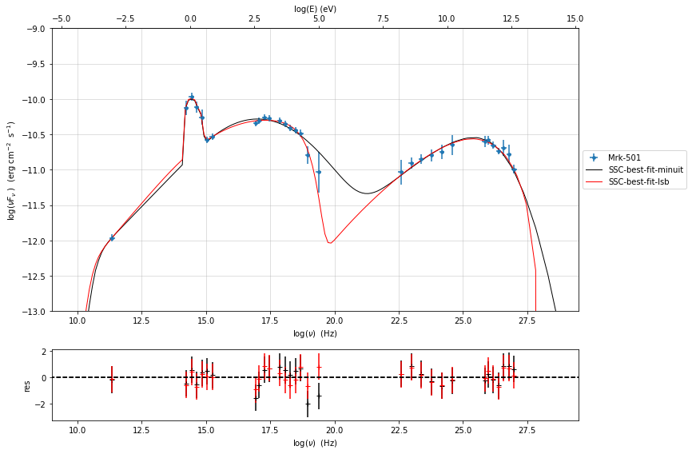
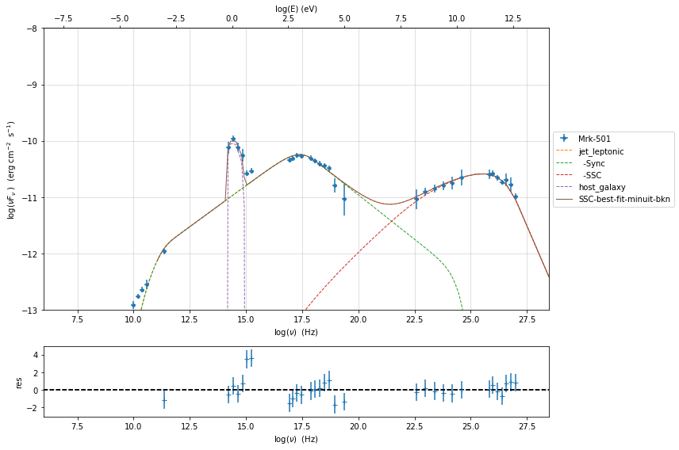
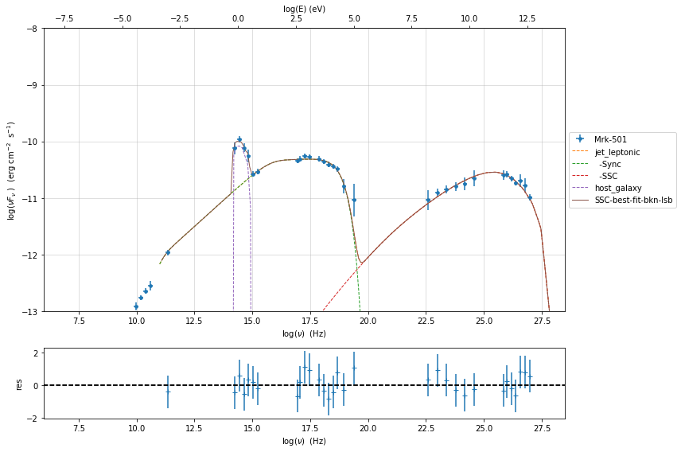
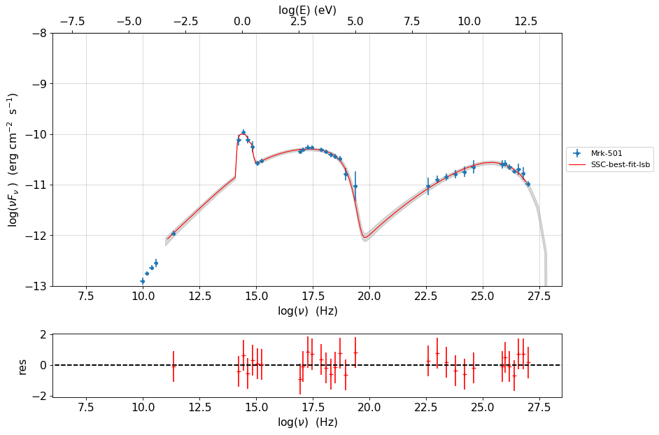
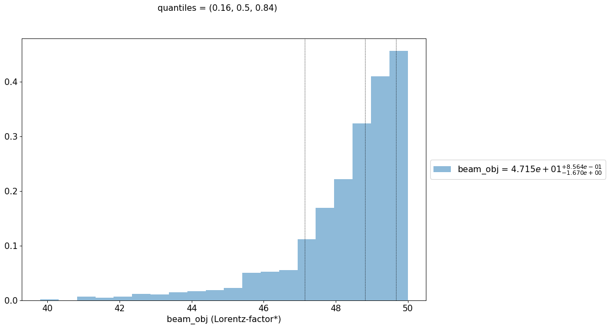
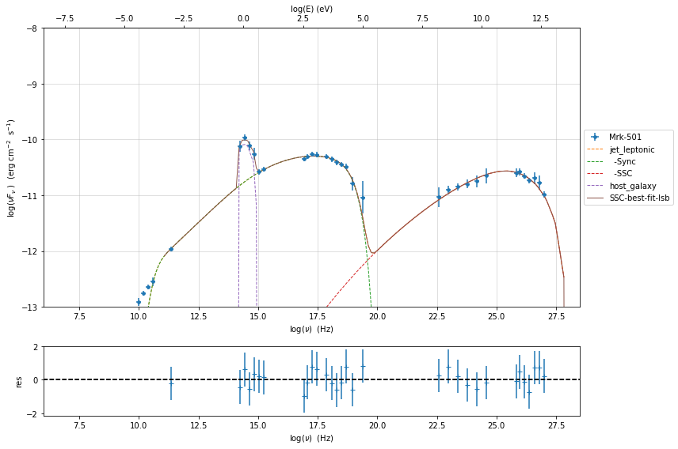

.. _model_fitting_2:

Model fitting 2: SSC + galaxy template
======================================

.. code:: ipython3

    import warnings
    warnings.filterwarnings('ignore')
    
    import matplotlib.pylab as plt
    import jetset
    from jetset.test_data_helper import  test_SEDs
    from jetset.data_loader import ObsData,Data
    from jetset.plot_sedfit import PlotSED
    from jetset.test_data_helper import  test_SEDs

.. code:: ipython3

    test_SEDs

.. parsed-literal::

    ['/Users/orion/anaconda3/envs/jetset/lib/python3.7/site-packages/jetset-1.1.2-py3.7-macosx-10.9-x86_64.egg/jetset/test_data/SEDs_data/SED_3C345.ecsv',
     '/Users/orion/anaconda3/envs/jetset/lib/python3.7/site-packages/jetset-1.1.2-py3.7-macosx-10.9-x86_64.egg/jetset/test_data/SEDs_data/SED_MW_Mrk421_EBL_DEABS.ecsv',
     '/Users/orion/anaconda3/envs/jetset/lib/python3.7/site-packages/jetset-1.1.2-py3.7-macosx-10.9-x86_64.egg/jetset/test_data/SEDs_data/SED_MW_Mrk501_EBL_DEABS.ecsv']

Loading data
------------

see the :ref:`data_format` user guide for further information about loading data 

.. code:: ipython3

    data=Data.from_file(test_SEDs[2])

.. code:: ipython3

    %matplotlib inline
    sed_data=ObsData(data_table=data)
    sed_data.group_data(bin_width=0.2)
    
    sed_data.add_systematics(0.1,[10.**6,10.**29])
    p=sed_data.plot_sed()

.. parsed-literal::

    ===================================================================================================================
    
    ***  binning data  ***
    ---> N bins= 90
    ---> bin_widht= 0.2
    ===================================================================================================================
    

.. image:: Jet_example_model_fit_wiht_gal_template_files/Jet_example_model_fit_wiht_gal_template_7_1.png

.. code:: ipython3

    sed_data.save('Mrk_501.pkl')

Phenomenological model constraining
-----------------------------------

see the :ref:`phenom_constr` user guide for further information about loading data 

Spectral indices
~~~~~~~~~~~~~~~~

.. code:: ipython3

    from jetset.sed_shaper import  SEDShape
    my_shape=SEDShape(sed_data)
    my_shape.eval_indices(silent=True)
    p=my_shape.plot_indices()
    p.rescale(y_min=-15,y_max=-6)

.. parsed-literal::

    ===================================================================================================================
    
    *** evaluating spectral indices for data ***
    ===================================================================================================================
    

.. image:: Jet_example_model_fit_wiht_gal_template_files/Jet_example_model_fit_wiht_gal_template_12_1.png

Sed shaper
~~~~~~~~~~

.. code:: ipython3

    mm,best_fit=my_shape.sync_fit(check_host_gal_template=True,
                      Ep_start=None,
                      minimizer='lsb',
                      silent=True,
                      fit_range=[10. , 21.])

.. parsed-literal::

    ===================================================================================================================
    
    *** Log-Polynomial fitting of the synchrotron component ***
    ---> first blind fit run,  fit range: [10.0, 21.0]
    ---> class:  HSP
    
    ---> class:  HSP
    
    
     model name     name      bestfit val     err +     err -   start val   fit range min fit range max frozen
    ----------- ------------ ------------- ------------ ----- ------------- ------------- ------------- ------
       LogCubic            b -6.411144e-02 7.838941e-03    -- -4.778766e-02 -1.000000e+01  0.000000e+00  False
       LogCubic            c -1.751706e-03 1.127019e-03    --  3.576198e-03 -1.000000e+01  1.000000e+01  False
       LogCubic           Ep  1.703747e+01 9.437328e-02    --  1.626870e+01  0.000000e+00  3.000000e+01  False
       LogCubic           Sp -1.030068e+01 1.884113e-02    -- -1.025412e+01 -3.000000e+01  0.000000e+00  False
    host_galaxy nuFnu_p_host -1.006556e+01 5.462496e-02    -- -1.025412e+01 -1.225412e+01 -8.254123e+00  False
    host_galaxy     nu_scale  1.730750e-02 3.694862e-03    --  0.000000e+00 -5.000000e-01  5.000000e-01  False
    ---> sync       nu_p=+1.703747e+01 (err=+9.437328e-02)  nuFnu_p=-1.030068e+01 (err=+1.884113e-02) curv.=-6.411144e-02 (err=+7.838941e-03)
    ===================================================================================================================
    

.. code:: ipython3

    my_shape.IC_fit(fit_range=[23., 29.],minimizer='minuit',silent=True)
    p=my_shape.plot_shape_fit()
    p.rescale(y_min=-15)

.. parsed-literal::

    ===================================================================================================================
    
    *** Log-Polynomial fitting of the IC component ***
    ---> fit range: [23.0, 29.0]
    ---> LogCubic fit
    
    
    model name name  bestfit val     err +     err -   start val   fit range min fit range max frozen
    ---------- ---- ------------- ------------ ----- ------------- ------------- ------------- ------
      LogCubic    b -1.310958e-01 3.244105e-02    -- -1.000000e+00 -1.000000e+01  0.000000e+00  False
      LogCubic    c -3.300308e-02 2.072526e-02    -- -1.000000e+00 -1.000000e+01  1.000000e+01  False
      LogCubic   Ep  2.549604e+01 2.235559e-01    --  2.556357e+01  0.000000e+00  3.000000e+01  False
      LogCubic   Sp -1.057946e+01 4.333061e-02    -- -1.000000e+01 -3.000000e+01  0.000000e+00  False
    ---> IC         nu_p=+2.549604e+01 (err=+2.235559e-01)  nuFnu_p=-1.057946e+01 (err=+4.333061e-02) curv.=-1.310958e-01 (err=+3.244105e-02)
    ===================================================================================================================
    

.. image:: Jet_example_model_fit_wiht_gal_template_files/Jet_example_model_fit_wiht_gal_template_15_1.png

Model constraining
~~~~~~~~~~~~~~~~~~

In this step we are not fitting the model, we are just obtaining the
phenomenological ``pre_fit`` model, that will be fitted in using minuit
ore least-square bound, as shown below

.. code:: ipython3

    from jetset.obs_constrain import ObsConstrain
    from jetset.model_manager import  FitModel
    from jetset.minimizer import fit_SED
    sed_obspar=ObsConstrain(beaming=25,
                            B_range=[0.001,0.1],
                            distr_e='lppl',
                            t_var_sec=3*86400,
                            nu_cut_IR=1E11,
                            SEDShape=my_shape)
    
    
    prefit_jet=sed_obspar.constrain_SSC_model(electron_distribution_log_values=False,silent=True)
    prefit_jet.save_model('prefit_jet_gal_templ.pkl')

.. parsed-literal::

    ===================================================================================================================
    
    ***  constrains parameters from observable ***
    
          name             par type           units          val      phys. bound. min phys. bound. max  log  frozen
    ---------------- ------------------- --------------- ------------ ---------------- ---------------- ----- ------
                gmin  low-energy-cut-off lorentz-factor* 1.057074e+02     1.000000e+00     1.000000e+09 False  False
                gmax high-energy-cut-off lorentz-factor* 1.642067e+06     1.000000e+00     1.000000e+15 False  False
                   N    emitters_density         1 / cm3 1.078494e+02     0.000000e+00               -- False  False
                   s   LE_spectral_slope                 2.248787e+00    -1.000000e+01     1.000000e+01 False  False
                   r  spectral_curvature                 3.205572e-01    -1.500000e+01     1.500000e+01 False  False
    gamma0_log_parab    turn-over-energy lorentz-factor* 7.432066e+03     1.000000e+00     1.000000e+09 False  False
                   R         region_size              cm 5.485641e+15     1.000000e+03     1.000000e+30 False  False
                 R_H     region_position              cm 1.000000e+17     0.000000e+00               -- False   True
                   B      magnetic_field               G 1.000000e-01     0.000000e+00               -- False  False
            beam_obj             beaming Lorentz-factor* 2.500000e+01     1.000000e-04               -- False  False
              z_cosm            redshift                 3.360000e-02     0.000000e+00               -- False  False
    
    ===================================================================================================================
    

.. code:: ipython3

    pl=prefit_jet.plot_model(sed_data=sed_data)
    pl.add_residual_plot(prefit_jet,sed_data)
    pl.rescale(y_min=-15,x_min=7,x_max=29)

.. image:: Jet_example_model_fit_wiht_gal_template_files/Jet_example_model_fit_wiht_gal_template_19_0.png

Model fitting
-------------

We remind that we can use different ``minimizers`` for the model fitting. In the following we will use the ``minuit`` minimizer and the ``lsb`` (least square bound scipy minimizer). Using ``minuit`` we notice that sometimes (as in the case below) the fit will converge, but the quality  will not be enough (``valid==false``) to run ``minos``. Anyhow, as shown in the :ref:`MCMC sampling`, it still possible to estimate asymmetric errors by means of MCMC sampling.

We freeze some parameters, and we also set some `fit_range` values. Setting fit_range can speed-up the fit convergence but should be judged by the user each time according to the physics of the particular source.

.. note::
   With the new implementation of composite model  (`FitModel` class) to set parameters you have to specify the model component, this is different from versions<1.1.2,
   and this holds also for the `freeze` method and for setting  `fit_range` intervals, and for the methods relate to parameters setting in general.
   See the :ref:`composite_models` user guide for further information about the new implementation of `FitModel`, in particular for parameter setting

Model fitting with LSB
~~~~~~~~~~~~~~~~~~~~~~

see the :ref:`composite_models` user guide for further information about the new implementation of `FitModel`, in particular for parameter setting

.. code:: ipython3

    from jetset.model_manager import  FitModel
    from jetset.jet_model import Jet
    
    jet_lsb=Jet.load_model('prefit_jet_gal_templ.pkl')
    jet_lsb.set_gamma_grid_size(200)

.. parsed-literal::

          name             par type           units          val      phys. bound. min phys. bound. max  log  frozen
    ---------------- ------------------- --------------- ------------ ---------------- ---------------- ----- ------
                gmin  low-energy-cut-off lorentz-factor* 1.057074e+02     1.000000e+00     1.000000e+09 False  False
                gmax high-energy-cut-off lorentz-factor* 1.642067e+06     1.000000e+00     1.000000e+15 False  False
                   N    emitters_density         1 / cm3 1.078494e+02     0.000000e+00               -- False  False
                   s   LE_spectral_slope                 2.248787e+00    -1.000000e+01     1.000000e+01 False  False
                   r  spectral_curvature                 3.205572e-01    -1.500000e+01     1.500000e+01 False  False
    gamma0_log_parab    turn-over-energy lorentz-factor* 7.432066e+03     1.000000e+00     1.000000e+09 False  False
                   R         region_size              cm 5.485641e+15     1.000000e+03     1.000000e+30 False  False
                 R_H     region_position              cm 1.000000e+17     0.000000e+00               -- False   True
                   B      magnetic_field               G 1.000000e-01     0.000000e+00               -- False  False
            beam_obj             beaming Lorentz-factor* 2.500000e+01     1.000000e-04               -- False  False
              z_cosm            redshift                 3.360000e-02     0.000000e+00               -- False  False

.. code:: ipython3

    fit_model_lsb=FitModel( jet=jet_lsb, name='SSC-best-fit-lsb',template=my_shape.host_gal) 
    fit_model_lsb.show_model()

.. parsed-literal::

    
    -------------------------------------------------------------------------------------------------------------------
    Composite model description
    -------------------------------------------------------------------------------------------------------------------
    name: SSC-best-fit-lsb  
    type: composite_model  
    components models:
     -model name: jet_leptonic model type: jet
     -model name: host_galaxy model type: template
    
    -------------------------------------------------------------------------------------------------------------------
    individual component description
    
    
    -------------------------------------------------------------------------------------------------------------------
    jet model description
    -------------------------------------------------------------------------------------------------------------------
    name: jet_leptonic  
    
    electrons distribution:
     type: lppl  
     gamma energy grid size:  201
     gmin grid : 1.057074e+02
     gmax grid : 1.642067e+06
     normalization  True
     log-values  False
    
    radiative fields:
     seed photons grid size:  100
     IC emission grid size:  50
     source emissivity lower bound :  1.000000e-120
     spectral components:
       name:Sum, state: on
       name:Sync, state: self-abs
       name:SSC, state: on
    external fields transformation method: blob
    
    SED info:
     nu grid size :200
     nu mix (Hz): 1.000000e+06
     nu max (Hz): 1.000000e+30
    
    flux plot lower bound   :  1.000000e-120
    
     model name        name             par type           units          val      phys. bound. min phys. bound. max  log  frozen
    ------------ ---------------- ------------------- --------------- ------------ ---------------- ---------------- ----- ------
    jet_leptonic             gmin  low-energy-cut-off lorentz-factor* 1.057074e+02     1.000000e+00     1.000000e+09 False  False
    jet_leptonic             gmax high-energy-cut-off lorentz-factor* 1.642067e+06     1.000000e+00     1.000000e+15 False  False
    jet_leptonic                N    emitters_density         1 / cm3 1.078494e+02     0.000000e+00               -- False  False
    jet_leptonic                s   LE_spectral_slope                 2.248787e+00    -1.000000e+01     1.000000e+01 False  False
    jet_leptonic                r  spectral_curvature                 3.205572e-01    -1.500000e+01     1.500000e+01 False  False
    jet_leptonic gamma0_log_parab    turn-over-energy lorentz-factor* 7.432066e+03     1.000000e+00     1.000000e+09 False  False
    jet_leptonic                R         region_size              cm 5.485641e+15     1.000000e+03     1.000000e+30 False  False
    jet_leptonic              R_H     region_position              cm 1.000000e+17     0.000000e+00               -- False   True
    jet_leptonic                B      magnetic_field               G 1.000000e-01     0.000000e+00               -- False  False
    jet_leptonic         beam_obj             beaming Lorentz-factor* 2.500000e+01     1.000000e-04               -- False  False
    jet_leptonic           z_cosm            redshift                 3.360000e-02     0.000000e+00               -- False  False
    -------------------------------------------------------------------------------------------------------------------
    
    
    
    -------------------------------------------------------------------------------------------------------------------
    model description
    -------------------------------------------------------------------------------------------------------------------
    name: host_galaxy  
    type: template  
    
     model name     name       par type      units          val      phys. bound. min phys. bound. max  log  frozen
    ----------- ------------ ----------- ------------- ------------- ---------------- ---------------- ----- ------
    host_galaxy nuFnu_p_host nuFnu-scale erg / (cm2 s) -1.006556e+01    -2.000000e+01     2.000000e+01 False  False
    host_galaxy     nu_scale    nu-scale            Hz  1.730750e-02    -2.000000e+00     2.000000e+00 False  False
    -------------------------------------------------------------------------------------------------------------------
    
    -------------------------------------------------------------------------------------------------------------------

.. note::
   Since the `jet_leptonic to model` has to be summed to the `host_galaxy` model, we do not need to define the functional form for the composite model, because
   the default compostion is the sum of all the components
   (see the :ref:`composite_models` user guide for further information about the new implementation of `FitModel`, in particular for parameter setting).
   Anyhow, we show here the definition of the model composition  for purpose of clarity

.. code:: ipython3

    fit_model_lsb.composite_expr='jet_leptonic + host_galaxy '

.. code:: ipython3

    fit_model_lsb.freeze('jet_leptonic','z_cosm')
    fit_model_lsb.freeze('jet_leptonic','R_H')
    fit_model_lsb.jet_leptonic.parameters.beam_obj.fit_range=[5., 50.]
    fit_model_lsb.jet_leptonic.parameters.R.fit_range=[10**15.5,10**17.5]
    fit_model_lsb.jet_leptonic.parameters.gmax.fit_range=[1E4,1E8]
    fit_model_lsb.host_galaxy.parameters.nuFnu_p_host.frozen=False
    fit_model_lsb.host_galaxy.parameters.nu_scale.frozen=True

.. code:: ipython3

    from jetset.minimizer import fit_SED,ModelMinimizer
    
    model_minimizer_lsb=ModelMinimizer('lsb')
    best_fit_lsb=model_minimizer_lsb.fit(fit_model_lsb,sed_data,10.0**11,10**29.0,fitname='SSC-best-fit-lsb',repeat=3)

.. code:: ipython3

    best_fit_lsb.save_report('SSC-best-fit-lsb.txt')
    model_minimizer_lsb.save_model('model_minimizer_lsb.pkl')
    fit_model_lsb.save_model('fit_model_lsb.pkl')
    
    best_fit_lsb.bestfit_table

.. raw:: html

    <i>Table length=13</i>
    <table id="table4691015376" class="table-striped table-bordered table-condensed">
    <thead><tr><th>model name</th><th>name</th><th>bestfit val</th><th>err +</th><th>err -</th><th>start val</th><th>fit range min</th><th>fit range max</th><th>frozen</th></tr></thead>
    <thead><tr><th>str12</th><th>str16</th><th>float64</th><th>float64</th><th>float64</th><th>float64</th><th>float64</th><th>float64</th><th>bool</th></tr></thead>
    <tr><td>jet_leptonic</td><td>gmin</td><td>9.057901e+01</td><td>3.252862e+01</td><td>--</td><td>1.057074e+02</td><td>1.000000e+00</td><td>1.000000e+09</td><td>False</td></tr>
    <tr><td>jet_leptonic</td><td>gmax</td><td>1.923426e+06</td><td>1.035137e+06</td><td>--</td><td>1.642067e+06</td><td>1.000000e+04</td><td>1.000000e+08</td><td>False</td></tr>
    <tr><td>jet_leptonic</td><td>N</td><td>3.428342e+01</td><td>7.360941e+01</td><td>--</td><td>1.078494e+02</td><td>0.000000e+00</td><td>--</td><td>False</td></tr>
    <tr><td>jet_leptonic</td><td>s</td><td>2.152853e+00</td><td>1.727103e-01</td><td>--</td><td>2.248787e+00</td><td>-1.000000e+01</td><td>1.000000e+01</td><td>False</td></tr>
    <tr><td>jet_leptonic</td><td>r</td><td>2.185727e-01</td><td>4.325600e-02</td><td>--</td><td>3.205572e-01</td><td>-1.500000e+01</td><td>1.500000e+01</td><td>False</td></tr>
    <tr><td>jet_leptonic</td><td>gamma0_log_parab</td><td>4.075417e+03</td><td>6.027271e+03</td><td>--</td><td>7.432066e+03</td><td>1.000000e+00</td><td>1.000000e+09</td><td>False</td></tr>
    <tr><td>jet_leptonic</td><td>R</td><td>1.092028e+16</td><td>1.633182e+16</td><td>--</td><td>5.485641e+15</td><td>3.162278e+15</td><td>3.162278e+17</td><td>False</td></tr>
    <tr><td>jet_leptonic</td><td>R_H</td><td>--</td><td>--</td><td>--</td><td>1.000000e+17</td><td>0.000000e+00</td><td>--</td><td>True</td></tr>
    <tr><td>jet_leptonic</td><td>B</td><td>1.266761e-02</td><td>6.966549e-03</td><td>--</td><td>1.000000e-01</td><td>0.000000e+00</td><td>--</td><td>False</td></tr>
    <tr><td>jet_leptonic</td><td>beam_obj</td><td>4.897303e+01</td><td>2.764700e+01</td><td>--</td><td>2.500000e+01</td><td>5.000000e+00</td><td>5.000000e+01</td><td>False</td></tr>
    <tr><td>jet_leptonic</td><td>z_cosm</td><td>--</td><td>--</td><td>--</td><td>3.360000e-02</td><td>0.000000e+00</td><td>--</td><td>True</td></tr>
    <tr><td>host_galaxy</td><td>nuFnu_p_host</td><td>-1.006011e+01</td><td>3.268392e-02</td><td>--</td><td>-1.006556e+01</td><td>-1.225412e+01</td><td>-8.254123e+00</td><td>False</td></tr>
    <tr><td>host_galaxy</td><td>nu_scale</td><td>--</td><td>--</td><td>--</td><td>1.730750e-02</td><td>-5.000000e-01</td><td>5.000000e-01</td><td>True</td></tr>
    </table>

.. code:: ipython3

    %matplotlib inline
    fit_model_lsb.set_nu_grid(1E6,1E30,200)
    fit_model_lsb.eval()
    p2=fit_model_lsb.plot_model(sed_data=sed_data)
    p2.rescale(y_min=-13,x_min=6,x_max=28.5)

.. image:: Jet_example_model_fit_wiht_gal_template_files/Jet_example_model_fit_wiht_gal_template_32_0.png

Model fitting with Minuit
~~~~~~~~~~~~~~~~~~~~~~~~~

.. code:: ipython3

    jet_minuit=Jet.load_model('prefit_jet_gal_templ.pkl')
    jet_minuit.set_gamma_grid_size(200)

.. parsed-literal::

          name             par type           units          val      phys. bound. min phys. bound. max  log  frozen
    ---------------- ------------------- --------------- ------------ ---------------- ---------------- ----- ------
                gmin  low-energy-cut-off lorentz-factor* 1.057074e+02     1.000000e+00     1.000000e+09 False  False
                gmax high-energy-cut-off lorentz-factor* 1.642067e+06     1.000000e+00     1.000000e+15 False  False
                   N    emitters_density         1 / cm3 1.078494e+02     0.000000e+00               -- False  False
                   s   LE_spectral_slope                 2.248787e+00    -1.000000e+01     1.000000e+01 False  False
                   r  spectral_curvature                 3.205572e-01    -1.500000e+01     1.500000e+01 False  False
    gamma0_log_parab    turn-over-energy lorentz-factor* 7.432066e+03     1.000000e+00     1.000000e+09 False  False
                   R         region_size              cm 5.485641e+15     1.000000e+03     1.000000e+30 False  False
                 R_H     region_position              cm 1.000000e+17     0.000000e+00               -- False   True
                   B      magnetic_field               G 1.000000e-01     0.000000e+00               -- False  False
            beam_obj             beaming Lorentz-factor* 2.500000e+01     1.000000e-04               -- False  False
              z_cosm            redshift                 3.360000e-02     0.000000e+00               -- False  False

.. code:: ipython3

    fit_model_minuit=FitModel( jet=jet_minuit, name='SSC-best-fit-minuit',template=my_shape.host_gal) 
    fit_model_minuit.show_model_components()
    fit_model_minuit.freeze('jet_leptonic','z_cosm')
    fit_model_minuit.freeze('jet_leptonic','R_H')
    fit_model_minuit.jet_leptonic.parameters.beam_obj.fit_range=[5., 50.]
    fit_model_minuit.jet_leptonic.parameters.R.fit_range=[10**15.5,10**17.5]
    fit_model_minuit.host_galaxy.parameters.nuFnu_p_host.frozen=False
    fit_model_minuit.host_galaxy.parameters.nu_scale.frozen=True
    
    model_minimizer_minuit=ModelMinimizer('minuit')
    best_fit_minuit=model_minimizer_minuit.fit(fit_model_minuit,sed_data,10.0**11,10**29.0,fitname='SSC-best-fit-minuit',repeat=3)

.. parsed-literal::

    
    -------------------------------------------------------------------------------------------------------------------
    Composite model description
    -------------------------------------------------------------------------------------------------------------------
    name: SSC-best-fit-minuit  
    type: composite_model  
    components models:
     -model name: jet_leptonic model type: jet
     -model name: host_galaxy model type: template
    
    -------------------------------------------------------------------------------------------------------------------
    filtering data in fit range = [1.000000e+11,1.000000e+29]
    data length 31
    ===================================================================================================================
    
    *** start fit process ***
    ----- 
    fit run: 0
    | minim function calls=1010, chisq=16.080838 UL part=-0.0000002142684597977088.000000 UL part=-0.000000
    fit run: 1
    - minim function calls=140, chisq=16.289141 UL part=-0.000000
    fit run: 2
    | minim function calls=140, chisq=16.289141 UL part=-0.000000
    **************************************************************************************************
    Fit report
    
    Model: SSC-best-fit-minuit
     model name        name             par type           units           val      phys. bound. min phys. bound. max  log  frozen
    ------------ ---------------- ------------------- --------------- ------------- ---------------- ---------------- ----- ------
    jet_leptonic             gmin  low-energy-cut-off lorentz-factor*  8.763027e+01     1.000000e+00     1.000000e+09 False  False
    jet_leptonic             gmax high-energy-cut-off lorentz-factor*  9.952166e+08     1.000000e+00     1.000000e+15 False  False
    jet_leptonic                N    emitters_density         1 / cm3  6.484866e+01     0.000000e+00               -- False  False
    jet_leptonic                s   LE_spectral_slope                  2.247200e+00    -1.000000e+01     1.000000e+01 False  False
    jet_leptonic                r  spectral_curvature                  3.647713e-01    -1.500000e+01     1.500000e+01 False  False
    jet_leptonic gamma0_log_parab    turn-over-energy lorentz-factor*  1.758600e+04     1.000000e+00     1.000000e+09 False  False
    jet_leptonic                R         region_size              cm  7.754566e+15     1.000000e+03     1.000000e+30 False  False
    jet_leptonic              R_H     region_position              cm  1.000000e+17     0.000000e+00               -- False   True
    jet_leptonic                B      magnetic_field               G  1.909573e-02     0.000000e+00               -- False  False
    jet_leptonic         beam_obj             beaming Lorentz-factor*  4.702423e+01     1.000000e-04               -- False  False
    jet_leptonic           z_cosm            redshift                  3.360000e-02     0.000000e+00               -- False   True
     host_galaxy     nuFnu_p_host         nuFnu-scale   erg / (cm2 s) -1.004582e+01    -2.000000e+01     2.000000e+01 False  False
     host_galaxy         nu_scale            nu-scale              Hz  1.730750e-02    -2.000000e+00     2.000000e+00 False   True
    
    converged=True
    calls=143
    ------------------------------------------------------------------
    | FCN = 16.08                   |     Ncalls=131 (142 total)     |
    | EDM = 2.07E+04 (Goal: 1E-05)  |            up = 1.0            |
    ------------------------------------------------------------------
    |  Valid Min.   | Valid Param.  | Above EDM | Reached call limit |
    ------------------------------------------------------------------
    |     False     |     True      |   True    |       False        |
    ------------------------------------------------------------------
    | Hesse failed  |   Has cov.    | Accurate  | Pos. def. | Forced |
    ------------------------------------------------------------------
    |     False     |     True      |   True    |   True    | False  |
    ------------------------------------------------------------------
    -------------------------------------------------------------------------------------------
    |   | Name  |   Value   | Hesse Err | Minos Err- | Minos Err+ | Limit-  | Limit+  | Fixed |
    -------------------------------------------------------------------------------------------
    | 0 | par_0 |    88     |     9     |            |            |    1    |  1e+09  |       |
    | 1 | par_1 |  0.995E9  |  0.002E9  |            |            |    1    |  1e+15  |       |
    | 2 | par_2 |    65     |    21     |            |            |    0    |         |       |
    | 3 | par_3 |   2.25    |   0.03    |            |            |   -10   |   10    |       |
    | 4 | par_4 |   0.36    |   0.04    |            |            |   -15   |   15    |       |
    | 5 | par_5 |   1.8E4   |   0.6E4   |            |            |    1    |  1e+09  |       |
    | 6 | par_6 |  0.78E16  |  0.18E16  |            |            |3.16228e+15|3.16228e+17|       |
    | 7 | par_7 |  1.91E-2  |  0.28E-2  |            |            |    0    |         |       |
    | 8 | par_8 |    47     |     4     |            |            |    5    |   50    |       |
    | 9 | par_9 |  -10.05   |    0.05   |            |            |-12.2541 |-8.25412 |       |
    -------------------------------------------------------------------------------------------
    dof=21
    chisq=16.079774, chisq/red=0.765704 null hypothesis sig=0.765152
    
    best fit pars
     model name        name        bestfit val     err +     err -   start val   fit range min fit range max frozen
    ------------ ---------------- ------------- ------------ ----- ------------- ------------- ------------- ------
    jet_leptonic             gmin  8.763027e+01 8.621961e+00    --  1.057074e+02  1.000000e+00  1.000000e+09  False
    jet_leptonic             gmax  9.952166e+08 1.887130e+06    --  1.642067e+06  1.000000e+00  1.000000e+15  False
    jet_leptonic                N  6.484866e+01 2.118340e+01    --  1.078494e+02  0.000000e+00            --  False
    jet_leptonic                s  2.247200e+00 3.169117e-02    --  2.248787e+00 -1.000000e+01  1.000000e+01  False
    jet_leptonic                r  3.647713e-01 4.170891e-02    --  3.205572e-01 -1.500000e+01  1.500000e+01  False
    jet_leptonic gamma0_log_parab  1.758600e+04 5.985506e+03    --  7.432066e+03  1.000000e+00  1.000000e+09  False
    jet_leptonic                R  7.754566e+15 1.760854e+15    --  5.485641e+15  3.162278e+15  3.162278e+17  False
    jet_leptonic              R_H            --           --    --  1.000000e+17  0.000000e+00            --   True
    jet_leptonic                B  1.909573e-02 2.822307e-03    --  1.000000e-01  0.000000e+00            --  False
    jet_leptonic         beam_obj  4.702423e+01 4.242100e+00    --  2.500000e+01  5.000000e+00  5.000000e+01  False
    jet_leptonic           z_cosm            --           --    --  3.360000e-02  0.000000e+00            --   True
     host_galaxy     nuFnu_p_host -1.004582e+01 4.931307e-02    -- -1.004169e+01 -1.225412e+01 -8.254123e+00  False
     host_galaxy         nu_scale            --           --    --  1.730750e-02 -5.000000e-01  5.000000e-01   True
    **************************************************************************************************
    
    ===================================================================================================================
    

.. code:: ipython3

    model_minimizer_minuit.minimizer.mesg

.. raw:: html

    <table>
    <tr>
    <td colspan="2" title="Minimum value of function">
    FCN = 16.08
    </td>
    <td align="center" colspan="3" title="No. of calls in last algorithm and total number of calls">
    Ncalls = 131 (142 total)
    </td>
    </tr>
    <tr>
    <td colspan="2" title="Estimated distance to minimum and target threshold">
    EDM = 2.07E+04 (Goal: 1E-05)
    </td>
    <td align="center" colspan="3" title="Increase in FCN which corresponds to 1 standard deviation">
    up = 1.0
    </td>
    </tr>
    <tr>
    <td align="center" title="Validity of the migrad call">
    Valid Min.
    </td>
    <td align="center" title="Validity of parameters">
    Valid Param.
    </td>
    <td align="center" title="Is EDM above goal EDM?">
    Above EDM
    </td>
    <td align="center" colspan="2" title="Did last migrad call reach max call limit?">
    Reached call limit
    </td>
    </tr>
    <tr>
    <td align="center" style="background-color:#FF7878;">
    False
    </td>
    <td align="center" style="background-color:#92CCA6;">
    True
    </td>
    <td align="center" style="background-color:#FF7878;">
    True
    </td>
    <td align="center" colspan="2" style="background-color:#92CCA6;">
    False
    </td>
    </tr>
    <tr>
    <td align="center" title="Did Hesse fail?">
    Hesse failed
    </td>
    <td align="center" title="Has covariance matrix">
    Has cov.
    </td>
    <td align="center" title="Is covariance matrix accurate?">
    Accurate
    </td>
    <td align="center" title="Is covariance matrix positive definite?">
    Pos. def.
    </td>
    <td align="center" title="Was positive definiteness enforced by Minuit?">
    Forced
    </td>
    </tr>
    <tr>
    <td align="center" style="background-color:#92CCA6;">
    False
    </td>
    <td align="center" style="background-color:#92CCA6;">
    True
    </td>
    <td align="center" style="background-color:#92CCA6;">
    True
    </td>
    <td align="center" style="background-color:#92CCA6;">
    True
    </td>
    <td align="center" style="background-color:#92CCA6;">
    False
    </td>
    </tr>
    </table>
    <table>
    <tr style="background-color:#F4F4F4;">
    <td/>
    <th title="Variable name">
    Name
    </th>
    <th title="Value of parameter">
    Value
    </th>
    <th title="Hesse error">
    Hesse Error
    </th>
    <th title="Minos lower error">
    Minos Error-
    </th>
    <th title="Minos upper error">
    Minos Error+
    </th>
    <th title="Lower limit of the parameter">
    Limit-
    </th>
    <th title="Upper limit of the parameter">
    Limit+
    </th>
    <th title="Is the parameter fixed in the fit">
    Fixed
    </th>
    </tr>
    <tr style="background-color:#FFFFFF;">
    <td>
    0
    </td>
    <td>
    par_0
    </td>
    <td>
    88
    </td>
    <td>
    9
    </td>
    <td>
    
    </td>
    <td>
    
    </td>
    <td>
    1
    </td>
    <td>
    1E+09
    </td>
    <td>
    
    </td>
    </tr>
    <tr style="background-color:#F4F4F4;">
    <td>
    1
    </td>
    <td>
    par_1
    </td>
    <td>
    0.995E9
    </td>
    <td>
    0.002E9
    </td>
    <td>
    
    </td>
    <td>
    
    </td>
    <td>
    1
    </td>
    <td>
    1E+15
    </td>
    <td>
    
    </td>
    </tr>
    <tr style="background-color:#FFFFFF;">
    <td>
    2
    </td>
    <td>
    par_2
    </td>
    <td>
    65
    </td>
    <td>
    21
    </td>
    <td>
    
    </td>
    <td>
    
    </td>
    <td>
    0
    </td>
    <td>
    
    </td>
    <td>
    
    </td>
    </tr>
    <tr style="background-color:#F4F4F4;">
    <td>
    3
    </td>
    <td>
    par_3
    </td>
    <td>
    2.25
    </td>
    <td>
    0.03
    </td>
    <td>
    
    </td>
    <td>
    
    </td>
    <td>
    -10
    </td>
    <td>
    10
    </td>
    <td>
    
    </td>
    </tr>
    <tr style="background-color:#FFFFFF;">
    <td>
    4
    </td>
    <td>
    par_4
    </td>
    <td>
    0.36
    </td>
    <td>
    0.04
    </td>
    <td>
    
    </td>
    <td>
    
    </td>
    <td>
    -15
    </td>
    <td>
    15
    </td>
    <td>
    
    </td>
    </tr>
    <tr style="background-color:#F4F4F4;">
    <td>
    5
    </td>
    <td>
    par_5
    </td>
    <td>
    1.8E4
    </td>
    <td>
    0.6E4
    </td>
    <td>
    
    </td>
    <td>
    
    </td>
    <td>
    1
    </td>
    <td>
    1E+09
    </td>
    <td>
    
    </td>
    </tr>
    <tr style="background-color:#FFFFFF;">
    <td>
    6
    </td>
    <td>
    par_6
    </td>
    <td>
    0.78E16
    </td>
    <td>
    0.18E16
    </td>
    <td>
    
    </td>
    <td>
    
    </td>
    <td>
    3.16E+15
    </td>
    <td>
    3.16E+17
    </td>
    <td>
    
    </td>
    </tr>
    <tr style="background-color:#F4F4F4;">
    <td>
    7
    </td>
    <td>
    par_7
    </td>
    <td>
    1.91E-2
    </td>
    <td>
    0.28E-2
    </td>
    <td>
    
    </td>
    <td>
    
    </td>
    <td>
    0
    </td>
    <td>
    
    </td>
    <td>
    
    </td>
    </tr>
    <tr style="background-color:#FFFFFF;">
    <td>
    8
    </td>
    <td>
    par_8
    </td>
    <td>
    47
    </td>
    <td>
    4
    </td>
    <td>
    
    </td>
    <td>
    
    </td>
    <td>
    5
    </td>
    <td>
    50
    </td>
    <td>
    
    </td>
    </tr>
    <tr style="background-color:#F4F4F4;">
    <td>
    9
    </td>
    <td>
    par_9
    </td>
    <td>
    -10.05
    </td>
    <td>
     0.05
    </td>
    <td>
    
    </td>
    <td>
    
    </td>
    <td>
    -12.3
    </td>
    <td>
    -8.25
    </td>
    <td>
    
    </td>
    </tr>
    </table>

for further informatio regardin minuit please refer to
https://iminuit.readthedocs.io/en/latest/

.. code:: ipython3

    %matplotlib inline
    fit_model_minuit.set_nu_grid(1E6,1E30,200)
    fit_model_minuit.eval()
    p2=fit_model_minuit.plot_model(sed_data=sed_data)
    p2.rescale(y_min=-13,x_min=6,x_max=28.5)

.. code:: ipython3

    best_fit_minuit.save_report('SSC-best-fit-minuit.txt')
    model_minimizer_minuit.save_model('model_minimizer_minuit.pkl')
    fit_model_minuit.save_model('fit_model_minuit.pkl')
    
    best_fit_lsb.bestfit_table

.. raw:: html

    <i>Table length=13</i>
    <table id="table4691015376" class="table-striped table-bordered table-condensed">
    <thead><tr><th>model name</th><th>name</th><th>bestfit val</th><th>err +</th><th>err -</th><th>start val</th><th>fit range min</th><th>fit range max</th><th>frozen</th></tr></thead>
    <thead><tr><th>str12</th><th>str16</th><th>float64</th><th>float64</th><th>float64</th><th>float64</th><th>float64</th><th>float64</th><th>bool</th></tr></thead>
    <tr><td>jet_leptonic</td><td>gmin</td><td>9.057901e+01</td><td>3.252862e+01</td><td>--</td><td>1.057074e+02</td><td>1.000000e+00</td><td>1.000000e+09</td><td>False</td></tr>
    <tr><td>jet_leptonic</td><td>gmax</td><td>1.923426e+06</td><td>1.035137e+06</td><td>--</td><td>1.642067e+06</td><td>1.000000e+04</td><td>1.000000e+08</td><td>False</td></tr>
    <tr><td>jet_leptonic</td><td>N</td><td>3.428342e+01</td><td>7.360941e+01</td><td>--</td><td>1.078494e+02</td><td>0.000000e+00</td><td>--</td><td>False</td></tr>
    <tr><td>jet_leptonic</td><td>s</td><td>2.152853e+00</td><td>1.727103e-01</td><td>--</td><td>2.248787e+00</td><td>-1.000000e+01</td><td>1.000000e+01</td><td>False</td></tr>
    <tr><td>jet_leptonic</td><td>r</td><td>2.185727e-01</td><td>4.325600e-02</td><td>--</td><td>3.205572e-01</td><td>-1.500000e+01</td><td>1.500000e+01</td><td>False</td></tr>
    <tr><td>jet_leptonic</td><td>gamma0_log_parab</td><td>4.075417e+03</td><td>6.027271e+03</td><td>--</td><td>7.432066e+03</td><td>1.000000e+00</td><td>1.000000e+09</td><td>False</td></tr>
    <tr><td>jet_leptonic</td><td>R</td><td>1.092028e+16</td><td>1.633182e+16</td><td>--</td><td>5.485641e+15</td><td>3.162278e+15</td><td>3.162278e+17</td><td>False</td></tr>
    <tr><td>jet_leptonic</td><td>R_H</td><td>--</td><td>--</td><td>--</td><td>1.000000e+17</td><td>0.000000e+00</td><td>--</td><td>True</td></tr>
    <tr><td>jet_leptonic</td><td>B</td><td>1.266761e-02</td><td>6.966549e-03</td><td>--</td><td>1.000000e-01</td><td>0.000000e+00</td><td>--</td><td>False</td></tr>
    <tr><td>jet_leptonic</td><td>beam_obj</td><td>4.897303e+01</td><td>2.764700e+01</td><td>--</td><td>2.500000e+01</td><td>5.000000e+00</td><td>5.000000e+01</td><td>False</td></tr>
    <tr><td>jet_leptonic</td><td>z_cosm</td><td>--</td><td>--</td><td>--</td><td>3.360000e-02</td><td>0.000000e+00</td><td>--</td><td>True</td></tr>
    <tr><td>host_galaxy</td><td>nuFnu_p_host</td><td>-1.006011e+01</td><td>3.268392e-02</td><td>--</td><td>-1.006556e+01</td><td>-1.225412e+01</td><td>-8.254123e+00</td><td>False</td></tr>
    <tr><td>host_galaxy</td><td>nu_scale</td><td>--</td><td>--</td><td>--</td><td>1.730750e-02</td><td>-5.000000e-01</td><td>5.000000e-01</td><td>True</td></tr>
    </table>

.. code:: ipython3

    %matplotlib inline
    from jetset.plot_sedfit import PlotSED
    fit_model_minuit.set_nu_grid(1E6,1E30,200)
    fit_model_minuit.eval()
    fit_model_lsb.set_nu_grid(1E6,1E30,200)
    fit_model_lsb.eval()
    p2=PlotSED()
    p2.add_data_plot(sed_data,fit_range=[ 11., 29.])
    p2.add_model_plot(fit_model_minuit,color='black')
    p2.add_residual_plot(fit_model_minuit,sed_data,fit_range=[ 11., 29.],color='black')
    p2.add_model_plot(fit_model_lsb,color='red')
    p2.add_residual_plot(fit_model_lsb,sed_data,fit_range=[ 11., 29.],color='red')
    p2.rescale(y_min=-13,y_max=-9,x_min=9,x_max=29.5)

.. image:: Jet_example_model_fit_wiht_gal_template_files/Jet_example_model_fit_wiht_gal_template_40_0.png

Model fitting with a bkn pl
~~~~~~~~~~~~~~~~~~~~~~~~~~~

.. code:: ipython3

    from jetset.obs_constrain import ObsConstrain
    from jetset.model_manager import  FitModel
    from jetset.minimizer import fit_SED
    sed_obspar=ObsConstrain(beaming=25,
                            B_range=[0.001,0.1],
                            distr_e='bkn',
                            t_var_sec=3*86400,
                            nu_cut_IR=1E11,
                            SEDShape=my_shape)
    
    
    prefit_jet=sed_obspar.constrain_SSC_model(electron_distribution_log_values=False,silent=True)
    prefit_jet.save_model('prefit_jet_bkn_gal_templ.pkl')

.. parsed-literal::

    ===================================================================================================================
    
    ***  constrains parameters from observable ***
    
        name          par type           units          val      phys. bound. min phys. bound. max  log  frozen
    ----------- ------------------- --------------- ------------ ---------------- ---------------- ----- ------
           gmin  low-energy-cut-off lorentz-factor* 1.888625e+02     1.000000e+00     1.000000e+09 False  False
           gmax high-energy-cut-off lorentz-factor* 1.955869e+06     1.000000e+00     1.000000e+15 False  False
              N    emitters_density         1 / cm3 2.193451e+01     0.000000e+00               -- False  False
              p   LE_spectral_slope                 2.248787e+00    -1.000000e+01     1.000000e+01 False  False
            p_1   HE_spectral_slope                 3.500000e+00    -1.000000e+01     1.000000e+01 False  False
    gamma_break    turn-over-energy lorentz-factor* 1.971879e+05     1.000000e+00     1.000000e+09 False  False
              R         region_size              cm 1.045240e+16     1.000000e+03     1.000000e+30 False  False
            R_H     region_position              cm 1.000000e+17     0.000000e+00               -- False   True
              B      magnetic_field               G 3.132705e-02     0.000000e+00               -- False  False
       beam_obj             beaming Lorentz-factor* 2.500000e+01     1.000000e-04               -- False  False
         z_cosm            redshift                 3.360000e-02     0.000000e+00               -- False  False
    
    ===================================================================================================================
    

.. code:: ipython3

    pl=prefit_jet.plot_model(sed_data=sed_data)
    pl.add_residual_plot(prefit_jet,sed_data)
    pl.rescale(y_min=-15,x_min=7,x_max=29)

.. code:: ipython3

    jet_minuit_bkn=Jet.load_model('prefit_jet_bkn_gal_templ.pkl')
    jet_minuit_bkn.set_gamma_grid_size(200)
    
    
    fit_model_minuit_bkn=FitModel( jet=jet_minuit_bkn, name='SSC-best-fit-minuit-bkn',template=my_shape.host_gal) 
    fit_model_minuit_bkn.show_model_components()
    fit_model_minuit_bkn.freeze('jet_leptonic','z_cosm')
    fit_model_minuit_bkn.freeze('jet_leptonic','R_H')
    fit_model_minuit_bkn.jet_leptonic.parameters.beam_obj.fit_range=[5,50]
    fit_model_minuit_bkn.jet_leptonic.parameters.R.fit_range=[10**15.5,10**17.5]
    fit_model_minuit_bkn.host_galaxy.parameters.nuFnu_p_host.frozen=False
    fit_model_minuit_bkn.host_galaxy.parameters.nu_scale.frozen=True
    
    model_minimizer_minuit_bkn=ModelMinimizer('minuit')
    best_fit_minuit_bkn=model_minimizer_minuit.fit(fit_model_minuit_bkn,sed_data,1E11,1E29,fitname='SSC-best-fit-minuit-bkn',repeat=3)

.. parsed-literal::

        name          par type           units          val      phys. bound. min phys. bound. max  log  frozen
    ----------- ------------------- --------------- ------------ ---------------- ---------------- ----- ------
           gmin  low-energy-cut-off lorentz-factor* 1.888625e+02     1.000000e+00     1.000000e+09 False  False
           gmax high-energy-cut-off lorentz-factor* 1.955869e+06     1.000000e+00     1.000000e+15 False  False
              N    emitters_density         1 / cm3 2.193451e+01     0.000000e+00               -- False  False
              p   LE_spectral_slope                 2.248787e+00    -1.000000e+01     1.000000e+01 False  False
            p_1   HE_spectral_slope                 3.500000e+00    -1.000000e+01     1.000000e+01 False  False
    gamma_break    turn-over-energy lorentz-factor* 1.971879e+05     1.000000e+00     1.000000e+09 False  False
              R         region_size              cm 1.045240e+16     1.000000e+03     1.000000e+30 False  False
            R_H     region_position              cm 1.000000e+17     0.000000e+00               -- False   True
              B      magnetic_field               G 3.132705e-02     0.000000e+00               -- False  False
       beam_obj             beaming Lorentz-factor* 2.500000e+01     1.000000e-04               -- False  False
         z_cosm            redshift                 3.360000e-02     0.000000e+00               -- False  False
    
    -------------------------------------------------------------------------------------------------------------------
    Composite model description
    -------------------------------------------------------------------------------------------------------------------
    name: SSC-best-fit-minuit-bkn  
    type: composite_model  
    components models:
     -model name: jet_leptonic model type: jet
     -model name: host_galaxy model type: template
    
    -------------------------------------------------------------------------------------------------------------------
    filtering data in fit range = [1.000000e+11,1.000000e+29]
    data length 31
    ===================================================================================================================
    
    *** start fit process ***
    ----- 
    fit run: 0
    | minim function calls=1320, chisq=66.130577 UL part=-0.0000000
    fit run: 1
    - minim function calls=140, chisq=41.673638 UL part=-0.000000
    fit run: 2
    | minim function calls=140, chisq=41.673638 UL part=-0.000000
    **************************************************************************************************
    Fit report
    
    Model: SSC-best-fit-minuit-bkn
     model name      name           par type           units           val      phys. bound. min phys. bound. max  log  frozen
    ------------ ------------ ------------------- --------------- ------------- ---------------- ---------------- ----- ------
    jet_leptonic         gmin  low-energy-cut-off lorentz-factor*  2.051986e+02     1.000000e+00     1.000000e+09 False  False
    jet_leptonic         gmax high-energy-cut-off lorentz-factor*  9.605091e+08     1.000000e+00     1.000000e+15 False  False
    jet_leptonic            N    emitters_density         1 / cm3  2.569272e+01     0.000000e+00               -- False  False
    jet_leptonic            p   LE_spectral_slope                  2.416570e+00    -1.000000e+01     1.000000e+01 False  False
    jet_leptonic          p_1   HE_spectral_slope                  3.628967e+00    -1.000000e+01     1.000000e+01 False  False
    jet_leptonic  gamma_break    turn-over-energy lorentz-factor*  3.357861e+05     1.000000e+00     1.000000e+09 False  False
    jet_leptonic            R         region_size              cm  1.237821e+16     1.000000e+03     1.000000e+30 False  False
    jet_leptonic          R_H     region_position              cm  1.000000e+17     0.000000e+00               -- False   True
    jet_leptonic            B      magnetic_field               G  1.894651e-02     0.000000e+00               -- False  False
    jet_leptonic     beam_obj             beaming Lorentz-factor*  3.279214e+01     1.000000e-04               -- False  False
    jet_leptonic       z_cosm            redshift                  3.360000e-02     0.000000e+00               -- False   True
     host_galaxy nuFnu_p_host         nuFnu-scale   erg / (cm2 s) -1.001478e+01    -2.000000e+01     2.000000e+01 False  False
     host_galaxy     nu_scale            nu-scale              Hz  1.730750e-02    -2.000000e+00     2.000000e+00 False   True
    
    converged=True
    calls=147
    ------------------------------------------------------------------
    | FCN = 40.86                   |     Ncalls=135 (146 total)     |
    | EDM = 3.88E+04 (Goal: 1E-05)  |            up = 1.0            |
    ------------------------------------------------------------------
    |  Valid Min.   | Valid Param.  | Above EDM | Reached call limit |
    ------------------------------------------------------------------
    |     False     |     True      |   True    |       False        |
    ------------------------------------------------------------------
    | Hesse failed  |   Has cov.    | Accurate  | Pos. def. | Forced |
    ------------------------------------------------------------------
    |     False     |     True      |   False   |   False   |  True  |
    ------------------------------------------------------------------
    -------------------------------------------------------------------------------------------
    |   | Name  |   Value   | Hesse Err | Minos Err- | Minos Err+ | Limit-  | Limit+  | Fixed |
    -------------------------------------------------------------------------------------------
    | 0 | par_0 |   205.2   |    0.8    |            |            |    1    |  1e+09  |       |
    | 1 | par_1 |  0.961E9  |  0.003E9  |            |            |    1    |  1e+15  |       |
    | 2 | par_2 |   25.7    |    2.4    |            |            |    0    |         |       |
    | 3 | par_3 |   2.417   |   0.020   |            |            |   -10   |   10    |       |
    | 4 | par_4 |   3.63    |   0.11    |            |            |   -10   |   10    |       |
    | 5 | par_5 |  0.34E6   |  0.06E6   |            |            |    1    |  1e+09  |       |
    | 6 | par_6 |  1.24E16  |  0.06E16  |            |            |3.16228e+15|3.16228e+17|       |
    | 7 | par_7 |  1.89E-2  |  0.17E-2  |            |            |    0    |         |       |
    | 8 | par_8 |   32.8    |    2.0    |            |            |    5    |   50    |       |
    | 9 | par_9 |  -10.01   |    0.05   |            |            |-12.2541 |-8.25412 |       |
    -------------------------------------------------------------------------------------------
    dof=21
    chisq=40.860003, chisq/red=1.945714 null hypothesis sig=0.005835
    
    best fit pars
     model name      name      bestfit val     err +     err -   start val   fit range min fit range max frozen
    ------------ ------------ ------------- ------------ ----- ------------- ------------- ------------- ------
    jet_leptonic         gmin  2.051986e+02 8.367297e-01    --  1.888625e+02  1.000000e+00  1.000000e+09  False
    jet_leptonic         gmax  9.605091e+08 2.865538e+06    --  1.955869e+06  1.000000e+00  1.000000e+15  False
    jet_leptonic            N  2.569272e+01 2.353670e+00    --  2.193451e+01  0.000000e+00            --  False
    jet_leptonic            p  2.416570e+00 1.989287e-02    --  2.248787e+00 -1.000000e+01  1.000000e+01  False
    jet_leptonic          p_1  3.628967e+00 1.129247e-01    --  3.500000e+00 -1.000000e+01  1.000000e+01  False
    jet_leptonic  gamma_break  3.357861e+05 5.541361e+04    --  1.971879e+05  1.000000e+00  1.000000e+09  False
    jet_leptonic            R  1.237821e+16 6.448324e+14    --  1.045240e+16  3.162278e+15  3.162278e+17  False
    jet_leptonic          R_H            --           --    --  1.000000e+17  0.000000e+00            --   True
    jet_leptonic            B  1.894651e-02 1.680518e-03    --  3.132705e-02  0.000000e+00            --  False
    jet_leptonic     beam_obj  3.279214e+01 1.965164e+00    --  2.500000e+01  5.000000e+00  5.000000e+01  False
    jet_leptonic       z_cosm            --           --    --  3.360000e-02  0.000000e+00            --   True
     host_galaxy nuFnu_p_host -1.001478e+01 4.529686e-02    -- -1.001700e+01 -1.225412e+01 -8.254123e+00  False
     host_galaxy     nu_scale            --           --    --  1.730750e-02 -5.000000e-01  5.000000e-01   True
    **************************************************************************************************
    
    ===================================================================================================================
    

.. code:: ipython3

    %matplotlib inline
    fit_model_minuit_bkn.set_nu_grid(1E6,1E30,200)
    fit_model_minuit_bkn.eval()
    p2=fit_model_minuit_bkn.plot_model(sed_data=sed_data)
    p2.rescale(y_min=-13,x_min=6,x_max=28.5)

.. image:: Jet_example_model_fit_wiht_gal_template_files/Jet_example_model_fit_wiht_gal_template_45_0.png

.. code:: ipython3

    jet_minuit_bkn=Jet.load_model('prefit_jet_bkn_gal_templ.pkl')
    jet_minuit_bkn.set_gamma_grid_size(200)
    
    fit_model_lsb_bkn=FitModel( jet=jet_minuit_bkn, name='SSC-best-fit-bkn-lsb',template=my_shape.host_gal) 
    
    
    fit_model_lsb_bkn.freeze(jet_lsb,'z_cosm')
    fit_model_lsb_bkn.freeze(jet_lsb,'R_H')
    fit_model_lsb_bkn.jet_leptonic.parameters.beam_obj.fit_range=[5,50]
    fit_model_lsb_bkn.jet_leptonic.parameters.R.fit_range=[10**15.5,10**17.5]
    fit_model_lsb_bkn.jet_leptonic.parameters.gmax.fit_range=[1E4,1E8]
    fit_model_lsb_bkn.host_galaxy.parameters.nuFnu_p_host.frozen=False
    fit_model_lsb_bkn.host_galaxy.parameters.nu_scale.frozen=True
    
    model_minimizer_lsb_bkn=ModelMinimizer('lsb')
    best_fit_lsb_bkn=model_minimizer_lsb_bkn.fit(fit_model_lsb_bkn,sed_data,1E11,1E29,fitname='SSC-best-fit-lsb',repeat=3)

.. parsed-literal::

        name          par type           units          val      phys. bound. min phys. bound. max  log  frozen
    ----------- ------------------- --------------- ------------ ---------------- ---------------- ----- ------
           gmin  low-energy-cut-off lorentz-factor* 1.888625e+02     1.000000e+00     1.000000e+09 False  False
           gmax high-energy-cut-off lorentz-factor* 1.955869e+06     1.000000e+00     1.000000e+15 False  False
              N    emitters_density         1 / cm3 2.193451e+01     0.000000e+00               -- False  False
              p   LE_spectral_slope                 2.248787e+00    -1.000000e+01     1.000000e+01 False  False
            p_1   HE_spectral_slope                 3.500000e+00    -1.000000e+01     1.000000e+01 False  False
    gamma_break    turn-over-energy lorentz-factor* 1.971879e+05     1.000000e+00     1.000000e+09 False  False
              R         region_size              cm 1.045240e+16     1.000000e+03     1.000000e+30 False  False
            R_H     region_position              cm 1.000000e+17     0.000000e+00               -- False   True
              B      magnetic_field               G 3.132705e-02     0.000000e+00               -- False  False
       beam_obj             beaming Lorentz-factor* 2.500000e+01     1.000000e-04               -- False  False
         z_cosm            redshift                 3.360000e-02     0.000000e+00               -- False  False
    filtering data in fit range = [1.000000e+11,1.000000e+29]
    data length 31
    ===================================================================================================================
    
    *** start fit process ***
    ----- 
    fit run: 0
    - minim function calls=110, chisq=10.605368 UL part=-0.000000
    fit run: 1
    / minim function calls=30, chisq=10.533876 UL part=-0.000000
    fit run: 2
    \ minim function calls=20, chisq=10.591447 UL part=-0.000000
    **************************************************************************************************
    Fit report
    
    Model: SSC-best-fit-lsb
     model name      name           par type           units           val      phys. bound. min phys. bound. max  log  frozen
    ------------ ------------ ------------------- --------------- ------------- ---------------- ---------------- ----- ------
    jet_leptonic         gmin  low-energy-cut-off lorentz-factor*  1.749680e+02     1.000000e+00     1.000000e+09 False  False
    jet_leptonic         gmax high-energy-cut-off lorentz-factor*  1.697600e+06     1.000000e+00     1.000000e+15 False  False
    jet_leptonic            N    emitters_density         1 / cm3  1.701337e+01     0.000000e+00               -- False  False
    jet_leptonic            p   LE_spectral_slope                  2.259594e+00    -1.000000e+01     1.000000e+01 False  False
    jet_leptonic          p_1   HE_spectral_slope                  2.959331e+00    -1.000000e+01     1.000000e+01 False  False
    jet_leptonic  gamma_break    turn-over-energy lorentz-factor*  5.507627e+04     1.000000e+00     1.000000e+09 False  False
    jet_leptonic            R         region_size              cm  1.207377e+16     1.000000e+03     1.000000e+30 False  False
    jet_leptonic          R_H     region_position              cm  1.000000e+17     0.000000e+00               -- False   True
    jet_leptonic            B      magnetic_field               G  1.433677e-02     0.000000e+00               -- False  False
    jet_leptonic     beam_obj             beaming Lorentz-factor*  4.296909e+01     1.000000e-04               -- False  False
    jet_leptonic       z_cosm            redshift                  3.360000e-02     0.000000e+00               -- False   True
     host_galaxy nuFnu_p_host         nuFnu-scale   erg / (cm2 s) -1.004890e+01    -2.000000e+01     2.000000e+01 False  False
     host_galaxy     nu_scale            nu-scale              Hz  1.730750e-02    -2.000000e+00     2.000000e+00 False   True
    
    converged=True
    calls=29
    The relative error between two consecutive iterates is at most 0.000000
    dof=21
    chisq=10.573237, chisq/red=0.503487 null hypothesis sig=0.970467
    
    best fit pars
     model name      name      bestfit val     err +     err -   start val   fit range min fit range max frozen
    ------------ ------------ ------------- ------------ ----- ------------- ------------- ------------- ------
    jet_leptonic         gmin  1.749680e+02 1.817072e+02    --  1.888625e+02  1.000000e+00  1.000000e+09  False
    jet_leptonic         gmax  1.697600e+06 5.412972e+00    --  1.955869e+06  1.000000e+04  1.000000e+08  False
    jet_leptonic            N  1.701337e+01 1.843144e+01    --  2.193451e+01  0.000000e+00            --  False
    jet_leptonic            p  2.259594e+00 1.081772e-01    --  2.248787e+00 -1.000000e+01  1.000000e+01  False
    jet_leptonic          p_1  2.959331e+00 5.902665e-02    --  3.500000e+00 -1.000000e+01  1.000000e+01  False
    jet_leptonic  gamma_break  5.507627e+04 1.989682e+04    --  1.971879e+05  1.000000e+00  1.000000e+09  False
    jet_leptonic            R  1.207377e+16 9.871346e+15    --  1.045240e+16  3.162278e+15  3.162278e+17  False
    jet_leptonic          R_H            --           --    --  1.000000e+17  0.000000e+00            --   True
    jet_leptonic            B  1.433677e-02 6.168436e-03    --  3.132705e-02  0.000000e+00            --  False
    jet_leptonic     beam_obj  4.296909e+01 1.428408e+01    --  2.500000e+01  5.000000e+00  5.000000e+01  False
    jet_leptonic       z_cosm            --           --    --  3.360000e-02  0.000000e+00            --   True
     host_galaxy nuFnu_p_host -1.004890e+01 3.571625e-02    -- -1.001478e+01 -1.225412e+01 -8.254123e+00  False
     host_galaxy     nu_scale            --           --    --  1.730750e-02 -5.000000e-01  5.000000e-01   True
    **************************************************************************************************
    
    ===================================================================================================================
    

.. code:: ipython3

    %matplotlib inline
    fit_model_lsb_bkn.set_nu_grid(1E6,1E30,200)
    fit_model_minuit_bkn.eval()
    p2=fit_model_lsb_bkn.plot_model(sed_data=sed_data)
    p2.rescale(y_min=-13,x_min=6,x_max=28.5)

.. code:: ipython3

    %matplotlib inline
    from jetset.plot_sedfit import PlotSED
    fit_model_minuit_bkn.set_nu_grid(1E6,1E30,200)
    fit_model_minuit_bkn.eval()
    fit_model_minuit.set_nu_grid(1E6,1E30,200)
    fit_model_minuit.eval()
    fit_model_lsb.set_nu_grid(1E6,1E30,200)
    fit_model_lsb.eval()
    fit_model_lsb_bkn.set_nu_grid(1E6,1E30,200)
    fit_model_lsb_bkn.eval()
    p2=PlotSED()
    p2.add_data_plot(sed_data,fit_range=[ 11., 29.])
    p2.add_model_plot(fit_model_minuit,color='black')
    p2.add_residual_plot(fit_model_minuit,sed_data,fit_range=[ 11. ,29.],color='black')
    p2.add_model_plot(fit_model_lsb,color='red')
    p2.add_residual_plot(fit_model_lsb,sed_data,fit_range=[ 11., 29.],color='red')
    p2.add_model_plot(fit_model_minuit_bkn,color='green')
    p2.add_residual_plot(fit_model_minuit_bkn,sed_data,fit_range=[ 11., 29.],color='green')
    p2.add_model_plot(fit_model_lsb_bkn,color='orange')
    p2.add_residual_plot(fit_model_lsb_bkn,sed_data,fit_range=[ 11., 29.],color='orange')
    p2.rescale(y_min=-13,x_min=6,x_max=28.5)

.. image:: Jet_example_model_fit_wiht_gal_template_files/Jet_example_model_fit_wiht_gal_template_48_0.png

MCMC sampling
-------------

.. code:: ipython3

    from jetset.mcmc import McmcSampler
    from jetset.minimizer import ModelMinimizer

We used a flat prior centered on the best fit value. Setting
``bound=5.0`` and ``bound_rel=True`` means that:

::

   1) the prior interval will be defined as  [best_fit_val - delta_m , best_fit_val + delta_p] 

   2) with delta_p=delta_m=best_fit_val*bound

If we set ``bound_rel=False`` then

::

   delta_p = delta_m = best_fit_err*bound

It is possible to define asymmetric boundaries e.g. ``bound=[2.0,5.0]``
meaning that

::

   1) for `bound_rel=True` 

        delta_p = best_fit_val*bound[1]

        delta_m =b est_fit_val*bound[0]

   2)  for `bound_rel=False` 

       delta_p = best_fit_err*bound[1]

       delta_m = best_fit_err*bound[0]

In the next release a more flexible prior interface will be added,
including different type of priors

Given the large parameter space, we select a sub sample of parameters
using the ``use_labels_dict``. If we do not pass the ‘use_labels_dict’
the full set of free parameters will be used

.. code:: ipython3

    model_minimizer_lsb = ModelMinimizer.load_model('model_minimizer_lsb.pkl')
    
    
    mcmc=McmcSampler(model_minimizer_lsb)
    
    labels=['N','B','beam_obj','s','gamma0_log_parab']
    model_name='jet_leptonic'
    use_labels_dict={model_name:labels}
    
    mcmc.run_sampler(nwalkers=128,burnin=10,steps=50,bound=5.0,bound_rel=True,threads=None,walker_start_bound=0.005,use_labels_dict=use_labels_dict)

.. parsed-literal::

    mcmc run starting

.. parsed-literal::

    100%|██████████| 50/50 [05:33<00:00,  6.66s/it]

.. parsed-literal::

    mcmc run done, with 1 threads took 340.49 seconds

.. parsed-literal::

    

.. code:: ipython3

    print(mcmc.acceptance_fraction)

.. parsed-literal::

    0.5264062500000001

.. code:: ipython3

    p=mcmc.plot_model(sed_data=sed_data,fit_range=[11., 27.],size=50)
    p.rescale(y_min=-13,x_min=6,x_max=28.5)

.. code:: ipython3

    f=mcmc.plot_chain('s',log_plot=False)

.. image:: Jet_example_model_fit_wiht_gal_template_files/Jet_example_model_fit_wiht_gal_template_55_0.png

.. code:: ipython3

    f=mcmc.corner_plot()

.. image:: Jet_example_model_fit_wiht_gal_template_files/Jet_example_model_fit_wiht_gal_template_56_0.png

.. code:: ipython3

    mcmc.get_par('N')

.. parsed-literal::

    (array([33.62965681, 33.03731839, 33.64361785, ..., 29.52744229,
            41.31820058, 39.60121389]),
     0)

.. code:: ipython3

    f=mcmc.plot_par('beam_obj')

The posterior of the beaming factor is clearly truncated, so we should
rerun the fit changing the constrain on ``beam_obj`` parameter.

.. code:: ipython3

    from jetset.model_manager import  FitModel
    from jetset.jet_model import Jet
    
    jet_lsb=Jet.load_model('prefit_jet_gal_templ.pkl')
    jet_lsb.set_gamma_grid_size(200)

.. parsed-literal::

          name             par type           units          val      phys. bound. min phys. bound. max  log  frozen
    ---------------- ------------------- --------------- ------------ ---------------- ---------------- ----- ------
                gmin  low-energy-cut-off lorentz-factor* 1.057074e+02     1.000000e+00     1.000000e+09 False  False
                gmax high-energy-cut-off lorentz-factor* 1.642067e+06     1.000000e+00     1.000000e+15 False  False
                   N    emitters_density         1 / cm3 1.078494e+02     0.000000e+00               -- False  False
                   s   LE_spectral_slope                 2.248787e+00    -1.000000e+01     1.000000e+01 False  False
                   r  spectral_curvature                 3.205572e-01    -1.500000e+01     1.500000e+01 False  False
    gamma0_log_parab    turn-over-energy lorentz-factor* 7.432066e+03     1.000000e+00     1.000000e+09 False  False
                   R         region_size              cm 5.485641e+15     1.000000e+03     1.000000e+30 False  False
                 R_H     region_position              cm 1.000000e+17     0.000000e+00               -- False   True
                   B      magnetic_field               G 1.000000e-01     0.000000e+00               -- False  False
            beam_obj             beaming Lorentz-factor* 2.500000e+01     1.000000e-04               -- False  False
              z_cosm            redshift                 3.360000e-02     0.000000e+00               -- False  False

.. code:: ipython3

    fit_model_lsb=FitModel( jet=jet_lsb, name='SSC-best-fit-lsb',template=my_shape.host_gal) 

.. code:: ipython3

    fit_model_lsb.freeze('jet_leptonic','z_cosm')
    fit_model_lsb.freeze('jet_leptonic','R_H')
    fit_model_lsb.jet_leptonic.parameters.beam_obj.fit_range=[5., 100.]
    fit_model_lsb.jet_leptonic.parameters.R.fit_range=[10**15.5,10**17.5]
    fit_model_lsb.jet_leptonic.parameters.gmax.fit_range=[1E4,1E8]
    fit_model_lsb.host_galaxy.parameters.nuFnu_p_host.frozen=False
    fit_model_lsb.host_galaxy.parameters.nu_scale.frozen=True

.. code:: ipython3

    model_minimizer_lsb=ModelMinimizer('lsb')
    best_fit_lsb=model_minimizer_lsb.fit(fit_model_lsb,sed_data,10.0**11,10**29.0,fitname='SSC-best-fit-lsb',repeat=3,silent=True)

.. parsed-literal::

    fit run: 0
    
    fit run: 1
    
    fit run: 2
    

.. code:: ipython3

    %matplotlib inline
    fit_model_lsb.set_nu_grid(1E6,1E30,200)
    fit_model_lsb.eval()
    p2=fit_model_lsb.plot_model(sed_data=sed_data)
    p2.rescale(y_min=-13,x_min=6,x_max=28.5)

.. code:: ipython3

    best_fit_lsb.save_report('SSC-best-fit-lsb.txt')
    model_minimizer_lsb.save_model('model_minimizer_lsb.pkl')
    fit_model_lsb.save_model('fit_model_lsb.pkl')

.. code:: ipython3

    model_minimizer_lsb = ModelMinimizer.load_model('model_minimizer_lsb.pkl')
    
    
    mcmc=McmcSampler(model_minimizer_lsb)
    
    labels=['N','B','beam_obj','s','gamma0_log_parab']
    model_name='jet_leptonic'
    use_labels_dict={model_name:labels}
    
    mcmc.run_sampler(nwalkers=128,burnin=10,steps=50,bound=5.0,bound_rel=True,threads=None,walker_start_bound=0.005,use_labels_dict=use_labels_dict)

.. parsed-literal::

    mcmc run starting

.. parsed-literal::

    100%|██████████| 50/50 [06:02<00:00,  7.24s/it]

.. parsed-literal::

    mcmc run done, with 1 threads took 369.33 seconds

.. parsed-literal::

    

.. code:: ipython3

    f=mcmc.corner_plot()

.. image:: Jet_example_model_fit_wiht_gal_template_files/Jet_example_model_fit_wiht_gal_template_67_0.png

Save and reuse MCMC
-------------------

.. code:: ipython3

    mcmc.save('mcmc_sampler.pkl')

.. code:: ipython3

    from jetset.mcmc import McmcSampler
    from jetset.data_loader import ObsData
    from jetset.plot_sedfit import PlotSED
    from jetset.test_data_helper import  test_SEDs
    
    sed_data=ObsData.load('Mrk_501.pkl')
    
    ms=McmcSampler.load('mcmc_sampler.pkl')

.. code:: ipython3

    p=ms.plot_model(sed_data=sed_data,fit_range=[11., 27.4],size=50)
    p.rescale(y_min=-13,x_min=6,x_max=28.5)

.. image:: Jet_example_model_fit_wiht_gal_template_files/Jet_example_model_fit_wiht_gal_template_71_0.png

.. code:: ipython3

    f=ms.plot_par('beam_obj',log_plot=False)

.. image:: Jet_example_model_fit_wiht_gal_template_files/Jet_example_model_fit_wiht_gal_template_72_0.png

.. code:: ipython3

    f=ms.plot_chain('s',log_plot=False)

.. image:: Jet_example_model_fit_wiht_gal_template_files/Jet_example_model_fit_wiht_gal_template_73_0.png

