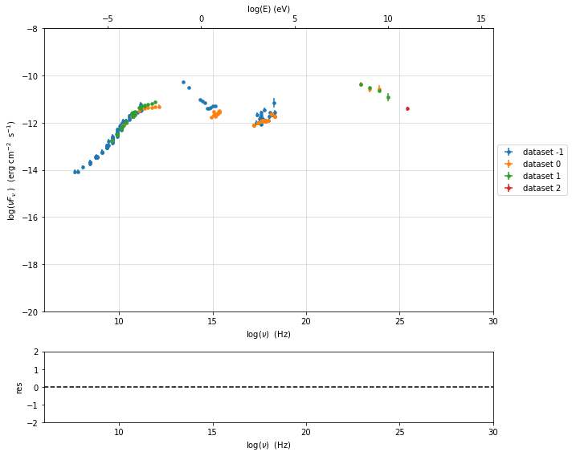
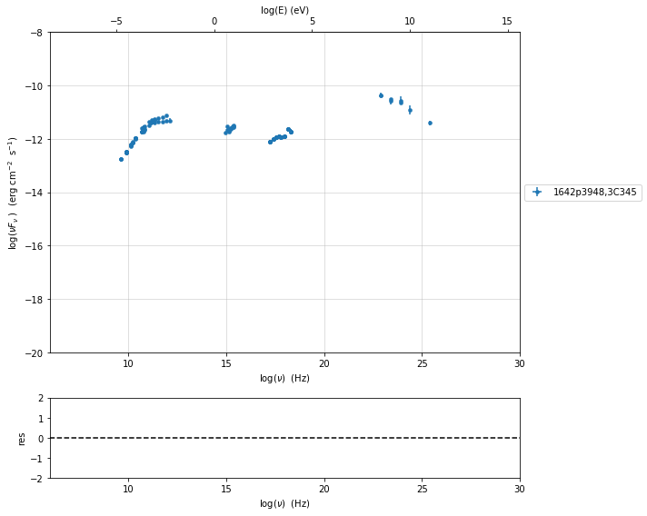
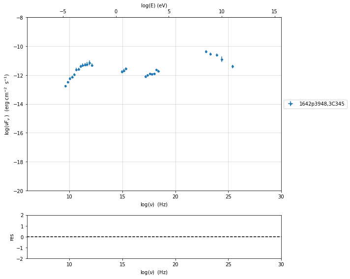
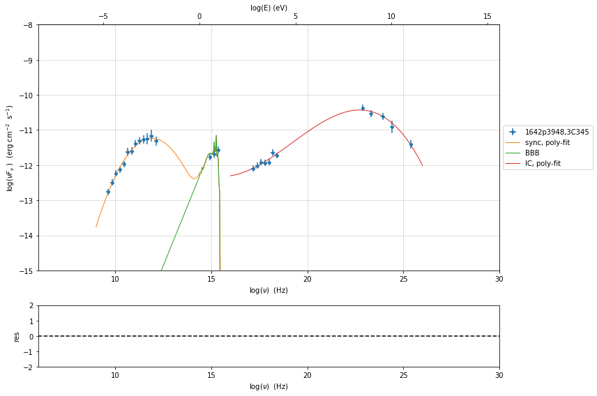
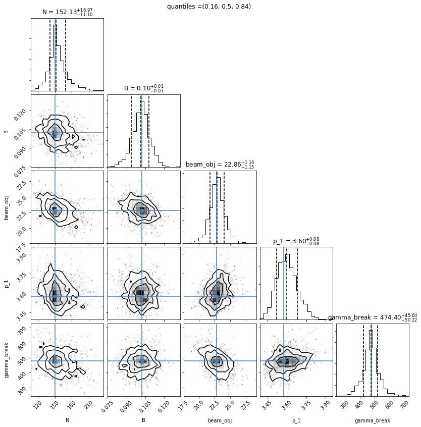
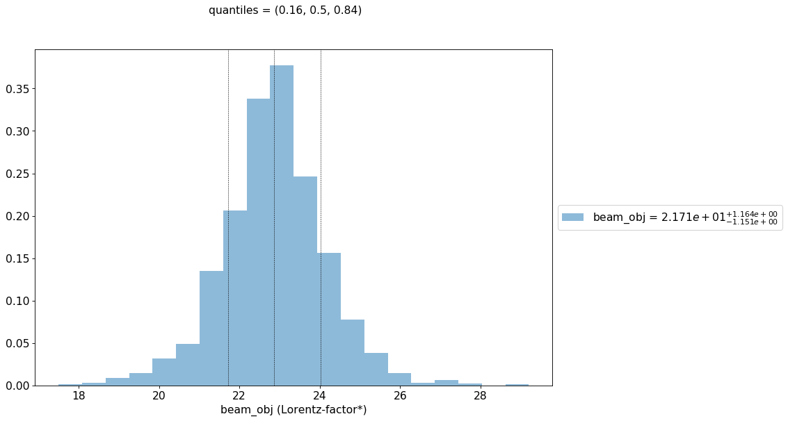

.. _model_fitting_EC:

.. code:: ipython3

    import warnings
    warnings.filterwarnings('ignore')

Model fitting 3: External Compton
=================================

Loading data
------------

see the :ref:`data_format` user guide for further information about loading data and :ref:`jet_physical_guide_EC` for the information regarding the implementation of the external Conpton model

.. code:: ipython3

    from jetset.jet_model import Jet
    from jetset.data_loader import Data,ObsData
    from jetset.test_data_helper import  test_SEDs
    test_SEDs

.. parsed-literal::

    ['/Users/orion/anaconda3/envs/jetset/lib/python3.7/site-packages/jetset-1.1.2-py3.7-macosx-10.9-x86_64.egg/jetset/test_data/SEDs_data/SED_3C345.ecsv',
     '/Users/orion/anaconda3/envs/jetset/lib/python3.7/site-packages/jetset-1.1.2-py3.7-macosx-10.9-x86_64.egg/jetset/test_data/SEDs_data/SED_MW_Mrk421_EBL_DEABS.ecsv',
     '/Users/orion/anaconda3/envs/jetset/lib/python3.7/site-packages/jetset-1.1.2-py3.7-macosx-10.9-x86_64.egg/jetset/test_data/SEDs_data/SED_MW_Mrk501_EBL_DEABS.ecsv']

.. code:: ipython3

    data=Data.from_file(test_SEDs[0])

.. code:: ipython3

    sed_data=ObsData(data_table=data)

.. code:: ipython3

    %matplotlib inline
    p=sed_data.plot_sed(show_dataset=True)

we filter out the data set ``-1``

.. code:: ipython3

    sed_data.show_data_sets()
    sed_data.filter_data_set('-1',exclude=True)
    sed_data.show_data_sets()
    p=sed_data.plot_sed()

.. parsed-literal::

    current datasets
    dataset -1
    dataset 0
    dataset 1
    dataset 2
    ---> excluding  data_set/s ['-1']
    filter -1 192
    current datasets
    dataset 0
    dataset 1
    dataset 2
    ---> data sets left after filtering None
    ---> data len after filtering=192
    current datasets
    dataset 0
    dataset 1
    dataset 2

.. code:: ipython3

    sed_data.group_data(bin_width=.2)
    sed_data.add_systematics(0.2,[10.**6,10.**29])
    p=sed_data.plot_sed()

.. parsed-literal::

    ===================================================================================================================
    
    ***  binning data  ***
    ---> N bins= 80
    ---> bin_widht= 0.2
    ===================================================================================================================
    

.. code:: ipython3

    sed_data.save('3C454_data.pkl')

Phenomenological model constraining
-----------------------------------

see the :ref:`phenom_constr` user guide for further information about phenomenological model constraining

.. code:: ipython3

    from jetset.sed_shaper import  SEDShape
    my_shape=SEDShape(sed_data)
    my_shape.eval_indices(silent=True)
    p=my_shape.plot_indices()
    p.rescale(y_min=-15,y_max=-6)

.. parsed-literal::

    ===================================================================================================================
    
    *** evaluating spectral indices for data ***
    ===================================================================================================================
    

.. image:: Jet_example_model_fit_EC_files/Jet_example_model_fit_EC_15_1.png

for the synchrotron sed_shaping we include the check for Big Blue Bump
(BBB) component. Moreover, we force the model to use a pure
log-parabolic function and not a log-cubic one in order to get a better
estimation of the BBB component. The fit values of the BBB component
will be used in the ``ObsConstrain`` to guess the accretion disk
luminosity and temperature

.. code:: ipython3

    mm,best_fit=my_shape.sync_fit(check_BBB_template=True,
                                  check_host_gal_template=False,
                                  use_log_par=True,
                                  Ep_start=None,
                                  minimizer='lsb',
                                  silent=True,
                                  fit_range=[9,16])

.. parsed-literal::

    ===================================================================================================================
    
    *** Log-Polynomial fitting of the synchrotron component ***
    ---> first blind fit run,  fit range: [9, 16]
    --> class:  LSP
    
    --> class:  LSPn calls=120, chisq=11.539386 UL part=-0.000000
    
    
      model name      name     bestfit val     err +     err -   start val   fit range min fit range max frozen
    ------------- ----------- ------------- ------------ ----- ------------- ------------- ------------- ------
    LogParabolaEp           b -2.984653e-01 5.631621e-02    -- -1.527892e-01 -1.000000e+01  0.000000e+00  False
    LogParabolaEp          Ep  1.190850e+01 2.238812e-01    --  1.298338e+01  0.000000e+00  3.000000e+01  False
    LogParabolaEp          Sp -1.123366e+01 7.306309e-02    -- -1.095506e+01 -3.000000e+01  0.000000e+00  False
              BBB nuFnu_p_BBB -1.155965e+01 6.791049e-02    -- -1.095506e+01 -1.295506e+01 -8.955061e+00  False
              BBB    nu_scale  7.058302e-02 2.539001e-03    --  0.000000e+00 -5.000000e-01  5.000000e-01  False
    ---> sync       nu_p=+1.190850e+01 (err=+2.238812e-01)  nuFnu_p=-1.123366e+01 (err=+7.306309e-02) curv.=-2.984653e-01 (err=+5.631621e-02)
    ===================================================================================================================
    

.. code:: ipython3

    my_shape.IC_fit(fit_range=[16,26],minimizer='minuit', silent=True)
    p=my_shape.plot_shape_fit()
    p.rescale(y_min=-15)

.. parsed-literal::

    ===================================================================================================================
    
    *** Log-Polynomial fitting of the IC component ***
    ---> fit range: [16, 26]
    ---> LogCubic fit
    
    
    model name name  bestfit val     err +     err -   start val   fit range min fit range max frozen
    ---------- ---- ------------- ------------ ----- ------------- ------------- ------------- ------
      LogCubic    b -1.127307e-01 1.237406e-02    -- -1.000000e+00 -1.000000e+01  0.000000e+00  False
      LogCubic    c -1.061377e-02 2.388611e-03    -- -1.000000e+00 -1.000000e+01  1.000000e+01  False
      LogCubic   Ep  2.273133e+01 1.451687e-01    --  2.270678e+01  0.000000e+00  3.000000e+01  False
      LogCubic   Sp -1.043074e+01 6.087740e-02    -- -1.000000e+01 -3.000000e+01  0.000000e+00  False
    ---> IC         nu_p=+2.273133e+01 (err=+1.451687e-01)  nuFnu_p=-1.043074e+01 (err=+6.087740e-02) curv.=-1.127307e-01 (err=+1.237406e-02)
    ===================================================================================================================
    

In this case we use the ``constrain_SSC_EC_model``, and we ask to use a
dusty torus and BLR component external component

read the section :ref:`jet_physical_guide_EC`  for more information regarding the EC model

.. code:: ipython3

    from jetset.obs_constrain import ObsConstrain
    from jetset.model_manager import  FitModel
    from jetset.minimizer import fit_SED
    sed_obspar=ObsConstrain(beaming=25,
                            B_range=[0.1,0.2],
                            distr_e='bkn',
                            t_var_sec=7*86400,
                            nu_cut_IR=1E9,
                            SEDShape=my_shape)
    
    
    prefit_jet=sed_obspar.constrain_SSC_EC_model(electron_distribution_log_values=False,EC_componets_list=['EC_DT','EC_BLR'],R_H=1E18,silent=True)

.. parsed-literal::

    ===================================================================================================================
    
    ***  constrains parameters from observable ***
    
        name          par type           units          val      phys. bound. min phys. bound. max  log  frozen
    ----------- ------------------- --------------- ------------ ---------------- ---------------- ----- ------
           gmin  low-energy-cut-off lorentz-factor* 1.214476e+01     1.000000e+00     1.000000e+09 False  False
           gmax high-energy-cut-off lorentz-factor* 1.209849e+04     1.000000e+00     1.000000e+15 False  False
              N    emitters_density         1 / cm3 2.039857e+02     0.000000e+00               -- False  False
              p   LE_spectral_slope                 2.355053e+00    -1.000000e+01     1.000000e+01 False  False
            p_1   HE_spectral_slope                 3.500000e+00    -1.000000e+01     1.000000e+01 False  False
    gamma_break    turn-over-energy lorentz-factor* 3.456517e+02     1.000000e+00     1.000000e+09 False  False
              R         region_size              cm 1.384330e+17     1.000000e+03     1.000000e+30 False  False
            R_H     region_position              cm 1.000000e+18     0.000000e+00               -- False   True
              B      magnetic_field               G 1.167606e-01     0.000000e+00               -- False  False
       beam_obj             beaming Lorentz-factor* 2.500000e+01     1.000000e-04               -- False  False
         z_cosm            redshift                 5.930000e-01     0.000000e+00               -- False  False
           T_DT                  DT               K 1.000000e+02     0.000000e+00               -- False  False
           R_DT                  DT              cm 5.143375e+18     0.000000e+00               -- False  False
         tau_DT                  DT                 1.000000e-01     0.000000e+00     1.000000e+00 False  False
         L_Disk                Disk         erg / s 4.232689e+45     0.000000e+00               -- False  False
         T_Disk                Disk               K 3.018434e+04     0.000000e+00               -- False  False
        tau_BLR                 BLR                 1.000000e-01     0.000000e+00     1.000000e+00 False  False
       R_BLR_in                 BLR              cm 2.057350e+17     0.000000e+00               -- False   True
      R_BLR_out                 BLR              cm 4.114700e+17     0.000000e+00               -- False   True
    
    ===================================================================================================================
    

.. code:: ipython3

    prefit_jet.eval()
    p=prefit_jet.plot_model(sed_data=sed_data)
    prefit_jet.save_model('prefit_jet_EC.pkl')

.. image:: Jet_example_model_fit_EC_files/Jet_example_model_fit_EC_22_0.png

The prefit model should works well for the synchrotron component, but
the EC one is a bit problematic. We can set as starting values a
slightly harder value of ``p``, and a larger value of ``gamma_break``
and ``gmax``. We freeze some parameters, and we also set some
``fit_range`` values. Setting fit_range can speed-up the fit convergence
but should be judged by the user each time according to the physics of
the particular source

.. note::
   With the new implementation of composite model  (`FitModel` class) to set parameters you have to specify the model component, this is different from versions<1.1.2,
   and this holds also for the `freeze` method and for setting  `fit_range` intervals, and for the methods relate to parameters setting in general.
   See the :ref:`composite_models` user guide for further information about the new implementation of `FitModel`, in particular for parameter setting

EC model fit
------------

.. code:: ipython3

    jet_minuti=Jet.load_model('prefit_jet_EC.pkl')
    jet_minuti.set_gamma_grid_size(100)
    fit_model_minuit=FitModel( jet=jet_minuti, name='EC-best-fit-lsb')
    fit_model_minuit.show_model_components()

.. parsed-literal::

        name          par type           units          val      phys. bound. min phys. bound. max  log  frozen
    ----------- ------------------- --------------- ------------ ---------------- ---------------- ----- ------
           gmin  low-energy-cut-off lorentz-factor* 1.214476e+01     1.000000e+00     1.000000e+09 False  False
           gmax high-energy-cut-off lorentz-factor* 1.209849e+04     1.000000e+00     1.000000e+15 False  False
              N    emitters_density         1 / cm3 2.039857e+02     0.000000e+00               -- False  False
              p   LE_spectral_slope                 2.355053e+00    -1.000000e+01     1.000000e+01 False  False
            p_1   HE_spectral_slope                 3.500000e+00    -1.000000e+01     1.000000e+01 False  False
    gamma_break    turn-over-energy lorentz-factor* 3.456517e+02     1.000000e+00     1.000000e+09 False  False
           T_DT                  DT               K 1.000000e+02     0.000000e+00               -- False  False
           R_DT                  DT              cm 5.143375e+18     0.000000e+00               -- False  False
         tau_DT                  DT                 1.000000e-01     0.000000e+00     1.000000e+00 False  False
         L_Disk                Disk         erg / s 4.232689e+45     0.000000e+00               -- False  False
         T_Disk                Disk               K 3.018434e+04     0.000000e+00               -- False  False
        tau_BLR                 BLR                 1.000000e-01     0.000000e+00     1.000000e+00 False  False
       R_BLR_in                 BLR              cm 2.057350e+17     0.000000e+00               -- False   True
      R_BLR_out                 BLR              cm 4.114700e+17     0.000000e+00               -- False   True
              R         region_size              cm 1.384330e+17     1.000000e+03     1.000000e+30 False  False
            R_H     region_position              cm 1.000000e+18     0.000000e+00               -- False   True
              B      magnetic_field               G 1.167606e-01     0.000000e+00               -- False  False
       beam_obj             beaming Lorentz-factor* 2.500000e+01     1.000000e-04               -- False  False
         z_cosm            redshift                 5.930000e-01     0.000000e+00               -- False  False
    
    -------------------------------------------------------------------------------------------------------------------
    Composite model description
    -------------------------------------------------------------------------------------------------------------------
    name: EC-best-fit-lsb  
    type: composite_model  
    components models:
     -model name: jet_leptonic model type: jet
    
    -------------------------------------------------------------------------------------------------------------------

.. code:: ipython3

    jet_minuti=Jet.load_model('prefit_jet_EC.pkl')
    jet_minuti.set_gamma_grid_size(100)
    fit_model_minuit=FitModel( jet=jet_minuti, name='EC-best-fit-lsb')
    fit_model_minuit.freeze('jet_leptonic','z_cosm')
    fit_model_minuit.freeze('jet_leptonic','R_H')
    fit_model_minuit.freeze('jet_leptonic','L_Disk')
    fit_model_minuit.freeze('jet_leptonic','R_DT')
    fit_model_minuit.freeze('jet_leptonic','R_BLR_in')
    fit_model_minuit.freeze('jet_leptonic','R_BLR_out')
    
    fit_model_minuit.jet_leptonic.parameters.R.fit_range=[1E16,5E18]
    fit_model_minuit.jet_leptonic.parameters.gamma_break.val=600
    fit_model_minuit.jet_leptonic.parameters.p.val=1.8
    fit_model_minuit.jet_leptonic.parameters.gamma_break.fit_range=[100,3000]
    fit_model_minuit.jet_leptonic.parameters.gmin.fit_range=[2,10]
    
    fit_model_minuit.jet_leptonic.parameters.gmax.val=1E5
    fit_model_minuit.jet_leptonic.parameters.gmax.fit_range=[1000,1E6]

.. parsed-literal::

        name          par type           units          val      phys. bound. min phys. bound. max  log  frozen
    ----------- ------------------- --------------- ------------ ---------------- ---------------- ----- ------
           gmin  low-energy-cut-off lorentz-factor* 1.214476e+01     1.000000e+00     1.000000e+09 False  False
           gmax high-energy-cut-off lorentz-factor* 1.209849e+04     1.000000e+00     1.000000e+15 False  False
              N    emitters_density         1 / cm3 2.039857e+02     0.000000e+00               -- False  False
              p   LE_spectral_slope                 2.355053e+00    -1.000000e+01     1.000000e+01 False  False
            p_1   HE_spectral_slope                 3.500000e+00    -1.000000e+01     1.000000e+01 False  False
    gamma_break    turn-over-energy lorentz-factor* 3.456517e+02     1.000000e+00     1.000000e+09 False  False
           T_DT                  DT               K 1.000000e+02     0.000000e+00               -- False  False
           R_DT                  DT              cm 5.143375e+18     0.000000e+00               -- False  False
         tau_DT                  DT                 1.000000e-01     0.000000e+00     1.000000e+00 False  False
         L_Disk                Disk         erg / s 4.232689e+45     0.000000e+00               -- False  False
         T_Disk                Disk               K 3.018434e+04     0.000000e+00               -- False  False
        tau_BLR                 BLR                 1.000000e-01     0.000000e+00     1.000000e+00 False  False
       R_BLR_in                 BLR              cm 2.057350e+17     0.000000e+00               -- False   True
      R_BLR_out                 BLR              cm 4.114700e+17     0.000000e+00               -- False   True
              R         region_size              cm 1.384330e+17     1.000000e+03     1.000000e+30 False  False
            R_H     region_position              cm 1.000000e+18     0.000000e+00               -- False   True
              B      magnetic_field               G 1.167606e-01     0.000000e+00               -- False  False
       beam_obj             beaming Lorentz-factor* 2.500000e+01     1.000000e-04               -- False  False
         z_cosm            redshift                 5.930000e-01     0.000000e+00               -- False  False

.. code:: ipython3

    from jetset.minimizer import ModelMinimizer
    model_minimizer_minuit=ModelMinimizer('minuit')
    best_fit_minuit=model_minimizer_minuit.fit(fit_model_minuit,sed_data,1E11,1E29,fitname='EC-best-fit-minuit',repeat=3)

.. parsed-literal::

    filtering data in fit range = [1.000000e+11,1.000000e+29]
    data length 21
    ===================================================================================================================
    
    *** start fit process ***
    ----- 
    fit run: 0
    \ minim function calls=920, chisq=21.205331 UL part=-0.00000000000
    fit run: 1
    / minim function calls=940, chisq=16.501900 UL part=-0.0000000
    fit run: 2
    | minim function calls=350, chisq=16.389750 UL part=-0.00000000000 UL part=-0.000000
    **************************************************************************************************
    Fit report
    
    Model: EC-best-fit-minuit
     model name      name          par type           units          val      phys. bound. min phys. bound. max  log  frozen
    ------------ ----------- ------------------- --------------- ------------ ---------------- ---------------- ----- ------
    jet_leptonic        gmin  low-energy-cut-off lorentz-factor* 9.999991e+00     1.000000e+00     1.000000e+09 False  False
    jet_leptonic        gmax high-energy-cut-off lorentz-factor* 9.998178e+04     1.000000e+00     1.000000e+15 False  False
    jet_leptonic           N    emitters_density         1 / cm3 1.502210e+02     0.000000e+00               -- False  False
    jet_leptonic           p   LE_spectral_slope                 1.806760e+00    -1.000000e+01     1.000000e+01 False  False
    jet_leptonic         p_1   HE_spectral_slope                 3.575040e+00    -1.000000e+01     1.000000e+01 False  False
    jet_leptonic gamma_break    turn-over-energy lorentz-factor* 4.785486e+02     1.000000e+00     1.000000e+09 False  False
    jet_leptonic        T_DT                  DT               K 4.383439e+02     0.000000e+00               -- False  False
    jet_leptonic        R_DT                  DT              cm 5.143375e+18     0.000000e+00               -- False   True
    jet_leptonic      tau_DT                  DT                 5.243266e-02     0.000000e+00     1.000000e+00 False  False
    jet_leptonic      L_Disk                Disk         erg / s 4.232689e+45     0.000000e+00               -- False   True
    jet_leptonic      T_Disk                Disk               K 4.815942e+04     0.000000e+00               -- False  False
    jet_leptonic     tau_BLR                 BLR                 1.677494e-01     0.000000e+00     1.000000e+00 False  False
    jet_leptonic    R_BLR_in                 BLR              cm 2.057350e+17     0.000000e+00               -- False   True
    jet_leptonic   R_BLR_out                 BLR              cm 4.114700e+17     0.000000e+00               -- False   True
    jet_leptonic           R         region_size              cm 1.219759e+17     1.000000e+03     1.000000e+30 False  False
    jet_leptonic         R_H     region_position              cm 1.000000e+18     0.000000e+00               -- False   True
    jet_leptonic           B      magnetic_field               G 1.021389e-01     0.000000e+00               -- False  False
    jet_leptonic    beam_obj             beaming Lorentz-factor* 2.281074e+01     1.000000e-04               -- False  False
    jet_leptonic      z_cosm            redshift                 5.930000e-01     0.000000e+00               -- False   True
    
    converged=True
    calls=351
    ------------------------------------------------------------------
    | FCN = 16.38                   |     Ncalls=339 (350 total)     |
    | EDM = 1.53E+04 (Goal: 1E-05)  |            up = 1.0            |
    ------------------------------------------------------------------
    |  Valid Min.   | Valid Param.  | Above EDM | Reached call limit |
    ------------------------------------------------------------------
    |     False     |     True      |   True    |       False        |
    ------------------------------------------------------------------
    | Hesse failed  |   Has cov.    | Accurate  | Pos. def. | Forced |
    ------------------------------------------------------------------
    |     False     |     True      |   False   |   False   |  True  |
    ------------------------------------------------------------------
    --------------------------------------------------------------------------------------------
    |   | Name   |   Value   | Hesse Err | Minos Err- | Minos Err+ | Limit-  | Limit+  | Fixed |
    --------------------------------------------------------------------------------------------
    | 0 | par_0  |  1.000E1  |  0.000E1  |            |            |    2    |   10    |       |
    | 1 | par_1  |  1.000E5  |  0.000E5  |            |            |  1000   |  1e+06  |       |
    | 2 | par_2  |  150.221  |   0.029   |            |            |    0    |         |       |
    | 3 | par_3  |   1.81    |   0.06    |            |            |   -10   |   10    |       |
    | 4 | par_4  |  0.358E1  |  0.000E1  |            |            |   -10   |   10    |       |
    | 5 | par_5  |  478.55   |   0.18    |            |            |   100   |  3000   |       |
    | 6 | par_6  |    440    |    40     |            |            |    0    |         |       |
    | 7 | par_7  |   0.052   |   0.014   |            |            |    0    |    1    |       |
    | 8 | par_8  |  0.48E5   |  0.08E5   |            |            |    0    |         |       |
    | 9 | par_9  |   0.17    |   0.21    |            |            |    0    |    1    |       |
    | 10| par_10 |  1.22E17  |  0.19E17  |            |            |  1e+16  |  5e+18  |       |
    | 11| par_11 | 1.021E-1  | 0.022E-1  |            |            |    0    |         |       |
    | 12| par_12 |   22.8    |    1.9    |            |            | 0.0001  |         |       |
    --------------------------------------------------------------------------------------------
    dof=8
    chisq=16.378087, chisq/red=2.047261 null hypothesis sig=0.037277
    
    best fit pars
     model name      name    bestfit val     err +     err -  start val   fit range min fit range max frozen
    ------------ ----------- ------------ ------------ ----- ------------ ------------- ------------- ------
    jet_leptonic        gmin 9.999991e+00 9.610403e-08    -- 1.214476e+01  2.000000e+00  1.000000e+01  False
    jet_leptonic        gmax 9.998178e+04 1.938664e+00    -- 1.000000e+05  1.000000e+03  1.000000e+06  False
    jet_leptonic           N 1.502210e+02 2.883063e-02    -- 2.039857e+02  0.000000e+00            --  False
    jet_leptonic           p 1.806760e+00 6.298315e-02    -- 1.800000e+00 -1.000000e+01  1.000000e+01  False
    jet_leptonic         p_1 3.575040e+00 3.367924e-04    -- 3.500000e+00 -1.000000e+01  1.000000e+01  False
    jet_leptonic gamma_break 4.785486e+02 1.845153e-01    -- 6.000000e+02  1.000000e+02  3.000000e+03  False
    jet_leptonic        T_DT 4.383439e+02 4.463019e+01    -- 1.000000e+02  0.000000e+00            --  False
    jet_leptonic        R_DT           --           --    -- 5.143375e+18  0.000000e+00            --   True
    jet_leptonic      tau_DT 5.243266e-02 1.442664e-02    -- 1.000000e-01  0.000000e+00  1.000000e+00  False
    jet_leptonic      L_Disk           --           --    -- 4.232689e+45  0.000000e+00            --   True
    jet_leptonic      T_Disk 4.815942e+04 7.881132e+03    -- 3.018434e+04  0.000000e+00            --  False
    jet_leptonic     tau_BLR 1.677494e-01 2.132366e-01    -- 1.000000e-01  0.000000e+00  1.000000e+00  False
    jet_leptonic    R_BLR_in           --           --    -- 2.057350e+17  0.000000e+00            --   True
    jet_leptonic   R_BLR_out           --           --    -- 4.114700e+17  0.000000e+00            --   True
    jet_leptonic           R 1.219759e+17 1.909803e+16    -- 1.384330e+17  1.000000e+16  5.000000e+18  False
    jet_leptonic         R_H           --           --    -- 1.000000e+18  0.000000e+00            --   True
    jet_leptonic           B 1.021389e-01 2.161677e-03    -- 1.167606e-01  0.000000e+00            --  False
    jet_leptonic    beam_obj 2.281074e+01 1.916088e+00    -- 2.500000e+01  1.000000e-04            --  False
    jet_leptonic      z_cosm           --           --    -- 5.930000e-01  0.000000e+00            --   True
    **************************************************************************************************
    
    ===================================================================================================================
    

.. code:: ipython3

    best_fit_minuit.save_report('EC-best-fit-minuit.txt')
    model_minimizer_minuit.save_model('EC_model_minimizer_minuit.pkl')
    fit_model_minuit.save_model('EC_fit_model_minuit.pkl')

.. code:: ipython3

    %matplotlib inline
    fit_model_minuit.set_nu_grid(1E6,1E30,200)
    fit_model_minuit.eval()
    p2=fit_model_minuit.plot_model(sed_data=sed_data)
    p2.rescale(y_min=-15,y_max=-9.5,x_min=6,x_max=28.5)

.. image:: Jet_example_model_fit_EC_files/Jet_example_model_fit_EC_30_0.png

.. code:: ipython3

    jet_minuti.energetic_report()

.. parsed-literal::

    -----------------------------------------------------------------------------------------
    jet eneregetic report:
         name                   type               units        val     
    -------------- ----------------------------- --------- -------------
               U_e Energy dens. blob rest. frame erg / cm3  7.257454e-03
          U_p_cold Energy dens. blob rest. frame erg / cm3  2.819493e-05
               U_B Energy dens. blob rest. frame erg / cm3  4.150905e-04
               U_p Energy dens. blob rest. frame erg / cm3  0.000000e+00
        U_p_target Energy dens. blob rest. frame erg / cm3 6.929110e-310
           U_Synch Energy dens. blob rest. frame erg / cm3  1.309732e-04
       U_Synch_DRF Energy dens. disk rest. frame erg / cm3  3.546008e+01
            U_Disk Energy dens. blob rest. frame erg / cm3  1.316068e-04
             U_BLR Energy dens. blob rest. frame erg / cm3  7.014444e-04
              U_DT Energy dens. blob rest. frame erg / cm3  4.471427e-03
             U_CMB Energy dens. blob rest. frame erg / cm3  0.000000e+00
        U_Disk_DRF Energy dens. disk rest. frame erg / cm3  1.109071e-02
         U_BLR_DRF Energy dens. disk rest. frame erg / cm3  1.937101e-03
          U_DT_DRF Energy dens. disk rest. frame erg / cm3  2.241331e-05
         U_CMB_DRF Energy dens. disk rest. frame erg / cm3  0.000000e+00
         L_Sync_rf         Lum. blob rest. frme.   erg / s  2.430199e+41
          L_SSC_rf         Lum. blob rest. frme.   erg / s  6.436753e+40
      L_EC_Disk_rf         Lum. blob rest. frme.   erg / s  0.000000e+00
       L_EC_BLR_rf         Lum. blob rest. frme.   erg / s  3.646502e+41
        L_EC_DT_rf         Lum. blob rest. frme.   erg / s  2.724764e+42
       L_EC_CMB_rf         Lum. blob rest. frme.   erg / s  0.000000e+00
     L_pp_gamma_rf         Lum. blob rest. frme.   erg / s  0.000000e+00
        jet_L_Sync                      jet Lum.   erg / s  6.075499e+42
         jet_L_SSC                      jet Lum.   erg / s  1.609188e+42
     jet_L_EC_Disk                      jet Lum.   erg / s  0.000000e+00
      jet_L_EC_BLR                      jet Lum.   erg / s  9.116254e+42
       jet_L_EC_DT                      jet Lum.   erg / s  6.811910e+43
      jet_L_EC_CMB                      jet Lum.   erg / s  0.000000e+00
    jet_L_pp_gamma                      jet Lum.   erg / s  0.000000e+00
         jet_L_rad                      jet Lum.   erg / s  8.492004e+43
         jet_L_kin                      jet Lum.   erg / s  1.079074e+45
         jet_L_tot                      jet Lum.   erg / s  1.163994e+45
           jet_L_e                      jet Lum.   erg / s  1.016958e+45
           jet_L_B                      jet Lum.   erg / s  5.816499e+43
      jet_L_p_cold                      jet Lum.   erg / s  3.950844e+42
           jet_L_p                      jet Lum.   erg / s  0.000000e+00
    -----------------------------------------------------------------------------------------

MCMC
----

.. code:: ipython3

    from jetset.mcmc import McmcSampler
    from jetset.minimizer import ModelMinimizer

.. code:: ipython3

    model_minimizer_minuit = ModelMinimizer.load_model('EC_model_minimizer_minuit.pkl')
    
    
    mcmc=McmcSampler(model_minimizer_minuit)
    
    labels=['N','B','beam_obj','p_1','gamma_break']
    model_name='jet_leptonic'
    use_labels_dict={model_name:labels}
    
    mcmc.run_sampler(nwalkers=128,burnin=10,steps=50,bound=5.0,bound_rel=True,threads=None,walker_start_bound=0.005,use_labels_dict=use_labels_dict)

.. parsed-literal::

    mcmc run starting

.. parsed-literal::

    100%|██████████| 50/50 [05:44<00:00,  6.89s/it]

.. parsed-literal::

    mcmc run done, with 1 threads took 351.07 seconds

.. parsed-literal::

    

We have used a flat prior centered on the best fit value. Setting
``bound=5.0`` and ``bound_rel=True`` means that the prior interval will
be defined as

``[best_fit_val - delta_m , best_fit_val + delta_p]``

with ``delta_p``\ =\ ``delta_m``\ =\ ``best_fit_val*bound``

If ``bound_rel=False`` then
``delta_p``\ =\ ``delta_m``\ =\ ``best_fit_err*bound``

It is possible to define asymmetric boundaries e.g.

``bound=[2.0,5.0]`` meaning that , for ``bound_rel=True``

``delta_p``\ =\ ``best_fit_val*bound[1]``

``delta_m``\ =\ ``best_fit_val*bound[0]``

or, for ``bound_rel=False``

``delta_p``\ =\ ``best_fit_err*bound[1]``

``delta_m``\ =\ ``best_fit_err*bound[0]``

In the next release a more flexible prior interface will be added,
including different type of priors

.. code:: ipython3

    print(mcmc.acceptance_fraction)

.. parsed-literal::

    0.58734375

.. code:: ipython3

    f=mcmc.corner_plot()

.. code:: ipython3

    f=mcmc.plot_chain('p_1',log_plot=False)

.. image:: Jet_example_model_fit_EC_files/Jet_example_model_fit_EC_38_0.png

Save and reuse MCMC
-------------------

.. code:: ipython3

    mcmc.save('mcmc_sampler.pkl')

.. code:: ipython3

    from jetset.mcmc import McmcSampler
    from jetset.data_loader import ObsData
    from jetset.plot_sedfit import PlotSED
    from jetset.test_data_helper import  test_SEDs
    
    sed_data=ObsData.load('3C454_data.pkl')
    
    ms=McmcSampler.load('mcmc_sampler.pkl')

.. code:: ipython3

    ms.model.set_nu_grid(1E6,1E30,200)
    
    p=ms.plot_model(sed_data=sed_data,fit_range=[11., 27.4],size=50)
    p.rescale(y_min=-13,x_min=6,x_max=28.5)

.. image:: Jet_example_model_fit_EC_files/Jet_example_model_fit_EC_42_0.png

.. code:: ipython3

    f=ms.plot_par('beam_obj',log_plot=False)

.. code:: ipython3

    f=ms.corner_plot()

.. image:: Jet_example_model_fit_EC_files/Jet_example_model_fit_EC_44_0.png

