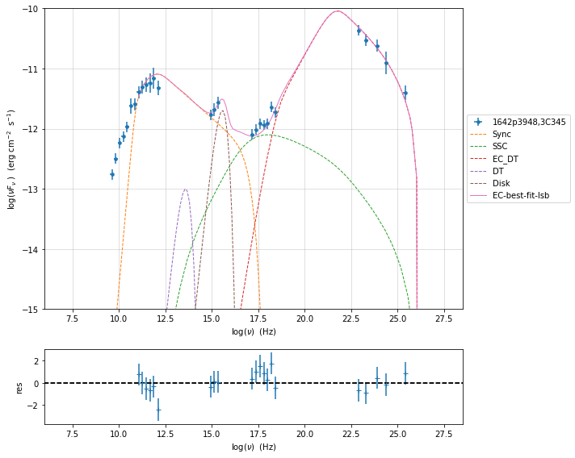

.. _model_fitting_EC:

see the :ref:`data_format` user guide for further information about loading data and :ref:`jet_physical_guide_EC` for the information regarding the implementation of the external Conpton model

Model fitting for External Compton
==================================

.. code:: ipython3

    import warnings
    warnings.filterwarnings('ignore')

.. code:: ipython3

    from jetset.jet_model import Jet
    from jetset.data_loader import Data,ObsData
    from jetset.test_data_helper import  test_SEDs
    test_SEDs

.. parsed-literal::

    ['/Users/orion/anaconda3/envs/develop/lib/python3.7/site-packages/jetset-1.1.0-py3.7-macosx-10.7-x86_64.egg/jetset/test_data/SEDs_data/SED_3C345.ecsv',
     '/Users/orion/anaconda3/envs/develop/lib/python3.7/site-packages/jetset-1.1.0-py3.7-macosx-10.7-x86_64.egg/jetset/test_data/SEDs_data/SED_MW_Mrk421.ecsv',
     '/Users/orion/anaconda3/envs/develop/lib/python3.7/site-packages/jetset-1.1.0-py3.7-macosx-10.7-x86_64.egg/jetset/test_data/SEDs_data/SED_MW_Mrk501.ecsv']

.. code:: ipython3

    data=Data.from_file(test_SEDs[0])

.. code:: ipython3

    sed_data=ObsData(data_table=data)

.. code:: ipython3

    %matplotlib inline
    p=sed_data.plot_sed(show_dataset=True)

.. image:: Jet_example_model_fit_EC_files/Jet_example_model_fit_EC_7_0.png

we filter out the data set ``-1``

.. code:: ipython3

    sed_data.show_data_sets()
    sed_data.filter_data_set('-1',exclude=True)
    sed_data.show_data_sets()
    p=sed_data.plot_sed()

.. parsed-literal::

    current datasets
    dataset -1
    dataset 0
    dataset 1
    dataset 2
    ---> excluding  data_set/s ['-1']
    filter -1 192
    current datasets
    dataset 0
    dataset 1
    dataset 2
    ---> data sets left after filtering None
    ---> data len after filtering=192
    current datasets
    dataset 0
    dataset 1
    dataset 2

.. image:: Jet_example_model_fit_EC_files/Jet_example_model_fit_EC_9_1.png

.. code:: ipython3

    sed_data.group_data(bin_width=.2)
    sed_data.add_systematics(0.2,[10.**6,10.**29])
    p=sed_data.plot_sed()

.. parsed-literal::

    ===================================================================================================================
    
    ***  binning data  ***
    ---> N bins= 80
    ---> bin_widht= 0.2
    ===================================================================================================================
    

.. image:: Jet_example_model_fit_EC_files/Jet_example_model_fit_EC_10_1.png

.. code:: ipython3

    from jetset.sed_shaper import  SEDShape
    my_shape=SEDShape(sed_data)
    my_shape.eval_indices(silent=True)
    p=my_shape.plot_indices()
    p.rescale(y_min=-15,y_max=-6)

.. parsed-literal::

    ===================================================================================================================
    
    *** evaluating spectral indices for data ***
    ---> initial range for index radio  set to [6.000000,10.000000]
    ---> range for index radio updated  to [5.900000,10.100000]
    ---> name = radio            range=[5.900 ,10.100] log(Hz)  photon.val=-7.220146e-01, err=1.374842e-02 
    
    ---> initial range for index radio_mm  set to [10.000000,11.000000]
    ---> range for index radio_mm updated  to [10.000000,11.000000]
    ---> name = radio_mm         range=[10.000,11.000] log(Hz)  photon.val=-1.145232e+00, err=1.107139e-01 
    
    ---> initial range for index mm_IR  set to [11.000000,13.000000]
    ---> range for index mm_IR updated  to [11.000000,13.000000]
    ---> name = mm_IR            range=[11.000,13.000] log(Hz)  photon.val=-1.904939e+00, err=7.083441e-02 
    
    ---> initial range for index IR_Opt  set to [13.000000,14.000000]
    ---> not enough data in range for indexIR_Opt 
    
    ---> initial range for index Opt_UV  set to [14.000000,16.000000]
    ---> range for index Opt_UV updated  to [14.000000,16.000000]
    ---> name = Opt_UV           range=[14.000,16.000] log(Hz)  photon.val=-1.504361e+00, err=2.459255e-02 
    
    ---> initial range for index BBB  set to [15.000000,16.000000]
    ---> range for index BBB updated  to [14.900000,16.100000]
    ---> name = BBB              range=[14.900,16.100] log(Hz)  photon.val=-1.504361e+00, err=2.459255e-02 
    
    ---> initial range for index UV_X  set to [15.000000,17.500000]
    ---> range for index UV_X updated  to [15.000000,17.500000]
    ---> name = UV_X             range=[15.000,17.500] log(Hz)  photon.val=-2.207032e+00, err=4.763143e-02 
    
    ---> initial range for index X  set to [16.000000,19.000000]
    ---> range for index X updated  to [16.000000,19.000000]
    ---> name = X                range=[16.000,19.000] log(Hz)  photon.val=-1.677527e+00, err=6.809415e-02 
    
    ---> initial range for index Fermi  set to [22.380000,25.380000]
    ---> range for index Fermi updated  to [22.380000,25.380000]
    ---> name = Fermi            range=[22.380,25.380] log(Hz)  photon.val=-2.295072e+00, err=6.118002e-02 
    
    ---> initial range for index TeV  set to [25.000000,28.380000]
    ---> range for index TeV updated  to [23.900000,29.480000]
    ---> name = TeV              range=[23.900,29.480] log(Hz)  photon.val=-2.529390e+00, err=1.850638e-02 
    
    ===================================================================================================================
    

.. image:: Jet_example_model_fit_EC_files/Jet_example_model_fit_EC_11_1.png

for the synchrotron sed_shaping we include the check for Big Blue Bump
(BBB) component. Moreover, we force the model to use a pure
log-parabolic function and not a log-cubic one in order to get a better
estimation of the BBB component. The fit values of the BBB component
will be used in the ``ObsConstrain`` to guess the accretion disk
luminosity and temperature

.. code:: ipython3

    mm,best_fit=my_shape.sync_fit(check_BBB_template=True,
                                  check_host_gal_template=False,
                                  use_log_par=True,
                                  Ep_start=None,
                                  minimizer='lsb',
                                  silent=True,
                                  fit_range=[9,16])

.. parsed-literal::

    ===================================================================================================================
    
    *** Log-Polynomial fitting of the synchrotron component ***
    ---> first blind fit run,  fit range: [9, 16]
    --> class:  LSP
    
    --> class:  LSP
        name      par type      units             val         phys. bound. min phys. bound. max  log  frozen
    ----------- ----------- ------------- ------------------- ---------------- ---------------- ----- ------
              b   curvature               -0.2984653291941175            -10.0              0.0 False  False
             Ep   peak freq            Hz   11.90849942193066              0.0             30.0  True  False
             Sp   peak flux erg / (cm2 s) -11.233657458385743            -30.0              0.0  True  False
    nuFnu_p_BBB nuFnu-scale erg / (cm2 s)  -11.55964975937204            -20.0             20.0 False  False
       nu_scale    nu-scale            Hz 0.07058302184753273             -2.0              2.0 False  False
    
    
    ---> sync       nu_p=+1.190850e+01 (err=+2.238812e-01)  nuFnu_p=-1.123366e+01 (err=+7.306309e-02) curv.=-2.984653e-01 (err=+5.631622e-02)
    ===================================================================================================================
    

.. code:: ipython3

    my_shape.IC_fit(fit_range=[16,26],minimizer='minuit', silent=True)
    p=my_shape.plot_shape_fit()
    p.rescale(y_min=-15)

.. parsed-literal::

    ===================================================================================================================
    
    *** Log-Polynomial fitting of the IC component ***
    ---> fit range: [16, 26]
    ---> LogCubic fit
    
    
    name   par type       units              val          phys. bound. min phys. bound. max  log  frozen
    ---- ------------ ------------- --------------------- ---------------- ---------------- ----- ------
       b    curvature                -0.11273065291828388            -10.0              0.0 False  False
       c third-degree               -0.010613774612263427            -10.0             10.0 False  False
      Ep    peak freq            Hz    22.731332318664315              0.0             30.0  True  False
      Sp    peak flux erg / (cm2 s)    -10.43073799217408            -30.0              0.0  True  False
    ---> IC         nu_p=+2.273133e+01 (err=+1.451687e-01)  nuFnu_p=-1.043074e+01 (err=+6.087742e-02) curv.=-1.127307e-01 (err=+1.237407e-02)
    ===================================================================================================================
    

.. image:: Jet_example_model_fit_EC_files/Jet_example_model_fit_EC_14_1.png

In this case we use the ``constrain_SSC_EC_model``, and we ask to use a
dusty torus component external component

.. code:: ipython3

    from jetset.obs_constrain import ObsConstrain
    from jetset.model_manager import  FitModel
    from jetset.minimizer import fit_SED
    sed_obspar=ObsConstrain(beaming=25,
                            B_range=[0.1,0.2],
                            distr_e='bkn',
                            t_var_sec=7*86400,
                            nu_cut_IR=1E9,
                            SEDShape=my_shape)
    
    
    prefit_jet=sed_obspar.constrain_SSC_EC_model(electron_distribution_log_values=False,EC_componets_list=['EC_DT'])

.. parsed-literal::

    ===================================================================================================================
    
    ***  constrains parameters from observable ***
    
    ---> ***  emitting region parameters  ***
    ---> name = beam_obj          type = beaming               units = Lorentz-factor*   val = +2.500000e+01  phys-bounds = [+1.000000e-04,No           ] islog = False  froze= False 
    ---> setting par type redshift, corresponding to par z_cosm
    --->  name = z_cosm            type = redshift              units =                   val = +5.930000e-01  phys-bounds = [+0.000000e+00,No           ] islog = False  froze= False 
    
    ---> setting par type magnetic_field, corresponding to par B
    --->  name = B                 type = magnetic_field        units = G                 val = +1.500000e-01  phys-bounds = [+0.000000e+00,No           ] islog = False  froze= False 
    
    ---> setting par type region_size, corresponding to par R
    --->  name = R                 type = region_size           units = cm                val = +2.845488e+17  phys-bounds = [+1.000000e+03,+1.000000e+30] islog = False  froze= False 
    
    
    ---> *** electron distribution parameters ***
    ---> distribution type:  bkn
    ---> s_radio_mm -0.14523151800047884 1.2904630360009577
    ---> s_X 2.355053439996553
    ---> s_Fermi 2.4721144443324135
    ---> s_UV_X 3.414063285684673
    ---> s_Opt_UV -0.5043611510390775 2.008722302078155
    ---> s from X_index 2.355053439996553
    ---> s from synch log-log fit -1.0
    ---> power-law index s, class obj=LSP s chosen is 2.355053
    ---> setting par type LE_spectral_slope, corresponding to par p
    --->  name = p                 type = LE_spectral_slope     units =                   val = +2.355053e+00  phys-bounds = [-1.000000e+01,+1.000000e+01] islog = False  froze= False 
    
    ---> set s1 to 3.500000
    ---> setting par type LE_spectral_slope, corresponding to par p_1
    --->  name = p_1               type = HE_spectral_slope     units =                   val = +3.500000e+00  phys-bounds = [-1.000000e+01,+1.000000e+01] islog = False  froze= False 
    
    ---> gamma_3p_Sync= 3.049588e+02, assuming B=1.500000e-01
    ---> gamma_max=1.067416e+04 from nu_max_Sync= 2.232890e+15, using B=1.500000e-01
    ---> setting par type high-energy-cut-off, corresponding to par gmax
    --->  name = gmax              type = high-energy-cut-off   units = lorentz-factor*   val = +1.067416e+04  phys-bounds = [+1.000000e+00,+1.000000e+15] islog = False  froze= False 
    
    ---> setting par type low-energy-cut-off, corresponding to par gmin
    --->  name = gmin              type = low-energy-cut-off    units = lorentz-factor*   val = +1.071498e+01  phys-bounds = [+1.000000e+00,+1.000000e+09] islog = False  froze= False 
    
    ---> setting par type turn-over energy, corresponding to par gamma_break
    ---> using gamma_3p_Sync= 304.9587529090696
    --->  name = gamma_break       type = turn-over-energy      units = lorentz-factor*   val = +3.049588e+02  phys-bounds = [+1.000000e+00,+1.000000e+09] islog = False  froze= False 
    
    nu_p_seed_blob 4.554149201467627e+16
    COMP FACTOR 0.11240200595914539 1450.1110722137896
    ---> gamma_3p_SSCc= %e 2711.5623852258914
    ---> setting par type turn-over energy, corresponding to par gamma_break
    ---> using gamma_3p_SSC= 2711.5623852258914
    --->  name = gamma_break       type = turn-over-energy      units = lorentz-factor*   val = +2.711562e+03  phys-bounds = [+1.000000e+00,+1.000000e+09] islog = False  froze= False 
    
    
    ---> setting par type electron_density, corresponding to par N
    ---> name = N                 type = electron_density      units = 1 / cm3           val = +4.564750e+00  phys-bounds = [+0.000000e+00,No           ] islog = False  froze= False 
    ---> B from nu_p_S=1.897292e-03
    ---> get B from best matching of nu_p_IC
         Best B=1.167606e-01
    ---> setting par type magnetic_field, corresponding to par B
    --->  name = B                 type = magnetic_field        units = G                 val = +1.167606e-01  phys-bounds = [+0.000000e+00,No           ] islog = False  froze= False 
    
    ---> best B found:  name = B                 type = magnetic_field        units = G                 val = +1.167606e-01  phys-bounds = [+0.000000e+00,No           ] islog = False  froze= False 
    
    ---> update pars for new B 
    ---> setting par type low-energy-cut-off, corresponding to par gmin
    --->  name = gmin              type = low-energy-cut-off    units = lorentz-factor*   val = +1.214476e+01  phys-bounds = [+1.000000e+00,+1.000000e+09] islog = False  froze= False 
    
    ---> setting par type low-energy-cut-off, corresponding to par gamma_break
    ---> using gamma_3p_Sync= 345.6516717283015
    --->  name = gamma_break       type = turn-over-energy      units = lorentz-factor*   val = +3.456517e+02  phys-bounds = [+1.000000e+00,+1.000000e+09] islog = False  froze= False 
    
    ---> gamma_max=1.209849e+04 from nu_max_Sync= 2.232890e+15, using B=1.167606e-01
    ---> setting par type high-energy-cut-off, corresponding to par gmax
    --->  name = gmax              type = high-energy-cut-off   units = lorentz-factor*   val = +1.209849e+04  phys-bounds = [+1.000000e+00,+1.000000e+15] islog = False  froze= False 
    
    ---> setting par type electron_density, corresponding to par N
    ---> get R from Compoton Dominance (CD)
         Best R=1.423492e+17
    ---> setting par type region_size, corresponding to par R
    --->  name = R                 type = region_size           units = cm                val = +1.423492e+17  phys-bounds = [+1.000000e+03,+1.000000e+30] islog = False  froze= False 
    
    ---> setting par type electron_density, corresponding to par N
    ---> t_var (days) 3.50184136293619
    
    show pars
        name          par type           units               val           phys. bound. min  phys. bound. max   log  frozen
    ----------- ------------------- --------------- ---------------------- ---------------- ------------------ ----- ------
              N    electron_density         1 / cm3     187.63441369917297                0               None False  False
           gmin  low-energy-cut-off lorentz-factor*     12.144760386892157                1       1000000000.0 False  False
           gmax high-energy-cut-off lorentz-factor*     12098.494331819644                1 1000000000000000.0 False  False
              p   LE_spectral_slope                      2.355053439996553            -10.0               10.0 False  False
            p_1   HE_spectral_slope                                    3.5            -10.0               10.0 False  False
    gamma_break    turn-over-energy lorentz-factor*      345.6516717283015                1       1000000000.0 False  False
              R         region_size              cm 1.4234923792823195e+17           1000.0              1e+30 False  False
            R_H     region_position              cm                  1e+17                0               None False   True
              B      magnetic_field               G    0.11676055257897361                0               None False  False
       beam_obj             beaming Lorentz-factor*                     25           0.0001               None False  False
         z_cosm            redshift                                  0.593                0               None False  False
           T_DT                  DT               K                  100.0                0               None False  False
           R_DT                  DT              cm                  5e+18                0               None False  False
         tau_DT                  DT                                    0.1                0                1.0 False  False
         L_Disk                Disk         erg / s 4.2326884651040774e+45                0               None False  False
     R_inner_Sw                Disk      Sw. radii*                    3.0                0               None False  False
       R_ext_Sw                Disk      Sw. radii*                  500.0                0               None False  False
         T_Disk                Disk               K     30184.343849825982                0               None False  False
       accr_eff                Disk                                   0.08                0               None False  False
      disk_type                Disk                                     BB             None               None False   True
           M_BH                Disk          M_sun*           1000000000.0                0               None False  False
    eval_model
    
    ===================================================================================================================
    

.. code:: ipython3

    p=prefit_jet.plot_model(sed_data=sed_data)
    prefit_jet.save_model('prefit_jet_EC.dat')

.. image:: Jet_example_model_fit_EC_files/Jet_example_model_fit_EC_17_0.png

The prefit model should works well for the synchrotron component, but
the EC one is a bit problematic. We can set as starting values a
slightly hader value of ``p``, and a larger value of ``gamma_break`` and
``gmax``. We freeze some parameters, and we also set some ``fit_range``
values, indeed ``minuit`` works better if ``fit_range`` is set for some
parameters that might impact significantly on the fit.

.. code:: ipython3

    jet_minuti=Jet.load_model('prefit_jet_EC.dat')
    jet_minuti.set_gamma_grid_size(100)
    fit_model_minuit=FitModel( jet=jet_minuti, name='EC-best-fit-lsb')
    fit_model_minuit.freeze('z_cosm')
    fit_model_minuit.freeze('R_H')
    fit_model_minuit.freeze('L_Disk')
    
    fit_model_minuit.freeze('accr_eff')
    fit_model_minuit.freeze('R_inner_Sw')
    fit_model_minuit.freeze('R_ext_Sw')
    fit_model_minuit.parameters.R.fit_range=[1E16,5E18]
    fit_model_minuit.parameters.gamma_break.val=600
    fit_model_minuit.parameters.p.val=1.8
    fit_model_minuit.parameters.gamma_break.fit_range=[100,3000]
    fit_model_minuit.parameters.gmin.fit_range=[2,10]
    
    fit_model_minuit.parameters.gmax.val=1E5
    fit_model_minuit.parameters.gmax.fit_range=[1000,1E6]
    
    
    model_minimizer_minuit,best_fit__minuit=fit_SED(fit_model_minuit,sed_data,10.0**11,10**29.0,fitname='SSC-best-fit-minuit',minimizer='minuit')

.. parsed-literal::

        name          par type           units               val           phys. bound. min  phys. bound. max   log  frozen
    ----------- ------------------- --------------- ---------------------- ---------------- ------------------ ----- ------
           T_DT                  DT               K                  100.0                0               None False  False
           R_DT                  DT              cm                  5e+18                0               None False  False
         tau_DT                  DT                                    0.1                0                1.0 False  False
         L_Disk                Disk         erg / s 4.2326884651040774e+45                0               None False  False
     R_inner_Sw                Disk      Sw. radii*                    3.0                0               None False  False
       R_ext_Sw                Disk      Sw. radii*                  500.0                0               None False  False
         T_Disk                Disk               K     30184.343849825982                0               None False  False
       accr_eff                Disk                                   0.08                0               None False  False
      disk_type                Disk                                     BB             None               None False   True
           M_BH                Disk          M_sun*           1000000000.0                0               None False  False
              R         region_size              cm 1.4234923792823195e+17           1000.0              1e+30 False  False
            R_H     region_position              cm                  1e+17                0               None False   True
              B      magnetic_field               G    0.11676055257897361                0               None False  False
       beam_obj             beaming Lorentz-factor*                     25           0.0001               None False  False
         z_cosm            redshift                                  0.593                0               None False  False
              N    electron_density         1 / cm3     187.63441369917297                0               None False  False
           gmin  low-energy-cut-off lorentz-factor*     12.144760386892157                1       1000000000.0 False  False
           gmax high-energy-cut-off lorentz-factor*     12098.494331819644                1 1000000000000000.0 False  False
              p   LE_spectral_slope                      2.355053439996553            -10.0               10.0 False  False
            p_1   HE_spectral_slope                                    3.5            -10.0               10.0 False  False
    gamma_break    turn-over-energy lorentz-factor*      345.6516717283015                1       1000000000.0 False  False
    filtering data in fit range = [1.000000e+11,1.000000e+29]
    data length 21
    ===================================================================================================================
    
    *** start fit process ***
    initial pars: 
        name          par type           units               val           phys. bound. min  phys. bound. max   log  frozen
    ----------- ------------------- --------------- ---------------------- ---------------- ------------------ ----- ------
           T_DT                  DT               K                  100.0                0               None False  False
           R_DT                  DT              cm                  5e+18                0               None False  False
         tau_DT                  DT                                    0.1                0                1.0 False  False
         L_Disk                Disk         erg / s 4.2326884651040774e+45                0               None False   True
     R_inner_Sw                Disk      Sw. radii*                    3.0                0               None False   True
       R_ext_Sw                Disk      Sw. radii*                  500.0                0               None False   True
         T_Disk                Disk               K     30184.343849825982                0               None False  False
       accr_eff                Disk                                   0.08                0               None False   True
      disk_type                Disk                                     BB             None               None False   True
           M_BH                Disk          M_sun*           1000000000.0                0               None False  False
              R         region_size              cm 1.4234923792823195e+17           1000.0              1e+30 False  False
            R_H     region_position              cm                  1e+17                0               None False   True
              B      magnetic_field               G    0.11676055257897361                0               None False  False
       beam_obj             beaming Lorentz-factor*                     25           0.0001               None False  False
         z_cosm            redshift                                  0.593                0               None False   True
              N    electron_density         1 / cm3     187.63441369917297                0               None False  False
           gmin  low-energy-cut-off lorentz-factor*     12.144760386892157                1       1000000000.0 False  False
           gmax high-energy-cut-off lorentz-factor*               100000.0                1 1000000000000000.0 False  False
              p   LE_spectral_slope                                    1.8            -10.0               10.0 False  False
            p_1   HE_spectral_slope                                    3.5            -10.0               10.0 False  False
    gamma_break    turn-over-energy lorentz-factor*                    600                1       1000000000.0 False  False
    ----- 
    \ minim function calls=760, chisq=17.816674 UL part=-0.000000                                                                                                                                                                                                   
    **************************************************************************************************
    Fit report
    
    Model: SSC-best-fit-minuit
        name          par type           units               val           phys. bound. min  phys. bound. max   log  frozen
    ----------- ------------------- --------------- ---------------------- ---------------- ------------------ ----- ------
           T_DT                  DT               K      766.0505479472275                0               None False  False
           R_DT                  DT              cm                  5e+18                0               None False  False
         tau_DT                  DT                    0.04960251882376426                0                1.0 False  False
         L_Disk                Disk         erg / s 4.2326884651040774e+45                0               None False   True
     R_inner_Sw                Disk      Sw. radii*                    3.0                0               None False   True
       R_ext_Sw                Disk      Sw. radii*                  500.0                0               None False   True
         T_Disk                Disk               K       73809.6560004079                0               None False  False
       accr_eff                Disk                                   0.08                0               None False   True
      disk_type                Disk                                     BB             None               None False   True
           M_BH                Disk          M_sun*           1000000000.0                0               None False  False
              R         region_size              cm 1.4217166817747483e+17           1000.0              1e+30 False  False
            R_H     region_position              cm                  1e+17                0               None False   True
              B      magnetic_field               G    0.09798353611180577                0               None False  False
       beam_obj             beaming Lorentz-factor*     24.403277224124015           0.0001               None False  False
         z_cosm            redshift                                  0.593                0               None False   True
              N    electron_density         1 / cm3     136.23658342396095                0               None False  False
           gmin  low-energy-cut-off lorentz-factor*      9.999992370979635                1       1000000000.0 False  False
           gmax high-energy-cut-off lorentz-factor*      100000.0012986835                1 1000000000000000.0 False  False
              p   LE_spectral_slope                     1.8588192516595203            -10.0               10.0 False  False
            p_1   HE_spectral_slope                      3.545067120025095            -10.0               10.0 False  False
    gamma_break    turn-over-energy lorentz-factor*      374.5753366556106                1       1000000000.0 False  False
    
    converged=True
    calls=760
    ------------------------------------------------------------------
    | FCN = 17.17                   |     Ncalls=748 (759 total)     |
    | EDM = 0.289 (Goal: 1E-05)     |            up = 1.0            |
    ------------------------------------------------------------------
    |  Valid Min.   | Valid Param.  | Above EDM | Reached call limit |
    ------------------------------------------------------------------
    |     False     |     True      |   True    |       False        |
    ------------------------------------------------------------------
    | Hesse failed  |   Has cov.    | Accurate  | Pos. def. | Forced |
    ------------------------------------------------------------------
    |     True      |     True      |   False   |   False   | False  |
    ------------------------------------------------------------------
    --------------------------------------------------------------------------------------------
    |   | Name   |   Value   | Hesse Err | Minos Err- | Minos Err+ | Limit-  | Limit+  | Fixed |
    --------------------------------------------------------------------------------------------
    | 0 | par_0  |    766    |     0     |            |            |    0    |         |       |
    | 1 | par_1  |  0.5E19   |  0.0E19   |            |            |    0    |         |       |
    | 2 | par_2  |   0.05    |   0.00    |            |            |    0    |    1    |       |
    | 3 | par_3  |  0.738E5  |  0.000E5  |            |            |    0    |         |       |
    | 4 | par_4  |  1.000E9  |  0.000E9  |            |            |    0    |         |       |
    | 5 | par_5  |  1.4E17   |  0.0E17   |            |            |  1e+16  |  5e+18  |       |
    | 6 | par_6  |   0.10    |   0.00    |            |            |    0    |         |       |
    | 7 | par_7  |    24     |     0     |            |            | 0.0001  |         |       |
    | 8 | par_8  |    136    |     0     |            |            |    0    |         |       |
    | 9 | par_9  |    10     |     0     |            |            |    2    |   10    |       |
    | 10| par_10 |  1.000E5  |  0.000E5  |            |            |  1000   |  1e+06  |       |
    | 11| par_11 |    1.9    |    0.0    |            |            |   -10   |   10    |       |
    | 12| par_12 |     4     |     0     |            |            |   -10   |   10    |       |
    | 13| par_13 |    375    |     0     |            |            |   100   |  3000   |       |
    --------------------------------------------------------------------------------------------
    dof=7
    chisq=17.816674, chisq/red=2.545239 null hypothesis sig=0.012825
    
    best fit pars
        name         bestfit val       err + err -       start val        fit range min fit range max frozen
    ----------- ---------------------- ----- ----- ---------------------- ------------- ------------- ------
           T_DT      766.0505479472275   0.0  None                  100.0             0          None  False
           R_DT                  5e+18   0.0  None                  5e+18             0          None  False
         tau_DT    0.04960251882376426   0.0  None                    0.1             0           1.0  False
         L_Disk                   None  None  None 4.2326884651040774e+45             0          None   True
     R_inner_Sw                   None  None  None                    3.0             0          None   True
       R_ext_Sw                   None  None  None                  500.0             0          None   True
         T_Disk       73809.6560004079   0.0  None     30184.343849825982             0          None  False
       accr_eff                   None  None  None                   0.08             0          None   True
      disk_type                   None  None  None                     BB          None          None   True
           M_BH           1000000000.0   0.0  None           1000000000.0             0          None  False
              R 1.4217166817747483e+17   0.0  None 1.4234923792823195e+17         1e+16         5e+18  False
            R_H                   None  None  None                  1e+17             0          None   True
              B    0.09798353611180577   0.0  None    0.11676055257897361             0          None  False
       beam_obj     24.403277224124015   0.0  None                     25        0.0001          None  False
         z_cosm                   None  None  None                  0.593             0          None   True
              N     136.23658342396095   0.0  None     187.63441369917297             0          None  False
           gmin      9.999992370979635   0.0  None     12.144760386892157             2            10  False
           gmax      100000.0012986835   0.0  None               100000.0          1000     1000000.0  False
              p     1.8588192516595203   0.0  None                    1.8         -10.0          10.0  False
            p_1      3.545067120025095   0.0  None                    3.5         -10.0          10.0  False
    gamma_break      374.5753366556106   0.0  None                    600           100          3000  False
    **************************************************************************************************
    
    ===================================================================================================================
    

.. code:: ipython3

    %matplotlib inline
    fit_model_minuit.set_nu_grid(1E6,1E30,200)
    fit_model_minuit.eval()
    p2=fit_model_minuit.plot_model(sed_data=sed_data)
    p2.rescale(y_min=-15,y_max=-10,x_min=6,x_max=28.5)

.. code:: ipython3

    jet_minuti.energetic_report()

.. parsed-literal::

    -----------------------------------------------------------------------------------------
    jet eneregetic report:
         name                  type               units            val          
    ------------- ----------------------------- --------- ----------------------
              U_e Energy dens. blob rest. frame erg / cm3   0.005731624840412476
              U_p Energy dens. blob rest. frame erg / cm3    0.02048012442336465
              U_B Energy dens. blob rest. frame erg / cm3 0.00038200263399851747
          U_Synch Energy dens. blob rest. frame erg / cm3   8.51281216391543e-05
      U_Synch_DRF Energy dens. disk rest. frame erg / cm3     30.190177406896357
           U_Disk Energy dens. blob rest. frame erg / cm3     1.2898132130819888
            U_BLR Energy dens. blob rest. frame erg / cm3                    0.0
             U_DT Energy dens. blob rest. frame erg / cm3   0.004476146294050553
            U_CMB Energy dens. blob rest. frame erg / cm3                    0.0
       U_Disk_DRF Energy dens. disk rest. frame erg / cm3    0.45408606977926885
        U_BLR_DRF Energy dens. disk rest. frame erg / cm3                    0.0
         U_DT_DRF Energy dens. disk rest. frame erg / cm3 2.2436964818898403e-05
        U_CMB_DRF Energy dens. disk rest. frame erg / cm3                    0.0
        L_Sync_rf         Lum. blob rest. frme.   erg / s 2.1413916177679377e+41
         L_SSC_rf         Lum. blob rest. frme.   erg / s  4.148876079737478e+40
     L_EC_Disk_rf         Lum. blob rest. frme.   erg / s                    0.0
      L_EC_BLR_rf         Lum. blob rest. frme.   erg / s                    0.0
       L_EC_DT_rf         Lum. blob rest. frme.   erg / s 2.6356386055579016e+42
      L_EC_CMB_rf         Lum. blob rest. frme.   erg / s                    0.0
          L_PP_rf         Lum. blob rest. frme.   erg / s                    0.0
       jet_L_Sync                      jet Lum.   erg / s 5.3534790444198446e+42
        jet_L_SSC                      jet Lum.   erg / s 1.0372190199343695e+42
    jet_L_EC_Disk                      jet Lum.   erg / s                    0.0
     jet_L_EC_BLR                      jet Lum.   erg / s                    0.0
      jet_L_EC_DT                      jet Lum.   erg / s  6.589096513894754e+43
     jet_L_EC_CMB                      jet Lum.   erg / s                    0.0
         jet_L_PP                      jet Lum.   erg / s                    0.0
        jet_L_rad                      jet Lum.   erg / s  7.228166320330175e+43
        jet_L_kin                      jet Lum.   erg / s  5.062631382190167e+45
        jet_L_tot                      jet Lum.   erg / s  5.134913045393469e+45
          jet_L_e                      jet Lum.   erg / s 1.0911248589350025e+45
          jet_L_B                      jet Lum.   erg / s  7.272153738946318e+43
          jet_L_p                      jet Lum.   erg / s 3.8987849858657015e+45
    -----------------------------------------------------------------------------------------

