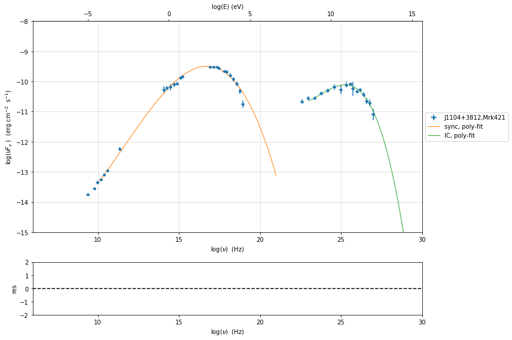
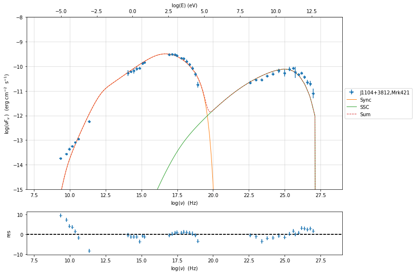
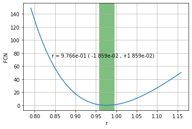
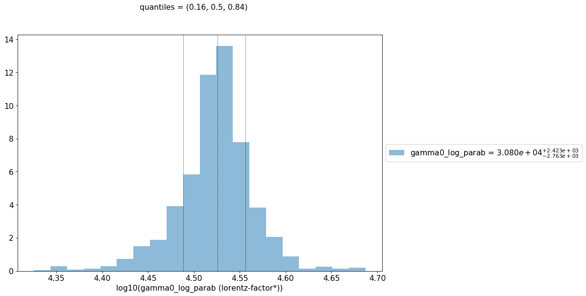
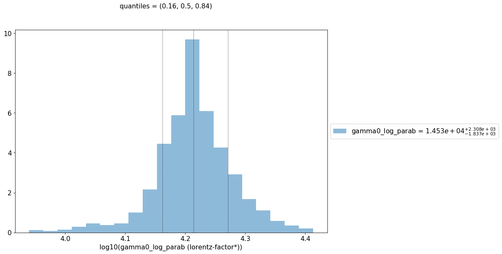
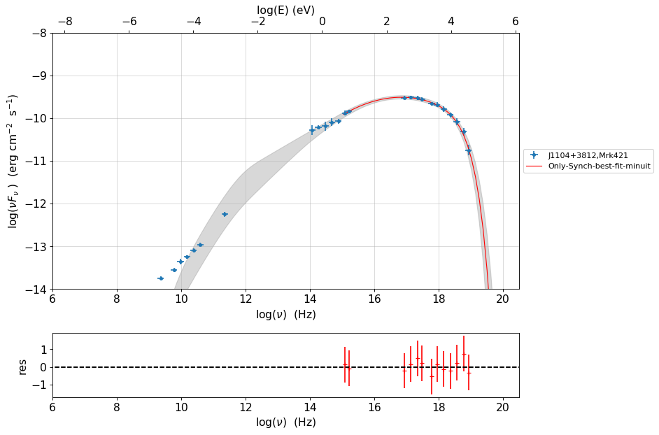
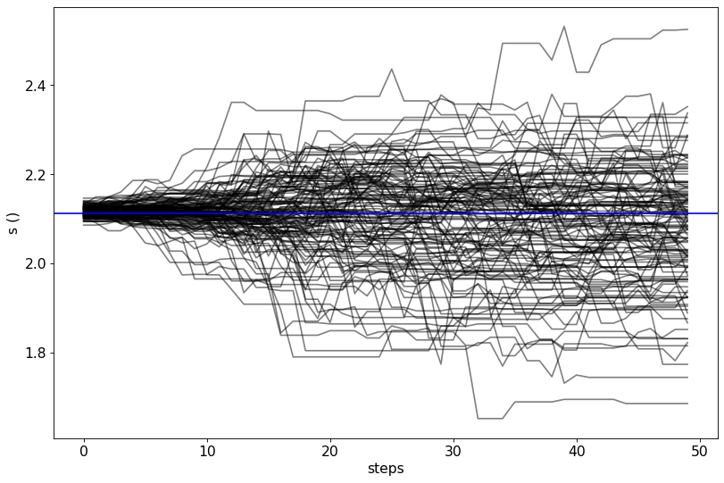
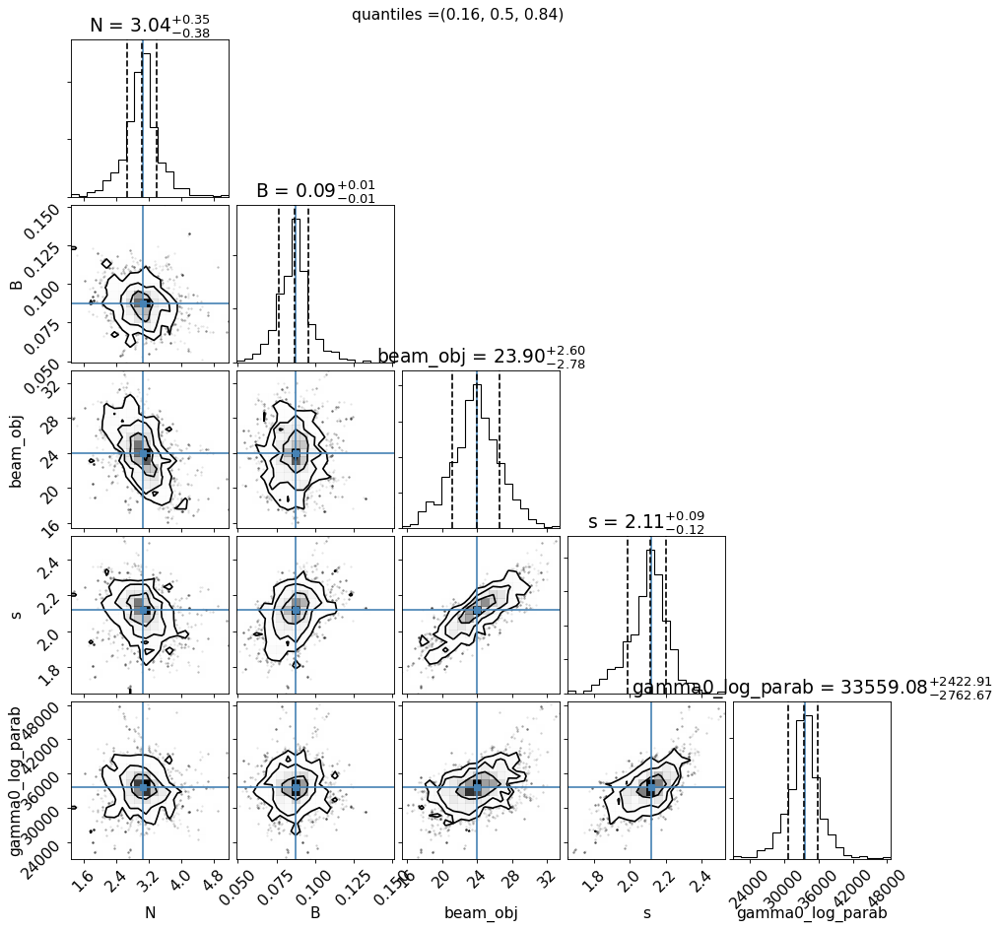

.. _model_fitting_3:

Model fitting 4: Only Synchrotron
=================================

.. code:: ipython3

    import warnings
    warnings.filterwarnings('ignore')
    
    import matplotlib.pylab as plt
    import jetset
    from jetset.test_data_helper import  test_SEDs
    from jetset.data_loader import ObsData,Data
    from jetset.plot_sedfit import PlotSED
    from jetset.test_data_helper import  test_SEDs

.. code:: ipython3

    test_SEDs

.. parsed-literal::

    ['/Users/orion/anaconda3/envs/jetset/lib/python3.7/site-packages/jetset-1.1.2-py3.7-macosx-10.9-x86_64.egg/jetset/test_data/SEDs_data/SED_3C345.ecsv',
     '/Users/orion/anaconda3/envs/jetset/lib/python3.7/site-packages/jetset-1.1.2-py3.7-macosx-10.9-x86_64.egg/jetset/test_data/SEDs_data/SED_MW_Mrk421_EBL_DEABS.ecsv',
     '/Users/orion/anaconda3/envs/jetset/lib/python3.7/site-packages/jetset-1.1.2-py3.7-macosx-10.9-x86_64.egg/jetset/test_data/SEDs_data/SED_MW_Mrk501_EBL_DEABS.ecsv']

Loading data
------------

see the :ref:`data_format` user guide for further information about loading data 

.. code:: ipython3

    print(test_SEDs[1])
    data=Data.from_file(test_SEDs[1])

.. parsed-literal::

    /Users/orion/anaconda3/envs/jetset/lib/python3.7/site-packages/jetset-1.1.2-py3.7-macosx-10.9-x86_64.egg/jetset/test_data/SEDs_data/SED_MW_Mrk421_EBL_DEABS.ecsv

.. code:: ipython3

    %matplotlib inline
    sed_data=ObsData(data_table=data)
    sed_data.group_data(bin_width=0.2)
    
    sed_data.add_systematics(0.1,[10.**6,10.**29])
    p=sed_data.plot_sed()

.. parsed-literal::

    ===================================================================================================================
    
    ***  binning data  ***
    ---> N bins= 89
    ---> bin_widht= 0.2
    ===================================================================================================================
    

.. image:: Jet_example_only_synchrotron_files/Jet_example_only_synchrotron_7_1.png

.. code:: ipython3

    sed_data.save('Mrk_401.pkl')

Phenomenological model constraining
-----------------------------------

see the :ref:`phenom_constr` user guide for further information about loading data 

Spectral indices
~~~~~~~~~~~~~~~~

.. code:: ipython3

    from jetset.sed_shaper import  SEDShape
    my_shape=SEDShape(sed_data)
    my_shape.eval_indices(silent=True)
    p=my_shape.plot_indices()
    p.rescale(y_min=-15,y_max=-6)

.. parsed-literal::

    ===================================================================================================================
    
    *** evaluating spectral indices for data ***
    ===================================================================================================================
    

.. image:: Jet_example_only_synchrotron_files/Jet_example_only_synchrotron_12_1.png

Sed shaper
~~~~~~~~~~

.. code:: ipython3

    mm,best_fit=my_shape.sync_fit(check_host_gal_template=False,
                      Ep_start=None,
                      minimizer='lsb',
                      silent=True,
                      fit_range=[10., 21.])

.. parsed-literal::

    ===================================================================================================================
    
    *** Log-Polynomial fitting of the synchrotron component ***
    ---> first blind fit run,  fit range: [10.0, 21.0]
    ---> class:  HSP
    
    
    
    model name name  bestfit val     err +     err -   start val   fit range min fit range max frozen
    ---------- ---- ------------- ------------ ----- ------------- ------------- ------------- ------
      LogCubic    b -1.545301e-01 9.534756e-03    -- -1.000000e+00 -1.000000e+01  0.000000e+00  False
      LogCubic    c -1.023245e-02 1.433074e-03    -- -1.000000e+00 -1.000000e+01  1.000000e+01  False
      LogCubic   Ep  1.672267e+01 4.139904e-02    --  1.667039e+01  0.000000e+00  3.000000e+01  False
      LogCubic   Sp -9.491658e+00 2.515289e-02    -- -1.000000e+01 -3.000000e+01  0.000000e+00  False
    ---> sync       nu_p=+1.672267e+01 (err=+4.139904e-02)  nuFnu_p=-9.491658e+00 (err=+2.515289e-02) curv.=-1.545301e-01 (err=+9.534756e-03)
    ===================================================================================================================
    

.. code:: ipython3

    my_shape.IC_fit(fit_range=[23., 29.],minimizer='minuit',silent=True)
    p=my_shape.plot_shape_fit()
    p.rescale(y_min=-15)

.. parsed-literal::

    ===================================================================================================================
    
    *** Log-Polynomial fitting of the IC component ***
    ---> fit range: [23.0, 29.0]
    ---> LogCubic fit
    
    
    model name name  bestfit val     err +     err -   start val   fit range min fit range max frozen
    ---------- ---- ------------- ------------ ----- ------------- ------------- ------------- ------
      LogCubic    b -2.097925e-01 3.133727e-02    -- -1.000000e+00 -1.000000e+01  0.000000e+00  False
      LogCubic    c -4.662648e-02 2.178444e-02    -- -1.000000e+00 -1.000000e+01  1.000000e+01  False
      LogCubic   Ep  2.524932e+01 1.147866e-01    --  2.529412e+01  0.000000e+00  3.000000e+01  False
      LogCubic   Sp -1.011094e+01 3.498801e-02    -- -1.000000e+01 -3.000000e+01  0.000000e+00  False
    ---> IC         nu_p=+2.524932e+01 (err=+1.147866e-01)  nuFnu_p=-1.011094e+01 (err=+3.498801e-02) curv.=-2.097925e-01 (err=+3.133727e-02)
    ===================================================================================================================
    

Model constraining
~~~~~~~~~~~~~~~~~~

.. code:: ipython3

    from jetset.obs_constrain import ObsConstrain
    from jetset.model_manager import  FitModel
    from jetset.minimizer import fit_SED
    sed_obspar=ObsConstrain(beaming=25,
                            B_range=[0.001,0.1],
                            distr_e='lppl',
                            t_var_sec=3*86400,
                            nu_cut_IR=1E12,
                            SEDShape=my_shape)
    
    
    prefit_jet=sed_obspar.constrain_SSC_model(electron_distribution_log_values=False,silent=True)
    prefit_jet.save_model('prefit_jet.pkl')

.. parsed-literal::

    ===================================================================================================================
    
    ***  constrains parameters from observable ***
    
          name             par type           units          val      phys. bound. min phys. bound. max  log  frozen
    ---------------- ------------------- --------------- ------------ ---------------- ---------------- ----- ------
                gmin  low-energy-cut-off lorentz-factor* 3.338231e+02     1.000000e+00     1.000000e+09 False  False
                gmax high-energy-cut-off lorentz-factor* 9.758134e+05     1.000000e+00     1.000000e+15 False  False
                   N    emitters_density         1 / cm3 3.072164e+00     0.000000e+00               -- False  False
                   s   LE_spectral_slope                 2.181578e+00    -1.000000e+01     1.000000e+01 False  False
                   r  spectral_curvature                 7.726503e-01    -1.500000e+01     1.500000e+01 False  False
    gamma0_log_parab    turn-over-energy lorentz-factor* 2.265855e+04     1.000000e+00     1.000000e+09 False  False
                   R         region_size              cm 1.649188e+16     1.000000e+03     1.000000e+30 False  False
                 R_H     region_position              cm 1.000000e+17     0.000000e+00               -- False   True
                   B      magnetic_field               G 1.000000e-01     0.000000e+00               -- False  False
            beam_obj             beaming Lorentz-factor* 2.500000e+01     1.000000e-04               -- False  False
              z_cosm            redshift                 3.080000e-02     0.000000e+00               -- False  False
    
    ===================================================================================================================
    

.. code:: ipython3

    pl=prefit_jet.plot_model(sed_data=sed_data)
    pl.add_residual_plot(prefit_jet,sed_data)
    pl.rescale(y_min=-15,x_min=7,x_max=29)

Model fitting only Synchorotron component
-----------------------------------------

.. note::
   With the new implementation of composite model  (`FitModel` class) to set parameters you have to specify the model component, this is different from versions<1.1.2,
   and this holds also for the `freeze` method and for setting  `fit_range` intervals, and for the methods relate to parameters setting in general.
   See the :ref:`composite_models` user guide for further information about the new implementation of `FitModel`, in particular for parameter setting

Model fitting with Minuit
~~~~~~~~~~~~~~~~~~~~~~~~~

.. code:: ipython3

    from jetset.jet_model import Jet
    jet_minuit=Jet.load_model('prefit_jet.pkl')
    jet_minuit.set_gamma_grid_size(200)

.. parsed-literal::

          name             par type           units          val      phys. bound. min phys. bound. max  log  frozen
    ---------------- ------------------- --------------- ------------ ---------------- ---------------- ----- ------
                gmin  low-energy-cut-off lorentz-factor* 3.338231e+02     1.000000e+00     1.000000e+09 False  False
                gmax high-energy-cut-off lorentz-factor* 9.758134e+05     1.000000e+00     1.000000e+15 False  False
                   N    emitters_density         1 / cm3 3.072164e+00     0.000000e+00               -- False  False
                   s   LE_spectral_slope                 2.181578e+00    -1.000000e+01     1.000000e+01 False  False
                   r  spectral_curvature                 7.726503e-01    -1.500000e+01     1.500000e+01 False  False
    gamma0_log_parab    turn-over-energy lorentz-factor* 2.265855e+04     1.000000e+00     1.000000e+09 False  False
                   R         region_size              cm 1.649188e+16     1.000000e+03     1.000000e+30 False  False
                 R_H     region_position              cm 1.000000e+17     0.000000e+00               -- False   True
                   B      magnetic_field               G 1.000000e-01     0.000000e+00               -- False  False
            beam_obj             beaming Lorentz-factor* 2.500000e+01     1.000000e-04               -- False  False
              z_cosm            redshift                 3.080000e-02     0.000000e+00               -- False  False

we switch off the IC component

.. code:: ipython3

    
    jet_minuit.spectral_components.SSC.state='off'
    jet_minuit.show_model()

.. parsed-literal::

    
    -------------------------------------------------------------------------------------------------------------------
    jet model description
    -------------------------------------------------------------------------------------------------------------------
    name: jet_leptonic  
    
    electrons distribution:
     type: lppl  
     gamma energy grid size:  201
     gmin grid : 3.338231e+02
     gmax grid : 9.758134e+05
     normalization  True
     log-values  False
    
    radiative fields:
     seed photons grid size:  100
     IC emission grid size:  50
     source emissivity lower bound :  1.000000e-120
     spectral components:
       name:Sum, state: on
       name:Sync, state: self-abs
       name:SSC, state: off
    external fields transformation method: blob
    
    SED info:
     nu grid size :200
     nu mix (Hz): 1.000000e+06
     nu max (Hz): 1.000000e+30
    
    flux plot lower bound   :  1.000000e-120
    
          name             par type           units          val      phys. bound. min phys. bound. max  log  frozen
    ---------------- ------------------- --------------- ------------ ---------------- ---------------- ----- ------
                gmin  low-energy-cut-off lorentz-factor* 3.338231e+02     1.000000e+00     1.000000e+09 False  False
                gmax high-energy-cut-off lorentz-factor* 9.758134e+05     1.000000e+00     1.000000e+15 False  False
                   N    emitters_density         1 / cm3 3.072164e+00     0.000000e+00               -- False  False
                   s   LE_spectral_slope                 2.181578e+00    -1.000000e+01     1.000000e+01 False  False
                   r  spectral_curvature                 7.726503e-01    -1.500000e+01     1.500000e+01 False  False
    gamma0_log_parab    turn-over-energy lorentz-factor* 2.265855e+04     1.000000e+00     1.000000e+09 False  False
                   R         region_size              cm 1.649188e+16     1.000000e+03     1.000000e+30 False  False
                 R_H     region_position              cm 1.000000e+17     0.000000e+00               -- False   True
                   B      magnetic_field               G 1.000000e-01     0.000000e+00               -- False  False
            beam_obj             beaming Lorentz-factor* 2.500000e+01     1.000000e-04               -- False  False
              z_cosm            redshift                 3.080000e-02     0.000000e+00               -- False  False
    -------------------------------------------------------------------------------------------------------------------

.. code:: ipython3

    fit_model_minuit=FitModel( jet=jet_minuit, name='Only-Synch-best-fit-minuit') 
    
    fit_model_minuit.freeze('jet_leptonic','z_cosm')
    fit_model_minuit.freeze('jet_leptonic','R_H')
    fit_model_minuit.freeze('jet_leptonic','R')
    fit_model_minuit.freeze('jet_leptonic','gmax')
    fit_model_minuit.jet_leptonic.parameters.R.fit_range=[10**15.5, 10**17.5]
    fit_model_minuit.jet_leptonic.parameters.beam_obj.fit_range=[5., 50.]

.. code:: ipython3

    from jetset.minimizer import fit_SED,ModelMinimizer
    
    model_minimizer_minuit=ModelMinimizer('minuit')
    best_fit_minuit=model_minimizer_minuit.fit(fit_model_minuit,sed_data,10.0**15,10**20.0,fitname='SSC-best-fit-minuit')

.. parsed-literal::

    filtering data in fit range = [1.000000e+15,1.000000e+20]
    data length 13
    ===================================================================================================================
    
    *** start fit process ***
    ----- 
    / minim function calls=180, chisq=10.025227 UL part=-0.000000
    **************************************************************************************************
    Fit report
    
    Model: SSC-best-fit-minuit
     model name        name             par type           units          val      phys. bound. min phys. bound. max  log  frozen
    ------------ ---------------- ------------------- --------------- ------------ ---------------- ---------------- ----- ------
    jet_leptonic             gmin  low-energy-cut-off lorentz-factor* 3.316412e+02     1.000000e+00     1.000000e+09 False  False
    jet_leptonic             gmax high-energy-cut-off lorentz-factor* 9.758134e+05     1.000000e+00     1.000000e+15 False   True
    jet_leptonic                N    emitters_density         1 / cm3 3.056138e+00     0.000000e+00               -- False  False
    jet_leptonic                s   LE_spectral_slope                 2.116389e+00    -1.000000e+01     1.000000e+01 False  False
    jet_leptonic                r  spectral_curvature                 9.747794e-01    -1.500000e+01     1.500000e+01 False  False
    jet_leptonic gamma0_log_parab    turn-over-energy lorentz-factor* 3.361531e+04     1.000000e+00     1.000000e+09 False  False
    jet_leptonic                R         region_size              cm 1.649188e+16     1.000000e+03     1.000000e+30 False   True
    jet_leptonic              R_H     region_position              cm 1.000000e+17     0.000000e+00               -- False   True
    jet_leptonic                B      magnetic_field               G 8.722124e-02     0.000000e+00               -- False  False
    jet_leptonic         beam_obj             beaming Lorentz-factor* 2.400658e+01     1.000000e-04               -- False  False
    jet_leptonic           z_cosm            redshift                 3.080000e-02     0.000000e+00               -- False   True
    
    converged=True
    calls=185
    ------------------------------------------------------------------
    | FCN = 9.883                   |     Ncalls=173 (184 total)     |
    | EDM = 2.57E+04 (Goal: 1E-05)  |            up = 1.0            |
    ------------------------------------------------------------------
    |  Valid Min.   | Valid Param.  | Above EDM | Reached call limit |
    ------------------------------------------------------------------
    |     False     |     True      |   True    |       False        |
    ------------------------------------------------------------------
    | Hesse failed  |   Has cov.    | Accurate  | Pos. def. | Forced |
    ------------------------------------------------------------------
    |     False     |     True      |   False   |   False   |  True  |
    ------------------------------------------------------------------
    -------------------------------------------------------------------------------------------
    |   | Name  |   Value   | Hesse Err | Minos Err- | Minos Err+ | Limit-  | Limit+  | Fixed |
    -------------------------------------------------------------------------------------------
    | 0 | par_0 |   331.6   |    1.2    |            |            |    1    |  1e+09  |       |
    | 1 | par_1 |    3.1    |    1.1    |            |            |    0    |         |       |
    | 2 | par_2 |   2.12    |   0.06    |            |            |   -10   |   10    |       |
    | 3 | par_3 |   0.97    |   0.09    |            |            |   -15   |   15    |       |
    | 4 | par_4 |  0.34E5   |  0.06E5   |            |            |    1    |  1e+09  |       |
    | 5 | par_5 |   0.087   |   0.014   |            |            |    0    |         |       |
    | 6 | par_6 |   24.0    |    2.0    |            |            |    5    |   50    |       |
    -------------------------------------------------------------------------------------------
    dof=6
    chisq=9.883327, chisq/red=1.647221 null hypothesis sig=0.129652
    
    best fit pars
     model name        name       bestfit val     err +     err -  start val   fit range min fit range max frozen
    ------------ ---------------- ------------ ------------ ----- ------------ ------------- ------------- ------
    jet_leptonic             gmin 3.316412e+02 1.191879e+00    -- 3.338231e+02  1.000000e+00  1.000000e+09  False
    jet_leptonic             gmax           --           --    -- 9.758134e+05  1.000000e+00  1.000000e+15   True
    jet_leptonic                N 3.056138e+00 1.054492e+00    -- 3.072164e+00  0.000000e+00            --  False
    jet_leptonic                s 2.116389e+00 6.417366e-02    -- 2.181578e+00 -1.000000e+01  1.000000e+01  False
    jet_leptonic                r 9.747794e-01 9.201361e-02    -- 7.726503e-01 -1.500000e+01  1.500000e+01  False
    jet_leptonic gamma0_log_parab 3.361531e+04 5.673704e+03    -- 2.265855e+04  1.000000e+00  1.000000e+09  False
    jet_leptonic                R           --           --    -- 1.649188e+16  3.162278e+15  3.162278e+17   True
    jet_leptonic              R_H           --           --    -- 1.000000e+17  0.000000e+00            --   True
    jet_leptonic                B 8.722124e-02 1.439927e-02    -- 1.000000e-01  0.000000e+00            --  False
    jet_leptonic         beam_obj 2.400658e+01 1.964607e+00    -- 2.500000e+01  5.000000e+00  5.000000e+01  False
    jet_leptonic           z_cosm           --           --    -- 3.080000e-02  0.000000e+00            --   True
    **************************************************************************************************
    
    ===================================================================================================================
    

.. code:: ipython3

    %matplotlib inline
    fit_model_minuit.set_nu_grid(1E6,1E30,200)
    fit_model_minuit.eval()
    p2=fit_model_minuit.plot_model(sed_data=sed_data)
    p2.rescale(y_min=-12,x_min=15,x_max=19.5)

.. image:: Jet_example_only_synchrotron_files/Jet_example_only_synchrotron_27_0.png

.. code:: ipython3

    model_minimizer_minuit.minimizer.mesg

.. raw:: html

    <table>
    <tr>
    <td colspan="2" title="Minimum value of function">
    FCN = 9.883
    </td>
    <td align="center" colspan="3" title="No. of calls in last algorithm and total number of calls">
    Ncalls = 173 (184 total)
    </td>
    </tr>
    <tr>
    <td colspan="2" title="Estimated distance to minimum and target threshold">
    EDM = 2.57E+04 (Goal: 1E-05)
    </td>
    <td align="center" colspan="3" title="Increase in FCN which corresponds to 1 standard deviation">
    up = 1.0
    </td>
    </tr>
    <tr>
    <td align="center" title="Validity of the migrad call">
    Valid Min.
    </td>
    <td align="center" title="Validity of parameters">
    Valid Param.
    </td>
    <td align="center" title="Is EDM above goal EDM?">
    Above EDM
    </td>
    <td align="center" colspan="2" title="Did last migrad call reach max call limit?">
    Reached call limit
    </td>
    </tr>
    <tr>
    <td align="center" style="background-color:#FF7878;">
    False
    </td>
    <td align="center" style="background-color:#92CCA6;">
    True
    </td>
    <td align="center" style="background-color:#FF7878;">
    True
    </td>
    <td align="center" colspan="2" style="background-color:#92CCA6;">
    False
    </td>
    </tr>
    <tr>
    <td align="center" title="Did Hesse fail?">
    Hesse failed
    </td>
    <td align="center" title="Has covariance matrix">
    Has cov.
    </td>
    <td align="center" title="Is covariance matrix accurate?">
    Accurate
    </td>
    <td align="center" title="Is covariance matrix positive definite?">
    Pos. def.
    </td>
    <td align="center" title="Was positive definiteness enforced by Minuit?">
    Forced
    </td>
    </tr>
    <tr>
    <td align="center" style="background-color:#92CCA6;">
    False
    </td>
    <td align="center" style="background-color:#92CCA6;">
    True
    </td>
    <td align="center" style="background-color:#FF7878;">
    False
    </td>
    <td align="center" style="background-color:#FF7878;">
    False
    </td>
    <td align="center" style="background-color:#FF7878;">
    True
    </td>
    </tr>
    </table>
    <table>
    <tr style="background-color:#F4F4F4;">
    <td/>
    <th title="Variable name">
    Name
    </th>
    <th title="Value of parameter">
    Value
    </th>
    <th title="Hesse error">
    Hesse Error
    </th>
    <th title="Minos lower error">
    Minos Error-
    </th>
    <th title="Minos upper error">
    Minos Error+
    </th>
    <th title="Lower limit of the parameter">
    Limit-
    </th>
    <th title="Upper limit of the parameter">
    Limit+
    </th>
    <th title="Is the parameter fixed in the fit">
    Fixed
    </th>
    </tr>
    <tr style="background-color:#FFFFFF;">
    <td>
    0
    </td>
    <td>
    par_0
    </td>
    <td>
    331.6
    </td>
    <td>
    1.2
    </td>
    <td>
    
    </td>
    <td>
    
    </td>
    <td>
    1
    </td>
    <td>
    1E+09
    </td>
    <td>
    
    </td>
    </tr>
    <tr style="background-color:#F4F4F4;">
    <td>
    1
    </td>
    <td>
    par_1
    </td>
    <td>
    3.1
    </td>
    <td>
    1.1
    </td>
    <td>
    
    </td>
    <td>
    
    </td>
    <td>
    0
    </td>
    <td>
    
    </td>
    <td>
    
    </td>
    </tr>
    <tr style="background-color:#FFFFFF;">
    <td>
    2
    </td>
    <td>
    par_2
    </td>
    <td>
    2.12
    </td>
    <td>
    0.06
    </td>
    <td>
    
    </td>
    <td>
    
    </td>
    <td>
    -10
    </td>
    <td>
    10
    </td>
    <td>
    
    </td>
    </tr>
    <tr style="background-color:#F4F4F4;">
    <td>
    3
    </td>
    <td>
    par_3
    </td>
    <td>
    0.97
    </td>
    <td>
    0.09
    </td>
    <td>
    
    </td>
    <td>
    
    </td>
    <td>
    -15
    </td>
    <td>
    15
    </td>
    <td>
    
    </td>
    </tr>
    <tr style="background-color:#FFFFFF;">
    <td>
    4
    </td>
    <td>
    par_4
    </td>
    <td>
    0.34E5
    </td>
    <td>
    0.06E5
    </td>
    <td>
    
    </td>
    <td>
    
    </td>
    <td>
    1
    </td>
    <td>
    1E+09
    </td>
    <td>
    
    </td>
    </tr>
    <tr style="background-color:#F4F4F4;">
    <td>
    5
    </td>
    <td>
    par_5
    </td>
    <td>
    0.087
    </td>
    <td>
    0.014
    </td>
    <td>
    
    </td>
    <td>
    
    </td>
    <td>
    0
    </td>
    <td>
    
    </td>
    <td>
    
    </td>
    </tr>
    <tr style="background-color:#FFFFFF;">
    <td>
    6
    </td>
    <td>
    par_6
    </td>
    <td>
    24.0
    </td>
    <td>
    2.0
    </td>
    <td>
    
    </td>
    <td>
    
    </td>
    <td>
    5
    </td>
    <td>
    50
    </td>
    <td>
    
    </td>
    </tr>
    </table>

.. code:: ipython3

    c=model_minimizer_minuit.minimizer.draw_contour('r','s')

.. parsed-literal::

    / minim function calls=400, chisq=300.390795 UL part=-0.000000

.. code:: ipython3

    m=model_minimizer_minuit.minimizer.draw_profile('r')

.. parsed-literal::

    \ minim function calls=100, chisq=60.061619 UL part=-0.000000

.. image:: Jet_example_only_synchrotron_files/Jet_example_only_synchrotron_30_1.png

.. code:: ipython3

    best_fit_minuit.save_report('SSC-best-fit-minuit.txt')
    model_minimizer_minuit.save_model('model_minimizer_minuit.pkl')
    fit_model_minuit.save_model('fit_model_minuit.pkl')

MCMC sampling
-------------

.. code:: ipython3

    from jetset.mcmc import McmcSampler
    from jetset.minimizer import ModelMinimizer

.. code:: ipython3

    model_minimizer_minuit = ModelMinimizer.load_model('model_minimizer_minuit.pkl')
    
    mcmc=McmcSampler(model_minimizer_minuit)
    
    labels=['N','B','beam_obj','s','gamma0_log_parab']
    model_name='jet_leptonic'
    use_labels_dict={model_name:labels}
    
    mcmc.run_sampler(nwalkers=128,burnin=10,steps=50,bound=5.0,bound_rel=True,threads=None,walker_start_bound=0.005,use_labels_dict=use_labels_dict)

.. parsed-literal::

    mcmc run starting

.. parsed-literal::

    100%|██████████| 50/50 [04:28<00:00,  5.37s/it]

.. parsed-literal::

    mcmc run done, with 1 threads took 274.22 seconds

.. parsed-literal::

    

.. code:: ipython3

    print(mcmc.acceptance_fraction)

.. parsed-literal::

    0.5090625

.. code:: ipython3

    p=mcmc.plot_model(sed_data=sed_data,fit_range=[15., 20.],size=50)
    p.rescale(y_min=-14,x_min=6,x_max=20.5)

.. image:: Jet_example_only_synchrotron_files/Jet_example_only_synchrotron_37_0.png

f=mcmc.plot_chain(‘s’,log_plot=False)

.. code:: ipython3

    f=mcmc.corner_plot()

.. image:: Jet_example_only_synchrotron_files/Jet_example_only_synchrotron_39_0.png

.. code:: ipython3

    mcmc.get_par('N')

.. parsed-literal::

    (array([3.12933366, 3.01311456, 3.02939386, ..., 2.62278947, 3.83006784,
            3.75335437]),
     0)

.. code:: ipython3

    f=mcmc.plot_par('beam_obj')

.. code:: ipython3

    f=mcmc.plot_par('gamma0_log_parab',log_plot=True)

Save and resue MCMC
-------------------

.. code:: ipython3

    mcmc.save('mcmc_sampler.pkl')

.. code:: ipython3

    from jetset.mcmc import McmcSampler
    from jetset.data_loader import ObsData
    from jetset.plot_sedfit import PlotSED
    from jetset.test_data_helper import  test_SEDs
    
    sed_data=ObsData.load('Mrk_401.pkl')
    
    ms=McmcSampler.load('mcmc_sampler.pkl')

.. code:: ipython3

    ms.model.name

.. parsed-literal::

    'Only-Synch-best-fit-minuit'

.. code:: ipython3

    p=ms.plot_model(sed_data=sed_data,fit_range=[15., 20.],size=50)
    p.rescale(y_min=-14,x_min=6,x_max=20.5)

.. code:: ipython3

    f=ms.plot_par('beam_obj',log_plot=False)

.. image:: Jet_example_only_synchrotron_files/Jet_example_only_synchrotron_48_0.png

.. code:: ipython3

    f=ms.plot_par('B',log_plot=True)

.. code:: ipython3

    f=mcmc.plot_chain('s',log_plot=False)

.. code:: ipython3

    f=mcmc.corner_plot()

.. image:: Jet_example_only_synchrotron_files/Jet_example_only_synchrotron_51_0.png

