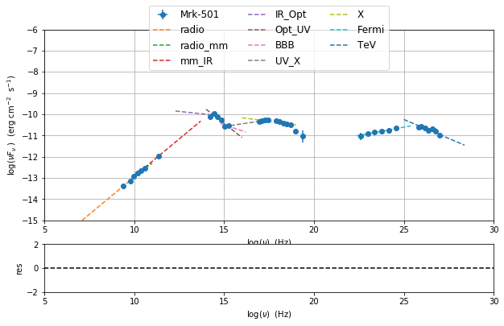
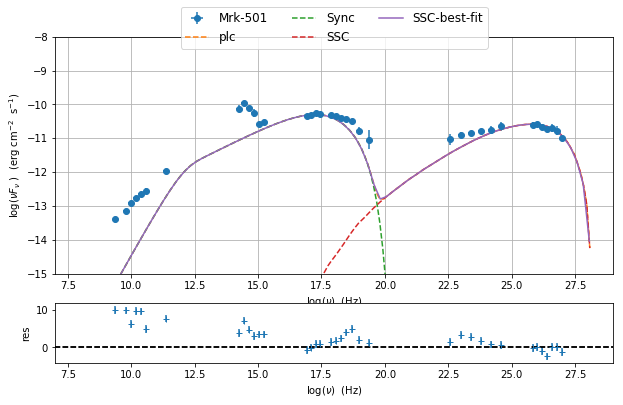
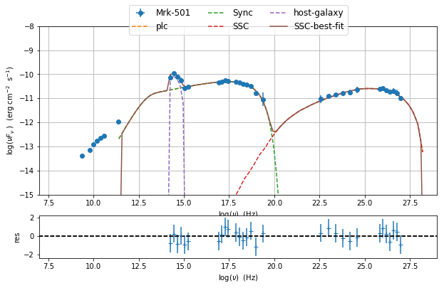
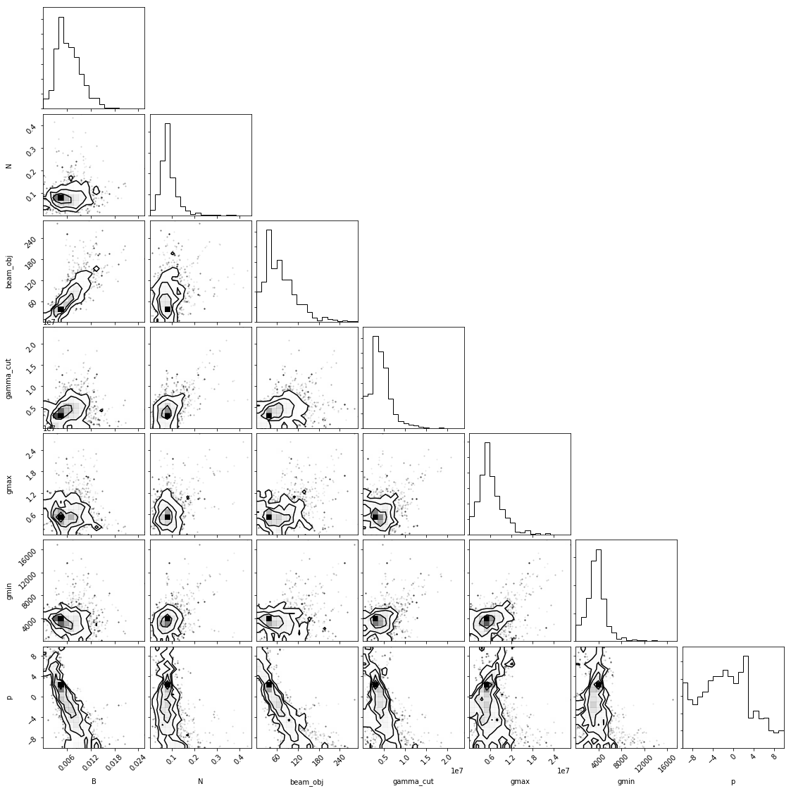
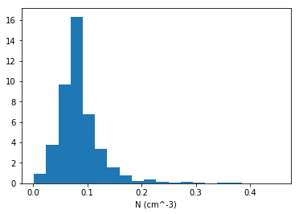
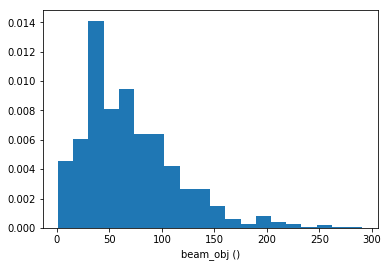
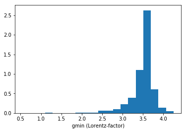

.. _model_fitting:

Model fitting
=============

.. code:: ipython3

    import warnings
    warnings.filterwarnings('ignore')
    
    import matplotlib.pylab as plt
    import jetset
    from jetset.test_data_helper import  test_SEDs
    from jetset.data_loader import ObsData,Data
    from jetset.plot_sedfit import PlotSED
    from jetset.test_data_helper import  test_SEDs

loading data
------------

see the :ref:`data_format` user guide for further information about loading data 

.. code:: ipython3

    print(test_SEDs[1])
    data=Data(data_table=test_SEDs[2])

.. parsed-literal::

    /Users/orion/anaconda3/lib/python3.7/site-packages/jetset-1.0.2-py3.7-macosx-10.9-x86_64.egg/jetset/test_data/SEDs_data/SED_MW_Mrk421.dat

.. code:: ipython3

    %matplotlib inline
    sed_data=ObsData(data_table=data)
    sed_data.group_data(bin_width=0.2)
    
    sed_data.add_systematics(0.1,[10.**6,10.**29])
    p=sed_data.plot_sed()

.. parsed-literal::

    ===================================================================================================================
    
    ***  binning data  ***
    ---> N bins= 90
    ---> bin_widht= 0.2
    ===================================================================================================================
    

.. image:: Jet_example_model_fit_files/Jet_example_model_fit_6_1.png

phenomenological model constraining
-----------------------------------

spectral indices
~~~~~~~~~~~~~~~~

.. code:: ipython3

    from jetset.sed_shaper import  SEDShape
    my_shape=SEDShape(sed_data)
    my_shape.eval_indices()
    p=my_shape.plot_indices()
    p.rescale(y_min=-15,y_max=-6)

.. parsed-literal::

    ===================================================================================================================
    
    *** evaluating spectral indices for data ***
    ---> initial range for index radio  set to [6.000000,10.000000]
    ---> range for index radio updated  to [6.000000,10.000000]
    ---> name = radio            range=[6.000 ,10.000] log(Hz)  photon.val=-1.295207e+00, err=1.359752e-01 
    
    ---> initial range for index radio_mm  set to [10.000000,11.000000]
    ---> range for index radio_mm updated  to [10.000000,11.000000]
    ---> name = radio_mm         range=[10.000,11.000] log(Hz)  photon.val=-1.455018e+00, err=5.280897e-02 
    
    ---> initial range for index mm_IR  set to [11.000000,13.000000]
    ---> range for index mm_IR updated  to [10.300000,13.700000]
    ---> name = mm_IR            range=[10.300,13.700] log(Hz)  photon.val=-1.296277e+00, err=3.749588e-02 
    
    ---> initial range for index IR_Opt  set to [13.000000,14.000000]
    ---> range for index IR_Opt updated  to [12.300000,14.700000]
    ---> name = IR_Opt           range=[12.300,14.700] log(Hz)  photon.val=-2.087455e+00, err=5.433975e-01 
    
    ---> initial range for index Opt_UV  set to [14.000000,16.000000]
    ---> range for index Opt_UV updated  to [14.000000,16.000000]
    ---> name = Opt_UV           range=[14.000,16.000] log(Hz)  photon.val=-2.665890e+00, err=1.419430e-01 
    
    ---> initial range for index BBB  set to [15.000000,16.000000]
    ---> range for index BBB updated  to [14.800000,16.200000]
    ---> name = BBB              range=[14.800,16.200] log(Hz)  photon.val=-2.282189e+00, err=5.738888e-01 
    
    ---> initial range for index UV_X  set to [15.000000,17.500000]
    ---> range for index UV_X updated  to [15.000000,17.500000]
    ---> name = UV_X             range=[15.000,17.500] log(Hz)  photon.val=-1.873128e+00, err=7.268872e-03 
    
    ---> initial range for index X  set to [16.000000,19.000000]
    ---> range for index X updated  to [16.000000,19.000000]
    ---> name = X                range=[16.000,19.000] log(Hz)  photon.val=-2.111490e+00, err=3.364660e-02 
    
    ---> initial range for index Fermi  set to [22.380000,25.380000]
    ---> range for index Fermi updated  to [22.380000,25.380000]
    ---> name = Fermi            range=[22.380,25.380] log(Hz)  photon.val=-1.844574e+00, err=1.535431e-02 
    
    ---> initial range for index TeV  set to [25.000000,28.380000]
    ---> range for index TeV updated  to [25.000000,28.380000]
    ---> name = TeV              range=[25.000,28.380] log(Hz)  photon.val=-2.357854e+00, err=4.850264e-02 
    
    ===================================================================================================================
    

sed shaper
~~~~~~~~~~

.. code:: ipython3

    mm,best_fit=my_shape.sync_fit(check_host_gal_template=True,
                      Ep_start=None,
                      minimizer='lsb',
                      silent=True,
                      fit_range=[10,21])

.. parsed-literal::

    ===================================================================================================================
    
    *** Log-Polynomial fitting of the synchrotron component ***
    ---> first blind fit run,  fit range: [10, 21]
    -------------------------------------------------------------------------------------------------------------------
    model parameters:
     Name             | Type                 | Units            | value         | phys. boundaries              | log
    -------------------------------------------------------------------------------------------------------------------
     b                | curvature            |                  | -1.000000e+00 | [-1.000000e+01,+0.000000e+00] | False 
     c                | third-degree         |                  | -1.000000e+00 | [-1.000000e+01,+1.000000e+01] | False 
     Ep               | peak freq            | Hz               | +1.400000e+01 | [+0.000000e+00,+3.000000e+01] | True 
     Sp               | peak flux            | erg cm^-2 s^-1   | -1.000000e+01 | [-3.000000e+01,+0.000000e+00] | True 
    -------------------------------------------------------------------------------------------------------------------
    ---> class:  HSP
    
    -------------------------------------------------------------------------------------------------------------------
    model parameters:
     Name             | Type                 | Units            | value         | phys. boundaries              | log
    -------------------------------------------------------------------------------------------------------------------
     b                | curvature            |                  | -4.778764e-02 | [-1.000000e+01,+0.000000e+00] | False 
     c                | third-degree         |                  | +3.576201e-03 | [-1.000000e+01,+1.000000e+01] | False 
     Ep               | peak freq            | Hz               | +1.626870e+01 | [+0.000000e+00,+3.000000e+01] | True 
     Sp               | peak flux            | erg cm^-2 s^-1   | -1.025412e+01 | [-3.000000e+01,+0.000000e+00] | True 
     nuFnu_p_host     | nuFnu-scale          | erg cm^-2 s^-1   | -1.025412e+01 | [-2.000000e+01,+2.000000e+01] | False 
     nu_scale         | nu-scale             | Hz               | +0.000000e+00 | [-2.000000e+00,+2.000000e+00] | False 
    -------------------------------------------------------------------------------------------------------------------
    
    **************************************************************************************************
    Fit report
    
    Model: sync-shape-fit
    -------------------------------------------------------------------------------------------------------------------
    model parameters:
     Name             | Type                 | Units            | value         | phys. boundaries              | log
    -------------------------------------------------------------------------------------------------------------------
     b                | curvature            |                  | -6.411143e-02 | [-1.000000e+01,+0.000000e+00] | False 
     c                | third-degree         |                  | -1.751704e-03 | [-1.000000e+01,+1.000000e+01] | False 
     Ep               | peak freq            | Hz               | +1.703747e+01 | [+0.000000e+00,+3.000000e+01] | True 
     Sp               | peak flux            | erg cm^-2 s^-1   | -1.030068e+01 | [-3.000000e+01,+0.000000e+00] | True 
     nuFnu_p_host     | nuFnu-scale          | erg cm^-2 s^-1   | -1.006556e+01 | [-2.000000e+01,+2.000000e+01] | False 
     nu_scale         | nu-scale             | Hz               | +1.730750e-02 | [-2.000000e+00,+2.000000e+00] | False 
    -------------------------------------------------------------------------------------------------------------------
    
    converged=True
    calls=144
    mesg=The relative error between two consecutive iterates is at most 0.000000
    dof=15
    chisq=15.371959, chisq/red=1.024797 null hypothesis sig=0.424971
    
    best fit pars
    -------------------------------------------------------------------------------------------------------------------
    best-fit parameters:
      Name            | best-fit value| best-fit err +| best-fit err -|start value   | fit boundaries
    -------------------------------------------------------------------------------------------------------------------
     b                | -6.411143e-02 | +7.838950e-03 | #             | -4.778764e-02 | [-1.000000e+01,+0.000000e+00]
     c                | -1.751704e-03 | +1.126942e-03 | #             | +3.576201e-03 | [-1.000000e+01,+1.000000e+01]
     Ep               | +1.703747e+01 | +9.437331e-02 | #             | +1.626870e+01 | [+0.000000e+00,+3.000000e+01]
     Sp               | -1.030068e+01 | +1.884115e-02 | #             | -1.025412e+01 | [-3.000000e+01,+0.000000e+00]
     nuFnu_p_host     | -1.006556e+01 | +5.462494e-02 | #             | -1.025412e+01 | [-1.225412e+01,-8.254123e+00]
     nu_scale         | +1.730750e-02 | +3.694837e-03 | #             | +0.000000e+00 | [-5.000000e-01,+5.000000e-01]
    -------------------------------------------------------------------------------------------------------------------
    **************************************************************************************************
    
    ---> class:  HSP
    ---> sync       nu_p=+1.703747e+01 (err=+9.437331e-02)  nuFnu_p=-1.030068e+01 (err=+1.884115e-02) curv.=-6.411143e-02 (err=+7.838950e-03)

.. code:: ipython3

    best_fit.show_report()

.. parsed-literal::

    
    **************************************************************************************************
    Fit report
    
    Model: sync-shape-fit
    -------------------------------------------------------------------------------------------------------------------
    model parameters:
     Name             | Type                 | Units            | value         | phys. boundaries              | log
    -------------------------------------------------------------------------------------------------------------------
     b                | curvature            |                  | -6.411143e-02 | [-1.000000e+01,+0.000000e+00] | False 
     c                | third-degree         |                  | -1.751704e-03 | [-1.000000e+01,+1.000000e+01] | False 
     Ep               | peak freq            | Hz               | +1.703747e+01 | [+0.000000e+00,+3.000000e+01] | True 
     Sp               | peak flux            | erg cm^-2 s^-1   | -1.030068e+01 | [-3.000000e+01,+0.000000e+00] | True 
     nuFnu_p_host     | nuFnu-scale          | erg cm^-2 s^-1   | -1.006556e+01 | [-2.000000e+01,+2.000000e+01] | False 
     nu_scale         | nu-scale             | Hz               | +1.730750e-02 | [-2.000000e+00,+2.000000e+00] | False 
    -------------------------------------------------------------------------------------------------------------------
    
    converged=True
    calls=144
    mesg=The relative error between two consecutive iterates is at most 0.000000
    dof=15
    chisq=15.371959, chisq/red=1.024797 null hypothesis sig=0.424971
    
    best fit pars
    -------------------------------------------------------------------------------------------------------------------
    best-fit parameters:
      Name            | best-fit value| best-fit err +| best-fit err -|start value   | fit boundaries
    -------------------------------------------------------------------------------------------------------------------
     b                | -6.411143e-02 | +7.838950e-03 | #             | -4.778764e-02 | [-1.000000e+01,+0.000000e+00]
     c                | -1.751704e-03 | +1.126942e-03 | #             | +3.576201e-03 | [-1.000000e+01,+1.000000e+01]
     Ep               | +1.703747e+01 | +9.437331e-02 | #             | +1.626870e+01 | [+0.000000e+00,+3.000000e+01]
     Sp               | -1.030068e+01 | +1.884115e-02 | #             | -1.025412e+01 | [-3.000000e+01,+0.000000e+00]
     nuFnu_p_host     | -1.006556e+01 | +5.462494e-02 | #             | -1.025412e+01 | [-1.225412e+01,-8.254123e+00]
     nu_scale         | +1.730750e-02 | +3.694837e-03 | #             | +0.000000e+00 | [-5.000000e-01,+5.000000e-01]
    -------------------------------------------------------------------------------------------------------------------
    **************************************************************************************************
    

.. code:: ipython3

    my_shape.IC_fit(fit_range=[23,29],minimizer='minuit')
    p=my_shape.plot_shape_fit()

.. parsed-literal::

    ===================================================================================================================
    
    *** Log-Polynomial fitting of the IC component ***
    ---> fit range: [23, 29]
    ---> LogCubic fit

.. raw:: html

    

.. raw:: html

    <table>
        <tr>
            <td title="Minimum value of function">FCN = 1.9966189636467242</td>
            <td title="Total number of call to FCN so far">TOTAL NCALL = 216</td>
            <td title="Number of call in last migrad">NCALLS = 216</td>
        </tr>
        <tr>
            <td title="Estimated distance to minimum">EDM = 9.56312217671091e-07</td>
            <td title="Maximum EDM definition of convergence">GOAL EDM = 1e-05</td>
            <td title="Error def. Amount of increase in FCN to be defined as 1 standard deviation">
            UP = 1.0</td>
        </tr>
    </table>
    <table>
        <tr>
            <td align="center" title="Validity of the migrad call">Valid</td>
            <td align="center" title="Validity of parameters">Valid Param</td>
            <td align="center" title="Is Covariance matrix accurate?">Accurate Covar</td>
            <td align="center" title="Positive definiteness of covariance matrix">PosDef</td>
            <td align="center" title="Was covariance matrix made posdef by adding diagonal element">Made PosDef</td>
        </tr>
        <tr>
            <td align="center" style="background-color:#92CCA6">True</td>
            <td align="center" style="background-color:#92CCA6">True</td>
            <td align="center" style="background-color:#92CCA6">True</td>
            <td align="center" style="background-color:#92CCA6">True</td>
            <td align="center" style="background-color:#92CCA6">False</td>
        </tr>
        <tr>
            <td align="center" title="Was last hesse call fail?">Hesse Fail</td>
            <td align="center" title="Validity of covariance">HasCov</td>
            <td align="center" title="Is EDM above goal EDM?">Above EDM</td>
            <td align="center"></td>
            <td align="center" title="Did last migrad call reach max call limit?">Reach calllim</td>
        </tr>
        <tr>
            <td align="center" style="background-color:#92CCA6">False</td>
            <td align="center" style="background-color:#92CCA6">True</td>
            <td align="center" style="background-color:#92CCA6">False</td>
            <td align="center"></td>
            <td align="center" style="background-color:#92CCA6">False</td>
        </tr>
    </table>

.. raw:: html

    <table>
        <tr>
            <td><a href="#" onclick="$('#QVTKcinQfY').toggle()">+</a></td>
            <td title="Variable name">Name</td>
            <td title="Value of parameter">Value</td>
            <td title="Hesse error">Hesse Error</td>
            <td title="Minos lower error">Minos Error-</td>
            <td title="Minos upper error">Minos Error+</td>
            <td title="Lower limit of the parameter">Limit-</td>
            <td title="Upper limit of the parameter">Limit+</td>
            <td title="Is the parameter fixed in the fit">Fixed?</td>
        </tr>
        <tr>
            <td>0</td>
            <td>par_0</td>
            <td>-0.131096</td>
            <td>0.032441</td>
            <td></td>
            <td></td>
            <td>-10</td>
            <td>0</td>
            <td>No</td>
        </tr>
        <tr>
            <td>1</td>
            <td>par_1</td>
            <td>-0.0330031</td>
            <td>0.0207252</td>
            <td></td>
            <td></td>
            <td>-10</td>
            <td>10</td>
            <td>No</td>
        </tr>
        <tr>
            <td>2</td>
            <td>par_2</td>
            <td>25.496</td>
            <td>0.223556</td>
            <td></td>
            <td></td>
            <td>0</td>
            <td>30</td>
            <td>No</td>
        </tr>
        <tr>
            <td>3</td>
            <td>par_3</td>
            <td>-10.5795</td>
            <td>0.0433306</td>
            <td></td>
            <td></td>
            <td>-30</td>
            <td>0</td>
            <td>No</td>
        </tr>
    </table>
    <pre id="QVTKcinQfY" style="display:none;">
    <textarea rows="14" cols="50" onclick="this.select()" readonly>
    \begin{tabular}{|c|r|r|r|r|r|r|r|c|}
    \hline
     & Name & Value & Hesse Error & Minos Error- & Minos Error+ & Limit- & Limit+ & Fixed?\\
    \hline
    0 & $par_{0}$ & -0.131096 & 0.032441 &  &  & -10.0 & 0 & No\\
    \hline
    1 & $par_{1}$ & -0.0330031 & 0.0207252 &  &  & -10.0 & 10 & No\\
    \hline
    2 & $par_{2}$ & 25.496 & 0.223556 &  &  & 0.0 & 30 & No\\
    \hline
    3 & $par_{3}$ & -10.5795 & 0.0433306 &  &  & -30.0 & 0 & No\\
    \hline
    \end{tabular}
    </textarea>
    </pre>

.. raw:: html

    

.. parsed-literal::

    
    **************************************************************************************************
    Fit report
    
    Model: IC-shape-fit
    -------------------------------------------------------------------------------------------------------------------
    model parameters:
     Name             | Type                 | Units            | value         | phys. boundaries              | log
    -------------------------------------------------------------------------------------------------------------------
     b                | curvature            |                  | -1.310958e-01 | [-1.000000e+01,+0.000000e+00] | False 
     c                | third-degree         |                  | -3.300308e-02 | [-1.000000e+01,+1.000000e+01] | False 
     Ep               | peak freq            | Hz               | +2.549604e+01 | [+0.000000e+00,+3.000000e+01] | True 
     Sp               | peak flux            | erg cm^-2 s^-1   | -1.057946e+01 | [-3.000000e+01,+0.000000e+00] | True 
    -------------------------------------------------------------------------------------------------------------------
    
    converged=True
    calls=217
    mesg=
    dof=7
    chisq=1.996620, chisq/red=0.285231 null hypothesis sig=0.960027
    
    best fit pars
    -------------------------------------------------------------------------------------------------------------------
    best-fit parameters:
      Name            | best-fit value| best-fit err +| best-fit err -|start value   | fit boundaries
    -------------------------------------------------------------------------------------------------------------------
     b                | -1.310958e-01 | +3.244101e-02 | #             | -1.000000e+00 | [-1.000000e+01,+0.000000e+00]
     c                | -3.300308e-02 | +2.072522e-02 | #             | -1.000000e+00 | [-1.000000e+01,+1.000000e+01]
     Ep               | +2.549604e+01 | +2.235556e-01 | #             | +2.556357e+01 | [+0.000000e+00,+3.000000e+01]
     Sp               | -1.057946e+01 | +4.333060e-02 | #             | -1.000000e+01 | [-3.000000e+01,+0.000000e+00]
    -------------------------------------------------------------------------------------------------------------------
    **************************************************************************************************
    
    ---> IC         nu_p=+2.549604e+01 (err=+2.235556e-01)  nuFnu_p=-1.057946e+01 (err=+4.333060e-02) curv.=-1.310958e-01 (err=+3.244101e-02)
    ===================================================================================================================
    

.. image:: Jet_example_model_fit_files/Jet_example_model_fit_13_6.png

model constraining
~~~~~~~~~~~~~~~~~~

.. code:: ipython3

    from jetset.obs_constrain import ObsConstrain
    from jetset.model_manager import  FitModel
    from jetset.minimizer import fit_SED
    sed_obspar=ObsConstrain(beaming=25,
                            B_range=[0.001,0.1],
                            distr_e='plc',
                            t_var_sec=3*86400,
                            nu_cut_IR=1E12,
                            SEDShape=my_shape)
    
    
    jet=sed_obspar.constrain_SSC_model(electron_distribution_log_values=False)
    pl=jet.plot_model(sed_data=sed_data)
    pl.rescale(y_min=-15,x_min=7,x_max=29)

.. parsed-literal::

    ===================================================================================================================
    
    ***  constrains parameters from observable ***
    -------------------------------------------------------------------------------------------------------------------
    model parameters:
     Name             | Type                 | Units            | value         | phys. boundaries              | log
    -------------------------------------------------------------------------------------------------------------------
     B                | magnetic_field       | G                | +1.000000e-01 | [+0.000000e+00,No           ] | False 
     N                | electron_density     | cm^-3            | +1.000000e+02 | [+0.000000e+00,No           ] | False 
     R                | region_size          | cm               | +1.569897e+01 | [+0.000000e+00,+3.000000e+01] | True 
     beam_obj         | beaming              |                  | +1.000000e+01 | [+1.000000e+00,No           ] | False 
     gamma_cut        | turn-over-energy     | Lorentz-factor   | +1.000000e+04 | [+1.000000e+00,+1.000000e+08] | False 
     gmax             | high-energy-cut-off  | Lorentz-factor   | +1.000000e+06 | [+1.000000e+00,+1.000000e+15] | False 
     gmin             | low-energy-cut-off   | Lorentz-factor   | +2.000000e+00 | [+1.000000e+00,+1.000000e+05] | False 
     p                | LE_spectral_slope    |                  | +2.000000e+00 | [-1.000000e+01,+1.000000e+01] | False 
     z_cosm           | redshift             |                  | +1.000000e-01 | [+0.000000e+00,No           ] | False 
    -------------------------------------------------------------------------------------------------------------------
    ---> ***  emitting region parameters  ***
    ---> name = beam_obj          type = beaming               units =                   val = +2.500000e+01  phys-bounds = [+1.000000e+00,No           ] islog = False   
    ---> setting par type redshift, corresponding to par z_cosm
    --->  name = z_cosm            type = redshift              units =                   val = +3.360000e-02  phys-bounds = [+0.000000e+00,No           ] islog = False   
    ---> setting par type magnetic_field, corresponding to par B
    --->  name = B                 type = magnetic_field        units = G                 val = +5.050000e-02  phys-bounds = [+0.000000e+00,No           ] islog = False   
    ---> setting par type region_size, corresponding to par R
    --->  name = R                 type = region_size           units = cm                val = +1.727404e+01  phys-bounds = [+0.000000e+00,+3.000000e+01] islog = True   
    ---> *** electron distribution parameters ***
    ---> distribution type:  plc
    ---> s_radio_mm -0.4550181897119767 1.9100363794239534
    ---> s_X 3.222980305950095
    ---> s_Fermi 1.751318246803089
    ---> s_UV_X 2.7462552767002855
    ---> s_Opt_UV -1.6658904880354974 4.331780976070995
    ---> s from synch log-log fit -1.0
    ---> s from (s_Fermi + s_UV)/2
    ---> power-law index s, class obj=HSP s chosen is 2.248787
    ---> setting par type LE_spectral_slope, corresponding to par p
    --->  name = p                 type = LE_spectral_slope     units =                   val = +2.248787e+00  phys-bounds = [-1.000000e+01,+1.000000e+01] islog = False   
    ---> gamma_3p_Sync= 1.553082e+05, assuming B=5.050000e-02
    ---> gamma_max=1.540472e+06 from nu_max_Sync= 2.413075e+19, using B=5.050000e-02
    ---> setting par type high-energy-cut-off, corresponding to par gmax
    --->  name = gmax              type = high-energy-cut-off   units = Lorentz-factor    val = +1.540472e+06  phys-bounds = [+1.000000e+00,+1.000000e+15] islog = False   
    
    ---> setting par type low-energy-cut-off, corresponding to par gmin
    --->  name = gmin              type = low-energy-cut-off    units = Lorentz-factor    val = +4.703917e+02  phys-bounds = [+1.000000e+00,+1.000000e+05] islog = False   
    
    ---> setting par type turn-over energy, corresponding to par gamma_cut
    ---> using gamma_3p_Sync= 155308.18930566724
    --->  name = gamma_cut         type = turn-over-energy      units = Lorentz-factor    val = +3.106164e+05  phys-bounds = [+1.000000e+00,+1.000000e+08] islog = False   
    
    nu_p_seed_blob 4506940400380918.0
    COMP FACTOR 5.665025584724533 22606.126136511644
    ---> gamma_3p_SSCc= %e 246681.73532127816
    ---> setting par type turn-over energy, corresponding to par gamma_cut
    ---> using gamma_3p_SSC= 246681.73532127816
    --->  name = gamma_cut         type = turn-over-energy      units = Lorentz-factor    val = +4.933635e+05  phys-bounds = [+1.000000e+00,+1.000000e+08] islog = False   
    
    
    ---> setting par type electron_density, corresponding to par N
    ---> name = N                 type = electron_density      units = cm^-3             val = +4.910190e-04  phys-bounds = [+0.000000e+00,No           ] islog = False   
    ---> B from nu_p_S=2.001733e-02
    ---> get B from best matching of nu_p_IC
         Best B=3.868794e-03
    ---> setting par type magnetic_field, corresponding to par B
    --->  name = B                 type = magnetic_field        units = G                 val = +3.868794e-03  phys-bounds = [+0.000000e+00,No           ] islog = False   
    
    ---> best B found:  name = B                 type = magnetic_field        units = G                 val = +3.868794e-03  phys-bounds = [+0.000000e+00,No           ] islog = False   
    
    ---> update pars for new B 
    ---> setting par type low-energy-cut-off, corresponding to par gmin
    --->  name = gmin              type = low-energy-cut-off    units = Lorentz-factor    val = +1.699486e+03  phys-bounds = [+1.000000e+00,+1.000000e+05] islog = False   
    
    ---> setting par type low-energy-cut-off, corresponding to par gamma_cut
    ---> using gamma_3p_Sync= 561115.5059675918
    --->  name = gamma_cut         type = turn-over-energy      units = Lorentz-factor    val = +1.122231e+06  phys-bounds = [+1.000000e+00,+1.000000e+08] islog = False   
    ---> gamma_max=5.565597e+06 from nu_max_Sync= 2.413075e+19, using B=3.868794e-03
    ---> setting par type high-energy-cut-off, corresponding to par gmax
    --->  name = gmax              type = high-energy-cut-off   units = Lorentz-factor    val = +5.565597e+06  phys-bounds = [+1.000000e+00,+1.000000e+15] islog = False   
    
    ---> setting par type electron_density, corresponding to par N
    ---> get R from Compoton Dominance (CD)
         Best R=7.892389e+16
    ---> setting par type region_size, corresponding to par R
    --->  name = R                 type = region_size           units = cm                val = +1.689721e+01  phys-bounds = [+0.000000e+00,+3.000000e+01] islog = True   
    
    ---> setting par type electron_density, corresponding to par N
    ---> t_var (days) 1.2597563330935961
    
    show pars
    -------------------------------------------------------------------------------------------------------------------
    model parameters:
     Name             | Type                 | Units            | value         | phys. boundaries              | log
    -------------------------------------------------------------------------------------------------------------------
     B                | magnetic_field       | G                | +3.868794e-03 | [+0.000000e+00,No           ] | False 
     N                | electron_density     | cm^-3            | +1.220832e-01 | [+0.000000e+00,No           ] | False 
     R                | region_size          | cm               | +1.689721e+01 | [+0.000000e+00,+3.000000e+01] | True 
     beam_obj         | beaming              |                  | +2.500000e+01 | [+1.000000e+00,No           ] | False 
     gamma_cut        | turn-over-energy     | Lorentz-factor   | +1.122231e+06 | [+1.000000e+00,+1.000000e+08] | False 
     gmax             | high-energy-cut-off  | Lorentz-factor   | +5.565597e+06 | [+1.000000e+00,+1.000000e+15] | False 
     gmin             | low-energy-cut-off   | Lorentz-factor   | +1.699486e+03 | [+1.000000e+00,+1.000000e+05] | False 
     p                | LE_spectral_slope    |                  | +2.248787e+00 | [-1.000000e+01,+1.000000e+01] | False 
     z_cosm           | redshift             |                  | +3.360000e-02 | [+0.000000e+00,No           ] | False 
    -------------------------------------------------------------------------------------------------------------------
    eval_model
    ===================================================================================================================
    

.. image:: Jet_example_model_fit_files/Jet_example_model_fit_15_1.png

.. code:: ipython3

    
    
    
    from jetset.model_manager import  FitModel
    from jetset.plot_sedfit import PlotSED
    jet.set_gamma_grid_size(200)
    fit_model=FitModel( jet=jet, name='SSC-best-fit',template=None)
    fit_model.eval()
    pl=fit_model.plot_model(sed_data=sed_data)
    pl.rescale(y_min=-15,x_min=7,x_max=29)

Model fitting
-------------

We remind that we can use different ``minimizers`` for the model
fitting. In the following we will use the ``minuit`` minimizer, but as
alternative we can use the ``lsb`` minimizer. Using ``minuit`` we notice
that sometime (as in the case below) the fit will converge, but the
quality will not be enough (``valid==false``) to run ``minos``. Anyhow,
as shown in the :ref:``MCMC sampling``, it still possible to estimate
asymmetric errors by means of MCMC sampling

.. code:: ipython3

    from jetset.model_manager import  FitModel
    
    jet.set_gamma_grid_size(200)
    
    fit_model=FitModel( jet=jet, name='SSC-best-fit',template=my_shape.host_gal)
    fit_model.freeze('z_cosm')
    fit_model.parameters.gmax.fit_range=[1E5,1E8]
    fit_model.freeze('R')
    fit_model.parameters.nuFnu_p_host.frozen=True
    fit_model.parameters.nu_scale.frozen=True
    fit_model.show_pars()
    
    #lsb minimizer
    model_minimizer,best_fit=fit_SED(fit_model,sed_data,10.0**11.4,10**29.0,fitname='SSC-best-fit',minimizer='lsb')
    
    #minuti minimizer
    model_minimizer,best_fit=fit_SED(fit_model,sed_data,10.0**11.4,10**29.0,fitname='SSC-best-fit',minimizer='minuit')

.. parsed-literal::

    -------------------------------------------------------------------------------------------------------------------
    model parameters:
     Name             | Type                 | Units            | value         | phys. boundaries              | log
    -------------------------------------------------------------------------------------------------------------------
     B                | magnetic_field       | G                | +3.868794e-03 | [+0.000000e+00,No           ] | False 
     N                | electron_density     | cm^-3            | +1.220832e-01 | [+0.000000e+00,No           ] | False 
     R                | region_size          | cm               | +1.689721e+01 | [+0.000000e+00,+3.000000e+01] | True 
     beam_obj         | beaming              |                  | +2.500000e+01 | [+1.000000e+00,No           ] | False 
     gamma_cut        | turn-over-energy     | Lorentz-factor   | +1.122231e+06 | [+1.000000e+00,+1.000000e+08] | False 
     gmax             | high-energy-cut-off  | Lorentz-factor   | +5.565597e+06 | [+1.000000e+00,+1.000000e+15] | False 
     gmin             | low-energy-cut-off   | Lorentz-factor   | +1.699486e+03 | [+1.000000e+00,+1.000000e+05] | False 
     p                | LE_spectral_slope    |                  | +2.248787e+00 | [-1.000000e+01,+1.000000e+01] | False 
     z_cosm           | redshift             |                  | +3.360000e-02 | [+0.000000e+00,No           ] | False 
     nuFnu_p_host     | nuFnu-scale          | erg cm^-2 s^-1   | -1.006556e+01 | [-2.000000e+01,+2.000000e+01] | False 
     nu_scale         | nu-scale             | Hz               | +1.730750e-02 | [-2.000000e+00,+2.000000e+00] | False 
    -------------------------------------------------------------------------------------------------------------------
    filtering data in fit range = [2.511886e+11,1.000000e+29]
    data length 30
    ===================================================================================================================
    
    *** start fit process ***
    initial pars: 
    -------------------------------------------------------------------------------------------------------------------
    model parameters:
     Name             | Type                 | Units            | value         | phys. boundaries              | log
    -------------------------------------------------------------------------------------------------------------------
     B                | magnetic_field       | G                | +3.868794e-03 | [+0.000000e+00,No           ] | False 
     N                | electron_density     | cm^-3            | +1.220832e-01 | [+0.000000e+00,No           ] | False 
     R                | region_size          | cm               | +1.689721e+01 | [+0.000000e+00,+3.000000e+01] | True 
     beam_obj         | beaming              |                  | +2.500000e+01 | [+1.000000e+00,No           ] | False 
     gamma_cut        | turn-over-energy     | Lorentz-factor   | +1.122231e+06 | [+1.000000e+00,+1.000000e+08] | False 
     gmax             | high-energy-cut-off  | Lorentz-factor   | +5.565597e+06 | [+1.000000e+00,+1.000000e+15] | False 
     gmin             | low-energy-cut-off   | Lorentz-factor   | +1.699486e+03 | [+1.000000e+00,+1.000000e+05] | False 
     p                | LE_spectral_slope    |                  | +2.248787e+00 | [-1.000000e+01,+1.000000e+01] | False 
     z_cosm           | redshift             |                  | +3.360000e-02 | [+0.000000e+00,No           ] | False 
     nuFnu_p_host     | nuFnu-scale          | erg cm^-2 s^-1   | -1.006556e+01 | [-2.000000e+01,+2.000000e+01] | False 
     nu_scale         | nu-scale             | Hz               | +1.730750e-02 | [-2.000000e+00,+2.000000e+00] | False 
    -------------------------------------------------------------------------------------------------------------------
    | minim function calls=50, chisq=13.292912 UL part=-0.000000
    **************************************************************************************************
    Fit report
    
    Model: SSC-best-fit
    -------------------------------------------------------------------------------------------------------------------
    model parameters:
     Name             | Type                 | Units            | value         | phys. boundaries              | log
    -------------------------------------------------------------------------------------------------------------------
     B                | magnetic_field       | G                | +3.842601e-03 | [+0.000000e+00,No           ] | False 
     N                | electron_density     | cm^-3            | +7.492553e-02 | [+0.000000e+00,No           ] | False 
     R                | region_size          | cm               | +1.689721e+01 | [+0.000000e+00,+3.000000e+01] | True 
     beam_obj         | beaming              |                  | +3.285602e+01 | [+1.000000e+00,No           ] | False 
     gamma_cut        | turn-over-energy     | Lorentz-factor   | +3.525224e+06 | [+1.000000e+00,+1.000000e+08] | False 
     gmax             | high-energy-cut-off  | Lorentz-factor   | +5.650706e+06 | [+1.000000e+00,+1.000000e+15] | False 
     gmin             | low-energy-cut-off   | Lorentz-factor   | +3.655704e+03 | [+1.000000e+00,+1.000000e+05] | False 
     p                | LE_spectral_slope    |                  | +2.700310e+00 | [-1.000000e+01,+1.000000e+01] | False 
     z_cosm           | redshift             |                  | +3.360000e-02 | [+0.000000e+00,No           ] | False 
     nuFnu_p_host     | nuFnu-scale          | erg cm^-2 s^-1   | -1.006556e+01 | [-2.000000e+01,+2.000000e+01] | False 
     nu_scale         | nu-scale             | Hz               | +1.730750e-02 | [-2.000000e+00,+2.000000e+00] | False 
    -------------------------------------------------------------------------------------------------------------------
    
    converged=True
    calls=59
    mesg=The relative error between two consecutive iterates is at most 0.000000
    dof=23
    chisq=13.292923, chisq/red=0.577953 null hypothesis sig=0.945350
    
    best fit pars
    -------------------------------------------------------------------------------------------------------------------
    best-fit parameters:
      Name            | best-fit value| best-fit err +| best-fit err -|start value   | fit boundaries
    -------------------------------------------------------------------------------------------------------------------
     B                | +3.842601e-03 | +1.308141e-09 | #             | +3.868794e-03 | [+0.000000e+00,No           ]
     N                | +7.492553e-02 | +9.296430e-03 | #             | +1.220832e-01 | [+0.000000e+00,No           ]
     R                | Frozen        | Frozen        | Frozen        | +1.689721e+01 | [+0.000000e+00,+3.000000e+01]
     beam_obj         | +3.285602e+01 | +7.308139e-01 | #             | +2.500000e+01 | [+1.000000e+00,No           ]
     gamma_cut        | +3.525224e+06 | +3.889897e+05 | #             | +1.122231e+06 | [+1.000000e+00,+1.000000e+08]
     gmax             | +5.650706e+06 | +1.033713e+05 | #             | +5.565597e+06 | [+1.000000e+05,+1.000000e+08]
     gmin             | +3.655704e+03 | +2.060421e-02 | #             | +1.699486e+03 | [+1.000000e+00,+1.000000e+05]
     p                | +2.700310e+00 | +1.882426e-02 | #             | +2.248787e+00 | [-1.000000e+01,+1.000000e+01]
     z_cosm           | Frozen        | Frozen        | Frozen        | +3.360000e-02 | [+0.000000e+00,No           ]
     nuFnu_p_host     | Frozen        | Frozen        | Frozen        | -1.006556e+01 | [-1.225412e+01,-8.254123e+00]
     nu_scale         | Frozen        | Frozen        | Frozen        | +1.730750e-02 | [-5.000000e-01,+5.000000e-01]
    -------------------------------------------------------------------------------------------------------------------
    **************************************************************************************************
    
    ===================================================================================================================
    
    filtering data in fit range = [2.511886e+11,1.000000e+29]
    data length 30
    ===================================================================================================================
    
    *** start fit process ***
    initial pars: 
    -------------------------------------------------------------------------------------------------------------------
    model parameters:
     Name             | Type                 | Units            | value         | phys. boundaries              | log
    -------------------------------------------------------------------------------------------------------------------
     B                | magnetic_field       | G                | +3.842601e-03 | [+0.000000e+00,No           ] | False 
     N                | electron_density     | cm^-3            | +7.492553e-02 | [+0.000000e+00,No           ] | False 
     R                | region_size          | cm               | +1.689721e+01 | [+0.000000e+00,+3.000000e+01] | True 
     beam_obj         | beaming              |                  | +3.285602e+01 | [+1.000000e+00,No           ] | False 
     gamma_cut        | turn-over-energy     | Lorentz-factor   | +3.525224e+06 | [+1.000000e+00,+1.000000e+08] | False 
     gmax             | high-energy-cut-off  | Lorentz-factor   | +5.650706e+06 | [+1.000000e+00,+1.000000e+15] | False 
     gmin             | low-energy-cut-off   | Lorentz-factor   | +3.655704e+03 | [+1.000000e+00,+1.000000e+05] | False 
     p                | LE_spectral_slope    |                  | +2.700310e+00 | [-1.000000e+01,+1.000000e+01] | False 
     z_cosm           | redshift             |                  | +3.360000e-02 | [+0.000000e+00,No           ] | False 
     nuFnu_p_host     | nuFnu-scale          | erg cm^-2 s^-1   | -1.006556e+01 | [-2.000000e+01,+2.000000e+01] | False 
     nu_scale         | nu-scale             | Hz               | +1.730750e-02 | [-2.000000e+00,+2.000000e+00] | False 
    -------------------------------------------------------------------------------------------------------------------

.. raw:: html

    

.. raw:: html

    <table>
        <tr>
            <td title="Minimum value of function">FCN = 10.979598657004106</td>
            <td title="Total number of call to FCN so far">TOTAL NCALL = 154</td>
            <td title="Number of call in last migrad">NCALLS = 143</td>
        </tr>
        <tr>
            <td title="Estimated distance to minimum">EDM = 119277.1671119715</td>
            <td title="Maximum EDM definition of convergence">GOAL EDM = 1e-05</td>
            <td title="Error def. Amount of increase in FCN to be defined as 1 standard deviation">
            UP = 1.0</td>
        </tr>
    </table>
    <table>
        <tr>
            <td align="center" title="Validity of the migrad call">Valid</td>
            <td align="center" title="Validity of parameters">Valid Param</td>
            <td align="center" title="Is Covariance matrix accurate?">Accurate Covar</td>
            <td align="center" title="Positive definiteness of covariance matrix">PosDef</td>
            <td align="center" title="Was covariance matrix made posdef by adding diagonal element">Made PosDef</td>
        </tr>
        <tr>
            <td align="center" style="background-color:#FF7878">False</td>
            <td align="center" style="background-color:#92CCA6">True</td>
            <td align="center" style="background-color:#92CCA6">True</td>
            <td align="center" style="background-color:#92CCA6">True</td>
            <td align="center" style="background-color:#92CCA6">False</td>
        </tr>
        <tr>
            <td align="center" title="Was last hesse call fail?">Hesse Fail</td>
            <td align="center" title="Validity of covariance">HasCov</td>
            <td align="center" title="Is EDM above goal EDM?">Above EDM</td>
            <td align="center"></td>
            <td align="center" title="Did last migrad call reach max call limit?">Reach calllim</td>
        </tr>
        <tr>
            <td align="center" style="background-color:#92CCA6">False</td>
            <td align="center" style="background-color:#92CCA6">True</td>
            <td align="center" style="background-color:#FF7878">True</td>
            <td align="center"></td>
            <td align="center" style="background-color:#92CCA6">False</td>
        </tr>
    </table>

.. raw:: html

    <table>
        <tr>
            <td><a href="#" onclick="$('#lPyAVnJRfX').toggle()">+</a></td>
            <td title="Variable name">Name</td>
            <td title="Value of parameter">Value</td>
            <td title="Hesse error">Hesse Error</td>
            <td title="Minos lower error">Minos Error-</td>
            <td title="Minos upper error">Minos Error+</td>
            <td title="Lower limit of the parameter">Limit-</td>
            <td title="Upper limit of the parameter">Limit+</td>
            <td title="Is the parameter fixed in the fit">Fixed?</td>
        </tr>
        <tr>
            <td>0</td>
            <td>par_0</td>
            <td>0.00384063</td>
            <td>1.24941e-07</td>
            <td></td>
            <td></td>
            <td>0</td>
            <td></td>
            <td>No</td>
        </tr>
        <tr>
            <td>1</td>
            <td>par_1</td>
            <td>0.0770046</td>
            <td>0.0066052</td>
            <td></td>
            <td></td>
            <td>0</td>
            <td></td>
            <td>No</td>
        </tr>
        <tr>
            <td>2</td>
            <td>par_2</td>
            <td>32.9474</td>
            <td>0.95594</td>
            <td></td>
            <td></td>
            <td>1</td>
            <td></td>
            <td>No</td>
        </tr>
        <tr>
            <td>3</td>
            <td>par_3</td>
            <td>3.16002e+06</td>
            <td>640631</td>
            <td></td>
            <td></td>
            <td>1</td>
            <td>1e+08</td>
            <td>No</td>
        </tr>
        <tr>
            <td>4</td>
            <td>par_4</td>
            <td>5.65071e+06</td>
            <td>77.4277</td>
            <td></td>
            <td></td>
            <td>100000</td>
            <td>1e+08</td>
            <td>No</td>
        </tr>
        <tr>
            <td>5</td>
            <td>par_5</td>
            <td>3655.72</td>
            <td>0.0573383</td>
            <td></td>
            <td></td>
            <td>1</td>
            <td>100000</td>
            <td>No</td>
        </tr>
        <tr>
            <td>6</td>
            <td>par_6</td>
            <td>2.69845</td>
            <td>0.040553</td>
            <td></td>
            <td></td>
            <td>-10</td>
            <td>10</td>
            <td>No</td>
        </tr>
    </table>
    <pre id="lPyAVnJRfX" style="display:none;">
    <textarea rows="20" cols="50" onclick="this.select()" readonly>
    \begin{tabular}{|c|r|r|r|r|r|r|r|c|}
    \hline
     & Name & Value & Hesse Error & Minos Error- & Minos Error+ & Limit- & Limit+ & Fixed?\\
    \hline
    0 & $par_{0}$ & 0.00384063 & 1.24941e-07 &  &  & 0.0 &  & No\\
    \hline
    1 & $par_{1}$ & 0.0770046 & 0.0066052 &  &  & 0.0 &  & No\\
    \hline
    2 & $par_{2}$ & 32.9474 & 0.95594 &  &  & 1.0 &  & No\\
    \hline
    3 & $par_{3}$ & 3.16002e+06 & 640631 &  &  & 1.0 & 1e+08 & No\\
    \hline
    4 & $par_{4}$ & 5.65071e+06 & 77.4277 &  &  & 100000.0 & 1e+08 & No\\
    \hline
    5 & $par_{5}$ & 3655.72 & 0.0573383 &  &  & 1.0 & 100000 & No\\
    \hline
    6 & $par_{6}$ & 2.69845 & 0.040553 &  &  & -10.0 & 10 & No\\
    \hline
    \end{tabular}
    </textarea>
    </pre>

.. raw:: html

    

.. parsed-literal::

    
    **************************************************************************************************
    Fit report
    
    Model: SSC-best-fit
    -------------------------------------------------------------------------------------------------------------------
    model parameters:
     Name             | Type                 | Units            | value         | phys. boundaries              | log
    -------------------------------------------------------------------------------------------------------------------
     B                | magnetic_field       | G                | +3.840635e-03 | [+0.000000e+00,No           ] | False 
     N                | electron_density     | cm^-3            | +7.700463e-02 | [+0.000000e+00,No           ] | False 
     R                | region_size          | cm               | +1.689721e+01 | [+0.000000e+00,+3.000000e+01] | True 
     beam_obj         | beaming              |                  | +3.294741e+01 | [+1.000000e+00,No           ] | False 
     gamma_cut        | turn-over-energy     | Lorentz-factor   | +3.160018e+06 | [+1.000000e+00,+1.000000e+08] | False 
     gmax             | high-energy-cut-off  | Lorentz-factor   | +5.650706e+06 | [+1.000000e+00,+1.000000e+15] | False 
     gmin             | low-energy-cut-off   | Lorentz-factor   | +3.655718e+03 | [+1.000000e+00,+1.000000e+05] | False 
     p                | LE_spectral_slope    |                  | +2.698452e+00 | [-1.000000e+01,+1.000000e+01] | False 
     z_cosm           | redshift             |                  | +3.360000e-02 | [+0.000000e+00,No           ] | False 
     nuFnu_p_host     | nuFnu-scale          | erg cm^-2 s^-1   | -1.006556e+01 | [-2.000000e+01,+2.000000e+01] | False 
     nu_scale         | nu-scale             | Hz               | +1.730750e-02 | [-2.000000e+00,+2.000000e+00] | False 
    -------------------------------------------------------------------------------------------------------------------
    
    converged=True
    calls=155
    mesg=
    dof=23
    chisq=11.291532, chisq/red=0.490936 null hypothesis sig=0.980012
    
    best fit pars
    -------------------------------------------------------------------------------------------------------------------
    best-fit parameters:
      Name            | best-fit value| best-fit err +| best-fit err -|start value   | fit boundaries
    -------------------------------------------------------------------------------------------------------------------
     B                | +3.840635e-03 | +1.249409e-07 | #             | +3.842601e-03 | [+0.000000e+00,No           ]
     N                | +7.700463e-02 | +6.605196e-03 | #             | +7.492553e-02 | [+0.000000e+00,No           ]
     R                | Frozen        | Frozen        | Frozen        | +1.689721e+01 | [+0.000000e+00,+3.000000e+01]
     beam_obj         | +3.294741e+01 | +9.559399e-01 | #             | +3.285602e+01 | [+1.000000e+00,No           ]
     gamma_cut        | +3.160018e+06 | +6.406310e+05 | #             | +3.525224e+06 | [+1.000000e+00,+1.000000e+08]
     gmax             | +5.650706e+06 | +7.742767e+01 | #             | +5.650706e+06 | [+1.000000e+05,+1.000000e+08]
     gmin             | +3.655718e+03 | +5.733830e-02 | #             | +3.655704e+03 | [+1.000000e+00,+1.000000e+05]
     p                | +2.698452e+00 | +4.055301e-02 | #             | +2.700310e+00 | [-1.000000e+01,+1.000000e+01]
     z_cosm           | Frozen        | Frozen        | Frozen        | +3.360000e-02 | [+0.000000e+00,No           ]
     nuFnu_p_host     | Frozen        | Frozen        | Frozen        | -1.006556e+01 | [-1.225412e+01,-8.254123e+00]
     nu_scale         | Frozen        | Frozen        | Frozen        | +1.730750e-02 | [-5.000000e-01,+5.000000e-01]
    -------------------------------------------------------------------------------------------------------------------
    **************************************************************************************************
    
    ===================================================================================================================
    

.. code:: ipython3

    p2=fit_model.plot_model(sed_data=sed_data)
    p2.rescale(y_min=-15,x_min=7,x_max=29)

MCMC sampling
-------------

.. code:: ipython3

    from jetset.mcmc import McmcSampler
    jet.set_gamma_grid_size(100)
    mcmc=McmcSampler(model_minimizer)
    mcmc.run_sampler(nwalkers=150,burnin=10,threads=1,steps=50)

.. parsed-literal::

    / progress=102.000% calls=7650 accepted=6338

.. code:: ipython3

    f=mcmc.corner_plot()

.. code:: ipython3

    f=mcmc.sampler_out.plot_par('N')

.. code:: ipython3

    f=mcmc.sampler_out.plot_par('beam_obj')

.. code:: ipython3

    mcmc.seve_run('test_run')

.. code:: ipython3

    from jetset.mcmc import SamplerOutput
    s=SamplerOutput.from_file('test_run')

.. code:: ipython3

    f=s.plot_par('beam_obj',log_plot=False)

.. image:: Jet_example_model_fit_files/Jet_example_model_fit_28_0.png

.. code:: ipython3

    f=s.plot_par('gmin',log_plot=True)

.. code:: ipython3

    f=s.plot_par('gamma_cut',log_plot=True)

.. image:: Jet_example_model_fit_files/Jet_example_model_fit_30_0.png

