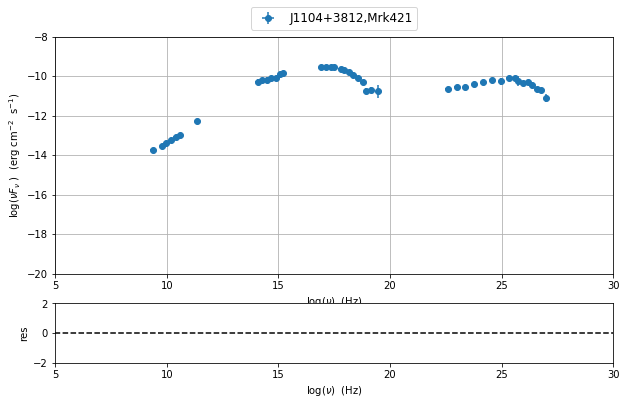
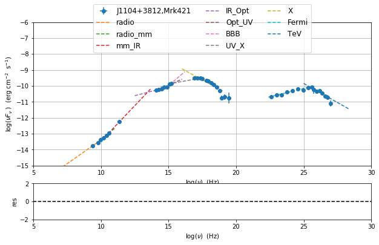
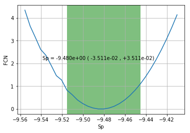
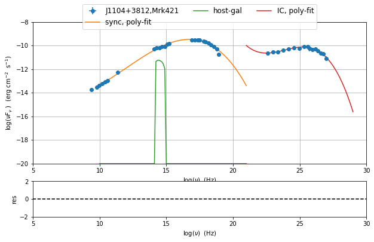

Phenomenological model constraining
===================================

.. code:: ipython3

    import warnings
    warnings.filterwarnings('ignore')
    
    import matplotlib.pylab as plt
    from jetset.test_data_helper import  test_SEDs
    from jetset.data_loader import ObsData,Data
    from jetset.plot_sedfit import PlotSED
    from jetset.test_data_helper import  test_SEDs

.. code:: ipython3

    print(test_SEDs[1])
    data=Data(data_table=test_SEDs[1])

.. parsed-literal::

    /Users/orion/anaconda3/lib/python3.7/site-packages/jetset-1.0.2-py3.7-macosx-10.7-x86_64.egg/jetset/test_data/SEDs_data/SED_MW_Mrk421.dat

.. code:: ipython3

    %matplotlib inline
    sed_data=ObsData(data_table=data)
    sed_data.group_data(bin_width=0.2)
    sed_data.add_systematics(0.2,[10.**6,10.**29])

.. parsed-literal::

    ===================================================================================================================
    
    ***  binning data  ***
    ---> N bins= 89
    ---> bin_widht= 0.2
    ===================================================================================================================
    

.. code:: ipython3

    sed_data.plot_sed()

.. parsed-literal::

    <jetset.plot_sedfit.PlotSED at 0x1520b5f9e8>

.. code:: ipython3

    from jetset.sed_shaper import  SEDShape
    my_shape=SEDShape(sed_data)
    my_shape.eval_indices()
    p=my_shape.plot_indices()
    p.rescale(y_min=-15,y_max=-6)

.. parsed-literal::

    ===================================================================================================================
    
    *** evaluating spectral indices for data ***
    ---> initial range for index radio  set to [6.000000,10.000000]
    ---> range for index radio updated  to [6.000000,10.000000]
    ---> name = radio            range=[6.000 ,10.000] log(Hz)  photon.val=-1.402754e+00, err=1.250721e-01 
    
    ---> initial range for index radio_mm  set to [10.000000,11.000000]
    ---> range for index radio_mm updated  to [10.000000,11.000000]
    ---> name = radio_mm         range=[10.000,11.000] log(Hz)  photon.val=-1.290348e+00, err=3.549105e-02 
    
    ---> initial range for index mm_IR  set to [11.000000,13.000000]
    ---> range for index mm_IR updated  to [10.300000,13.700000]
    ---> name = mm_IR            range=[10.300,13.700] log(Hz)  photon.val=-1.109667e+00, err=5.233777e-02 
    
    ---> initial range for index IR_Opt  set to [13.000000,14.000000]
    ---> range for index IR_Opt updated  to [12.500000,14.500000]
    ---> name = IR_Opt           range=[12.500,14.500] log(Hz)  photon.val=-1.778730e+00, err=8.336743e-02 
    
    ---> initial range for index Opt_UV  set to [14.000000,16.000000]
    ---> range for index Opt_UV updated  to [14.000000,16.000000]
    ---> name = Opt_UV           range=[14.000,16.000] log(Hz)  photon.val=-1.621180e+00, err=4.761704e-02 
    
    ---> initial range for index BBB  set to [15.000000,16.000000]
    ---> range for index BBB updated  to [14.800000,16.200000]
    ---> name = BBB              range=[14.800,16.200] log(Hz)  photon.val=-1.273282e+00, err=1.558347e-01 
    
    ---> initial range for index UV_X  set to [15.000000,17.500000]
    ---> range for index UV_X updated  to [15.000000,17.500000]
    ---> name = UV_X             range=[15.000,17.500] log(Hz)  photon.val=-1.845844e+00, err=1.974302e-02 
    
    ---> initial range for index X  set to [16.000000,19.000000]
    ---> range for index X updated  to [16.000000,19.000000]
    ---> name = X                range=[16.000,19.000] log(Hz)  photon.val=-2.458173e+00, err=7.557519e-02 
    
    ---> initial range for index Fermi  set to [22.380000,25.380000]
    ---> range for index Fermi updated  to [22.380000,25.380000]
    ---> name = Fermi            range=[22.380,25.380] log(Hz)  photon.val=-1.795555e+00, err=1.996362e-02 
    
    ---> initial range for index TeV  set to [25.000000,28.380000]
    ---> range for index TeV updated  to [25.000000,28.380000]
    ---> name = TeV              range=[25.000,28.380] log(Hz)  photon.val=-2.480131e+00, err=7.425494e-02 
    
    ===================================================================================================================
    

.. code:: ipython3

    mm,best_fit=my_shape.sync_fit(check_host_gal_template=True,
                      Ep_start=None,
                      minimizer='minuit',
                      silent=True,
                      fit_range=[10,21])
    
    
    #mm.minimizer.minos_errors()
    #p=my_shape.plot_sahpe_fit()
    #x,y,z,fig,ax=mm.minimizer.draw_contour('Ep','b')
    #x,y,fig,ax=mm.minimizer.draw_profile('Ep')

.. parsed-literal::

    ===================================================================================================================
    
    *** Log-Polynomial fitting of the synchrotron component ***
    ---> first blind fit run,  fit range: [10, 21]
    -------------------------------------------------------------------------------------------------------------------
    model parameters:
     Name             | Type                 | Units            | value         | phys. boundaries              | log
    -------------------------------------------------------------------------------------------------------------------
     b                | curvature            |                  | -1.000000e+00 | [-1.000000e+01,+0.000000e+00] | False 
     c                | third-degree         |                  | -1.000000e+00 | [-1.000000e+01,+1.000000e+01] | False 
     Ep               | peak freq            | Hz               | +1.400000e+01 | [+0.000000e+00,+3.000000e+01] | True 
     Sp               | peak flux            | erg cm^-2 s^-1   | -1.000000e+01 | [-3.000000e+01,+0.000000e+00] | True 
    -------------------------------------------------------------------------------------------------------------------

.. raw:: html

    

.. raw:: html

    <table>
        <tr>
            <td title="Minimum value of function">FCN = 13.927259927350658</td>
            <td title="Total number of call to FCN so far">TOTAL NCALL = 368</td>
            <td title="Number of call in last migrad">NCALLS = 368</td>
        </tr>
        <tr>
            <td title="Estimated distance to minimum">EDM = 3.297347390795456e-05</td>
            <td title="Maximum EDM definition of convergence">GOAL EDM = 1e-05</td>
            <td title="Error def. Amount of increase in FCN to be defined as 1 standard deviation">
            UP = 1.0</td>
        </tr>
    </table>
    <table>
        <tr>
            <td align="center" title="Validity of the migrad call">Valid</td>
            <td align="center" title="Validity of parameters">Valid Param</td>
            <td align="center" title="Is Covariance matrix accurate?">Accurate Covar</td>
            <td align="center" title="Positive definiteness of covariance matrix">PosDef</td>
            <td align="center" title="Was covariance matrix made posdef by adding diagonal element">Made PosDef</td>
        </tr>
        <tr>
            <td align="center" style="background-color:#92CCA6">True</td>
            <td align="center" style="background-color:#92CCA6">True</td>
            <td align="center" style="background-color:#92CCA6">True</td>
            <td align="center" style="background-color:#92CCA6">True</td>
            <td align="center" style="background-color:#92CCA6">False</td>
        </tr>
        <tr>
            <td align="center" title="Was last hesse call fail?">Hesse Fail</td>
            <td align="center" title="Validity of covariance">HasCov</td>
            <td align="center" title="Is EDM above goal EDM?">Above EDM</td>
            <td align="center"></td>
            <td align="center" title="Did last migrad call reach max call limit?">Reach calllim</td>
        </tr>
        <tr>
            <td align="center" style="background-color:#92CCA6">False</td>
            <td align="center" style="background-color:#92CCA6">True</td>
            <td align="center" style="background-color:#92CCA6">False</td>
            <td align="center"></td>
            <td align="center" style="background-color:#92CCA6">False</td>
        </tr>
    </table>

.. raw:: html

    <table>
        <tr>
            <td><a href="#" onclick="$('#GEKDOYapoK').toggle()">+</a></td>
            <td title="Variable name">Name</td>
            <td title="Value of parameter">Value</td>
            <td title="Hesse error">Hesse Error</td>
            <td title="Minos lower error">Minos Error-</td>
            <td title="Minos upper error">Minos Error+</td>
            <td title="Lower limit of the parameter">Limit-</td>
            <td title="Upper limit of the parameter">Limit+</td>
            <td title="Is the parameter fixed in the fit">Fixed?</td>
        </tr>
        <tr>
            <td>0</td>
            <td>par_0</td>
            <td>-0.161899</td>
            <td>0.0109177</td>
            <td></td>
            <td></td>
            <td>-10</td>
            <td>0</td>
            <td>No</td>
        </tr>
        <tr>
            <td>1</td>
            <td>par_1</td>
            <td>-0.0113167</td>
            <td>0.00168747</td>
            <td></td>
            <td></td>
            <td>-10</td>
            <td>10</td>
            <td>No</td>
        </tr>
        <tr>
            <td>2</td>
            <td>par_2</td>
            <td>16.6977</td>
            <td>0.0478326</td>
            <td></td>
            <td></td>
            <td>0</td>
            <td>30</td>
            <td>No</td>
        </tr>
        <tr>
            <td>3</td>
            <td>par_3</td>
            <td>-9.48043</td>
            <td>0.0353935</td>
            <td></td>
            <td></td>
            <td>-30</td>
            <td>0</td>
            <td>No</td>
        </tr>
    </table>
    <pre id="GEKDOYapoK" style="display:none;">
    <textarea rows="14" cols="50" onclick="this.select()" readonly>
    \begin{tabular}{|c|r|r|r|r|r|r|r|c|}
    \hline
     & Name & Value & Hesse Error & Minos Error- & Minos Error+ & Limit- & Limit+ & Fixed?\\
    \hline
    0 & $par_{0}$ & -0.161899 & 0.0109177 &  &  & -10.0 & 0 & No\\
    \hline
    1 & $par_{1}$ & -0.0113167 & 0.00168747 &  &  & -10.0 & 10 & No\\
    \hline
    2 & $par_{2}$ & 16.6977 & 0.0478326 &  &  & 0.0 & 30 & No\\
    \hline
    3 & $par_{3}$ & -9.48043 & 0.0353935 &  &  & -30.0 & 0 & No\\
    \hline
    \end{tabular}
    </textarea>
    </pre>

.. raw:: html

    

.. parsed-literal::

    ---> class:  HSP
    
    -------------------------------------------------------------------------------------------------------------------
    model parameters:
     Name             | Type                 | Units            | value         | phys. boundaries              | log
    -------------------------------------------------------------------------------------------------------------------
     b                | curvature            |                  | -1.618991e-01 | [-1.000000e+01,+0.000000e+00] | False 
     c                | third-degree         |                  | -1.131671e-02 | [-1.000000e+01,+1.000000e+01] | False 
     Ep               | peak freq            | Hz               | +1.669770e+01 | [+0.000000e+00,+3.000000e+01] | True 
     Sp               | peak flux            | erg cm^-2 s^-1   | -9.480428e+00 | [-3.000000e+01,+0.000000e+00] | True 
     nuFnu_p_host     | nuFnu-scale          | erg cm^-2 s^-1   | -9.480428e+00 | [-2.000000e+01,+2.000000e+01] | False 
     nu_scale         | nu-scale             | Hz               | +0.000000e+00 | [-2.000000e+00,+2.000000e+00] | False 
    -------------------------------------------------------------------------------------------------------------------

.. raw:: html

    

.. raw:: html

    <table>
        <tr>
            <td title="Minimum value of function">FCN = 13.683033407102968</td>
            <td title="Total number of call to FCN so far">TOTAL NCALL = 295</td>
            <td title="Number of call in last migrad">NCALLS = 295</td>
        </tr>
        <tr>
            <td title="Estimated distance to minimum">EDM = 0.0001534264450456054</td>
            <td title="Maximum EDM definition of convergence">GOAL EDM = 1e-05</td>
            <td title="Error def. Amount of increase in FCN to be defined as 1 standard deviation">
            UP = 1.0</td>
        </tr>
    </table>
    <table>
        <tr>
            <td align="center" title="Validity of the migrad call">Valid</td>
            <td align="center" title="Validity of parameters">Valid Param</td>
            <td align="center" title="Is Covariance matrix accurate?">Accurate Covar</td>
            <td align="center" title="Positive definiteness of covariance matrix">PosDef</td>
            <td align="center" title="Was covariance matrix made posdef by adding diagonal element">Made PosDef</td>
        </tr>
        <tr>
            <td align="center" style="background-color:#92CCA6">True</td>
            <td align="center" style="background-color:#92CCA6">True</td>
            <td align="center" style="background-color:#92CCA6">True</td>
            <td align="center" style="background-color:#92CCA6">True</td>
            <td align="center" style="background-color:#92CCA6">False</td>
        </tr>
        <tr>
            <td align="center" title="Was last hesse call fail?">Hesse Fail</td>
            <td align="center" title="Validity of covariance">HasCov</td>
            <td align="center" title="Is EDM above goal EDM?">Above EDM</td>
            <td align="center"></td>
            <td align="center" title="Did last migrad call reach max call limit?">Reach calllim</td>
        </tr>
        <tr>
            <td align="center" style="background-color:#92CCA6">False</td>
            <td align="center" style="background-color:#92CCA6">True</td>
            <td align="center" style="background-color:#92CCA6">False</td>
            <td align="center"></td>
            <td align="center" style="background-color:#92CCA6">False</td>
        </tr>
    </table>

.. raw:: html

    <table>
        <tr>
            <td><a href="#" onclick="$('#CgysxQCYor').toggle()">+</a></td>
            <td title="Variable name">Name</td>
            <td title="Value of parameter">Value</td>
            <td title="Hesse error">Hesse Error</td>
            <td title="Minos lower error">Minos Error-</td>
            <td title="Minos upper error">Minos Error+</td>
            <td title="Lower limit of the parameter">Limit-</td>
            <td title="Upper limit of the parameter">Limit+</td>
            <td title="Is the parameter fixed in the fit">Fixed?</td>
        </tr>
        <tr>
            <td>0</td>
            <td>par_0</td>
            <td>-0.163546</td>
            <td>0.0120918</td>
            <td></td>
            <td></td>
            <td>-10</td>
            <td>0</td>
            <td>No</td>
        </tr>
        <tr>
            <td>1</td>
            <td>par_1</td>
            <td>-0.0116345</td>
            <td>0.00190441</td>
            <td></td>
            <td></td>
            <td>-10</td>
            <td>10</td>
            <td>No</td>
        </tr>
        <tr>
            <td>2</td>
            <td>par_2</td>
            <td>16.7129</td>
            <td>0.0571933</td>
            <td></td>
            <td></td>
            <td>0</td>
            <td>30</td>
            <td>No</td>
        </tr>
        <tr>
            <td>3</td>
            <td>par_3</td>
            <td>-9.4829</td>
            <td>0.0363626</td>
            <td></td>
            <td></td>
            <td>-30</td>
            <td>0</td>
            <td>No</td>
        </tr>
        <tr>
            <td>4</td>
            <td>par_4</td>
            <td>-11.2044</td>
            <td>0.838746</td>
            <td></td>
            <td></td>
            <td>-11.4804</td>
            <td>-7.48043</td>
            <td>No</td>
        </tr>
        <tr>
            <td>5</td>
            <td>par_5</td>
            <td>0.0215409</td>
            <td>0.00144813</td>
            <td></td>
            <td></td>
            <td>-0.5</td>
            <td>0.5</td>
            <td>No</td>
        </tr>
    </table>
    <pre id="CgysxQCYor" style="display:none;">
    <textarea rows="18" cols="50" onclick="this.select()" readonly>
    \begin{tabular}{|c|r|r|r|r|r|r|r|c|}
    \hline
     & Name & Value & Hesse Error & Minos Error- & Minos Error+ & Limit- & Limit+ & Fixed?\\
    \hline
    0 & $par_{0}$ & -0.163546 & 0.0120918 &  &  & -10.0 & 0 & No\\
    \hline
    1 & $par_{1}$ & -0.0116345 & 0.00190441 &  &  & -10.0 & 10 & No\\
    \hline
    2 & $par_{2}$ & 16.7129 & 0.0571933 &  &  & 0.0 & 30 & No\\
    \hline
    3 & $par_{3}$ & -9.4829 & 0.0363626 &  &  & -30.0 & 0 & No\\
    \hline
    4 & $par_{4}$ & -11.2044 & 0.838746 &  &  & -11.480428205481736 & -7.48043 & No\\
    \hline
    5 & $par_{5}$ & 0.0215409 & 0.00144813 &  &  & -0.5 & 0.5 & No\\
    \hline
    \end{tabular}
    </textarea>
    </pre>

.. raw:: html

    

.. parsed-literal::

    
    **************************************************************************************************
    Fit report
    
    Model: sync-shape-fit
    -------------------------------------------------------------------------------------------------------------------
    model parameters:
     Name             | Type                 | Units            | value         | phys. boundaries              | log
    -------------------------------------------------------------------------------------------------------------------
     b                | curvature            |                  | -1.635465e-01 | [-1.000000e+01,+0.000000e+00] | False 
     c                | third-degree         |                  | -1.163451e-02 | [-1.000000e+01,+1.000000e+01] | False 
     Ep               | peak freq            | Hz               | +1.671294e+01 | [+0.000000e+00,+3.000000e+01] | True 
     Sp               | peak flux            | erg cm^-2 s^-1   | -9.482903e+00 | [-3.000000e+01,+0.000000e+00] | True 
     nuFnu_p_host     | nuFnu-scale          | erg cm^-2 s^-1   | -1.120444e+01 | [-2.000000e+01,+2.000000e+01] | False 
     nu_scale         | nu-scale             | Hz               | +2.154095e-02 | [-2.000000e+00,+2.000000e+00] | False 
    -------------------------------------------------------------------------------------------------------------------
    
    converged=True
    calls=296
    mesg=
    dof=18
    chisq=13.683082, chisq/red=0.760171 null hypothesis sig=0.749505
    
    best fit pars
    -------------------------------------------------------------------------------------------------------------------
    best-fit parameters:
      Name            | best-fit value| best-fit err +| best-fit err -|start value   | fit boundaries
    -------------------------------------------------------------------------------------------------------------------
     b                | -1.635465e-01 | +1.209179e-02 | #             | -1.618991e-01 | [-1.000000e+01,+0.000000e+00]
     c                | -1.163451e-02 | +1.904406e-03 | #             | -1.131671e-02 | [-1.000000e+01,+1.000000e+01]
     Ep               | +1.671294e+01 | +5.719331e-02 | #             | +1.669770e+01 | [+0.000000e+00,+3.000000e+01]
     Sp               | -9.482903e+00 | +3.636258e-02 | #             | -9.480428e+00 | [-3.000000e+01,+0.000000e+00]
     nuFnu_p_host     | -1.120444e+01 | +8.387457e-01 | #             | -9.480428e+00 | [-1.148043e+01,-7.480428e+00]
     nu_scale         | +2.154095e-02 | +1.448131e-03 | #             | +0.000000e+00 | [-5.000000e-01,+5.000000e-01]
    -------------------------------------------------------------------------------------------------------------------
    **************************************************************************************************
    
    ---> class:  HSP
    ---> sync       nu_p=+1.671294e+01 (err=+5.719331e-02)  nuFnu_p=-9.482903e+00 (err=+3.636258e-02) curv.=-1.635465e-01 (err=+1.209179e-02)

.. code:: ipython3

    x, y, fig,a=mm.minimizer.draw_mnprofile('Sp')

.. code:: ipython3

    my_shape.IC_fit(fit_range=[21,29],minimizer='minuit')
    p=my_shape.plot_sahpe_fit()

.. parsed-literal::

    ===================================================================================================================
    
    *** Log-Polynomial fitting of the IC component ***
    ---> fit range: [21, 29]
    ---> LogCubic fit

.. raw:: html

    

.. raw:: html

    <table>
        <tr>
            <td title="Minimum value of function">FCN = 3.4399462169488366</td>
            <td title="Total number of call to FCN so far">TOTAL NCALL = 214</td>
            <td title="Number of call in last migrad">NCALLS = 214</td>
        </tr>
        <tr>
            <td title="Estimated distance to minimum">EDM = 3.309614688792438e-05</td>
            <td title="Maximum EDM definition of convergence">GOAL EDM = 1e-05</td>
            <td title="Error def. Amount of increase in FCN to be defined as 1 standard deviation">
            UP = 1.0</td>
        </tr>
    </table>
    <table>
        <tr>
            <td align="center" title="Validity of the migrad call">Valid</td>
            <td align="center" title="Validity of parameters">Valid Param</td>
            <td align="center" title="Is Covariance matrix accurate?">Accurate Covar</td>
            <td align="center" title="Positive definiteness of covariance matrix">PosDef</td>
            <td align="center" title="Was covariance matrix made posdef by adding diagonal element">Made PosDef</td>
        </tr>
        <tr>
            <td align="center" style="background-color:#92CCA6">True</td>
            <td align="center" style="background-color:#92CCA6">True</td>
            <td align="center" style="background-color:#92CCA6">True</td>
            <td align="center" style="background-color:#92CCA6">True</td>
            <td align="center" style="background-color:#92CCA6">False</td>
        </tr>
        <tr>
            <td align="center" title="Was last hesse call fail?">Hesse Fail</td>
            <td align="center" title="Validity of covariance">HasCov</td>
            <td align="center" title="Is EDM above goal EDM?">Above EDM</td>
            <td align="center"></td>
            <td align="center" title="Did last migrad call reach max call limit?">Reach calllim</td>
        </tr>
        <tr>
            <td align="center" style="background-color:#92CCA6">False</td>
            <td align="center" style="background-color:#92CCA6">True</td>
            <td align="center" style="background-color:#92CCA6">False</td>
            <td align="center"></td>
            <td align="center" style="background-color:#92CCA6">False</td>
        </tr>
    </table>

.. raw:: html

    <table>
        <tr>
            <td><a href="#" onclick="$('#oWqhhspLtR').toggle()">+</a></td>
            <td title="Variable name">Name</td>
            <td title="Value of parameter">Value</td>
            <td title="Hesse error">Hesse Error</td>
            <td title="Minos lower error">Minos Error-</td>
            <td title="Minos upper error">Minos Error+</td>
            <td title="Lower limit of the parameter">Limit-</td>
            <td title="Upper limit of the parameter">Limit+</td>
            <td title="Is the parameter fixed in the fit">Fixed?</td>
        </tr>
        <tr>
            <td>0</td>
            <td>par_0</td>
            <td>-0.205605</td>
            <td>0.0400183</td>
            <td></td>
            <td></td>
            <td>-10</td>
            <td>0</td>
            <td>No</td>
        </tr>
        <tr>
            <td>1</td>
            <td>par_1</td>
            <td>-0.0499058</td>
            <td>0.015632</td>
            <td></td>
            <td></td>
            <td>-10</td>
            <td>10</td>
            <td>No</td>
        </tr>
        <tr>
            <td>2</td>
            <td>par_2</td>
            <td>25.2592</td>
            <td>0.107537</td>
            <td></td>
            <td></td>
            <td>0</td>
            <td>30</td>
            <td>No</td>
        </tr>
        <tr>
            <td>3</td>
            <td>par_3</td>
            <td>-10.1224</td>
            <td>0.0476766</td>
            <td></td>
            <td></td>
            <td>-30</td>
            <td>0</td>
            <td>No</td>
        </tr>
    </table>
    <pre id="oWqhhspLtR" style="display:none;">
    <textarea rows="14" cols="50" onclick="this.select()" readonly>
    \begin{tabular}{|c|r|r|r|r|r|r|r|c|}
    \hline
     & Name & Value & Hesse Error & Minos Error- & Minos Error+ & Limit- & Limit+ & Fixed?\\
    \hline
    0 & $par_{0}$ & -0.205605 & 0.0400183 &  &  & -10.0 & 0 & No\\
    \hline
    1 & $par_{1}$ & -0.0499058 & 0.015632 &  &  & -10.0 & 10 & No\\
    \hline
    2 & $par_{2}$ & 25.2592 & 0.107537 &  &  & 0.0 & 30 & No\\
    \hline
    3 & $par_{3}$ & -10.1224 & 0.0476766 &  &  & -30.0 & 0 & No\\
    \hline
    \end{tabular}
    </textarea>
    </pre>

.. raw:: html

    

.. parsed-literal::

    
    **************************************************************************************************
    Fit report
    
    Model: IC-shape-fit
    -------------------------------------------------------------------------------------------------------------------
    model parameters:
     Name             | Type                 | Units            | value         | phys. boundaries              | log
    -------------------------------------------------------------------------------------------------------------------
     b                | curvature            |                  | -2.056045e-01 | [-1.000000e+01,+0.000000e+00] | False 
     c                | third-degree         |                  | -4.990579e-02 | [-1.000000e+01,+1.000000e+01] | False 
     Ep               | peak freq            | Hz               | +2.525916e+01 | [+0.000000e+00,+3.000000e+01] | True 
     Sp               | peak flux            | erg cm^-2 s^-1   | -1.012238e+01 | [-3.000000e+01,+0.000000e+00] | True 
    -------------------------------------------------------------------------------------------------------------------
    
    converged=True
    calls=215
    mesg=
    dof=12
    chisq=3.439940, chisq/red=0.286662 null hypothesis sig=0.991560
    
    best fit pars
    -------------------------------------------------------------------------------------------------------------------
    best-fit parameters:
      Name            | best-fit value| best-fit err +| best-fit err -|start value   | fit boundaries
    -------------------------------------------------------------------------------------------------------------------
     b                | -2.056045e-01 | +4.001825e-02 | #             | -1.000000e+00 | [-1.000000e+01,+0.000000e+00]
     c                | -4.990579e-02 | +1.563199e-02 | #             | -1.000000e+00 | [-1.000000e+01,+1.000000e+01]
     Ep               | +2.525916e+01 | +1.075365e-01 | #             | +2.525747e+01 | [+0.000000e+00,+3.000000e+01]
     Sp               | -1.012238e+01 | +4.767656e-02 | #             | -1.000000e+01 | [-3.000000e+01,+0.000000e+00]
    -------------------------------------------------------------------------------------------------------------------
    **************************************************************************************************
    
    ---> IC         nu_p=+2.525916e+01 (err=+1.075365e-01)  nuFnu_p=-1.012238e+01 (err=+4.767656e-02) curv.=-2.056045e-01 (err=+4.001825e-02)
    ===================================================================================================================
    

.. code:: ipython3

    from jetset.obs_constrain import ObsConstrain
    from jetset.model_manager import  FitModel
    from jetset.minimizer import fit_SED
    sed_obspar=ObsConstrain(beaming=25,
                            B_range=[0.01,0.1],
                            distr_e='plc',
                            t_var_sec=3*86400,
                            nu_cut_IR=1E12,
                            SEDShape=my_shape)
    
    
    jet=sed_obspar.constrain_SSC_model(electron_distribution_log_values=True)
    pl=jet.plot_model(sed_data=sed_data)
    pl.rescale(y_min=-15,x_min=7,x_max=29)

.. parsed-literal::

    ===================================================================================================================
    
    ***  constrains parameters from observable ***
    -------------------------------------------------------------------------------------------------------------------
    model parameters:
     Name             | Type                 | Units            | value         | phys. boundaries              | log
    -------------------------------------------------------------------------------------------------------------------
     B                | magnetic_field       | G                | +1.000000e-01 | [+0.000000e+00,No           ] | False 
     N                | electron_density     | cm^-3            | +1.000000e+02 | [+0.000000e+00,No           ] | False 
     R                | region_size          | cm               | +1.569897e+01 | [+0.000000e+00,+3.000000e+01] | True 
     beam_obj         | beaming              |                  | +1.000000e+01 | [+1.000000e+00,No           ] | False 
     gamma_cut        | turn-over-energy     | Lorentz-factor   | +4.000000e+00 | [+0.000000e+00,+8.000000e+00] | True 
     gmax             | high-energy-cut-off  | Lorentz-factor   | +6.000000e+00 | [+0.000000e+00,+1.500000e+01] | True 
     gmin             | low-energy-cut-off   | Lorentz-factor   | +3.010300e-01 | [+0.000000e+00,+5.000000e+00] | True 
     p                | LE_spectral_slope    |                  | +2.000000e+00 | [-1.000000e+01,+1.000000e+01] | False 
     z_cosm           | redshift             |                  | +1.000000e-01 | [+0.000000e+00,No           ] | False 
    -------------------------------------------------------------------------------------------------------------------
    ---> ***  emitting region parameters  ***
    ---> name = beam_obj          type = beaming               units =                   val = +2.500000e+01  phys-bounds = [+1.000000e+00,No           ] islog = False   
    ---> setting par type redshift, corresponding to par z_cosm
    --->  name = z_cosm            type = redshift              units =                   val = +3.080000e-02  phys-bounds = [+0.000000e+00,No           ] islog = False   
    ---> setting par type magnetic_field, corresponding to par B
    --->  name = B                 type = magnetic_field        units = G                 val = +5.500000e-02  phys-bounds = [+0.000000e+00,No           ] islog = False   
    ---> setting par type region_size, corresponding to par R
    --->  name = R                 type = region_size           units = cm                val = +1.727522e+01  phys-bounds = [+0.000000e+00,+3.000000e+01] islog = True   
    ---> *** electron distribution parameters ***
    ---> distribution type:  plc
    ---> s_radio_mm -0.2903478685469203 1.5806957370938406
    ---> s_X 3.916345671601892
    ---> s_Fermi 1.6728884458724482
    ---> s_UV_X 2.6916888822641702
    ---> s_Opt_UV -0.6211804719438732 2.2423609438877463
    ---> s from synch log-log fit -1.0
    ---> s from (s_Fermi + s_UV)/2
    ---> power-law index s, class obj=HSP s chosen is 2.182289
    ---> setting par type LE_spectral_slope, corresponding to par p
    --->  name = p                 type = LE_spectral_slope     units =                   val = +2.182289e+00  phys-bounds = [-1.000000e+01,+1.000000e+01] islog = False   
    ---> gamma_3p_Sync= 1.022835e+05, assuming B=5.500000e-02
    ---> gamma_max=1.624676e+06 from nu_max_Sync= 2.931204e+19, using B=5.500000e-02
    ---> setting par type high-energy-cut-off, corresponding to par gmax
    --->  name = gmax              type = high-energy-cut-off   units = Lorentz-factor    val = +6.210767e+00  phys-bounds = [+0.000000e+00,+1.500000e+01] islog = True   
    
    ---> setting par type low-energy-cut-off, corresponding to par gmin
    --->  name = gmin              type = low-energy-cut-off    units = Lorentz-factor    val = +2.653335e+00  phys-bounds = [+0.000000e+00,+5.000000e+00] islog = True   
    
    ---> setting par type turn-over energy, corresponding to par gamma_cut
    ---> using gamma_3p_Sync= 102283.46132364045
    --->  name = gamma_cut         type = turn-over-energy      units = Lorentz-factor    val = +5.310835e+00  phys-bounds = [+0.000000e+00,+8.000000e+00] islog = True   
    
    nu_p_seed_blob 2128997964680136.8
    COMP FACTOR 1.7624076398261943 25006.178045434473
    ---> gamma_3p_SSCc= %e 161348.59516719714
    ---> setting par type turn-over energy, corresponding to par gamma_cut
    ---> using gamma_3p_SSC= 161348.59516719714
    --->  name = gamma_cut         type = turn-over-energy      units = Lorentz-factor    val = +5.508795e+00  phys-bounds = [+0.000000e+00,+8.000000e+00] islog = True   
    
    
    ---> setting par type electron_density, corresponding to par N
    ---> name = N                 type = electron_density      units = cm^-3             val = +2.280157e-03  phys-bounds = [+0.000000e+00,No           ] islog = False   
    ---> B from nu_p_S=2.210259e-02
    ---> get B from best matching of nu_p_IC
         Best B=1.261809e-02
    ---> setting par type magnetic_field, corresponding to par B
    --->  name = B                 type = magnetic_field        units = G                 val = +1.261809e-02  phys-bounds = [+0.000000e+00,No           ] islog = False   
    
    ---> best B found:  name = B                 type = magnetic_field        units = G                 val = +1.261809e-02  phys-bounds = [+0.000000e+00,No           ] islog = False   
    
    ---> update pars for new B 
    ---> setting par type low-energy-cut-off, corresponding to par gmin
    --->  name = gmin              type = low-energy-cut-off    units = Lorentz-factor    val = +2.973019e+00  phys-bounds = [+0.000000e+00,+5.000000e+00] islog = True   
    
    ---> setting par type low-energy-cut-off, corresponding to par gamma_cut
    ---> using gamma_3p_Sync= 213545.2430143568
    --->  name = gamma_cut         type = turn-over-energy      units = Lorentz-factor    val = +5.630520e+00  phys-bounds = [+0.000000e+00,+8.000000e+00] islog = True   
    ---> gamma_max=3.391964e+06 from nu_max_Sync= 2.931204e+19, using B=1.261809e-02
    ---> setting par type high-energy-cut-off, corresponding to par gmax
    --->  name = gmax              type = high-energy-cut-off   units = Lorentz-factor    val = +6.530451e+00  phys-bounds = [+0.000000e+00,+1.500000e+01] islog = True   
    
    ---> setting par type electron_density, corresponding to par N
    ---> get R from Compoton Dominance (CD)
         Best R=1.012083e+17
    ---> setting par type region_size, corresponding to par R
    --->  name = R                 type = region_size           units = cm                val = +1.700522e+01  phys-bounds = [+0.000000e+00,+3.000000e+01] islog = True   
    
    ---> setting par type electron_density, corresponding to par N
    ---> t_var (days) 1.6110761588550229
    
    show pars
    -------------------------------------------------------------------------------------------------------------------
    model parameters:
     Name             | Type                 | Units            | value         | phys. boundaries              | log
    -------------------------------------------------------------------------------------------------------------------
     B                | magnetic_field       | G                | +1.261809e-02 | [+0.000000e+00,No           ] | False 
     N                | electron_density     | cm^-3            | +9.316000e-02 | [+0.000000e+00,No           ] | False 
     R                | region_size          | cm               | +1.700522e+01 | [+0.000000e+00,+3.000000e+01] | True 
     beam_obj         | beaming              |                  | +2.500000e+01 | [+1.000000e+00,No           ] | False 
     gamma_cut        | turn-over-energy     | Lorentz-factor   | +5.630520e+00 | [+0.000000e+00,+8.000000e+00] | True 
     gmax             | high-energy-cut-off  | Lorentz-factor   | +6.530451e+00 | [+0.000000e+00,+1.500000e+01] | True 
     gmin             | low-energy-cut-off   | Lorentz-factor   | +2.973019e+00 | [+0.000000e+00,+5.000000e+00] | True 
     p                | LE_spectral_slope    |                  | +2.182289e+00 | [-1.000000e+01,+1.000000e+01] | False 
     z_cosm           | redshift             |                  | +3.080000e-02 | [+0.000000e+00,No           ] | False 
    -------------------------------------------------------------------------------------------------------------------
    eval_model
    ===================================================================================================================
    

.. image:: Jet_example_phenom_constr_files/Jet_example_phenom_constr_10_1.png

