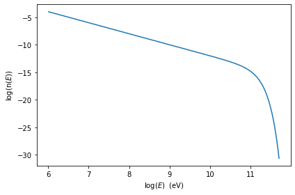

.. _custom_emitters_guide:

custom emitters distribution
============================

The user can bulid custom emitters distributions using the :class:`.EmittersDistribution` class. The following examples show how to implement it

.. code:: ipython3

    from jetset.jet_emitters import EmittersDistribution

you need to define a function that describes your functional form (use
numpy functions to make the code more performant)

.. code:: ipython3

    def distr_func_super_exp(gamma,gamma_cut,s,a):
        return np.power(gamma,-s)*np.exp(-(1/a)*(gamma/gamma_cut)**a)

then you have to link the parmeters in your funtcion to a paramters of
the ``EmittersDistribution`` class.

.. note::
   It is important that each parameter has the proper `par_type` string, if you want to have good results using the phenomenological constraining.
   Have a look at the predefined model to unterstand ho to set the `par_type` string. As a gneral rule
   1) the slope of the power law that starts from 'gmin' should be defined 'LE_spectral_slope'
   2) any slope of the power law above the break should be defined as 'HE_spectral_slope'
   3) valuse of gamma defining the transition from a power law trend toward a curved trend (including cut-off)  should be defined as 'turn-over-energy'
   4) curvature in log-parabolic trends and/or super-exp exponent, should be defined as 'spectral_curvature'

.. code:: ipython3

    n_e_super_exp=EmittersDistribution('super_exp')
    n_e_super_exp.add_par('gamma_cut',par_type='turn-over-energy',val=50000.,vmin=1., vmax=None, unit='lorentz-factor')
    n_e_super_exp.add_par('s',par_type='LE_spectral_slope',val=2.3,vmin=-10., vmax=10, unit='')
    n_e_super_exp.add_par('a',par_type='spectral_curvature',val=1.8,vmin=0., vmax=100., unit='')

now you have to link your defined functional form to the
``EmittersDistribution`` class.

.. code:: ipython3

    n_e_super_exp.set_distr_func(distr_func_super_exp)

parameters can be easily set

.. code:: ipython3

    n_e_super_exp.parameters.s.val=.4
    n_e_super_exp.parameters.s.val=2.0
    n_e_super_exp.parameters.gamma_cut.val=1E5
    n_e_super_exp.normalize=True
    n_e_super_exp.parameters.gmax.val=1E6

.. code:: ipython3

    n_e_super_exp.parameters.show_pars()

.. parsed-literal::

       name         par type           units          val      phys. bound. min phys. bound. max  log  frozen
    --------- ------------------- --------------- ------------ ---------------- ---------------- ----- ------
         gmin  low-energy-cut-off lorentz-factor* 2.000000e+00     1.000000e+00     1.000000e+09 False  False
         gmax high-energy-cut-off lorentz-factor* 1.000000e+06     1.000000e+00     1.000000e+15 False  False
            N    emitters_density         1 / cm3 1.000000e+02     0.000000e+00               -- False  False
    gamma_cut    turn-over-energy lorentz-factor* 1.000000e+05     1.000000e+00               -- False  False
            s   LE_spectral_slope                 2.000000e+00    -1.000000e+01     1.000000e+01 False  False
            a  spectral_curvature                 1.800000e+00     0.000000e+00     1.000000e+02 False  False

.. code:: ipython3

    p=n_e_super_exp.plot()

.. image:: custom_emitters_files/custom_emitters_14_0.png

.. code:: ipython3

    p=n_e_super_exp.plot(energy_unit='eV')

here we define a bkn power-law

.. code:: ipython3

    
    def distr_func_bkn(gamma_break,gamma,s1,s2):
        return np.power(gamma,-s1)*(1.+(gamma/gamma_break))**(-(s2-s1))
    
    n_e_bkn=EmittersDistribution('bkn')
    n_e_bkn.add_par('gamma_break',par_type='turn-over-energy',val=1E3,vmin=1., vmax=None, unit='lorentz-factor')
    n_e_bkn.add_par('s1',par_type='LE_spectral_slope',val=2.5,vmin=-10., vmax=10, unit='')
    n_e_bkn.add_par('s2',par_type='HE_spectral_slope',val=3.2,vmin=-10., vmax=10, unit='')
    n_e_bkn.set_distr_func(distr_func_bkn)
    n_e_bkn.parameters.show_pars()
    n_e_bkn.parameters.s1.val=2.0
    n_e_bkn.parameters.s2.val=3.5
    p=n_e_bkn.plot()

.. parsed-literal::

        name          par type           units          val      phys. bound. min phys. bound. max  log  frozen
    ----------- ------------------- --------------- ------------ ---------------- ---------------- ----- ------
           gmin  low-energy-cut-off lorentz-factor* 2.000000e+00     1.000000e+00     1.000000e+09 False  False
           gmax high-energy-cut-off lorentz-factor* 1.000000e+06     1.000000e+00     1.000000e+15 False  False
              N    emitters_density         1 / cm3 1.000000e+02     0.000000e+00               -- False  False
    gamma_break    turn-over-energy lorentz-factor* 1.000000e+03     1.000000e+00               -- False  False
             s1   LE_spectral_slope                 2.500000e+00    -1.000000e+01     1.000000e+01 False  False
             s2   HE_spectral_slope                 3.200000e+00    -1.000000e+01     1.000000e+01 False  False

.. image:: custom_emitters_files/custom_emitters_17_1.png

passing the custom distribution to the Jet class
------------------------------------------------

.. code:: ipython3

    from jetset.jet_model import Jet
    my_jet=Jet(electron_distribution=n_e_bkn)

.. code:: ipython3

    my_jet.parameters.N.val=5E4
    my_jet.show_model()
    my_jet.IC_nu_size=100
    my_jet.eval()

.. parsed-literal::

    
    -------------------------------------------------------------------------------------------------------------------
    jet model description
    -------------------------------------------------------------------------------------------------------------------
    name: jet_leptonic  
    
    electrons distribution:
     type: bkn  
     gamma energy grid size:  1000
     gmin grid : -1.000000e+00
     gmax grid : -1.000000e+00
     normalization  False
     log-values  False
    
    radiative fields:
     seed photons grid size:  100
     IC emission grid size:  50
     source emissivity lower bound :  1.000000e-120
     spectral components:
       name:Sum, state: on
       name:Sync, state: self-abs
       name:SSC, state: on
    external fields transformation method: blob
    
    SED info:
     nu grid size :200
     nu mix (Hz): 1.000000e+06
     nu max (Hz): 1.000000e+30
    
    flux plot lower bound   :  1.000000e-120
    
        name          par type           units          val      phys. bound. min phys. bound. max  log  frozen
    ----------- ------------------- --------------- ------------ ---------------- ---------------- ----- ------
           gmin  low-energy-cut-off lorentz-factor* 2.000000e+00     1.000000e+00     1.000000e+09 False  False
           gmax high-energy-cut-off lorentz-factor* 1.000000e+06     1.000000e+00     1.000000e+15 False  False
              N    emitters_density         1 / cm3 5.000000e+04     0.000000e+00               -- False  False
    gamma_break    turn-over-energy lorentz-factor* 1.000000e+03     1.000000e+00               -- False  False
             s1   LE_spectral_slope                 2.000000e+00    -1.000000e+01     1.000000e+01 False  False
             s2   HE_spectral_slope                 3.500000e+00    -1.000000e+01     1.000000e+01 False  False
              R         region_size              cm 5.000000e+15     1.000000e+03     1.000000e+30 False  False
            R_H     region_position              cm 1.000000e+17     0.000000e+00               -- False   True
              B      magnetic_field               G 1.000000e-01     0.000000e+00               -- False  False
       beam_obj             beaming Lorentz-factor* 1.000000e+01     1.000000e-04               -- False  False
         z_cosm            redshift                 1.000000e-01     0.000000e+00               -- False  False
    -------------------------------------------------------------------------------------------------------------------

Since as default, the ``Nomralization`` is false, let’s check the actual
number density of particles and conpare it to the parameter ``N``

.. code:: ipython3

    N_particle=np.trapz(n_e_bkn.n_gamma_e,n_e_bkn.gamma_e)
    print('N_particle=',N_particle,'N parameter=',n_e_bkn.parameters.N.val)

.. parsed-literal::

    N_particle= 24556.885796901424 N parameter= 50000.0

.. note::
   N_particle is different from N, because the distribution is not normalized 

.. code:: ipython3

    my_jet.eval()
    p.rescale(y_max=-12)

Now we shitch on the normalization for the emetters distribtuion, and we
keep all the parameters unchanged, including N

.. code:: ipython3

    my_jet.Norm_distr=True
    my_jet.parameters.N.val=5E4
    my_jet.show_model()
    my_jet.IC_nu_size=100
    my_jet.eval()

.. parsed-literal::

    
    -------------------------------------------------------------------------------------------------------------------
    jet model description
    -------------------------------------------------------------------------------------------------------------------
    name: jet_leptonic  
    
    electrons distribution:
     type: bkn  
     gamma energy grid size:  1001
     gmin grid : 2.000000e+00
     gmax grid : 1.000000e+06
     normalization  True
     log-values  False
    
    radiative fields:
     seed photons grid size:  100
     IC emission grid size:  100
     source emissivity lower bound :  1.000000e-120
     spectral components:
       name:Sum, state: on
       name:Sync, state: self-abs
       name:SSC, state: on
    external fields transformation method: blob
    
    SED info:
     nu grid size :200
     nu mix (Hz): 1.000000e+06
     nu max (Hz): 1.000000e+30
    
    flux plot lower bound   :  1.000000e-120
    
        name          par type           units          val      phys. bound. min phys. bound. max  log  frozen
    ----------- ------------------- --------------- ------------ ---------------- ---------------- ----- ------
           gmin  low-energy-cut-off lorentz-factor* 2.000000e+00     1.000000e+00     1.000000e+09 False  False
           gmax high-energy-cut-off lorentz-factor* 1.000000e+06     1.000000e+00     1.000000e+15 False  False
              N    emitters_density         1 / cm3 5.000000e+04     0.000000e+00               -- False  False
    gamma_break    turn-over-energy lorentz-factor* 1.000000e+03     1.000000e+00               -- False  False
             s1   LE_spectral_slope                 2.000000e+00    -1.000000e+01     1.000000e+01 False  False
             s2   HE_spectral_slope                 3.500000e+00    -1.000000e+01     1.000000e+01 False  False
              R         region_size              cm 5.000000e+15     1.000000e+03     1.000000e+30 False  False
            R_H     region_position              cm 1.000000e+17     0.000000e+00               -- False   True
              B      magnetic_field               G 1.000000e-01     0.000000e+00               -- False  False
       beam_obj             beaming Lorentz-factor* 1.000000e+01     1.000000e-04               -- False  False
         z_cosm            redshift                 1.000000e-01     0.000000e+00               -- False  False
    -------------------------------------------------------------------------------------------------------------------

and we check again the actual number density of particles and conpare it
to the parameter N

.. code:: ipython3

    N_particle=np.trapz(n_e_bkn.n_gamma_e,n_e_bkn.gamma_e)
    print('N_particle=',N_particle,'N parameter=',n_e_bkn.parameters.N.val)

.. parsed-literal::

    N_particle= 50000.0 N parameter= 50000.0

.. note::
   N_particle and N now are the same, because the distribution is normalized

.. code:: ipython3

    p=my_jet.plot_model()
    p.rescale(y_max=-12)

.. image:: custom_emitters_files/custom_emitters_30_0.png

