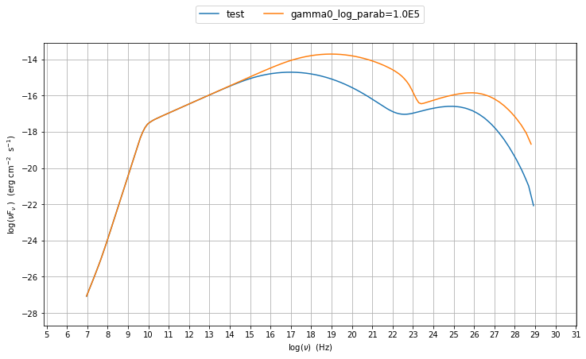

jet\_model module user guide
============================

.. currentmodule:: PrimalCore

.. contents:: :local:

.. toctree::

In this section we describe how to use the module  :mod:`.jet_model`
to buil a model of jet able to reproduce SSC/EC emission processes. 

=============================================

The :mod:`jet_model`  allows to build a jet  model  providing an interface 
to call the BlazarSED code. The BlazarSED code is a numerical 
accurate C code, to evaluate SSC/EC emission processes in a relativistic jet. 
The python wrappper is  built using SWIG. 
A jet can be built using the  the :class:`.Jet` class, istanciating a jet object.

.. code:: ipython2

    import BlazarSEDFit as SEDFit
    
    """
    create a Jet  object, named "test" , with a "lppl" electron  distribution
    """
    myJet=SEDFit.Jet('test','lppl')
    
    myJet.parameters.show_pars()
    
    myJet.eval()

.. parsed-literal::

    directory .//test_BalzarSED_prod/ already existing
    removing existing dir
    the directory .//test_BalzarSED_prod/ has been created
    --------------------------------------------------------------------------------------------------------------
    model parameters:
     Name             | Type                     | Units            | value         | phys. boundaries
    --------------------------------------------------------------------------------------------------------------
     gmax             | high-energy-cut-off      | Lorentz-factor   | +1.000000e+08 | [+1.000000e+00,No           ]  
     gmin             | low-energy-cut-off       | Lorentz-factor   | +2.000000e+00 | [+1.000000e+00,No           ]  
     N                | electron_density         | cm^-3            | +1.000000e+02 | [+0.000000e+00,No           ]  
     s                | LE_spectral_slope        |                  | +2.000000e+00 | [-1.000000e+01,+1.000000e+01]  
     r                | spectral_curvature       |                  | +4.000000e-01 | [-1.000000e+01,+1.000000e+01]  
     gamma0_log_parab | turn-over-energy         | Lorentz-factor   | +1.000000e+04 | [+1.000000e+00,No           ]  
     z_cosm           | redshift                 |                  | +1.000000e-01 | [+0.000000e+00,No           ]  
     B                | magnetic_field           | G                | +1.000000e-01 | [+0.000000e+00,No           ]  
     R                | region_size              | cm               | +3.000000e+15 | [+0.000000e+00,No           ]  
     beam_obj         | beaming                  |                  | +1.000000e+01 | [+1.000000e+00,No           ]  
    --------------------------------------------------------------------------------------------------------------
    ('fill name', 'Sum')
    ('fill name', 'Sync')
    ('fill name', 'SSC')

.. code:: ipython2

    myPlot=SEDFit.Plot()
    
    myPlot.add_model_plot(myJet,autoscale=True)
    
    myPlot.save('jet.png')

.. parsed-literal::

    running PyLab in interactive mode

.. image:: Jet_example_files/Jet_example_5_1.png

.. code:: ipython2

    """
    chante the value of the 'gamma0_log_parab' parameter
    """
    myJet.set_par('gamma0_log_parab',val=1.0E5)
    
    myJet.eval()
    
    myPlot.add_model_plot(myJet,label='gamma0_log_parab=1.0E5')
    
    myPlot.save('jet1.png')

.. parsed-literal::

    directory .//test_BalzarSED_prod/ already existing
    removing existing dir
    the directory .//test_BalzarSED_prod/ has been created
    --------------------------------------------------------------------------------------------------------------
    model parameters:
     Name             | Type                     | Units            | value         | phys. boundaries
    --------------------------------------------------------------------------------------------------------------
     gmax             | high-energy-cut-off      | Lorentz-factor   | +1.000000e+08 | [+1.000000e+00,No           ]  
     gmin             | low-energy-cut-off       | Lorentz-factor   | +2.000000e+00 | [+1.000000e+00,No           ]  
     N                | electron_density         | cm^-3            | +1.000000e+02 | [+0.000000e+00,No           ]  
     s                | LE_spectral_slope        |                  | +2.000000e+00 | [-1.000000e+01,+1.000000e+01]  
     r                | spectral_curvature       |                  | +4.000000e-01 | [-1.000000e+01,+1.000000e+01]  
     gamma0_log_parab | turn-over-energy         | Lorentz-factor   | +1.000000e+04 | [+1.000000e+00,No           ]  
     z_cosm           | redshift                 |                  | +1.000000e-01 | [+0.000000e+00,No           ]  
     B                | magnetic_field           | G                | +1.000000e-01 | [+0.000000e+00,No           ]  
     R                | region_size              | cm               | +3.000000e+15 | [+0.000000e+00,No           ]  
     beam_obj         | beaming                  |                  | +1.000000e+01 | [+1.000000e+00,No           ]  
    --------------------------------------------------------------------------------------------------------------
    ('fill name', 'Sum')
    ('fill name', 'Sync')
    ('fill name', 'SSC')
    running PyLab in interactive mode
    ('fill name', 'Sum')
    ('fill name', 'Sync')
    ('fill name', 'SSC')

