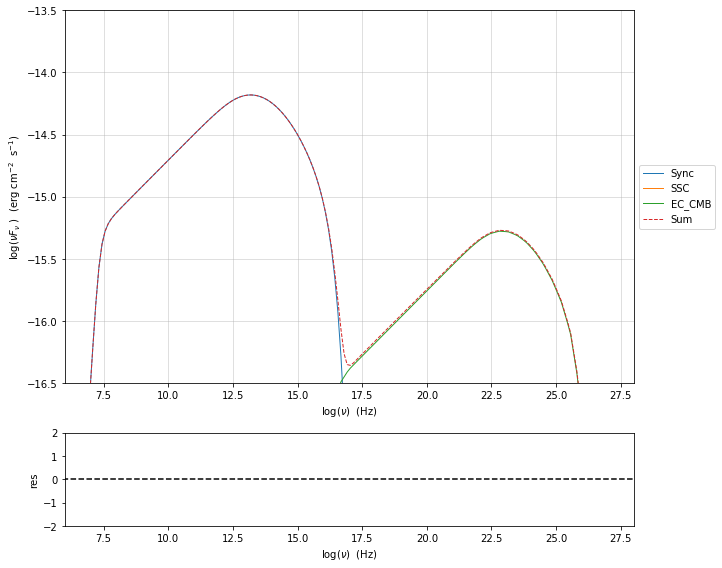
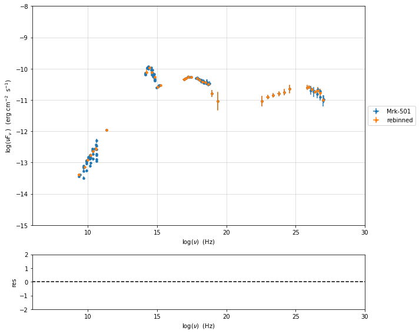
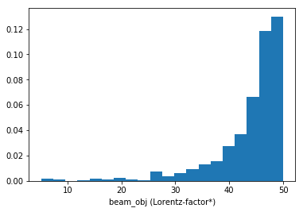
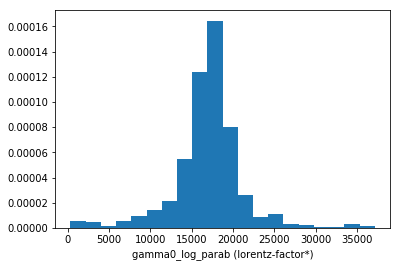
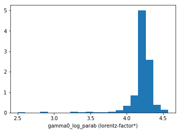
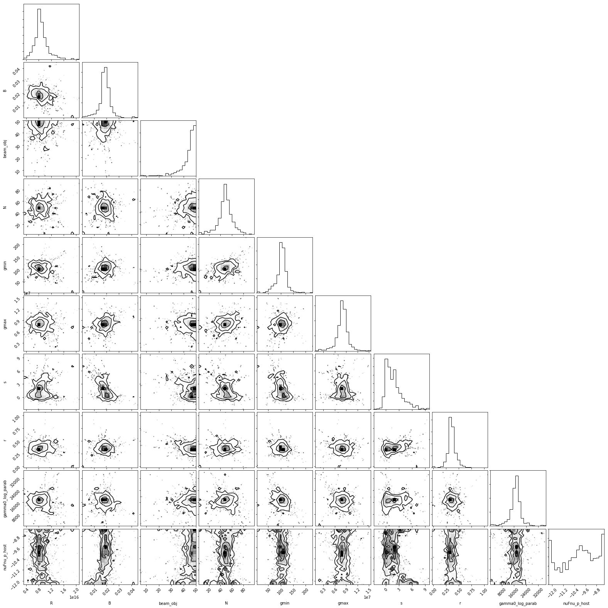

# Quick start fro v.1.1.0

This is a quick start tutorial, please read the full [userguide](https://jetset.readthedocs.io/en/1.1.0/user_guide/user_guide.html)

# Basic features and SSC

for more info  [ssc section of the userguide](https://jetset.readthedocs.io/en/1.1.0/user_guide/jet_model_phys_SSC/Jet_example_phys_SSC.html)

## Basic setup


```python
from jetset.jet_model import Jet
my_jet=Jet(name='test',electron_distribution='lppl',)
```


```python
Jet.available_electron_distributions()

```

    lp: log-parabola
    pl: powerlaw
    lppl: log-parabola with low-energy powerlaw branch
    lpep: log-parabola defined by peak energy
    plc: powerlaw with cut-off
    bkn: broken powerlaw
    spitkov: spitkov
    lppl_pile_up: log-parabola with low-energy powerlaw branch and pile-up
    bkn_pile_up: broken powerlaw and pileup


```python
my_jet.show_pars()

```

          name             par type           units             val         phys. bound. min  phys. bound. max   log  frozen
    ---------------- ------------------- --------------- ------------------ ---------------- ------------------ ----- ------
                   N    electron_density         1 / cm3              100.0              0.0               None False  False
                gmin  low-energy-cut-off lorentz-factor*                2.0              1.0       1000000000.0 False  False
                gmax high-energy-cut-off lorentz-factor*          1000000.0              1.0 1000000000000000.0 False  False
                   s   LE_spectral_slope                                2.0            -10.0               10.0 False  False
                   r  spectral_curvature                                0.4            -15.0               15.0 False  False
    gamma0_log_parab    turn-over-energy lorentz-factor*            10000.0              1.0       1000000000.0 False  False
                   R         region_size              cm 5000000000000000.0           1000.0              1e+30 False  False
                 R_H     region_position              cm              1e+17              0.0               None False   True
                   B      magnetic_field               G                0.1              0.0               None False  False
            beam_obj             beaming Lorentz-factor*               10.0           0.0001               None False  False
              z_cosm            redshift                                0.1              0.0               None False  False


```python
my_jet.parameters.par_table

```


<i>Table length=11</i>
<table id="table47644629008" class="table-striped table-bordered table-condensed">
<thead><tr><th>name</th><th>par type</th><th>units</th><th>val</th><th>phys. bound. min</th><th>phys. bound. max</th><th>log</th><th>frozen</th></tr></thead>
<thead><tr><th>str16</th><th>str19</th><th>object</th><th>float64</th><th>float64</th><th>object</th><th>bool</th><th>bool</th></tr></thead>
<tr><td>N</td><td>electron_density</td><td>1 / cm3</td><td>100.0</td><td>0.0</td><td>None</td><td>False</td><td>False</td></tr>
<tr><td>gmin</td><td>low-energy-cut-off</td><td>lorentz-factor*</td><td>2.0</td><td>1.0</td><td>1000000000.0</td><td>False</td><td>False</td></tr>
<tr><td>gmax</td><td>high-energy-cut-off</td><td>lorentz-factor*</td><td>1000000.0</td><td>1.0</td><td>1000000000000000.0</td><td>False</td><td>False</td></tr>
<tr><td>s</td><td>LE_spectral_slope</td><td></td><td>2.0</td><td>-10.0</td><td>10.0</td><td>False</td><td>False</td></tr>
<tr><td>r</td><td>spectral_curvature</td><td></td><td>0.4</td><td>-15.0</td><td>15.0</td><td>False</td><td>False</td></tr>
<tr><td>gamma0_log_parab</td><td>turn-over-energy</td><td>lorentz-factor*</td><td>10000.0</td><td>1.0</td><td>1000000000.0</td><td>False</td><td>False</td></tr>
<tr><td>R</td><td>region_size</td><td>cm</td><td>5000000000000000.0</td><td>1000.0</td><td>1e+30</td><td>False</td><td>False</td></tr>
<tr><td>R_H</td><td>region_position</td><td>cm</td><td>1e+17</td><td>0.0</td><td>None</td><td>False</td><td>True</td></tr>
<tr><td>B</td><td>magnetic_field</td><td>G</td><td>0.1</td><td>0.0</td><td>None</td><td>False</td><td>False</td></tr>
<tr><td>beam_obj</td><td>beaming</td><td>Lorentz-factor*</td><td>10.0</td><td>0.0001</td><td>None</td><td>False</td><td>False</td></tr>
<tr><td>z_cosm</td><td>redshift</td><td></td><td>0.1</td><td>0.0</td><td>None</td><td>False</td><td>False</td></tr>
</table>


```python
my_jet.show_model()

```

    
    -------------------------------------------------------------------------------------------------------------------
    jet model description
    -------------------------------------------------------------------------------------------------------------------
    name: test  
    
    electron distribution:
     type: lppl  
     electron energy grid size:  1001
     gmin grid : 2.000000e+00
     gmax grid : 1.000000e+06
     normalization  True
     log-values  False
    
    radiative fields:
     seed photons grid size:  100
     IC emission grid size:  50
     source emissivity lower bound :  1.000000e-120
     spectral components:
       name:Sum, state: on
       name:Sync, state: self-abs
       name:SSC, state: on
    external fields transformation method: blob
    
    SED info:
     nu grid size :200
     nu mix (Hz): 1.000000e+06
     nu max (Hz): 1.000000e+30
    
    flux plot lower bound   :  1.000000e-30
    
          name             par type           units             val         phys. bound. min  phys. bound. max   log  frozen
    ---------------- ------------------- --------------- ------------------ ---------------- ------------------ ----- ------
                   N    electron_density         1 / cm3              100.0              0.0               None False  False
                gmin  low-energy-cut-off lorentz-factor*                2.0              1.0       1000000000.0 False  False
                gmax high-energy-cut-off lorentz-factor*          1000000.0              1.0 1000000000000000.0 False  False
                   s   LE_spectral_slope                                2.0            -10.0               10.0 False  False
                   r  spectral_curvature                                0.4            -15.0               15.0 False  False
    gamma0_log_parab    turn-over-energy lorentz-factor*            10000.0              1.0       1000000000.0 False  False
                   R         region_size              cm 5000000000000000.0           1000.0              1e+30 False  False
                 R_H     region_position              cm              1e+17              0.0               None False   True
                   B      magnetic_field               G                0.1              0.0               None False  False
            beam_obj             beaming Lorentz-factor*               10.0           0.0001               None False  False
              z_cosm            redshift                                0.1              0.0               None False  False
    -------------------------------------------------------------------------------------------------------------------


## Setting the parameters

assume you want to change some of the parameters in your model, you can use two methods:

using the `set_par()` method


```python
my_jet.set_par('B',val=0.2)
my_jet.set_par('gamma0_log_parab',val=5E3)
my_jet.set_par('gmin',val=1E2)
my_jet.set_par('gmax',val=1E8)
my_jet.set_par('R',val=1E15)
my_jet.set_par('N',val=1E3)
```

or you can access directly the paramter 


```python
my_jet.parameters.B.val=0.2
my_jet.parameters.r.val=0.4
```

## Investigating the electron distribution


```python
my_jet.show_electron_distribution()

```

    -------------------------------------------------------------------------------------------------------------------
    electron distribution:
     type: lppl  
     electron energy grid size:  1001
     gmin grid : 2.000000e+00
     gmax grid : 1.000000e+06
     normalization  True
     log-values  False
    
          name             par type           units             val         phys. bound. min  phys. bound. max   log  frozen
    ---------------- ------------------- --------------- ------------------ ---------------- ------------------ ----- ------
                   B      magnetic_field               G                0.2              0.0               None False  False
                   N    electron_density         1 / cm3             1000.0              0.0               None False  False
                   R         region_size              cm 1000000000000000.0           1000.0              1e+30 False  False
                 R_H     region_position              cm              1e+17              0.0               None False   True
            beam_obj             beaming Lorentz-factor*               10.0           0.0001               None False  False
    gamma0_log_parab    turn-over-energy lorentz-factor*             5000.0              1.0       1000000000.0 False  False
                gmax high-energy-cut-off lorentz-factor*        100000000.0              1.0 1000000000000000.0 False  False
                gmin  low-energy-cut-off lorentz-factor*              100.0              1.0       1000000000.0 False  False
                   r  spectral_curvature                                0.4            -15.0               15.0 False  False
                   s   LE_spectral_slope                                2.0            -10.0               10.0 False  False
              z_cosm            redshift                                0.1              0.0               None False  False


```python
p=my_jet.electron_distribution.plot()

```


```python
p=my_jet.electron_distribution.plot3p()

```


```python
import numpy as np
p=None
for r in np.linspace(0.3,1,10):
    my_jet.parameters.r.val=r
    if p is None:
        p=my_jet.electron_distribution.plot3p()
    else:
        p=my_jet.electron_distribution.plot3p(p)
```


## Using log values for electron distribution parameters


```python
my_jet=Jet(name='test',electron_distribution='lppl',electron_distribution_log_values=True)
my_jet.show_model()
```

    
    -------------------------------------------------------------------------------------------------------------------
    jet model description
    -------------------------------------------------------------------------------------------------------------------
    name: test  
    
    electron distribution:
     type: lppl  
     electron energy grid size:  1001
     gmin grid : 2.000000e+00
     gmax grid : 1.000000e+06
     normalization  True
     log-values  True
    
    radiative fields:
     seed photons grid size:  100
     IC emission grid size:  50
     source emissivity lower bound :  1.000000e-120
     spectral components:
       name:Sum, state: on
       name:Sync, state: self-abs
       name:SSC, state: on
    external fields transformation method: blob
    
    SED info:
     nu grid size :200
     nu mix (Hz): 1.000000e+06
     nu max (Hz): 1.000000e+30
    
    flux plot lower bound   :  1.000000e-30
    
          name             par type           units             val         phys. bound. min phys. bound. max  log  frozen
    ---------------- ------------------- --------------- ------------------ ---------------- ---------------- ----- ------
                   N    electron_density         1 / cm3              100.0              0.0             None False  False
                gmin  low-energy-cut-off lorentz-factor* 0.3010299956639812              0.0              9.0  True  False
                gmax high-energy-cut-off lorentz-factor*                6.0              0.0             15.0  True  False
                   s   LE_spectral_slope                                2.0            -10.0             10.0 False  False
                   r  spectral_curvature                                0.4            -15.0             15.0 False  False
    gamma0_log_parab    turn-over-energy lorentz-factor*                4.0              0.0              9.0  True  False
                   R         region_size              cm 5000000000000000.0           1000.0            1e+30 False  False
                 R_H     region_position              cm              1e+17              0.0             None False   True
                   B      magnetic_field               G                0.1              0.0             None False  False
            beam_obj             beaming Lorentz-factor*               10.0           0.0001             None False  False
              z_cosm            redshift                                0.1              0.0             None False  False
    -------------------------------------------------------------------------------------------------------------------


## Evaluate and plot the model


```python
my_jet.eval()

```


```python
my_plot=my_jet.plot_model()
my_plot.rescale(y_max=-13,y_min=-17.5,x_min=8)
```


you can change the size of the grid for the IC frequencies (this will increase the computation time)


```python
my_jet.set_IC_nu_size(100)

```


```python
my_jet.eval()
my_plot=my_jet.plot_model()
my_plot.rescale(y_max=-13,y_min=-17.5,x_min=8)
```


## Plotting in the src frame (istropic luminosities)


```python
my_plot=my_jet.plot_model(frame='src')
my_plot.rescale(y_max=43,y_min=38,x_min=8)
```


## Comparing how the model reacts as we change the parameters


```python
my_jet=Jet(name='test',electron_distribution='lppl',)
my_jet.set_par('B',val=0.2)
my_jet.set_par('gamma0_log_parab',val=5E3)
my_jet.set_par('gmin',val=1E2)
my_jet.set_par('gmax',val=1E8)
my_jet.set_par('R',val=10**14.5)
my_jet.set_par('N',val=1E3)

my_jet.parameters.gamma0_log_parab.val=1E4
my_jet.eval()
my_plot=my_jet.plot_model(label='gamma0_log_parab=1E4',comp='Sum')
my_jet.set_par('gamma0_log_parab',val=1.0E5)
my_jet.eval()
my_plot=my_jet.plot_model(my_plot,label='gamma0_log_parab=1E5',comp='Sum')
my_plot.rescale(y_max=-13,y_min=-17.5,x_min=8)
```


## Saving images


```python
my_plot.save('jet1.png')

```

## Saving and loading models


```python
my_jet.save_model('test_model.dat')

```


```python
my_jet=Jet.load_model('test_model.dat')
```

          name             par type           units             val         phys. bound. min  phys. bound. max   log  frozen
    ---------------- ------------------- --------------- ------------------ ---------------- ------------------ ----- ------
                   R         region_size              cm 316227766016837.94           1000.0              1e+30 False  False
                 R_H     region_position              cm              1e+17              0.0               None False   True
                   B      magnetic_field               G                0.2              0.0               None False  False
            beam_obj             beaming Lorentz-factor*               10.0           0.0001               None False  False
              z_cosm            redshift                                0.1              0.0               None False  False
                   N    electron_density         1 / cm3             1000.0              0.0               None False  False
                gmin  low-energy-cut-off lorentz-factor*              100.0              1.0       1000000000.0 False  False
                gmax high-energy-cut-off lorentz-factor*        100000000.0              1.0 1000000000000000.0 False  False
                   s   LE_spectral_slope                                2.0            -10.0               10.0 False  False
                   r  spectral_curvature                                0.4            -15.0               15.0 False  False
    gamma0_log_parab    turn-over-energy lorentz-factor*           100000.0              1.0       1000000000.0 False  False


```python
my_plot=my_jet.plot_model(frame='src')
my_plot.rescale(y_max=43,y_min=38,x_min=8)
```


## Switching on/off the particle distribution normalization


\begin{aligned}
\int
\end{aligned}

As default the electron distributions are normalized, i.e. are multiplied by a constant ``N_0``, in such a way that :

\begin{aligned}
\int_{\gamma_{min}}^{\gamma_{max}} n(\gamma) d\gamma =1
\end{aligned}
it means the the value `N`, refers to the actual density of emitters.
If you want to chance this behavior, you can start looking at the sate of `Norm_distr` flag with the following command


```python
my_jet.Norm_distr
```


    1


and then you can switch off the normalization withe command


```python
my_jet.switch_Norm_distr_OFF()
```

OR


```python
my_jet.Norm_distr=0
```

or set back the normalization on with


```python
my_jet.switch_Norm_distr_ON()
```

OR


```python
my_jet.Norm_distr=1
```

## Setting the number density of emitters fron observed fluxes or luminosities

It is possible to set the vlue of `N` in order that the observed synchrotron flux at a given frequency matches a desired value. 
For example, assume that we wish to set `N` in order that  the synchrotron flux at $10^{15}$ Hz is exactly matching the desired value of $10^{-14}$ ergs cm-2 s-1. We can accomplish this by using the method `Jet.get_par_by_name()` as follows: 


```python
my_jet=Jet(name='test',electron_distribution='lppl')
my_jet.set_N_from_nuFnu(nuFnu_obs=1E-14,nu_obs=1E15)
```


```python
my_jet.eval()
my_plot=my_jet.plot_model(label='set N from F=1E-14')
my_plot.rescale(y_max=-13,y_min=-17.5,x_min=8)
```


Alternatively, the value of N  can be obtained using the rest-frame luminosity and  frequency, using the method `Jet.set_N_from_nuLnu()`


```python
my_jet.set_N_from_nuLnu(nuLnu_src=1E43,nu_src=1E15)
```

where `L_0` is the source rest-frame istropic luminosity in erg/s at the rest-frame frequency ``nu_0`` in Hz.


## setting the beaming factor and expression

It is possible to set the beaming factor according to the relativistic BulkFactor and viewing angle, this can be done by setting the ``beaming_expr`` kw in the Jet constructor, possible choices are

* `delta` to provide directly the beaming factor (default)
* `bulk_theta` to provide the BulkFactor and the jet  viewing angle 


```python
my_jet=Jet(name='test',electron_distribution='lppl',beaming_expr='bulk_theta')
my_jet.parameters.show_pars()
my_jet.get_beaming()

```

          name             par type           units             val         phys. bound. min  phys. bound. max   log  frozen
    ---------------- ------------------- --------------- ------------------ ---------------- ------------------ ----- ------
                   N    electron_density         1 / cm3              100.0              0.0               None False  False
                gmin  low-energy-cut-off lorentz-factor*                2.0              1.0       1000000000.0 False  False
                gmax high-energy-cut-off lorentz-factor*          1000000.0              1.0 1000000000000000.0 False  False
                   s   LE_spectral_slope                                2.0            -10.0               10.0 False  False
                   r  spectral_curvature                                0.4            -15.0               15.0 False  False
    gamma0_log_parab    turn-over-energy lorentz-factor*            10000.0              1.0       1000000000.0 False  False
                   R         region_size              cm 5000000000000000.0           1000.0              1e+30 False  False
                 R_H     region_position              cm              1e+17              0.0               None False   True
                   B      magnetic_field               G                0.1              0.0               None False  False
               theta   jet-viewing-angle             deg                0.1              0.0               None False  False
          BulkFactor     jet-bulk-factor Lorentz-factor*               10.0              1.0               None False  False
              z_cosm            redshift                                0.1              0.0               None False  False


    19.943844732554165


```python
my_jet=Jet(name='test',electron_distribution='lppl',beaming_expr='delta')
my_jet.parameters.beam_obj.val=10
```


```python
my_jet.parameters.show_pars()
my_jet.get_beaming()
```

          name             par type           units             val         phys. bound. min  phys. bound. max   log  frozen
    ---------------- ------------------- --------------- ------------------ ---------------- ------------------ ----- ------
                   N    electron_density         1 / cm3              100.0              0.0               None False  False
                gmin  low-energy-cut-off lorentz-factor*                2.0              1.0       1000000000.0 False  False
                gmax high-energy-cut-off lorentz-factor*          1000000.0              1.0 1000000000000000.0 False  False
                   s   LE_spectral_slope                                2.0            -10.0               10.0 False  False
                   r  spectral_curvature                                0.4            -15.0               15.0 False  False
    gamma0_log_parab    turn-over-energy lorentz-factor*            10000.0              1.0       1000000000.0 False  False
                   R         region_size              cm 5000000000000000.0           1000.0              1e+30 False  False
                 R_H     region_position              cm              1e+17              0.0               None False   True
                   B      magnetic_field               G                0.1              0.0               None False  False
            beam_obj             beaming Lorentz-factor*               10.0           0.0001               None False  False
              z_cosm            redshift                                0.1              0.0               None False  False


    10.0


## Accessing individual spectral components


```python
my_jet.eval()
my_jet.list_spectral_components()

```

    Sum
    Sync
    SSC


```python
my_jet.spectral_components.Sync.SED.nuFnu
```


$[1 \times 10^{-120},~1 \times 10^{-120},~1 \times 10^{-120},~\dots,~1 \times 10^{-120},~1 \times 10^{-120},~1 \times 10^{-120}] \; \mathrm{\frac{erg}{s\,cm^{2}}}$


```python
my_jet.spectral_components.build_table(restframe='obs')
t_obs=my_jet.spectral_components.table
```


```python
t_obs
```


<i>Table length=200</i>
<table id="table47647937616" class="table-striped table-bordered table-condensed">
<thead><tr><th>nu</th><th>Sum</th><th>Sync</th><th>SSC</th></tr></thead>
<thead><tr><th>Hz</th><th>erg / (cm2 s)</th><th>erg / (cm2 s)</th><th>erg / (cm2 s)</th></tr></thead>
<thead><tr><th>float64</th><th>float64</th><th>float64</th><th>float64</th></tr></thead>
<tr><td>1000000.0</td><td>1e-120</td><td>1e-120</td><td>1e-120</td></tr>
<tr><td>1318256.7385564074</td><td>1e-120</td><td>1e-120</td><td>1e-120</td></tr>
<tr><td>1737800.8287493763</td><td>1e-120</td><td>1e-120</td><td>1e-120</td></tr>
<tr><td>2290867.6527677746</td><td>1e-120</td><td>1e-120</td><td>1e-120</td></tr>
<tr><td>3019951.720402019</td><td>1e-120</td><td>1e-120</td><td>1e-120</td></tr>
<tr><td>3981071.7055349695</td><td>1e-120</td><td>1e-120</td><td>1e-120</td></tr>
<tr><td>5248074.602497723</td><td>1e-120</td><td>1e-120</td><td>1e-120</td></tr>
<tr><td>6918309.709189363</td><td>1e-120</td><td>1e-120</td><td>1e-120</td></tr>
<tr><td>9120108.393559096</td><td>1.163505761994677e-27</td><td>1.163505761994677e-27</td><td>1e-120</td></tr>
<tr><td>...</td><td>...</td><td>...</td><td>...</td></tr>
<tr><td>6.309573444801943e+28</td><td>1e-120</td><td>1e-120</td><td>1e-120</td></tr>
<tr><td>8.317637711026744e+28</td><td>1e-120</td><td>1e-120</td><td>1e-120</td></tr>
<tr><td>1.0964781961431829e+29</td><td>1e-120</td><td>1e-120</td><td>1e-120</td></tr>
<tr><td>1.445439770745928e+29</td><td>1e-120</td><td>1e-120</td><td>1e-120</td></tr>
<tr><td>1.905460717963252e+29</td><td>1e-120</td><td>1e-120</td><td>1e-120</td></tr>
<tr><td>2.511886431509572e+29</td><td>1e-120</td><td>1e-120</td><td>1e-120</td></tr>
<tr><td>3.311311214825908e+29</td><td>1e-120</td><td>1e-120</td><td>1e-120</td></tr>
<tr><td>4.365158322401665e+29</td><td>1e-120</td><td>1e-120</td><td>1e-120</td></tr>
<tr><td>5.75439937337159e+29</td><td>1e-120</td><td>1e-120</td><td>1e-120</td></tr>
<tr><td>7.585775750291821e+29</td><td>1e-120</td><td>1e-120</td><td>1e-120</td></tr>
</table>


for more details (how to get spectral components for  `src` and `obs` frame, or how to use astropy units for units conversion see for [userguide section of spectral components](https://jetset.readthedocs.io/en/latest/user_guide/jet_model_phys_SSC/Jet_example_phys_SSC.html#accessing-individual-spectral-components)

## Energetic report


```python
my_jet.energetic_report(verbose=False)
my_jet.energetic_report_table

```


<i>Table length=33</i>
<table id="table103508411984" class="table-striped table-bordered table-condensed">
<thead><tr><th>name</th><th>type</th><th>units</th><th>val</th></tr></thead>
<thead><tr><th>str13</th><th>str29</th><th>object</th><th>float64</th></tr></thead>
<tr><td>U_e</td><td>Energy dens. blob rest. frame</td><td>erg / cm3</td><td>0.0017404342430246782</td></tr>
<tr><td>U_p</td><td>Energy dens. blob rest. frame</td><td>erg / cm3</td><td>0.015032764261</td></tr>
<tr><td>U_B</td><td>Energy dens. blob rest. frame</td><td>erg / cm3</td><td>0.00039788735772973844</td></tr>
<tr><td>U_Synch</td><td>Energy dens. blob rest. frame</td><td>erg / cm3</td><td>5.506769532122052e-05</td></tr>
<tr><td>U_Synch_DRF</td><td>Energy dens. disk rest. frame</td><td>erg / cm3</td><td>0.5506769532122052</td></tr>
<tr><td>U_Disk</td><td>Energy dens. blob rest. frame</td><td>erg / cm3</td><td>0.0</td></tr>
<tr><td>U_BLR</td><td>Energy dens. blob rest. frame</td><td>erg / cm3</td><td>0.0</td></tr>
<tr><td>U_DT</td><td>Energy dens. blob rest. frame</td><td>erg / cm3</td><td>0.0</td></tr>
<tr><td>U_CMB</td><td>Energy dens. blob rest. frame</td><td>erg / cm3</td><td>0.0</td></tr>
<tr><td>U_Disk_DRF</td><td>Energy dens. disk rest. frame</td><td>erg / cm3</td><td>0.0</td></tr>
<tr><td>...</td><td>...</td><td>...</td><td>...</td></tr>
<tr><td>jet_L_EC_BLR</td><td>jet Lum.</td><td>erg / s</td><td>0.0</td></tr>
<tr><td>jet_L_EC_DT</td><td>jet Lum.</td><td>erg / s</td><td>0.0</td></tr>
<tr><td>jet_L_EC_CMB</td><td>jet Lum.</td><td>erg / s</td><td>0.0</td></tr>
<tr><td>jet_L_PP</td><td>jet Lum.</td><td>erg / s</td><td>0.0</td></tr>
<tr><td>jet_L_rad</td><td>jet Lum.</td><td>erg / s</td><td>4.4176328589197945e+39</td></tr>
<tr><td>jet_L_kin</td><td>jet Lum.</td><td>erg / s</td><td>4.043042849486075e+42</td></tr>
<tr><td>jet_L_tot</td><td>jet Lum.</td><td>erg / s</td><td>4.047460482344995e+42</td></tr>
<tr><td>jet_L_e</td><td>jet Lum.</td><td>erg / s</td><td>4.097964612089291e+41</td></tr>
<tr><td>jet_L_B</td><td>jet Lum.</td><td>erg / s</td><td>9.368514312500004e+40</td></tr>
<tr><td>jet_L_p</td><td>jet Lum.</td><td>erg / s</td><td>3.539561245152146e+42</td></tr>
</table>


# External Compton 


The external Compton implementation  gives you the possibility to use a double approach
 
* transformation of the external  fields to the blob rest frame :cite:`Dermer2000`

* transformation of the electron emitting distribution from the blob restframe to
  disk/BH restframe :cite:`Dermer95` :cite:`GKM01`

Regading the single external radiavite fiels 
 
* Implementation of Broad Line Region radiative field using the approach of :cite:`Donea2003` 

* Dusty torus implemented as a uniform BB field within `R_DT`

* accretion disk can be set a single BB or a multitemperature BB

* CMB 

Please read  the usere guide for more informations see the [EC userguide section](https://jetset.readthedocs.io/en/1.1.0/user_guide/jet_model_phys_EC/Jet_example_phys_EC.html)


```python
from jetset.jet_model import Jet
my_jet=Jet(name='BLR example',electron_distribution='bkn',beaming_expr='bulk_theta')
my_jet.add_EC_component(['EC_BLR','EC_Disk'])
my_jet.show_model()
```

    
    -------------------------------------------------------------------------------------------------------------------
    jet model description
    -------------------------------------------------------------------------------------------------------------------
    name: BLR example  
    
    electron distribution:
     type: bkn  
     electron energy grid size:  1001
     gmin grid : 2.000000e+00
     gmax grid : 1.000000e+06
     normalization  True
     log-values  False
    
    radiative fields:
     seed photons grid size:  100
     IC emission grid size:  50
     source emissivity lower bound :  1.000000e-120
     spectral components:
       name:Sum, state: on
       name:Sync, state: self-abs
       name:SSC, state: on
       name:EC_BLR, state: on
       name:Disk, state: on
       name:EC_Disk, state: on
    external fields transformation method: blob
    
    SED info:
     nu grid size :200
     nu mix (Hz): 1.000000e+06
     nu max (Hz): 1.000000e+30
    
    flux plot lower bound   :  1.000000e-30
    
        name          par type           units             val         phys. bound. min  phys. bound. max   log  frozen
    ----------- ------------------- --------------- ------------------ ---------------- ------------------ ----- ------
              N    electron_density         1 / cm3              100.0                0               None False  False
           gmin  low-energy-cut-off lorentz-factor*                2.0                1       1000000000.0 False  False
           gmax high-energy-cut-off lorentz-factor*          1000000.0                1 1000000000000000.0 False  False
              p   LE_spectral_slope                                2.0            -10.0               10.0 False  False
            p_1   HE_spectral_slope                                3.0            -10.0               10.0 False  False
    gamma_break    turn-over-energy lorentz-factor*            10000.0                1       1000000000.0 False  False
              R         region_size              cm 5000000000000000.0           1000.0              1e+30 False  False
            R_H     region_position              cm              1e+17                0               None False   True
              B      magnetic_field               G                0.1                0               None False  False
          theta   jet-viewing-angle             deg                0.1                0               None False  False
     BulkFactor     jet-bulk-factor Lorentz-factor*               10.0              1.0               None False  False
         z_cosm            redshift                                0.1                0               None False  False
        tau_BLR                 BLR                                0.1                0                1.0 False  False
       R_BLR_in                 BLR              cm              1e+18                0               None False   True
      R_BLR_out                 BLR              cm              2e+18                0               None False   True
         L_Disk                Disk         erg / s              1e+45                0               None False  False
     R_inner_Sw                Disk      Sw. radii*                3.0                0               None False  False
       R_ext_Sw                Disk      Sw. radii*              500.0                0               None False  False
         T_Disk                Disk               K           100000.0                0               None False  False
       accr_eff                Disk                               0.08                0               None False  False
      disk_type                Disk                                 BB             None               None False   True
           M_BH                Disk          M_sun*       1000000000.0                0               None False  False
    -------------------------------------------------------------------------------------------------------------------


```python
my_jet.set_par('L_Disk',val=1E46)
my_jet.set_par('gmax',val=5E4)
my_jet.set_par('gmin',val=2.)
my_jet.set_par('R_H',val=3E17)

my_jet.set_par('p',val=1.5)
my_jet.set_par('p_1',val=3.2)
my_jet.set_par('R',val=3E15)
my_jet.set_par('B',val=1.5)
my_jet.set_par('z_cosm',val=0.6)
my_jet.set_par('BulkFactor',val=20)
my_jet.set_par('theta',val=1)
my_jet.set_par('gamma_break',val=5E2)
my_jet.set_N_from_nuLnu(nu_src=3E13,nuLnu_src=5E45)
my_jet.set_IC_nu_size(100)
```

we can change the disk type from single temperature BB to multi temperature BB


```python
my_jet.set_par('disk_type',val='MultiBB')

```

we can add alos the dusty torus emissio


```python
my_jet.add_EC_component('DT')
my_jet.show_model()
```

    
    -------------------------------------------------------------------------------------------------------------------
    jet model description
    -------------------------------------------------------------------------------------------------------------------
    name: BLR example  
    
    electron distribution:
     type: bkn  
     electron energy grid size:  1001
     gmin grid : 2.000000e+00
     gmax grid : 5.000000e+04
     normalization  True
     log-values  False
    
    radiative fields:
     seed photons grid size:  100
     IC emission grid size:  100
     source emissivity lower bound :  1.000000e-120
     spectral components:
       name:Sum, state: on
       name:Sync, state: self-abs
       name:SSC, state: on
       name:EC_BLR, state: on
       name:Disk, state: on
       name:EC_Disk, state: on
       name:DT, state: on
    external fields transformation method: blob
    
    SED info:
     nu grid size :200
     nu mix (Hz): 1.000000e+06
     nu max (Hz): 1.000000e+30
    
    flux plot lower bound   :  1.000000e-30
    
        name          par type           units             val         phys. bound. min  phys. bound. max   log  frozen
    ----------- ------------------- --------------- ------------------ ---------------- ------------------ ----- ------
              N    electron_density         1 / cm3  4174.081522033596                0               None False  False
           gmin  low-energy-cut-off lorentz-factor*                2.0                1       1000000000.0 False  False
           gmax high-energy-cut-off lorentz-factor*            50000.0                1 1000000000000000.0 False  False
              p   LE_spectral_slope                                1.5            -10.0               10.0 False  False
            p_1   HE_spectral_slope                                3.2            -10.0               10.0 False  False
    gamma_break    turn-over-energy lorentz-factor*              500.0                1       1000000000.0 False  False
              R         region_size              cm 3000000000000000.0           1000.0              1e+30 False  False
            R_H     region_position              cm              3e+17                0               None False   True
              B      magnetic_field               G                1.5                0               None False  False
          theta   jet-viewing-angle             deg                  1                0               None False  False
     BulkFactor     jet-bulk-factor Lorentz-factor*                 20              1.0               None False  False
         z_cosm            redshift                                0.6                0               None False  False
        tau_BLR                 BLR                                0.1                0                1.0 False  False
       R_BLR_in                 BLR              cm              1e+18                0               None False   True
      R_BLR_out                 BLR              cm              2e+18                0               None False   True
         L_Disk                Disk         erg / s              1e+46                0               None False  False
     R_inner_Sw                Disk      Sw. radii*                3.0                0               None False  False
       R_ext_Sw                Disk      Sw. radii*              500.0                0               None False  False
         T_Disk                Disk               K           100000.0                0               None False  False
       accr_eff                Disk                               0.08                0               None False  False
      disk_type                Disk                            MultiBB             None               None False   True
           M_BH                Disk          M_sun*       1000000000.0                0               None False  False
           T_DT                  DT               K              100.0                0               None False  False
           R_DT                  DT              cm              5e+18                0               None False  False
         tau_DT                  DT                                0.1                0                1.0 False  False
    -------------------------------------------------------------------------------------------------------------------


```python
my_jet.eval()
p=my_jet.plot_model()
p.rescale(y_min=-13.5,y_max=-9.5,x_min=9,x_max=27)
```


## Changing the external field transformation, the case of IC against the CMB


```python
my_jet.set_external_field_transf('blob')

my_jet.set_external_field_transf('disk')

```


```python
my_jet=Jet(name='test_equipartition',electron_distribution='lppl',beaming_expr='bulk_theta')
my_jet.set_par('R',val=1E21)
my_jet.set_par('z_cosm',val= 0.651)
my_jet.set_par('B',val=2E-5)
my_jet.set_par('gmin',val=50)
my_jet.set_par('gamma0_log_parab',val=35.0E3)
my_jet.set_par('gmax',val=30E5)
my_jet.set_par('theta',val=12.0)
my_jet.set_par('BulkFactor',val=3.5)
my_jet.set_par('s',val=2.58)
my_jet.set_par('r',val=0.42)
my_jet.set_N_from_nuFnu(5E-15,1E12)
my_jet.add_EC_component('EC_CMB')
```


```python
from jetset.plot_sedfit import PlotSED
p=PlotSED()

my_jet.set_external_field_transf('blob')
c= ['k', 'g', 'r', 'c']
for ID,theta in enumerate(np.linspace(2,20,4)):
    my_jet.parameters.theta.val=theta
    my_jet.eval()
    my_jet.plot_model(plot_obj=p,comp='Sum',label='blob, theta=%2.2f'%theta,line_style='--',color=c[ID])

my_jet.set_external_field_transf('disk')
for ID,theta in enumerate(np.linspace(2,20,4)):
    my_jet.parameters.theta.val=theta
    my_jet.eval()
    my_jet.plot_model(plot_obj=p,comp='Sum',label='disk, theta=%2.2f'%theta,line_style='',color=c[ID])

p.rescale(y_min=-17.5,y_max=-12.5,x_max=28)
```


We can now compare the different beaming pattern for the EC emission if the CMB, and realize that the beaming pattern is different. 
This is very important in the case of radio galaxies. The `src` transformation is the one to use in the case of radio galaies or 
misaligned AGNs, and  gives a more accurate results.
Anyhow, be careful that  this  works only for isotropic external fields, suchs as the CMB,  or BLR 
seed photons whitin the Dusty torus radius, and BLR radius, respectively


## Equipartition

It is also possible to set our jet at the equipartition, that is achieved not using analytical approximation, but by numerically finding the equipartition value over a grid.
We have to provide the value of the observed flux (`nuFnu_obs`) at a given observed frequency (`nu_obs`), the minimum value of B (`B_min`), and the number of grid points (`N_pts`)


```python
my_jet.parameters.theta.val=12
B_min,b_grid,U_B,U_e=my_jet.set_B_eq(nuFnu_obs=5E-15,nu_obs=1E12,B_min=1E-9,N_pts=50,plot=True)
my_jet.show_pars()

my_jet.eval()
p=my_jet.plot_model()
p.rescale(y_min=-16.5,y_max=-13.5,x_max=28)
```

    B grid min  1e-09
    B grid max  1.0
    grid points 50


    setting B to  0.0001389495494373139
    setting N to  9.13927847193837e-06
          name             par type           units               val          phys. bound. min  phys. bound. max   log  frozen
    ---------------- ------------------- --------------- --------------------- ---------------- ------------------ ----- ------
                   N    electron_density         1 / cm3  9.13927847193837e-06              0.0               None False  False
                gmin  low-energy-cut-off lorentz-factor*                  50.0              1.0       1000000000.0 False  False
                gmax high-energy-cut-off lorentz-factor*             3000000.0              1.0 1000000000000000.0 False  False
                   s   LE_spectral_slope                                  2.58            -10.0               10.0 False  False
                   r  spectral_curvature                                  0.42            -15.0               15.0 False  False
    gamma0_log_parab    turn-over-energy lorentz-factor*               35000.0              1.0       1000000000.0 False  False
                   R         region_size              cm                 1e+21           1000.0              1e+30 False  False
                 R_H     region_position              cm                 1e+17              0.0               None False   True
                   B      magnetic_field               G 0.0001389495494373139              0.0               None False  False
               theta   jet-viewing-angle             deg                  12.0              0.0               None False  False
          BulkFactor     jet-bulk-factor Lorentz-factor*                   3.5              1.0               None False  False
              z_cosm            redshift                                 0.651              0.0               None False  False





# Lodaing SED

For more details see the [usergide data format section](https://jetset.readthedocs.io/en/1.1.0/user_guide/load_data/Jet_example_load_data.html)
The data are treated using two classes from the module `data_loader` module

`jetset.data_loader.Data` class 

`jetset.data_loader.ObsData` class 

The class  `jetset.data_loader.Data` is in charge of storing the data, giving access to the I/O functionalities, and provides an interface  to the astropy`Table` class (see the  [astropy table](https://docs.astropy.org/en/stable/table/>) documentation, for further information)

The class  `jetset.data_loader.ObsData` uses the information stored in :class:`jetset.data_loader.Data`, and can perform several operations 
 
 - rebinning (grouping) of the data
 - selection of time ranges
 - selection of datasets
 - transformation from linear to logarithmic representation
 - handling of errors and systematics


```python
import warnings
warnings.filterwarnings('ignore')

import matplotlib.pylab as plt
import jetset
from jetset.test_data_helper import  test_SEDs
from jetset.data_loader import ObsData,Data
from jetset.plot_sedfit import PlotSED
from jetset.test_data_helper import  test_SEDs
```


```python
data=Data.from_file(test_SEDs[2])
data.table
```


<i>Table length=120</i>
<table id="table103505921680" class="table-striped table-bordered table-condensed">
<thead><tr><th>x</th><th>dx</th><th>y</th><th>dy</th><th>T_start</th><th>T_stop</th><th>UL</th><th>data_set</th></tr></thead>
<thead><tr><th>Hz</th><th>Hz</th><th>erg / (cm2 s)</th><th>erg / (cm2 s)</th><th>MJD</th><th>MJD</th><th></th><th></th></tr></thead>
<thead><tr><th>float64</th><th>float64</th><th>float64</th><th>float64</th><th>float64</th><th>float64</th><th>bool</th><th>bytes16</th></tr></thead>
<tr><td>2299540000.0</td><td>0.0</td><td>3.6892e-14</td><td>2.668e-15</td><td>0.0</td><td>0.0</td><td>False</td><td>0.0</td></tr>
<tr><td>2639697000.0</td><td>0.0</td><td>4.12456e-14</td><td>9.712535e-26</td><td>0.0</td><td>0.0</td><td>False</td><td>0.0</td></tr>
<tr><td>4799040000.0</td><td>0.0</td><td>7.0368e-14</td><td>4.8e-16</td><td>0.0</td><td>0.0</td><td>False</td><td>0.0</td></tr>
<tr><td>4805039000.0</td><td>0.0</td><td>5.435586e-14</td><td>5.435586e-15</td><td>0.0</td><td>0.0</td><td>False</td><td>0.0</td></tr>
<tr><td>4805039000.0</td><td>0.0</td><td>3.239547e-14</td><td>3.239547e-15</td><td>0.0</td><td>0.0</td><td>False</td><td>0.0</td></tr>
<tr><td>4843552000.0</td><td>0.0</td><td>7.174767e-14</td><td>7.333333e-26</td><td>0.0</td><td>0.0</td><td>False</td><td>0.0</td></tr>
<tr><td>4999750000.0</td><td>0.0</td><td>8e-14</td><td>3.344772e-15</td><td>0.0</td><td>0.0</td><td>False</td><td>0.0</td></tr>
<tr><td>7698460000.0</td><td>0.0</td><td>1.15577e-13</td><td>6.16e-16</td><td>0.0</td><td>0.0</td><td>False</td><td>0.0</td></tr>
<tr><td>7999600000.0</td><td>0.0</td><td>1.1296e-13</td><td>1.672364e-15</td><td>0.0</td><td>0.0</td><td>False</td><td>0.0</td></tr>
<tr><td>...</td><td>...</td><td>...</td><td>...</td><td>...</td><td>...</td><td>...</td><td>...</td></tr>
<tr><td>1.209e+26</td><td>0.0</td><td>2.038883e-11</td><td>6.72337e-12</td><td>0.0</td><td>0.0</td><td>False</td><td>0.0</td></tr>
<tr><td>1.525641e+26</td><td>0.0</td><td>2.22809e-11</td><td>2.579472e-12</td><td>0.0</td><td>0.0</td><td>False</td><td>0.0</td></tr>
<tr><td>2.078361e+26</td><td>0.0</td><td>1.800374e-11</td><td>6.419976e-12</td><td>0.0</td><td>0.0</td><td>False</td><td>0.0</td></tr>
<tr><td>2.417922e+26</td><td>0.0</td><td>1.835862e-11</td><td>2.764158e-12</td><td>0.0</td><td>0.0</td><td>False</td><td>0.0</td></tr>
<tr><td>3.572855e+26</td><td>0.0</td><td>1.566353e-11</td><td>5.208654e-12</td><td>0.0</td><td>0.0</td><td>False</td><td>0.0</td></tr>
<tr><td>3.832253e+26</td><td>0.0</td><td>2.17794e-11</td><td>3.748383e-12</td><td>0.0</td><td>0.0</td><td>False</td><td>0.0</td></tr>
<tr><td>6.073794e+26</td><td>0.0</td><td>1.884817e-11</td><td>3.821992e-12</td><td>0.0</td><td>0.0</td><td>False</td><td>0.0</td></tr>
<tr><td>6.141985e+26</td><td>0.0</td><td>1.269783e-11</td><td>3.815834e-12</td><td>0.0</td><td>0.0</td><td>False</td><td>0.0</td></tr>
<tr><td>9.62625e+26</td><td>0.0</td><td>9.408627e-12</td><td>3.881649e-12</td><td>0.0</td><td>0.0</td><td>False</td><td>0.0</td></tr>
<tr><td>1.055851e+27</td><td>0.0</td><td>1.061459e-11</td><td>3.067395e-12</td><td>0.0</td><td>0.0</td><td>False</td><td>0.0</td></tr>
</table>


```python
%matplotlib inline
sed_data=ObsData(data_table=data)
myPlot=sed_data.plot_sed()
myPlot.rescale(y_min=-15)
sed_data.group_data(bin_width=0.2)
sed_data.add_systematics(0.1,[10.**6,10.**29])
myPlot.add_data_plot(sed_data,label='rebinned')
```

    ===================================================================================================================
    
    ***  binning data  ***
    ---> N bins= 90
    ---> bin_widht= 0.2
    ===================================================================================================================
    





# Phenomenological model constraining


For more details see the usergide  corresponding [section](https://jetset.readthedocs.io/en/1.1.0/user_guide/phen_constr/Jet_example_phenom_constr.html)


## evaluation of spectral indices


```python
from jetset.sed_shaper import  SEDShape
my_shape=SEDShape(sed_data)
my_shape.eval_indices(silent=True)
p=my_shape.plot_indices()
p.rescale(y_min=-15,y_max=-6)
```

    ===================================================================================================================
    
    *** evaluating spectral indices for data ***
    ---> initial range for index radio  set to [6.000000,10.000000]
    ---> range for index radio updated  to [6.000000,10.000000]
    ---> name = radio            range=[6.000 ,10.000] log(Hz)  photon.val=-1.295207e+00, err=1.359752e-01 
    
    ---> initial range for index radio_mm  set to [10.000000,11.000000]
    ---> range for index radio_mm updated  to [10.000000,11.000000]
    ---> name = radio_mm         range=[10.000,11.000] log(Hz)  photon.val=-1.455018e+00, err=5.280897e-02 
    
    ---> initial range for index mm_IR  set to [11.000000,13.000000]
    ---> range for index mm_IR updated  to [10.300000,13.700000]
    ---> name = mm_IR            range=[10.300,13.700] log(Hz)  photon.val=-1.296277e+00, err=3.749588e-02 
    
    ---> initial range for index IR_Opt  set to [13.000000,14.000000]
    ---> range for index IR_Opt updated  to [12.300000,14.700000]
    ---> name = IR_Opt           range=[12.300,14.700] log(Hz)  photon.val=-2.087455e+00, err=5.433975e-01 
    
    ---> initial range for index Opt_UV  set to [14.000000,16.000000]
    ---> range for index Opt_UV updated  to [14.000000,16.000000]
    ---> name = Opt_UV           range=[14.000,16.000] log(Hz)  photon.val=-2.665890e+00, err=1.419430e-01 
    
    ---> initial range for index BBB  set to [15.000000,16.000000]
    ---> range for index BBB updated  to [14.800000,16.200000]
    ---> name = BBB              range=[14.800,16.200] log(Hz)  photon.val=-2.282189e+00, err=5.738888e-01 
    
    ---> initial range for index UV_X  set to [15.000000,17.500000]
    ---> range for index UV_X updated  to [15.000000,17.500000]
    ---> name = UV_X             range=[15.000,17.500] log(Hz)  photon.val=-1.873128e+00, err=7.268872e-03 
    
    ---> initial range for index X  set to [16.000000,19.000000]
    ---> range for index X updated  to [16.000000,19.000000]
    ---> name = X                range=[16.000,19.000] log(Hz)  photon.val=-2.111490e+00, err=3.364660e-02 
    
    ---> initial range for index Fermi  set to [22.380000,25.380000]
    ---> range for index Fermi updated  to [22.380000,25.380000]
    ---> name = Fermi            range=[22.380,25.380] log(Hz)  photon.val=-1.844574e+00, err=1.535431e-02 
    
    ---> initial range for index TeV  set to [25.000000,28.380000]
    ---> range for index TeV updated  to [25.000000,28.380000]
    ---> name = TeV              range=[25.000,28.380] log(Hz)  photon.val=-2.357854e+00, err=4.850264e-02 
    
    ===================================================================================================================
    


## log-log SED shapying


```python
mm,best_fit=my_shape.sync_fit(check_host_gal_template=True,
                  Ep_start=None,
                  minimizer='lsb',
                  silent=True,
                  fit_range=[10,21])
```

    ===================================================================================================================
    
    *** Log-Polynomial fitting of the synchrotron component ***
    ---> first blind fit run,  fit range: [10, 21]
    ---> class:  HSP
    
    ---> class:  HSP
        name       par type       units              val           phys. bound. min phys. bound. max  log  frozen
    ------------ ------------ ------------- ---------------------- ---------------- ---------------- ----- ------
               b    curvature                 -0.06411142567190709            -10.0              0.0 False  False
               c third-degree               -0.0017517043999486503            -10.0             10.0 False  False
              Ep    peak freq            Hz     17.037469323035243              0.0             30.0  True  False
              Sp    peak flux erg / (cm2 s)    -10.300678073393044            -30.0              0.0  True  False
    nuFnu_p_host  nuFnu-scale erg / (cm2 s)    -10.065562043463723            -20.0             20.0 False  False
        nu_scale     nu-scale            Hz    0.01730750205131648             -2.0              2.0 False  False
    
    
    ---> sync       nu_p=+1.703747e+01 (err=+9.437331e-02)  nuFnu_p=-1.030068e+01 (err=+1.884115e-02) curv.=-6.411143e-02 (err=+7.838950e-03)
    ===================================================================================================================
    


```python
my_shape.IC_fit(fit_range=[23,29],minimizer='minuit')
p=my_shape.plot_shape_fit()
p.rescale(y_min=-15)
```

    ===================================================================================================================
    
    *** Log-Polynomial fitting of the IC component ***
    ---> fit range: [23, 29]
    ---> LogCubic fit
    
    **************************************************************************************************
    Fit report
    
    Model: IC-shape-fit
    name   par type       units             val          phys. bound. min phys. bound. max  log  frozen
    ---- ------------ ------------- -------------------- ---------------- ---------------- ----- ------
       b    curvature                -0.1310958292206994            -10.0              0.0 False  False
       c third-degree               -0.03300307548904158            -10.0             10.0 False  False
      Ep    peak freq            Hz   25.496044142870343              0.0             30.0  True  False
      Sp    peak flux erg / (cm2 s)  -10.579458692670435            -30.0              0.0  True  False
    
    converged=True
    calls=217
    ------------------------------------------------------------------
    | FCN = 1.997                   |     Ncalls=216 (216 total)     |
    | EDM = 9.56E-07 (Goal: 1E-05)  |            up = 1.0            |
    ------------------------------------------------------------------
    |  Valid Min.   | Valid Param.  | Above EDM | Reached call limit |
    ------------------------------------------------------------------
    |     True      |     True      |   False   |       False        |
    ------------------------------------------------------------------
    | Hesse failed  |   Has cov.    | Accurate  | Pos. def. | Forced |
    ------------------------------------------------------------------
    |     False     |     True      |   True    |   True    | False  |
    ------------------------------------------------------------------
    -------------------------------------------------------------------------------------------
    |   | Name  |   Value   | Hesse Err | Minos Err- | Minos Err+ | Limit-  | Limit+  | Fixed |
    -------------------------------------------------------------------------------------------
    | 0 | par_0 |   -0.13   |    0.03   |            |            |   -10   |    0    |       |
    | 1 | par_1 |  -0.033   |   0.021   |            |            |   -10   |   10    |       |
    | 2 | par_2 |   25.50   |   0.22    |            |            |    0    |   30    |       |
    | 3 | par_3 |  -10.58   |    0.04   |            |            |   -30   |    0    |       |
    -------------------------------------------------------------------------------------------
    dof=7
    chisq=1.996620, chisq/red=0.285231 null hypothesis sig=0.960027
    
    best fit pars
    name     bestfit val             err +         err -     start val     fit range min fit range max frozen
    ---- -------------------- -------------------- ----- ----------------- ------------- ------------- ------
       b  -0.1310958292206994  0.03244100734334854  None              -1.0         -10.0           0.0  False
       c -0.03300307548904158  0.02072522109968844  None              -1.0         -10.0          10.0  False
      Ep   25.496044142870343  0.22355556512819952  None 25.56357458508762           0.0          30.0  False
      Sp  -10.579458692670435 0.043330596273419175  None             -10.0         -30.0           0.0  False
    **************************************************************************************************
    
    
    
    name   par type       units             val          phys. bound. min phys. bound. max  log  frozen
    ---- ------------ ------------- -------------------- ---------------- ---------------- ----- ------
       b    curvature                -0.1310958292206994            -10.0              0.0 False  False
       c third-degree               -0.03300307548904158            -10.0             10.0 False  False
      Ep    peak freq            Hz   25.496044142870343              0.0             30.0  True  False
      Sp    peak flux erg / (cm2 s)  -10.579458692670435            -30.0              0.0  True  False
    ---> IC         nu_p=+2.549604e+01 (err=+2.235556e-01)  nuFnu_p=-1.057946e+01 (err=+4.333060e-02) curv.=-1.310958e-01 (err=+3.244101e-02)
    ===================================================================================================================
    


## model preconstrainin from sed shaping


```python
from jetset.obs_constrain import ObsConstrain
from jetset.model_manager import  FitModel
from jetset.minimizer import fit_SED
sed_obspar=ObsConstrain(beaming=25,
                        B_range=[0.001,0.1],
                        distr_e='lppl',
                        t_var_sec=3*86400,
                        nu_cut_IR=1E11,
                        SEDShape=my_shape)


prefit_jet=sed_obspar.constrain_SSC_model(electron_distribution_log_values=False)
prefit_jet.save_model('prefit_jet_gal_templ.dat')
```

    ===================================================================================================================
    
    ***  constrains parameters from observable ***
    
    ---> ***  emitting region parameters  ***
    ---> name = beam_obj          type = beaming               units = Lorentz-factor*   val = +2.500000e+01  phys-bounds = [+1.000000e-04,No           ] islog = False  froze= False 
    ---> setting par type redshift, corresponding to par z_cosm
    --->  name = z_cosm            type = redshift              units =                   val = +3.360000e-02  phys-bounds = [+0.000000e+00,No           ] islog = False  froze= False 
    
    ---> setting par type magnetic_field, corresponding to par B
    --->  name = B                 type = magnetic_field        units = G                 val = +5.050000e-02  phys-bounds = [+0.000000e+00,No           ] islog = False  froze= False 
    
    ---> setting par type region_size, corresponding to par R
    --->  name = R                 type = region_size           units = cm                val = +1.879504e+17  phys-bounds = [+1.000000e+03,+1.000000e+30] islog = False  froze= False 
    
    
    ---> *** electron distribution parameters ***
    ---> distribution type:  lppl
    ---> r elec. spec. curvature =3.205571e-01
    ---> setting par type curvature, corresponding to par r
    --->  name = r                 type = spectral_curvature    units =                   val = +3.205571e-01  phys-bounds = [-1.500000e+01,+1.500000e+01] islog = False  froze= False 
    
    ---> s_radio_mm -0.4550181897119767 1.9100363794239534
    ---> s_X 3.222980305950095
    ---> s_Fermi 1.751318246803089
    ---> s_UV_X 2.7462552767002855
    ---> s_Opt_UV -1.6658904880354974 4.331780976070995
    ---> s from synch log-log fit -1.0
    ---> s from (s_Fermi + s_UV)/2
    ---> power-law index s, class obj=HSP s chosen is 2.248787
    ---> setting par type LE_spectral_slope, corresponding to par s
    --->  name = s                 type = LE_spectral_slope     units =                   val = +2.248787e+00  phys-bounds = [-1.000000e+01,+1.000000e+01] islog = False  froze= False 
    
    ---> gamma_3p_Sync= 1.553082e+05, assuming B=5.050000e-02
    ---> gamma_max=2.310708e+06 from nu_max_Sync= 2.413075e+19, using B=5.050000e-02
    ---> setting par type high-energy-cut-off, corresponding to par gmax
    --->  name = gmax              type = high-energy-cut-off   units = lorentz-factor*   val = +2.310708e+06  phys-bounds = [+1.000000e+00,+1.000000e+15] islog = False  froze= False 
    
    ---> setting par type low-energy-cut-off, corresponding to par gmin
    --->  name = gmin              type = low-energy-cut-off    units = lorentz-factor*   val = +1.487509e+02  phys-bounds = [+1.000000e+00,+1.000000e+09] islog = False  froze= False 
    
    ---> setting par type turn-over energy, corresponding to par gamma0_log_parab
    ---> using gamma_3p_Sync= 155308.18930566724
    --->  name = gamma0_log_parab  type = turn-over-energy      units = lorentz-factor*   val = +1.045836e+04  phys-bounds = [+1.000000e+00,+1.000000e+09] islog = False  froze= False 
    
    nu_p_seed_blob 4506940400380918.0
    COMP FACTOR 5.665025584724533 22606.126136511644
    ---> gamma_3p_SSCc= %e 246681.73532127816
    ---> setting par type turn-over energy, corresponding to par gamma0_log_parab
    ---> using gamma_3p_SSC= 246681.73532127816
    --->  name = gamma0_log_parab  type = turn-over-energy      units = lorentz-factor*   val = +1.661140e+04  phys-bounds = [+1.000000e+00,+1.000000e+09] islog = False  froze= False 
    
    
    ---> setting par type electron_density, corresponding to par N
    ---> name = N                 type = electron_density      units = 1 / cm3           val = +3.758246e-03  phys-bounds = [+0.000000e+00,No           ] islog = False  froze= False 
    ---> B from nu_p_S=2.001733e-02
    ---> get B from best matching of nu_p_IC
    ---> B=3.445266e-01, out of boundaries 1.000000e-03 1.000000e-01, rejected
         Best B not found, (temporary set to 1.000000e-01)
    ---> setting par type magnetic_field, corresponding to par B
    --->  name = B                 type = magnetic_field        units = G                 val = +1.000000e-01  phys-bounds = [+0.000000e+00,No           ] islog = False  froze= False 
    
    ---> constrain failed, B set to:  name = B                 type = magnetic_field        units = G                 val = +1.000000e-01  phys-bounds = [+0.000000e+00,No           ] islog = False  froze= False 
    
    
    ---> update pars for new B 
    ---> setting par type low-energy-cut-off, corresponding to par gmin
    --->  name = gmin              type = low-energy-cut-off    units = lorentz-factor*   val = +1.057074e+02  phys-bounds = [+1.000000e+00,+1.000000e+09] islog = False  froze= False 
    
    ---> setting par type low-energy-cut-off, corresponding to par gamma0_log_parab
    ---> using gamma_3p_Sync= 110367.20527869459
    --->  name = gamma0_log_parab  type = turn-over-energy      units = lorentz-factor*   val = +7.432063e+03  phys-bounds = [+1.000000e+00,+1.000000e+09] islog = False  froze= False 
    
    ---> gamma_max=1.642067e+06 from nu_max_Sync= 2.413075e+19, using B=1.000000e-01
    ---> setting par type high-energy-cut-off, corresponding to par gmax
    --->  name = gmax              type = high-energy-cut-off   units = lorentz-factor*   val = +1.642067e+06  phys-bounds = [+1.000000e+00,+1.000000e+15] islog = False  froze= False 
    
    ---> setting par type electron_density, corresponding to par N
    ---> get R from Compoton Dominance (CD)
         Best R=5.485641e+15
    ---> setting par type region_size, corresponding to par R
    --->  name = R                 type = region_size           units = cm                val = +5.485641e+15  phys-bounds = [+1.000000e+03,+1.000000e+30] islog = False  froze= False 
    
    ---> setting par type electron_density, corresponding to par N
    ---> t_var (days) 0.08755993893706769
    
    show pars
          name             par type           units             val         phys. bound. min  phys. bound. max   log  frozen
    ---------------- ------------------- --------------- ------------------ ---------------- ------------------ ----- ------
                   N    electron_density         1 / cm3 107.84943545012176              0.0               None False  False
                gmin  low-energy-cut-off lorentz-factor* 105.70739829384722              1.0       1000000000.0 False  False
                gmax high-energy-cut-off lorentz-factor* 1642066.7004262165              1.0 1000000000000000.0 False  False
                   s   LE_spectral_slope                 2.2487867617516875            -10.0               10.0 False  False
                   r  spectral_curvature                 0.3205571283595354            -15.0               15.0 False  False
    gamma0_log_parab    turn-over-energy lorentz-factor*  7432.062863037491              1.0       1000000000.0 False  False
                   R         region_size              cm 5485641265784695.0           1000.0              1e+30 False  False
                 R_H     region_position              cm              1e+17              0.0               None False   True
                   B      magnetic_field               G                0.1              0.0               None False  False
            beam_obj             beaming Lorentz-factor*               25.0           0.0001               None False  False
              z_cosm            redshift                             0.0336              0.0               None False  False
    eval_model
    
    ===================================================================================================================
    


## numerical fitting with least square bound minimizer


```python
from jetset.model_manager import  FitModel
from jetset.jet_model import Jet

jet_lsb=Jet.load_model('prefit_jet_gal_templ.dat')
jet_lsb.set_gamma_grid_size(200)

fit_model_lsb=FitModel( jet=jet_lsb, name='SSC-best-fit-lsb',template=my_shape.host_gal)
fit_model_lsb.freeze('z_cosm')
fit_model_lsb.freeze('R_H')
fit_model_lsb.parameters.beam_obj.fit_range=[5,50]
fit_model_lsb.parameters.R.fit_range=[10**15.5,10**17.5]
fit_model_lsb.parameters.gmax.fit_range=[1E4,1E8]
fit_model_lsb.parameters.nuFnu_p_host.frozen=False
fit_model_lsb.parameters.nu_scale.frozen=True


model_minimizer_lsb,best_fit_lsb=fit_SED(fit_model_lsb,sed_data,10.0**11,10**29.0,fitname='SSC-best-fit-lsb',minimizer='lsb')
```

          name             par type           units             val         phys. bound. min  phys. bound. max   log  frozen
    ---------------- ------------------- --------------- ------------------ ---------------- ------------------ ----- ------
                   R         region_size              cm 5485641265784695.0           1000.0              1e+30 False  False
                 R_H     region_position              cm              1e+17              0.0               None False   True
                   B      magnetic_field               G                0.1              0.0               None False  False
            beam_obj             beaming Lorentz-factor*               25.0           0.0001               None False  False
              z_cosm            redshift                             0.0336              0.0               None False  False
                   N    electron_density         1 / cm3 107.84943545012176              0.0               None False  False
                gmin  low-energy-cut-off lorentz-factor* 105.70739829384722              1.0       1000000000.0 False  False
                gmax high-energy-cut-off lorentz-factor* 1642066.7004262165              1.0 1000000000000000.0 False  False
                   s   LE_spectral_slope                 2.2487867617516875            -10.0               10.0 False  False
                   r  spectral_curvature                 0.3205571283595354            -15.0               15.0 False  False
    gamma0_log_parab    turn-over-energy lorentz-factor*  7432.062863037491              1.0       1000000000.0 False  False
    filtering data in fit range = [1.000000e+11,1.000000e+29]
    data length 31
    ===================================================================================================================
    
    *** start fit process ***
    initial pars: 
          name             par type           units              val         phys. bound. min  phys. bound. max   log  frozen
    ---------------- ------------------- --------------- ------------------- ---------------- ------------------ ----- ------
                   R         region_size              cm  5485641265784695.0           1000.0              1e+30 False  False
                 R_H     region_position              cm               1e+17              0.0               None False   True
                   B      magnetic_field               G                 0.1              0.0               None False  False
            beam_obj             beaming Lorentz-factor*                25.0           0.0001               None False  False
              z_cosm            redshift                              0.0336              0.0               None False   True
                   N    electron_density         1 / cm3  107.84943545012176              0.0               None False  False
                gmin  low-energy-cut-off lorentz-factor*  105.70739829384722              1.0       1000000000.0 False  False
                gmax high-energy-cut-off lorentz-factor*  1642066.7004262165              1.0 1000000000000000.0 False  False
                   s   LE_spectral_slope                  2.2487867617516875            -10.0               10.0 False  False
                   r  spectral_curvature                  0.3205571283595354            -15.0               15.0 False  False
    gamma0_log_parab    turn-over-energy lorentz-factor*   7432.062863037491              1.0       1000000000.0 False  False
        nuFnu_p_host         nuFnu-scale   erg / (cm2 s) -10.065562043463723            -20.0               20.0 False  False
            nu_scale            nu-scale              Hz 0.01730750205131648             -2.0                2.0 False   True
    ----- 
    / minim function calls=220, chisq=16.175660 UL part=-0.000000                                                                                                                                                                                                   
    **************************************************************************************************
    Fit report
    
    Model: SSC-best-fit-lsb
          name             par type           units              val          phys. bound. min  phys. bound. max   log  frozen
    ---------------- ------------------- --------------- -------------------- ---------------- ------------------ ----- ------
                   R         region_size              cm   8378228093120288.0           1000.0              1e+30 False  False
                 R_H     region_position              cm                1e+17              0.0               None False   True
                   B      magnetic_field               G 0.017801553453728358              0.0               None False  False
            beam_obj             beaming Lorentz-factor*    46.95494511788813           0.0001               None False  False
              z_cosm            redshift                               0.0336              0.0               None False   True
                   N    electron_density         1 / cm3    47.97366358048528              0.0               None False  False
                gmin  low-energy-cut-off lorentz-factor*   102.46624530427954              1.0       1000000000.0 False  False
                gmax high-energy-cut-off lorentz-factor*    7929178.419082588              1.0 1000000000000000.0 False  False
                   s   LE_spectral_slope                   2.2455458450296977            -10.0               10.0 False  False
                   r  spectral_curvature                   0.3585923704414302            -15.0               15.0 False  False
    gamma0_log_parab    turn-over-energy lorentz-factor*    17351.49944670226              1.0       1000000000.0 False  False
        nuFnu_p_host         nuFnu-scale   erg / (cm2 s)  -10.047325970775558            -20.0               20.0 False  False
            nu_scale            nu-scale              Hz  0.01730750205131648             -2.0                2.0 False   True
    
    converged=True
    calls=229
    The relative error between two consecutive iterates is at most 0.000000
    dof=21
    chisq=16.175660, chisq/red=0.770270 null hypothesis sig=0.759702
    
    best fit pars
          name           bestfit val              err +         err -      start val        fit range min        fit range max      frozen
    ---------------- -------------------- --------------------- ----- ------------------- ------------------ ---------------------- ------
                   R   8378228093120288.0 2.204486627707412e+16  None  5485641265784695.0 3162277660168379.5 3.1622776601683795e+17  False
                 R_H                 None                  None  None               1e+17                0.0                   None   True
                   B 0.017801553453728358   0.01679317589598411  None                 0.1                0.0                   None  False
            beam_obj    46.95494511788813    46.391377140656175  None                25.0                5.0                     50  False
              z_cosm                 None                  None  None              0.0336                0.0                   None   True
                   N    47.97366358048528    142.13768244872657  None  107.84943545012176                0.0                   None  False
                gmin   102.46624530427954    0.2531078937618845  None  105.70739829384722                1.0           1000000000.0  False
                gmax    7929178.419082588     9702557.590413574  None  1642066.7004262165            10000.0            100000000.0  False
                   s   2.2455458450296977   0.04802909037375515  None  2.2487867617516875              -10.0                   10.0  False
                   r   0.3585923704414302   0.04252170953021034  None  0.3205571283595354              -15.0                   15.0  False
    gamma0_log_parab    17351.49944670226    14638.784751180716  None   7432.062863037491                1.0           1000000000.0  False
        nuFnu_p_host  -10.047325970775558   0.04364529970524803  None -10.065562043463723 -12.25412262810351      -8.25412262810351  False
            nu_scale                 None                  None  None 0.01730750205131648               -0.5                    0.5   True
    **************************************************************************************************
    
    ===================================================================================================================                                                                                                                                             
    


```python
best_fit_lsb.save_report()
best_fit_lsb.bestfit_table
```


<i>Table length=13</i>
<table id="table112124141840" class="table-striped table-bordered table-condensed">
<thead><tr><th>name</th><th>bestfit val</th><th>err +</th><th>err -</th><th>start val</th><th>fit range min</th><th>fit range max</th><th>frozen</th></tr></thead>
<thead><tr><th>str16</th><th>object</th><th>object</th><th>object</th><th>float64</th><th>float64</th><th>object</th><th>bool</th></tr></thead>
<tr><td>R</td><td>8378228093120288.0</td><td>2.204486627707412e+16</td><td>None</td><td>5485641265784695.0</td><td>3162277660168379.5</td><td>3.1622776601683795e+17</td><td>False</td></tr>
<tr><td>R_H</td><td>None</td><td>None</td><td>None</td><td>1e+17</td><td>0.0</td><td>None</td><td>True</td></tr>
<tr><td>B</td><td>0.017801553453728358</td><td>0.01679317589598411</td><td>None</td><td>0.1</td><td>0.0</td><td>None</td><td>False</td></tr>
<tr><td>beam_obj</td><td>46.95494511788813</td><td>46.391377140656175</td><td>None</td><td>25.0</td><td>5.0</td><td>50</td><td>False</td></tr>
<tr><td>z_cosm</td><td>None</td><td>None</td><td>None</td><td>0.0336</td><td>0.0</td><td>None</td><td>True</td></tr>
<tr><td>N</td><td>47.97366358048528</td><td>142.13768244872657</td><td>None</td><td>107.84943545012176</td><td>0.0</td><td>None</td><td>False</td></tr>
<tr><td>gmin</td><td>102.46624530427954</td><td>0.2531078937618845</td><td>None</td><td>105.70739829384722</td><td>1.0</td><td>1000000000.0</td><td>False</td></tr>
<tr><td>gmax</td><td>7929178.419082588</td><td>9702557.590413574</td><td>None</td><td>1642066.7004262165</td><td>10000.0</td><td>100000000.0</td><td>False</td></tr>
<tr><td>s</td><td>2.2455458450296977</td><td>0.04802909037375515</td><td>None</td><td>2.2487867617516875</td><td>-10.0</td><td>10.0</td><td>False</td></tr>
<tr><td>r</td><td>0.3585923704414302</td><td>0.04252170953021034</td><td>None</td><td>0.3205571283595354</td><td>-15.0</td><td>15.0</td><td>False</td></tr>
<tr><td>gamma0_log_parab</td><td>17351.49944670226</td><td>14638.784751180716</td><td>None</td><td>7432.062863037491</td><td>1.0</td><td>1000000000.0</td><td>False</td></tr>
<tr><td>nuFnu_p_host</td><td>-10.047325970775558</td><td>0.04364529970524803</td><td>None</td><td>-10.065562043463723</td><td>-12.25412262810351</td><td>-8.25412262810351</td><td>False</td></tr>
<tr><td>nu_scale</td><td>None</td><td>None</td><td>None</td><td>0.01730750205131648</td><td>-0.5</td><td>0.5</td><td>True</td></tr>
</table>


```python
%matplotlib inline
fit_model_lsb.set_nu_grid(1E6,1E30,200)
fit_model_lsb.eval()
p2=fit_model_lsb.plot_model(sed_data=sed_data)
p2.rescale(y_min=-13,x_min=6,x_max=28.5)
```


## Numerical fitting with minuit minimizer


```python
jet_minuit=Jet.load_model('prefit_jet_gal_templ.dat')
jet_minuit.set_gamma_grid_size(200)

fit_model_minuit=FitModel( jet=jet_minuit, name='SSC-best-fit-minuit',template=my_shape.host_gal)
fit_model_minuit.freeze('z_cosm')
fit_model_minuit.freeze('R_H')
fit_model_minuit.parameters.beam_obj.fit_range=[5,50]
fit_model_minuit.parameters.R.fit_range=[10**15.5,10**17.5]
fit_model_minuit.parameters.nuFnu_p_host.frozen=False
fit_model_minuit.parameters.nu_scale.frozen=True

model_minimizer_minuit,best_fit_minuit=fit_SED(fit_model_minuit,sed_data,10.0**11,10**29.0,fitname='SSC-best-fit-minuit',minimizer='minuit')
```

          name             par type           units             val         phys. bound. min  phys. bound. max   log  frozen
    ---------------- ------------------- --------------- ------------------ ---------------- ------------------ ----- ------
                   R         region_size              cm 5485641265784695.0           1000.0              1e+30 False  False
                 R_H     region_position              cm              1e+17              0.0               None False   True
                   B      magnetic_field               G                0.1              0.0               None False  False
            beam_obj             beaming Lorentz-factor*               25.0           0.0001               None False  False
              z_cosm            redshift                             0.0336              0.0               None False  False
                   N    electron_density         1 / cm3 107.84943545012176              0.0               None False  False
                gmin  low-energy-cut-off lorentz-factor* 105.70739829384722              1.0       1000000000.0 False  False
                gmax high-energy-cut-off lorentz-factor* 1642066.7004262165              1.0 1000000000000000.0 False  False
                   s   LE_spectral_slope                 2.2487867617516875            -10.0               10.0 False  False
                   r  spectral_curvature                 0.3205571283595354            -15.0               15.0 False  False
    gamma0_log_parab    turn-over-energy lorentz-factor*  7432.062863037491              1.0       1000000000.0 False  False
    filtering data in fit range = [1.000000e+11,1.000000e+29]
    data length 31
    ===================================================================================================================
    
    *** start fit process ***
    initial pars: 
          name             par type           units              val         phys. bound. min  phys. bound. max   log  frozen
    ---------------- ------------------- --------------- ------------------- ---------------- ------------------ ----- ------
                   R         region_size              cm  5485641265784695.0           1000.0              1e+30 False  False
                 R_H     region_position              cm               1e+17              0.0               None False   True
                   B      magnetic_field               G                 0.1              0.0               None False  False
            beam_obj             beaming Lorentz-factor*                25.0           0.0001               None False  False
              z_cosm            redshift                              0.0336              0.0               None False   True
                   N    electron_density         1 / cm3  107.84943545012176              0.0               None False  False
                gmin  low-energy-cut-off lorentz-factor*  105.70739829384722              1.0       1000000000.0 False  False
                gmax high-energy-cut-off lorentz-factor*  1642066.7004262165              1.0 1000000000000000.0 False  False
                   s   LE_spectral_slope                  2.2487867617516875            -10.0               10.0 False  False
                   r  spectral_curvature                  0.3205571283595354            -15.0               15.0 False  False
    gamma0_log_parab    turn-over-energy lorentz-factor*   7432.062863037491              1.0       1000000000.0 False  False
        nuFnu_p_host         nuFnu-scale   erg / (cm2 s) -10.047325970775558            -20.0               20.0 False  False
            nu_scale            nu-scale              Hz 0.01730750205131648             -2.0                2.0 False   True
    ----- 
    | minim function calls=530, chisq=23.558150 UL part=-0.000000                                                                                                                                                                                                   
    **************************************************************************************************
    Fit report
    
    Model: SSC-best-fit-minuit
          name             par type           units              val         phys. bound. min  phys. bound. max   log  frozen
    ---------------- ------------------- --------------- ------------------- ---------------- ------------------ ----- ------
                   R         region_size              cm  7005902449303527.0           1000.0              1e+30 False  False
                 R_H     region_position              cm               1e+17              0.0               None False   True
                   B      magnetic_field               G 0.02824843541131483              0.0               None False  False
            beam_obj             beaming Lorentz-factor*  39.675103214017845           0.0001               None False  False
              z_cosm            redshift                              0.0336              0.0               None False   True
                   N    electron_density         1 / cm3  105.32197460286113              0.0               None False  False
                gmin  low-energy-cut-off lorentz-factor*  62.341393403356406              1.0       1000000000.0 False  False
                gmax high-energy-cut-off lorentz-factor*   948726898.2652165              1.0 1000000000000000.0 False  False
                   s   LE_spectral_slope                   2.214083798550364            -10.0               10.0 False  False
                   r  spectral_curvature                  0.4032976785594613            -15.0               15.0 False  False
    gamma0_log_parab    turn-over-energy lorentz-factor*   18134.12131456428              1.0       1000000000.0 False  False
        nuFnu_p_host         nuFnu-scale   erg / (cm2 s) -10.035494783731453            -20.0               20.0 False  False
            nu_scale            nu-scale              Hz 0.01730750205131648             -2.0                2.0 False   True
    
    converged=True
    calls=530
    ------------------------------------------------------------------
    | FCN = 23.33                   |     Ncalls=518 (529 total)     |
    | EDM = 4.27E+05 (Goal: 1E-05)  |            up = 1.0            |
    ------------------------------------------------------------------
    |  Valid Min.   | Valid Param.  | Above EDM | Reached call limit |
    ------------------------------------------------------------------
    |     False     |     True      |   True    |       False        |
    ------------------------------------------------------------------
    | Hesse failed  |   Has cov.    | Accurate  | Pos. def. | Forced |
    ------------------------------------------------------------------
    |     False     |     True      |   True    |   True    | False  |
    ------------------------------------------------------------------
    -------------------------------------------------------------------------------------------
    |   | Name  |   Value   | Hesse Err | Minos Err- | Minos Err+ | Limit-  | Limit+  | Fixed |
    -------------------------------------------------------------------------------------------
    | 0 | par_0 |  0.70E16  |  0.24E16  |            |            |3.16228e+15|3.16228e+17|       |
    | 1 | par_1 |   0.028   |   0.008   |            |            |    0    |         |       |
    | 2 | par_2 |   39.7    |    2.8    |            |            |    5    |   50    |       |
    | 3 | par_3 |    105    |    28     |            |            |    0    |         |       |
    | 4 | par_4 |   62.3    |    3.0    |            |            |    1    |  1e+09  |       |
    | 5 | par_5 |  0.949E9  |  0.011E9  |            |            |    1    |  1e+15  |       |
    | 6 | par_6 |   2.21    |   0.05    |            |            |   -10   |   10    |       |
    | 7 | par_7 |   0.40    |   0.05    |            |            |   -15   |   15    |       |
    | 8 | par_8 |   1.8E4   |   0.7E4   |            |            |    1    |  1e+09  |       |
    | 9 | par_9 |  -10.04   |    0.05   |            |            |-12.2541 |-8.25412 |       |
    -------------------------------------------------------------------------------------------
    dof=21
    chisq=23.558150, chisq/red=1.121817 null hypothesis sig=0.314956
    
    best fit pars
          name           bestfit val            err +         err -      start val        fit range min        fit range max      frozen
    ---------------- ------------------- -------------------- ----- ------------------- ------------------ ---------------------- ------
                   R  7005902449303527.0   2360680059387186.0  None  5485641265784695.0 3162277660168379.5 3.1622776601683795e+17  False
                 R_H                None                 None  None               1e+17                0.0                   None   True
                   B 0.02824843541131483 0.008174672674116312  None                 0.1                0.0                   None  False
            beam_obj  39.675103214017845   2.7543642629202303  None                25.0                5.0                     50  False
              z_cosm                None                 None  None              0.0336                0.0                   None   True
                   N  105.32197460286113   27.615031642353394  None  107.84943545012176                0.0                   None  False
                gmin  62.341393403356406   2.9700423202214914  None  105.70739829384722                1.0           1000000000.0  False
                gmax   948726898.2652165   10604370.076494634  None  1642066.7004262165                1.0     1000000000000000.0  False
                   s   2.214083798550364 0.046843333484935634  None  2.2487867617516875              -10.0                   10.0  False
                   r  0.4032976785594613 0.048524668046090014  None  0.3205571283595354              -15.0                   15.0  False
    gamma0_log_parab   18134.12131456428    6641.471861737906  None   7432.062863037491                1.0           1000000000.0  False
        nuFnu_p_host -10.035494783731453  0.04786997956205408  None -10.047325970775558 -12.25412262810351      -8.25412262810351  False
            nu_scale                None                 None  None 0.01730750205131648               -0.5                    0.5   True
    **************************************************************************************************
    
    ===================================================================================================================
    


```python
%matplotlib inline
from jetset.plot_sedfit import PlotSED
fit_model_minuit.set_nu_grid(1E6,1E30,200)
fit_model_minuit.eval()
p2=PlotSED()
p2.add_data_plot(sed_data,fit_range=[ 11,29])
p2.add_model_plot(fit_model_minuit,color='black')
p2.add_residual_plot(fit_model_minuit,sed_data,fit_range=[ 11,29],color='black')
p2.add_model_plot(fit_model_lsb,color='red')
p2.add_residual_plot(fit_model_lsb,sed_data,fit_range=[ 11,29],color='red')
p2.rescale(y_min=-13,x_min=6,x_max=28.5)
```


## Comparins of differnt moldes

We define now a model with a bkn power law as electron distribution, and we compare it with the lppl models  above


```python
from jetset.obs_constrain import ObsConstrain
from jetset.model_manager import  FitModel
from jetset.minimizer import fit_SED
sed_obspar=ObsConstrain(beaming=25,
                        B_range=[0.001,0.1],
                        distr_e='bkn',
                        t_var_sec=3*86400,
                        nu_cut_IR=1E11,
                        SEDShape=my_shape)


prefit_jet=sed_obspar.constrain_SSC_model(electron_distribution_log_values=False)
prefit_jet.save_model('prefit_jet_bkn_gal_templ.dat')
```

    ===================================================================================================================
    
    ***  constrains parameters from observable ***
    
    ---> ***  emitting region parameters  ***
    ---> name = beam_obj          type = beaming               units = Lorentz-factor*   val = +2.500000e+01  phys-bounds = [+1.000000e-04,No           ] islog = False  froze= False 
    ---> setting par type redshift, corresponding to par z_cosm
    --->  name = z_cosm            type = redshift              units =                   val = +3.360000e-02  phys-bounds = [+0.000000e+00,No           ] islog = False  froze= False 
    
    ---> setting par type magnetic_field, corresponding to par B
    --->  name = B                 type = magnetic_field        units = G                 val = +5.050000e-02  phys-bounds = [+0.000000e+00,No           ] islog = False  froze= False 
    
    ---> setting par type region_size, corresponding to par R
    --->  name = R                 type = region_size           units = cm                val = +1.879504e+17  phys-bounds = [+1.000000e+03,+1.000000e+30] islog = False  froze= False 
    
    
    ---> *** electron distribution parameters ***
    ---> distribution type:  bkn
    ---> s_radio_mm -0.4550181897119767 1.9100363794239534
    ---> s_X 3.222980305950095
    ---> s_Fermi 1.751318246803089
    ---> s_UV_X 2.7462552767002855
    ---> s_Opt_UV -1.6658904880354974 4.331780976070995
    ---> s from synch log-log fit -1.0
    ---> s from (s_Fermi + s_UV)/2
    ---> power-law index s, class obj=HSP s chosen is 2.248787
    ---> setting par type LE_spectral_slope, corresponding to par p
    --->  name = p                 type = LE_spectral_slope     units =                   val = +2.248787e+00  phys-bounds = [-1.000000e+01,+1.000000e+01] islog = False  froze= False 
    
    ---> set s1 to 3.500000
    ---> setting par type LE_spectral_slope, corresponding to par p_1
    --->  name = p_1               type = HE_spectral_slope     units =                   val = +3.500000e+00  phys-bounds = [-1.000000e+01,+1.000000e+01] islog = False  froze= False 
    
    ---> gamma_3p_Sync= 1.553082e+05, assuming B=5.050000e-02
    ---> gamma_max=1.540472e+06 from nu_max_Sync= 2.413075e+19, using B=5.050000e-02
    ---> setting par type high-energy-cut-off, corresponding to par gmax
    --->  name = gmax              type = high-energy-cut-off   units = lorentz-factor*   val = +1.540472e+06  phys-bounds = [+1.000000e+00,+1.000000e+15] islog = False  froze= False 
    
    ---> setting par type low-energy-cut-off, corresponding to par gmin
    --->  name = gmin              type = low-energy-cut-off    units = lorentz-factor*   val = +1.487509e+02  phys-bounds = [+1.000000e+00,+1.000000e+09] islog = False  froze= False 
    
    ---> setting par type turn-over energy, corresponding to par gamma_break
    ---> using gamma_3p_Sync= 155308.18930566724
    --->  name = gamma_break       type = turn-over-energy      units = lorentz-factor*   val = +1.553082e+05  phys-bounds = [+1.000000e+00,+1.000000e+09] islog = False  froze= False 
    
    nu_p_seed_blob 4506940400380918.0
    COMP FACTOR 5.665025584724533 22606.126136511644
    ---> gamma_3p_SSCc= %e 246681.73532127816
    ---> setting par type turn-over energy, corresponding to par gamma_break
    ---> using gamma_3p_SSC= 246681.73532127816
    --->  name = gamma_break       type = turn-over-energy      units = lorentz-factor*   val = +2.466817e+05  phys-bounds = [+1.000000e+00,+1.000000e+09] islog = False  froze= False 
    
    
    ---> setting par type electron_density, corresponding to par N
    ---> name = N                 type = electron_density      units = 1 / cm3           val = +1.652104e-03  phys-bounds = [+0.000000e+00,No           ] islog = False  froze= False 
    ---> B from nu_p_S=2.001733e-02
    ---> get B from best matching of nu_p_IC
         Best B=3.132705e-02
    ---> setting par type magnetic_field, corresponding to par B
    --->  name = B                 type = magnetic_field        units = G                 val = +3.132705e-02  phys-bounds = [+0.000000e+00,No           ] islog = False  froze= False 
    
    ---> best B found:  name = B                 type = magnetic_field        units = G                 val = +3.132705e-02  phys-bounds = [+0.000000e+00,No           ] islog = False  froze= False 
    
    ---> update pars for new B 
    ---> setting par type low-energy-cut-off, corresponding to par gmin
    --->  name = gmin              type = low-energy-cut-off    units = lorentz-factor*   val = +1.888625e+02  phys-bounds = [+1.000000e+00,+1.000000e+09] islog = False  froze= False 
    
    ---> setting par type low-energy-cut-off, corresponding to par gamma_break
    ---> using gamma_3p_Sync= 197187.9234306636
    --->  name = gamma_break       type = turn-over-energy      units = lorentz-factor*   val = +1.971879e+05  phys-bounds = [+1.000000e+00,+1.000000e+09] islog = False  froze= False 
    
    ---> gamma_max=1.955869e+06 from nu_max_Sync= 2.413075e+19, using B=3.132705e-02
    ---> setting par type high-energy-cut-off, corresponding to par gmax
    --->  name = gmax              type = high-energy-cut-off   units = lorentz-factor*   val = +1.955869e+06  phys-bounds = [+1.000000e+00,+1.000000e+15] islog = False  froze= False 
    
    ---> setting par type electron_density, corresponding to par N
    ---> get R from Compoton Dominance (CD)
         Best R=1.045240e+16
    ---> setting par type region_size, corresponding to par R
    --->  name = R                 type = region_size           units = cm                val = +1.045240e+16  phys-bounds = [+1.000000e+03,+1.000000e+30] islog = False  froze= False 
    
    ---> setting par type electron_density, corresponding to par N
    ---> t_var (days) 0.16683760488534477
    
    show pars
        name          par type           units               val          phys. bound. min  phys. bound. max   log  frozen
    ----------- ------------------- --------------- --------------------- ---------------- ------------------ ----- ------
              N    electron_density         1 / cm3    21.934513544042005              0.0               None False  False
           gmin  low-energy-cut-off lorentz-factor*    188.86246424548722              1.0       1000000000.0 False  False
           gmax high-energy-cut-off lorentz-factor*     1955869.179158501              1.0 1000000000000000.0 False  False
              p   LE_spectral_slope                    2.2487867617516875            -10.0               10.0 False  False
            p_1   HE_spectral_slope                                   3.5            -10.0               10.0 False  False
    gamma_break    turn-over-energy lorentz-factor*     197187.9234306636              1.0       1000000000.0 False  False
              R         region_size              cm 1.045239707969101e+16           1000.0              1e+30 False  False
            R_H     region_position              cm                 1e+17              0.0               None False   True
              B      magnetic_field               G  0.031327047381077736              0.0               None False  False
       beam_obj             beaming Lorentz-factor*                  25.0           0.0001               None False  False
         z_cosm            redshift                                0.0336              0.0               None False  False
    eval_model
    
    ===================================================================================================================
    


```python
pl=prefit_jet.plot_model(sed_data=sed_data)
pl.add_residual_plot(prefit_jet,sed_data)
pl.rescale(y_min=-15,x_min=7,x_max=29)
```


```python
jet_minuit_bkn=Jet.load_model('prefit_jet_bkn_gal_templ.dat')
jet_minuit_bkn.set_gamma_grid_size(200)

fit_model_minuit_bkn=FitModel( jet=jet_minuit_bkn, name='SSC-best-fit-bkn-minuit',template=my_shape.host_gal) 
fit_model_minuit_bkn.freeze('z_cosm')
fit_model_minuit_bkn.freeze('R_H')
fit_model_minuit_bkn.parameters.beam_obj.fit_range=[5,50]
fit_model_minuit_bkn.parameters.R.fit_range=[10**15.5,10**17.5]
fit_model_minuit_bkn.parameters.nuFnu_p_host.frozen=False
fit_model_minuit_bkn.parameters.nu_scale.frozen=True

model_minimizer_minuit_bkn,best_fit_minuit_bkn=fit_SED(fit_model_minuit_bkn,sed_data,10.0**11,10**29.0,fitname='SSC-best-fit-minuit',minimizer='minuit')
```

        name          par type           units               val          phys. bound. min  phys. bound. max   log  frozen
    ----------- ------------------- --------------- --------------------- ---------------- ------------------ ----- ------
              R         region_size              cm 1.045239707969101e+16           1000.0              1e+30 False  False
            R_H     region_position              cm                 1e+17              0.0               None False   True
              B      magnetic_field               G  0.031327047381077736              0.0               None False  False
       beam_obj             beaming Lorentz-factor*                  25.0           0.0001               None False  False
         z_cosm            redshift                                0.0336              0.0               None False  False
              N    electron_density         1 / cm3    21.934513544042005              0.0               None False  False
           gmin  low-energy-cut-off lorentz-factor*    188.86246424548722              1.0       1000000000.0 False  False
           gmax high-energy-cut-off lorentz-factor*     1955869.179158501              1.0 1000000000000000.0 False  False
              p   LE_spectral_slope                    2.2487867617516875            -10.0               10.0 False  False
            p_1   HE_spectral_slope                                   3.5            -10.0               10.0 False  False
    gamma_break    turn-over-energy lorentz-factor*     197187.9234306636              1.0       1000000000.0 False  False
    filtering data in fit range = [1.000000e+11,1.000000e+29]
    data length 31
    ===================================================================================================================
    
    *** start fit process ***
    initial pars: 
        name           par type           units               val          phys. bound. min  phys. bound. max   log  frozen
    ------------ ------------------- --------------- --------------------- ---------------- ------------------ ----- ------
               R         region_size              cm 1.045239707969101e+16           1000.0              1e+30 False  False
             R_H     region_position              cm                 1e+17              0.0               None False   True
               B      magnetic_field               G  0.031327047381077736              0.0               None False  False
        beam_obj             beaming Lorentz-factor*                  25.0           0.0001               None False  False
          z_cosm            redshift                                0.0336              0.0               None False   True
               N    electron_density         1 / cm3    21.934513544042005              0.0               None False  False
            gmin  low-energy-cut-off lorentz-factor*    188.86246424548722              1.0       1000000000.0 False  False
            gmax high-energy-cut-off lorentz-factor*     1955869.179158501              1.0 1000000000000000.0 False  False
               p   LE_spectral_slope                    2.2487867617516875            -10.0               10.0 False  False
             p_1   HE_spectral_slope                                   3.5            -10.0               10.0 False  False
     gamma_break    turn-over-energy lorentz-factor*     197187.9234306636              1.0       1000000000.0 False  False
    nuFnu_p_host         nuFnu-scale   erg / (cm2 s)   -10.035494783731453            -20.0               20.0 False  False
        nu_scale            nu-scale              Hz   0.01730750205131648             -2.0                2.0 False   True
    ----- 
    \ minim function calls=760, chisq=41.840465 UL part=-0.000000                                                                                                                                                                                                   
    **************************************************************************************************
    Fit report
    
    Model: SSC-best-fit-minuit
        name           par type           units               val           phys. bound. min  phys. bound. max   log  frozen
    ------------ ------------------- --------------- ---------------------- ---------------- ------------------ ----- ------
               R         region_size              cm 1.2444390794818728e+16           1000.0              1e+30 False  False
             R_H     region_position              cm                  1e+17              0.0               None False   True
               B      magnetic_field               G   0.019430715234125984              0.0               None False  False
        beam_obj             beaming Lorentz-factor*      32.26117240293633           0.0001               None False  False
          z_cosm            redshift                                 0.0336              0.0               None False   True
               N    electron_density         1 / cm3     25.845693056773378              0.0               None False  False
            gmin  low-energy-cut-off lorentz-factor*     205.16341613550097              1.0       1000000000.0 False  False
            gmax high-energy-cut-off lorentz-factor*      916801799.9225054              1.0 1000000000000000.0 False  False
               p   LE_spectral_slope                     2.4156320972774985            -10.0               10.0 False  False
             p_1   HE_spectral_slope                     3.6625122448498377            -10.0               10.0 False  False
     gamma_break    turn-over-energy lorentz-factor*      337190.2388965147              1.0       1000000000.0 False  False
    nuFnu_p_host         nuFnu-scale   erg / (cm2 s)     -10.02067084167235            -20.0               20.0 False  False
        nu_scale            nu-scale              Hz    0.01730750205131648             -2.0                2.0 False   True
    
    converged=True
    calls=766
    ------------------------------------------------------------------
    | FCN = 41.4                    |     Ncalls=754 (765 total)     |
    | EDM = 4.21E+04 (Goal: 1E-05)  |            up = 1.0            |
    ------------------------------------------------------------------
    |  Valid Min.   | Valid Param.  | Above EDM | Reached call limit |
    ------------------------------------------------------------------
    |     False     |     True      |   True    |       False        |
    ------------------------------------------------------------------
    | Hesse failed  |   Has cov.    | Accurate  | Pos. def. | Forced |
    ------------------------------------------------------------------
    |     False     |     True      |   False   |   False   |  True  |
    ------------------------------------------------------------------
    -------------------------------------------------------------------------------------------
    |   | Name  |   Value   | Hesse Err | Minos Err- | Minos Err+ | Limit-  | Limit+  | Fixed |
    -------------------------------------------------------------------------------------------
    | 0 | par_0 |  1.24E16  |  0.07E16  |            |            |3.16228e+15|3.16228e+17|       |
    | 1 | par_1 |  1.94E-2  |  0.25E-2  |            |            |    0    |         |       |
    | 2 | par_2 |   32.3    |    1.2    |            |            |    5    |   50    |       |
    | 3 | par_3 |   25.8    |    1.9    |            |            |    0    |         |       |
    | 4 | par_4 |   205.2   |    0.8    |            |            |    1    |  1e+09  |       |
    | 5 | par_5 |  0.917E9  |  0.018E9  |            |            |    1    |  1e+15  |       |
    | 6 | par_6 |   2.416   |   0.013   |            |            |   -10   |   10    |       |
    | 7 | par_7 |   3.66    |   0.09    |            |            |   -10   |   10    |       |
    | 8 | par_8 |  0.34E6   |  0.05E6   |            |            |    1    |  1e+09  |       |
    | 9 | par_9 |  -10.02   |    0.05   |            |            |-12.2541 |-8.25412 |       |
    -------------------------------------------------------------------------------------------
    dof=21
    chisq=41.404788, chisq/red=1.971657 null hypothesis sig=0.004995
    
    best fit pars
        name          bestfit val               err +         err -       start val         fit range min        fit range max      frozen
    ------------ ---------------------- --------------------- ----- --------------------- ------------------ ---------------------- ------
               R 1.2444390794818728e+16     715162091159756.0  None 1.045239707969101e+16 3162277660168379.5 3.1622776601683795e+17  False
             R_H                   None                  None  None                 1e+17                0.0                   None   True
               B   0.019430715234125984 0.0024956321015221494  None  0.031327047381077736                0.0                   None  False
        beam_obj      32.26117240293633    1.1541014950423563  None                  25.0                5.0                     50  False
          z_cosm                   None                  None  None                0.0336                0.0                   None   True
               N     25.845693056773378    1.9307746288038423  None    21.934513544042005                0.0                   None  False
            gmin     205.16341613550097    0.8475954096770977  None    188.86246424548722                1.0           1000000000.0  False
            gmax      916801799.9225054    17743785.940549374  None     1955869.179158501                1.0     1000000000000000.0  False
               p     2.4156320972774985   0.01283203552093859  None    2.2487867617516875              -10.0                   10.0  False
             p_1     3.6625122448498377   0.09127161599512856  None                   3.5              -10.0                   10.0  False
     gamma_break      337190.2388965147     46121.67332480298  None     197187.9234306636                1.0           1000000000.0  False
    nuFnu_p_host     -10.02067084167235  0.045722206930403964  None   -10.035494783731453 -12.25412262810351      -8.25412262810351  False
        nu_scale                   None                  None  None   0.01730750205131648               -0.5                    0.5   True
    **************************************************************************************************
    
    ===================================================================================================================
    


```python
%matplotlib inline
fit_model_minuit_bkn.set_nu_grid(1E6,1E30,200)
fit_model_minuit_bkn.eval()
p2=fit_model_minuit_bkn.plot_model(sed_data=sed_data)
p2.rescale(y_min=-13,x_min=6,x_max=28.5)
```


```python

```


```python
%matplotlib inline
from jetset.plot_sedfit import PlotSED
fit_model_minuit_bkn.set_nu_grid(1E6,1E30,200)
fit_model_minuit_bkn.eval()
p2=PlotSED()
p2.add_data_plot(sed_data,fit_range=[ 11,29])
p2.add_model_plot(fit_model_minuit,color='black')
p2.add_residual_plot(fit_model_minuit,sed_data,fit_range=[ 11,29],color='black')
p2.add_model_plot(fit_model_lsb,color='red')
p2.add_residual_plot(fit_model_lsb,sed_data,fit_range=[ 11,29],color='red')
p2.add_model_plot(fit_model_minuit_bkn,color='green')
p2.add_residual_plot(fit_model_minuit_bkn,sed_data,fit_range=[ 11,29],color='green')
p2.rescale(y_min=-13,x_min=6,x_max=28.5)
```


# Runing a MCMC 


```python
from jetset.mcmc import McmcSampler

```


```python
jet_lsb.set_gamma_grid_size(100)
mcmc=McmcSampler(model_minimizer_lsb)
mcmc.run_sampler(nwalkers=150,burnin=10,threads=1,steps=50)
```

    | progress=102.000% calls=7650 accepted=5895


```python
mcmc.seve_run('test_run')

```


```python
from jetset.mcmc import SamplerOutput
s=SamplerOutput.from_file('test_run')

```


```python
mcmc.sampler_out.get_par('N')

```


    (array([42.41723463, 42.41723463, 42.41723463, ..., 75.81441844,
            75.81441844, 75.81441844]), 3)


```python
f=s.plot_par('beam_obj',log_plot=False)

```





```python
f=s.plot_par('gamma0_log_parab',log_plot=False)

```





```python
f=s.plot_par('gamma0_log_parab',log_plot=True)

```





```python
f=mcmc.corner_plot()

```





```python

```
